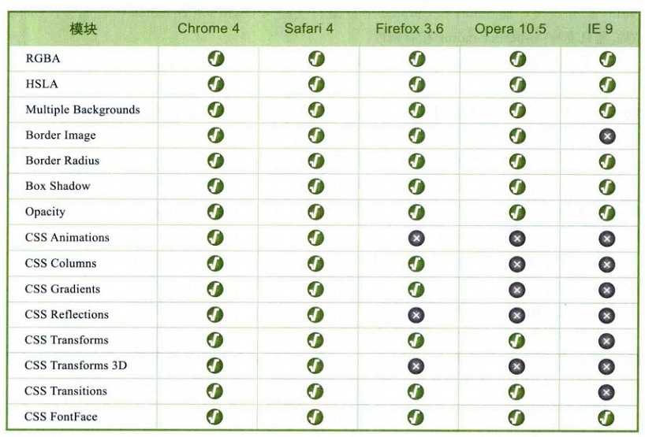

[TOC]

## 激动人心的CSS3

### 本章内容

- CSS的发展史
- CSS3 模块化简介
- CSS3 新特性预览
- 主流浏览器对CSS3的支持
- CSS3 的未来

### CSS3的发展史

- HTML的诞生 20世纪90年代初
- 1996年底, CSS第一版诞生
- 1998年5月, CSS2正式发布
- 2004年, CSS2.1发布
- CSS3的发布…

### CSS3模块介绍

- **CSS1 中定义了网页的基本属性：**
  - 字体、颜色、补白、基本选择器等
- **CSS2中在CSS1的基础上添加了高级功能**
  - 浮动和定位、高级选择器等(子选择器、相邻选择器、通用选择器)
- **CSS3遵循的是模块化开发。发布时间并不是一个时间点，而是一个时间段**
  - 2002年5月15日发布CSS3 Line模块，该模块定义了文本行模型。
  - 2002年11月7日发布CSS3 Lists模块，该模块定义了列表相关样式。
  - 2002年11月7日发布CSS3 Border模块，新增背景边框功能，后被合并到背景模块中。
  - 2003年5月14日发布CSS3 Generated and Replace Content模块，该模块定义CSS3生成及更换内容功能。
  - 2003年8月13日发布CSS3 Presentation Levels模块，该模块定义了演示效果功能。
  - 2003年8月13日发布CSS3 Syntax模块，该模块重新定义了CSS语法规则。
  - 2004年2月24日发布CSS3 Hyperlink Presenation模块，该模块中心定义了超链接的表示规则。
  - 2004年12月6日发布CSS3 Speech模块，该模块定义了’语音’样式规则。
  - 2005年12月15日发布CSS3 Cascading and inheritance模块，该模块重新定义了CSS层叠和继承规则。
  - 2007年8月9日发布CSS3 Basic box模块，该模块定义了CSS的基本盒子模型。
  - 2007年9月5日发布CSS3 Grid Positioning模块，该模块定义了CSS的网格定义规则。
  - 2009年3月20日发布CSS3 Animations模块，该模块定义了CSS3的动画模型。
  - 2009年3月20日发布CSS3 3D Transforms模块，该模块定义了CSS3 3D转换模型。
  - 2009年6月18日发布CSS3 Fonts模块，该模块定义了CSS字体模型。
  - 2009年7月23日发布CSS3 Image Value模块，该模块定义了图像内容显示模型。
  - 2009年7月23日发布CSS3 Flexible Box Layout模块，该模块定义了灵活的框布局模块。
  - 2009年8月4日发布了CSS3 视图模块。
  - 2009年12月1日发布CSS3 Transitions模块，该模块定义了动画过渡效果。
  - 2009年12月1日发布CSS3 2D Transforms模块，该模块定义了CSS3 2D转换模型。
  - 2010年4月29日发布CSS3 Template Layout模块，该模块定义了模板布局模型。
  - 2010年4月29日发布了CSS3 Generated Content For Page Media 模块，该模块定义了分页媒体内容模型。
  - 2010年10月5日发布CSS3 Text模块，该模块定义了文本模型。
  - 2010年10月5日发布CSS3 Background and Borders模块，该模块重新定义了边框和背景模型。

### CSS3新特性预览

1. 强大的CSS选择器
2. 新的颜色制式和透明设定
3. 多栏布局的实现
4. 多背景图效果
5. 文字阴影效果
6. 开放的网络字体类型
7. 圆角
8. 边框背景图片
9. 盒子阴影
10. 媒体查询

### 浏览器支持情况

### CSS3 的未来

- CSS的好处不言而喻，会跟我们带来视觉上的新享受和开发的便捷，但是任何的新技术都是要付出代价的。
- **使用CSS3的负面因素**
  - 1、IE浏览器这个拖油瓶。
  - 2、CSS验证问题
  - 3、代码冗余、臃肿
