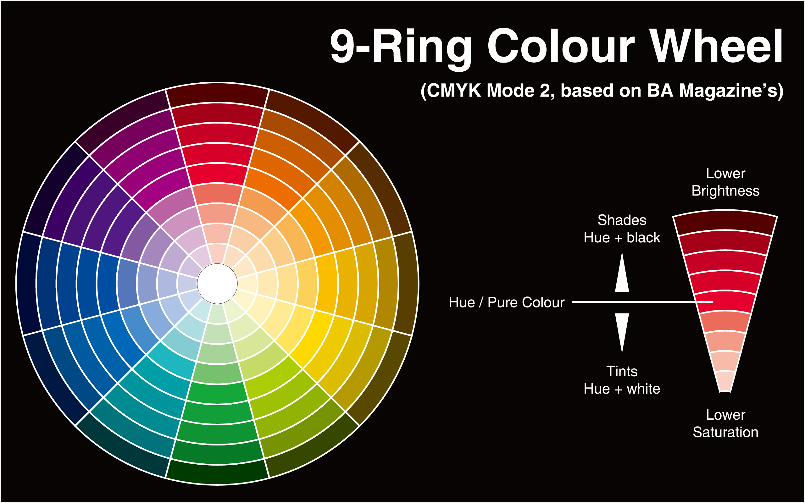

[TOC]

## CSS3的新增颜色方式

### 本章内容

- CSS1&2颜色表示方式(W3C标准)
- CSS3 新增颜色表示方式
- CSS3 颜色使用实例
  - 模拟渐变效果
  - 网页配色表
  - 图片查看器效果演示

## CSS1&CSS2的颜色方式

- Color name -  颜色名称方式
- HEX方式 - 十六进制方式
- RGB方式 - 三原色配色方式

### Color Name方式

- 用颜色关键字表示对应的颜色。
  - 例如： red(红色)、blue(蓝色)、pink(粉色)
- 优点：
  - 方便快捷而且特定颜色比较准确
- 缺点：
  - 英文记忆很是个问题
  - 表示颜色数量有限
  - 不支持透明颜色

### HEX方式

- 十六进制记法 ，使用十六进制表示颜色
- 语法：
  - `#RRGGBB` 或 `#RGB`
- 取值：
  - RR： 红色值。十六进制正整数  
  - GG： 绿色值。十六进制正整数 
  - BB： 蓝色值。十六进制正整数 
- 取值范围： `00-FF`
  - 例如： `#FF0000`红色 `#FFFF00` 黄色
- 优点：
  - 表示颜色种类多，使用较方便
- 缺点：
  - 16进制单位换算很成问题
  - 不支持透明颜色
  - 特定颜色需要工具配合或者一定的颜色调配知识

### RGB方式

- RGB记法
- 语法：
  - RGB(R,G,B)
- 取值：
  - R： 红色值。正整数 | 百分数
  - G： 绿色值。正整数 | 百分数 
  - B： 蓝色值。正整数 | 百分数 
- 取值范围： `0~255`或者`0%~100%`
  - 例如： `rgb(255,0,0)`红色 `rgb(255,255,0)`黄色
- 优点：
  - 表示颜色种类多，使用较方便
- 缺点：
  - 不支持透明颜色
  - 特定颜色需要工具配合或者一定的颜色调配知识

## CSS3 新增颜色表示方式

- RGBA模式
- HSL模式
- HSLA模式

### RGBA模式

- RGBA记法
  - 此色彩模式与RGB相同，只是在RGB模式上新增了Alpha透明度
- 语法：RGBA(R,G,B,A)
- 取值：
  - R： 红色值。正整数 | 百分数
  - G： 绿色值。正整数 | 百分数
  - B： 蓝色值。正整数 | 百分数
  - A： Alpha透明度。取值0~1之间
- 例如：`rgba(255,0,0.5)`半透明红色

### HSL模式

- HSL记法。 (色轮模式)
- 语法：
  - HSL(H,S,L)
- 取值：
  - H： Hue(色调)
    - `0(或360)`表示红色，`120`表示绿色，`240`表示蓝色，也可取其他数值来指定颜色。取值为：`0 - 360`
  - S： Saturation(饱和度)。取值为：`0.0% - 100.0%`
  - L： Lightness(亮度)。取值为：`0.0% - 100.0%`
- 例如：`hsl(360,50%,50%)` 红色

### HSLA模式

- HSL记法。 (色轮模式)
- 语法：
  - HSLA(H,S,L,A)
- 取值：
  - H： Hue(色调)
    - `0(或360)`表示红色，`120`表示绿色，`240`表示蓝色，也可取其他数值来指定颜色。取值为：`0 - 360`
  - S： Saturation(饱和度)。取值为：`0.0% - 100.0%` 
  - L： Lightness(亮度)。取值为：`0.0% - 100.0%`
  - A： Alpha透明度。取值`0~1`之间
- 例如：`hsl(360,50%,50%,0.5)` 红色

### transparent

- 特殊颜色值,表示透明色。可以直接当做颜色使用
- 例如：
  - `color:transparent`设定字体颜色为透明

### Opacity属性

- 作用：设定元素的透明度
- 取值：`0~1`之间
- 注意：对于尚不支持opacity属性的IE浏览器
- 滤镜：`filter:alpha(opacity=50)` 仅限IE
