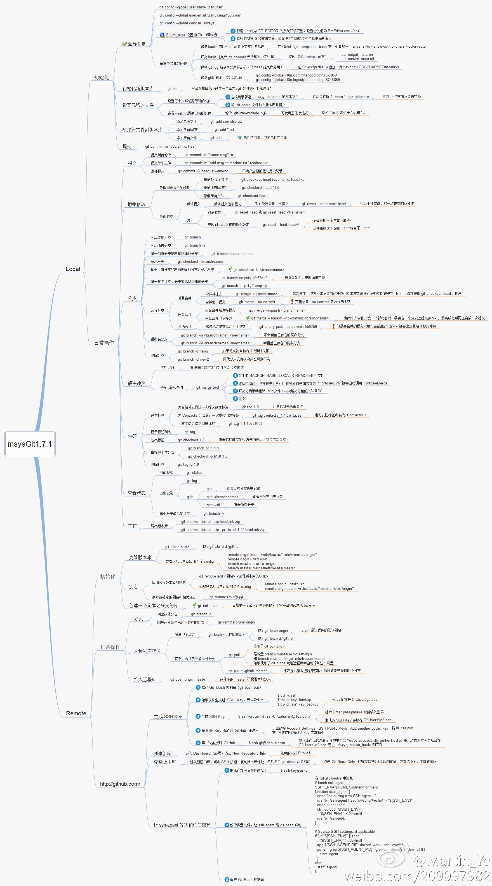

[TOC]

# git原理

### 什么是git

Git是一个开源的分布式版本控制系统，用于敏捷高效地处理任何或小或大的项目。

Git 是 Linus Torvalds 为了帮助管理 Linux 内核开发而开发的一个开放源码的版本控制软件。

Git 与常用的版本控制工具 CVS, Subversion 等不同，它采用了分布式版本库的方式，不必服务器端软件支持。

### Git 与 SVN 区别

GIT不仅仅是个版本控制系统，它也是个内容管理系统(CMS),工作管理系统等。

如果你是一个具有使用SVN背景的人，你需要做一定的思想转换，来适应GIT提供的一些概念和特征。

Git 与 SVN 区别点：

-   1、GIT是分布式的，SVN不是：这是GIT和其它非分布式的版本控制系统，例如SVN，CVS等，最核心的区别。
-   2、GIT把内容按元数据方式存储，而SVN是按文件：所有的资源控制系统都是把文件的元信息隐藏在一个类似.svn,.cvs等的文件夹里。
-   3、GIT分支和SVN的分支不同：分支在SVN中一点不特别，就是版本库中的另外的一个目录。
-   4、GIT没有一个全局的版本号，而SVN有：目前为止这是跟SVN相比GIT缺少的最大的一个特征。
-   5、GIT的内容完整性要优于SVN：GIT的内容存储使用的是SHA-1哈希算法。这能确保代码内容的完整性，确保在遇到磁盘故障和网络问题时降低对版本库的破坏。

### git原理与命令图解


### 各命令详解



### git

```bash
用法：git [--version] [--help] [-C <path>] [-c <键名>=<值>]
           [--exec-path[=<路径>]] [--html-path] [--man-path] [--info-path]
           [-p | --paginate | --no-pager] [--no-replace-objects] [--bare]
           [--git-dir=<路径>] [--work-tree=<路径>] [--namespace=<名称>]
           <命令> [<参数>]

这些是各种场合常见的 Git 命令：

开始一个工作区（参见：git help tutorial）
   clone      克隆一个仓库到一个新目录
   init       创建一个空的 Git 仓库或重新初始化一个已存在的仓库

在当前变更上工作（参见：git help everyday）
   add        添加文件内容至索引
   mv         移动或重命名一个文件、目录或符号链接
   reset      重置当前 HEAD 到指定状态
   rm         从工作区和索引中删除文件

检查历史和状态（参见：git help revisions）
   bisect     通过二分查找定位引入 bug 的提交
   grep       输出和模式匹配的行
   log        显示提交日志
   show       显示各种类型的对象
   status     显示工作区状态

扩展、标记和调校您的历史记录
   branch     列出、创建或删除分支
   checkout   切换分支或恢复工作区文件
   commit     记录变更到仓库
   diff       显示提交之间、提交和工作区之间等的差异
   merge      合并两个或更多开发历史
   rebase     在另一个分支上重新应用提交
   tag        创建、列出、删除或校验一个 GPG 签名的标签对象

协同（参见：git help workflows）
   fetch      从另外一个仓库下载对象和引用
   pull       获取并整合另外的仓库或一个本地分支
   push       更新远程引用和相关的对象

命令 'git help -a' 和 'git help -g' 显示可用的子命令和一些概念帮助。
查看 'git help <命令>' 或 'git help <概念>' 以获取给定子命令或概念的
帮助。
```

### git add

```bash
  Adds changed files to the index.

- Add a file to the index:

  git add path/to/file

- Add all files (tracked and untracked):

  git add -A

- Only add already tracked files:

  git add -u

- Also add ignored files:

  git add -f

- Add parts of a file interactively:

  git add -p path/to/file

用法：git add [<选项>] [--] <路径规格>...

    -n, --dry-run         演习
    -v, --verbose         冗长输出

    -i, --interactive     交互式拣选
    -p, --patch           交互式挑选数据块
    -e, --edit            编辑当前差异并应用
    -f, --force           允许添加忽略的文件
    -u, --update          更新已跟踪的文件
    --renormalize         对已跟踪文件（暗含 -u）重新归一换行符
    -N, --intent-to-add   只记录，该路径稍后再添加
    -A, --all             添加所有改变的已跟踪文件和未跟踪文件
    --ignore-removal      忽略工作区中移除的路径（和 --no-all 相同）
    --refresh             不添加，只刷新索引
    --ignore-errors       跳过因出错不能添加的文件
    --ignore-missing      检查在演习模式下文件（即使不存在）是否被忽略
    --chmod <(+/-)x>      覆盖列表里文件的可执行位
```

### git commit

```bash
  Commit files to the repository.

- Commit staged files to the repository with a message:

  git commit -m message

- Auto stage all modified files and commit with a message:

  git commit -a -m message

- Replace the last commit with currently staged changes:

  git commit --amend

用法：git commit [<选项>] [--] <路径规格>...

    -q, --quiet           提交成功后不显示概述信息
    -v, --verbose         在提交说明模板里显示差异

提交说明选项
    -F, --file <文件>     从文件中读取提交说明
    --author <作者>       提交时覆盖作者
    --date <日期>         提交时覆盖日期
    -m, --message <说明>  提交说明
    -c, --reedit-message <提交>
                          重用并编辑指定提交的提交说明
    -C, --reuse-message <提交>
                          重用指定提交的提交说明
    --fixup <提交>        使用 autosquash 格式的提交说明用以修正指定的提交
    --squash <提交>       使用 autosquash 格式的提交说明用以压缩至指定的提交
    --reset-author        现在将该提交的作者改为我（和 -C/-c/--amend 参数共用）
    -s, --signoff         添加 Signed-off-by: 签名
    -t, --template <文件>
                          使用指定的模板文件
    -e, --edit            强制编辑提交
    --cleanup <default>   设置如何删除提交说明里的空格和#注释
    --status              在提交说明模板里包含状态信息
    -S, --gpg-sign[=<key-id>]
                          GPG 提交签名

提交内容选项
    -a, --all             提交所有改动的文件
    -i, --include         添加指定的文件到索引区等待提交
    --interactive         交互式添加文件
    -p, --patch           交互式添加变更
    -o, --only            只提交指定的文件
    -n, --no-verify       绕过 pre-commit 和 commit-msg 钩子
    --dry-run             显示将要提交的内容
    --short               以简洁的格式显示状态
    --branch              显示分支信息
    --ahead-behind        计算完整的领先/落后值
    --porcelain           机器可读的输出
    --long                以长格式显示状态（默认）
    -z, --null            条目以 NUL 字符结尾
    --amend               修改先前的提交
    --no-post-rewrite     绕过 post-rewrite 钩子
    -u, --untracked-files[=<模式>]
                          显示未跟踪的文件，“模式”的可选参数：all、normal、no。（默认：all）
```

### git config

```bash
git config --global user.email "you@example.com"
git config --global user.name "Your Name"

  Manage custom configuration options for git repositories.
  These configurations can be local (for the current repository) or global (for the current user).

- List only local configuration entries (stored in `.git/config` in the current repository):

  git config --list --local

- List only global configuration entries (stored in `~/.gitconfig`):

  git config --list --global

- List all configuration entries that have been defined either locally or globally:

  git config --list

- Get the value of a given configuration entry:

  git config alias.unstage

- Set the global value of a given configuration entry:

  git config --global alias.unstage "reset HEAD --"

- Revert a global configuration entry to its default value:

  git config --global --unset alias.unstage

用法：git config [<选项>]

配置文件位置
    --global              使用全局配置文件
    --system              使用系统级配置文件
    --local               使用仓库级配置文件
    -f, --file <文件>     使用指定的配置文件
    --blob <数据对象 ID>  从给定的数据对象读取配置

操作
    --get                 获取值：name [value-regex]
    --get-all             获得所有的值：key [value-regex]
    --get-regexp          根据正则表达式获得值：name-regex [value-regex]
    --get-urlmatch        获得 URL 取值：section[.var] URL
    --replace-all         替换所有匹配的变量：name value [value_regex]
    --add                 添加一个新的变量：name value
    --unset               删除一个变量：name [value-regex]
    --unset-all           删除所有匹配项：name [value-regex]
    --rename-section      重命名小节：old-name new-name
    --remove-section      删除一个小节：name
    -l, --list            列出所有
    -e, --edit            打开一个编辑器
    --get-color           获得配置的颜色：配置 [默认]
    --get-colorbool       获得颜色设置：配置 [stdout-is-tty]

类型
    --bool                值是 "true" 或 "false"
    --int                 值是十进制数
    --bool-or-int         值是 --bool or --int
    --path                值是一个路径（文件或目录名）
    --expiry-date         值是一个到期日期

其它
    -z, --null            终止值是 NUL 字节
    --name-only           只显示变量名
    --includes            查询时参照 include 指令递归查找
    --show-origin         显示配置的来源（文件、标准输入、数据对象，或命令行）
```

### git push

```bash
  Push commits to a remote repository.

- Send local changes in the current branch to its remote counterpart:

  git push

- Send local changes in a given branch to its remote counterpart:

  git push remote_name local_branch

- Publish the current branch to a remote repository, setting the remote branch name:

  git push remote_name -u remote_branch

- Send changes on all local branches to their counterparts in a given remote repository:

  git push --all remote_name

- Delete a branch in a remote repository:

  git push remote_name --delete remote_branch

- Remove remote branches that don't have a local counterpart:

  git push --prune remote_name

- Publish tags that aren't yet in the remote repository:

  git push --tags

用法：git push [<选项>] [<仓库> [<引用规格>...]]

    -v, --verbose         更加详细
    -q, --quiet           更加安静
    --repo <仓库>         仓库
    --all                 推送所有引用
    --mirror              镜像所有引用
    -d, --delete          删除引用
    --tags                推送标签（不能使用 --all or --mirror）
    -n, --dry-run         演习
    --porcelain           机器可读的输出
    -f, --force           强制更新
    --force-with-lease[=<引用名>:<期望值>]
                          要求引用旧的取值为设定值
    --recurse-submodules[=<check|on-demand|no>]
                          控制子模组的递归推送
    --thin                使用精简打包
    --receive-pack <receive-pack>
                          接收包程序
    --exec <receive-pack>
                          接收包程序
    -u, --set-upstream    设置 git pull/status 的上游
    --progress            强制显示进度报告
    --prune               清除本地删除的引用
    --no-verify           绕过 pre-push 钩子
    --follow-tags         推送缺失但有关的标签
    --signed[=<yes|no|if-asked>]
                          用 GPG 为推送签名
    --atomic              需要远端支持原子事务
    -o, --push-option <server-specific>
                          传输选项
    -4, --ipv4            只使用 IPv4 地址
    -6, --ipv6            只使用 IPv6 地址
```

### git stash

```bash
  Stash local Git changes in a temporary area.

- Stash current changes, except new (untracked) files:

  git stash [save optional_stash_message]

- Stash current changes, including new (untracked) files:

  git stash -u

- Interactively select parts of changed files for stashing:

  git stash -p

- List all stashes (shows stash name, related branch and message):

  git stash list

- Apply a stash (default is the latest, named stash@{0}):

  git stash apply optional_stash_name_or_commit

- Apply a stash (default is stash@{0}), and remove it from the stash list if applying doesn't cause conflicts:

  git stash pop optional_stash_name

- Drop a stash (default is stash@{0}):

  git stash drop optional_stash_name

- Drop all stashes:

  git stash clear

用法：git stash list [<options>]
   or: git stash show [<stash>]
   or: git stash drop [-q|--quiet] [<stash>]
   or: git stash ( pop | apply ) [--index] [-q|--quiet] [<stash>]
   or: git stash branch <branchname> [<stash>]
   or: git stash save [--patch] [-k|--[no-]keep-index] [-q|--quiet]
                      [-u|--include-untracked] [-a|--all] [<message>]
   or: git stash [push [--patch] [-k|--[no-]keep-index] [-q|--quiet]
                       [-u|--include-untracked] [-a|--all] [-m <message>]
                       [-- <pathspec>...]]
   or: git stash clear
```

### git rebase

```bash
  Reapply commits from one branch on top of another branch.
  Commonly used to "move" an entire branch to another base, creating copies of the commits in the new location.

- Rebase the current branch on top of the master branch:

  git rebase master

- Start an interactive rebase, which allows the commits to be reordered, omitted, combined or modified:

  git rebase -i target_base_branch_or_commit_hash

- Continue a rebase that was interrupted by a merge failure, after editing conflicting files:

  git rebase --continue

- Abort a rebase in progress (e.g. if it is interrupted by a merge conflict):

  git rebase --abort

- Move part of the current branch onto a new base, providing the old base to start from:

  git rebase --onto new_base old_base

- Reapply the last 5 commits in-place, stopping to allow them to be reordered, omitted, combined or modified:

  git rebase -i HEAD~5

用法：git rebase [-i] [options] [--exec <cmd>] [--onto <newbase>] [<upstream>] [<branch>]
   或：git rebase [-i] [options] [--exec <cmd>] [--onto <newbase>] --root [<branch>]
   或：git rebase --continue | --abort | --skip | --edit-todo

Available options are
    -v, --verbose         display a diffstat of what changed upstream
    -q, --quiet           be quiet. implies --no-stat
    --autostash           automatically stash/stash pop before and after
    --fork-point          use 'merge-base --fork-point' to refine upstream
    --onto ...            rebase onto given branch instead of upstream
    -p, --preserve-merges
                          try to recreate merges instead of ignoring them
    -s, --strategy ...    use the given merge strategy
    --no-ff               cherry-pick all commits, even if unchanged
    -m, --merge           use merging strategies to rebase
    -i, --interactive     let the user edit the list of commits to rebase
    -x, --exec ...        add exec lines after each commit of the editable list
    -k, --keep-empty      preserve empty commits during rebase
    --allow-empty-message
                          allow rebasing commits with empty messages
    -f, --force-rebase    force rebase even if branch is up to date
    -X, --strategy-option ...
                          pass the argument through to the merge strategy
    --stat                display a diffstat of what changed upstream
    -n, --no-stat         do not show diffstat of what changed upstream
    --verify              allow pre-rebase hook to run
    --rerere-autoupdate   allow rerere to update index with resolved conflicts
    --root                rebase all reachable commits up to the root(s)
    --autosquash          move commits that begin with squash!/fixup! under -i
    --committer-date-is-author-date
                          passed to 'git am'
    --ignore-date         passed to 'git am'
    --signoff             passed to 'git am'
    --whitespace ...      passed to 'git apply'
    --ignore-whitespace   passed to 'git apply'
    -C ...                passed to 'git apply'
    -S, --gpg-sign[=...]  使用 GPG 签名提交

Actions:
    --continue            continue
    --abort               abort and check out the original branch
    --skip                skip current patch and continue
    --edit-todo           edit the todo list during an interactive rebase
    --quit                abort but keep HEAD where it is
    --show-current-patch  show the patch file being applied or merged
```

### git reset

```bash
  Undo commits or unstage changes, by resetting the current git HEAD to the specified state.
  If a path is passed, it works as "unstage"; if a commit hash or branch is passed, it works as "uncommit".

- Unstage everything:

  git reset

- Unstage specific file(s):

  git reset path/to/file(s)

- Unstage portions of a file:

  git reset -p path/to/file

- Undo the last commit, keeping its changes (and any further uncommitted changes) in the filesystem:

  git reset HEAD~

- Undo the last two commits, adding their changes to the index, i.e. staged for commit:

  git reset --soft HEAD~2

- Discard any uncommitted changes, staged or not (for only unstaged changes, use `git checkout`):

  git reset --hard

- Reset the repository to a given commit, discarding committed, staged and uncommitted changes since then:

  git reset --hard commit

用法：git reset [--mixed | --soft | --hard | --merge | --keep] [-q] [<提交>]
   或：git reset [-q] [<树或提交>] [--] <路径>...
   或：git reset --patch [<树或提交>] [--] [<路径>...]

    -q, --quiet           安静模式，只报告错误
    --mixed               重置 HEAD 和索引
    --soft                只重置 HEAD
    --hard                重置 HEAD、索引和工作区
    --merge               重置 HEAD、索引和工作区
    --keep                重置 HEAD 但保存本地变更
    --recurse-submodules[=<reset>]
                          control recursive updating of submodules
    -p, --patch           交互式挑选数据块
    -N, --intent-to-add   将删除的路径标记为稍后添加
```

### git revert

```bash
用法：git revert [<选项>] <提交号>...
   或：git revert <子命令>

    --quit                终止反转或拣选操作
    --continue            继续反转或拣选操作
    --abort               取消反转或拣选操作
    -n, --no-commit       不要自动提交
    -e, --edit            编辑提交说明
    -s, --signoff         添加 Signed-off-by: 签名
    -m, --mainline <父编号>
                          选择主干父提交编号
    --rerere-autoupdate   如果可能，重用冲突解决更新索引
    --strategy <策略>     合并策略
    -X, --strategy-option <选项>
                          合并策略的选项
    -S, --gpg-sign[=<key-id>]
                          GPG 提交签名
```

### git log

```bash
  Show a history of commits.

- Show the sequence of commits starting from the current one, in reverse chronological order:

  git log

- Show the history of a particular file or directory, including differences:

  git log -p path

- Show only the first line of each commit message:

  git log --oneline

- Show an overview of which file(s) changed in each commit:

  git log --stat

- Show all commits, tags and branches for the entire repo in a graph format:

  git log --oneline --decorate --all --graph

- Show only commits whose messages include a given string (case-insensitively):

  git log -i --grep search_string

git log --pretty=format:"%h %s" --graph

用法：git log [<选项>] [<版本范围>] [[--] <路径>...]
   或：git show [<选项>] <对象>...

    -q, --quiet           不显示差异输出
    --source              显示源
    --use-mailmap         使用邮件映射文件
    --decorate-refs <模式>
                          只修饰与 <模式> 匹配的引用
    --decorate-refs-exclude <模式>
                          不修饰和 <模式> 匹配的引用
    --decorate[=...]      修饰选项
    -L <n,m:file>         处理文件中第 n 到 m 之间的行，从 1 开始
```

### git checkout

```bash
  Checkout a branch or paths to the working tree.

- Create and switch to a new branch:

  git checkout -b branch_name

- Create and switch to a new branch based on a specific reference (branch, remote/branch, tag are examples of valid references):

  git checkout -b branch_name reference

- Switch to an existing local branch:

  git checkout branch_name

- Switch to an existing remote branch:

  git checkout --track remote_name/branch_name

- Discard all unstaged changes in the current folder (see `git reset` for more undo-like commands):

  git checkout .

- Discard unstaged changes to a given file:

  git checkout file_name

- Replace a file in the current folder with the version of it committed in a given branch:

  git checkout branch_name -- file_name

用法：git checkout [<选项>] <分支>
   或：git checkout [<选项>] [<分支>] -- <文件>...

    -q, --quiet           不显示进度报告
    -b <分支>             创建并检出一个新的分支
    -B <分支>             创建/重置并检出一个分支
    -l                    为新的分支创建引用日志
    --detach              HEAD 从指定的提交分离
    -t, --track           为新的分支设置上游信息
    --orphan <新分支>     新的没有父提交的分支
    -2, --ours            对尚未合并的文件检出我们的版本
    -3, --theirs          对尚未合并的文件检出他们的版本
    -f, --force           强制检出（丢弃本地修改）
    -m, --merge           和新的分支执行三方合并
    --overwrite-ignore    更新忽略的文件（默认）
    --conflict <风格>     冲突输出风格（merge 或 diff3）
    -p, --patch           交互式挑选数据块
    --ignore-skip-worktree-bits
                          对路径不做稀疏检出的限制
    --ignore-other-worktrees
                          不检查指定的引用是否被其他工作区所占用
    --recurse-submodules[=<checkout>]
                          control recursive updating of submodules
    --progress            强制显示进度报告
```

### git pull

```bash
  Fetch branch from a remote repository and merge it to local repository.

- Download changes from default remote repository and merge it:

  git pull

- Download changes from default remote repository and use fast forward:

  git pull --rebase

- Download changes from given remote repository and branch, then merge them into HEAD:

  git pull remote_name branch

用法：git pull [<选项>] [<仓库> [<引用规格>...]]

    -v, --verbose         更加详细
    -q, --quiet           更加安静
    --progress            强制显示进度报告
    --recurse-submodules[=<on-demand>]
                          控制子模组的递归获取

和合并相关的选项
    -r, --rebase[=<false|true|preserve|interactive>]
                          使用变基操作取代合并操作以合入修改
    -n                    在合并的最后不显示差异统计
    --stat                在合并的最后显示差异统计
    --log[=<n>]           在合并提交信息中添加（最多 <n> 条）精简提交记录
    --signoff[=...]       添加 Signed-off-by: 签名
    --squash              创建一个单独的提交而不是做一次合并
    --commit              如果合并成功，执行一次提交（默认）
    --edit                在提交前编辑提交说明
    --ff                  允许快进式
    --ff-only             如果不能快进就放弃合并
    --verify-signatures   验证指定的提交是否包含一个有效的 GPG 签名
    --autostash           变基操作前后执行自动贮藏和弹出贮藏
    -s, --strategy <策略>
                          要使用的合并策略
    -X, --strategy-option <option=value>
                          所选的合并策略的选项
    -S, --gpg-sign[=<key-id>]
                          GPG 提交签名
    --allow-unrelated-histories
                          允许合并不相关的历史

和获取相关的参数
    --all                 从所有的远程抓取
    -a, --append          追加到 .git/FETCH_HEAD 而不是覆盖它
    --upload-pack <路径>  上传包到远程的路径
    -f, --force           强制覆盖本地分支
    -t, --tags            抓取所有的标签和关联对象
    -p, --prune           清除远程已经不存在的分支的跟踪分支
    -j, --jobs[=<n>]      并发拉取的子模组的数量
    --dry-run             演习
    -k, --keep            保持下载包
    --depth <深度>        深化浅克隆的历史
    --unshallow           转换为一个完整的仓库
    --update-shallow      接受更新 .git/shallow 的引用
    --refmap <引用映射>   指定获取操作的引用映射
    -4, --ipv4            只使用 IPv4 地址
    -6, --ipv6            只使用 IPv6 地址
```

### git clone

```bash
  Clone an existing repository.

- Clone an existing repository:

  git clone remote_repository_location

- Clone an existing repository and its submodules:

  git clone --recursive remote_repository_location

- For cloning from the local machine:

  git clone -l

- Do it quietly:

  git clone -q

- Clone an existing repository, and truncate to the specified number of revisions, save your time mostly:

  git clone --depth 10 remote_repository_location

用法：git clone [<选项>] [--] <仓库> [<路径>]

    -v, --verbose         更加详细
    -q, --quiet           更加安静
    --progress            强制显示进度报告
    -n, --no-checkout     不创建一个检出
    --bare                创建一个纯仓库
    --mirror              创建一个镜像仓库（也是纯仓库）
    -l, --local           从本地仓库克隆
    --no-hardlinks        不使用本地硬链接，始终复制
    -s, --shared          设置为共享仓库
    --recurse-submodules[=<路径规格>]
                          在克隆时初始化子模组
    -j, --jobs <n>        并发克隆的子模组的数量
    --template <模板目录>
                          模板目录将被使用
    --reference <仓库>    参考仓库
    --reference-if-able <仓库>
                          参考仓库
    --dissociate          仅在克隆时参考 --reference 指向的本地仓库
    -o, --origin <名称>   使用 <名称> 而不是 'origin' 去跟踪上游
    -b, --branch <分支>   检出 <分支> 而不是远程 HEAD
    -u, --upload-pack <路径>
                          远程 git-upload-pack 路径
    --depth <深度>        创建一个指定深度的浅克隆
    --shallow-since <时间>
                          从一个特定时间创建一个浅克隆
    --shallow-exclude <版本>
                          深化浅克隆的历史，除了特定版本
    --single-branch       只克隆一个分支、HEAD 或 --branch
    --no-tags             不要克隆任何标签，并且后续获取操作也不下载它们
    --shallow-submodules  子模组将以浅下载模式克隆
    --separate-git-dir <git目录>
                          git目录和工作区分离
    -c, --config <key=value>
                          在新仓库中设置配置信息
    -4, --ipv4            只使用 IPv4 地址
    -6, --ipv6            只使用 IPv6 地址
    --filter <参数>       对象过滤
```

### git init

```bash
  Initializes a new local Git repository.

- Initialize a new local repository:

  git init

- Initialize a barebones repository, suitable for use as a remote over ssh:

  git init --bare

用法：git init [-q | --quiet] [--bare] [--template=<模板目录>] [--shared[=<权限>]] [<目录>]

    --template <模板目录>
                          模板目录将被使用
    --bare                创建一个纯仓库
    --shared[=<权限>]     指定 git 仓库是多个用户之间共享的
    -q, --quiet           静默模式
    --separate-git-dir <git目录>
                          git目录和工作区分离
```

### git branch

```bash
  Main git command for working with branches.

- List local branches. The current branch is highlighted by `*`:

  git branch

- List all branches (local and remote):

  git branch -a

- Create new branch based on the current commit:

  git branch branch_name

- Rename a branch (must not have it checked out to do this):

  git branch -m old_branch_name new_branch_name

- Delete a local branch:

  git branch -d branch_name

用法：git branch [<选项>] [-r | -a] [--merged | --no-merged]
   或：git branch [<选项>] [-l] [-f] <分支名> [<起始点>]
   或：git branch [<选项>] [-r] (-d | -D) <分支名>...
   或：git branch [<选项>] (-m | -M) [<旧分支>] <新分支>
   或：git branch [<选项>] (-c | -C) [<老分支>] <新分支>
   或：git branch [<选项>] [-r | -a] [--points-at]
   或：git branch [<选项>] [-r | -a] [--format]

通用选项
    -v, --verbose         显示哈希值和主题，若参数出现两次则显示上游分支
    -q, --quiet           不显示信息
    -t, --track           设置跟踪模式（参见 git-pull(1)）
    -u, --set-upstream-to <上游>
                          改变上游信息
    --unset-upstream      取消上游信息的设置
    --color[=<何时>]      使用彩色输出
    -r, --remotes         作用于远程跟踪分支
    --contains <提交>     只打印包含该提交的分支
    --no-contains <提交>  只打印不包含该提交的分支
    --abbrev[=<n>]        用 <n> 位数字显示 SHA-1 哈希值

具体的 git-branch 动作：
    -a, --all             列出远程跟踪及本地分支
    -d, --delete          删除完全合并的分支
    -D                    删除分支（即使没有合并）
    -m, --move            移动/重命名一个分支，以及它的引用日志
    -M                    移动/重命名一个分支，即使目标已存在
    -c, --copy            拷贝一个分支和它的引用日志
    -C                    拷贝一个分支，即使目标已存在
    --list                列出分支名
    -l, --create-reflog   创建分支的引用日志
    --edit-description    标记分支的描述
    -f, --force           强制创建、移动/重命名、删除
    --merged <提交>       只打印已经合并的分支
    --no-merged <提交>    只打印尚未合并的分支
    --column[=<风格>]     以列的方式显示分支
    --sort <key>          排序的字段名
    --points-at <对象>    只打印指向该对象的分支
    -i, --ignore-case     排序和过滤属于大小写不敏感
    --format <格式>       输出格式
```

### git status

```bash
  Show the index (changed files).

- Show changed files which are not yet added for commit:

  git status

- Give output in short format:

  git status -s

用法：git status [<选项>] [--] <路径规格>...

    -v, --verbose         冗长输出
    -s, --short           以简洁的格式显示状态
    -b, --branch          显示分支信息
    --show-stash          显示贮藏区信息
    --ahead-behind        计算完整的领先/落后值
    --porcelain[=<版本>]  机器可读的输出
    --long                以长格式显示状态（默认）
    -z, --null            条目以 NUL 字符结尾
    -u, --untracked-files[=<模式>]
                          显示未跟踪的文件，“模式”的可选参数：all、normal、no。（默认：all）
    --ignored[=<模式>]    显示已忽略的文件，可选模式：traditional、matching、no。（默认：traditional）
    --ignore-submodules[=<何时>]
                          忽略子模组的更改，“何时”的可选参数：all、dirty、untracked。（默认：all）
    --column[=<风格>]     以列的方式显示未跟踪的文件
```

### git diff

```bash
  Show changes to tracked files.

- Show unstaged, uncommitted changes:

  git diff

- Show all uncommitted changes (including staged ones):

  git diff HEAD

- Show only staged (added, but not yet committed) changes:

  git diff --staged

- Show changes from all commits since a given date/time (a date expression, e.g. "1 week 2 days" or an ISO date):

  git diff 'HEAD@{3 months|weeks|days|hours|seconds ago}'

- Show only names of changed files since a given commit:

  git diff --name-only commit

- Output a summary of file creations, renames and mode changes since a given commit:

  git diff --summary commit

- Create a patch file:

  git diff > target_file.patch

- Compare a single file between two branches or commits:

  git diff branch_1..branch_2 [--] path/to/file

- Compare different files from the current branch to other branch:

  git diff branch:path/to/file2 path/to/file

```

### git fetch

```bash
  Download objects and refs from a remote repository.

- Fetch the latest changes from the default remote upstream repository (if set):

  git fetch

- Fetch new branches from a specific remote upstream repository:

  git fetch remote_name

- Fetch the latest changes from all remote upstream repositories:

  git fetch --all

- Also fetch tags from the remote upstream repository:

  git fetch --tags

- Delete local references to remote branches that have been deleted upstream:

  git fetch --prune

用法：git fetch [<选项>] [<仓库> [<引用规格>...]]
   或：git fetch [<选项>] <组>
   或：git fetch --multiple [<选项>] [(<仓库> | <组>)...]
   或：git fetch --all [<选项>]

    -v, --verbose         更加详细
    -q, --quiet           更加安静
    --all                 从所有的远程抓取
    -a, --append          追加到 .git/FETCH_HEAD 而不是覆盖它
    --upload-pack <路径>  上传包到远程的路径
    -f, --force           强制覆盖本地分支
    -m, --multiple        从多个远程抓取
    -t, --tags            抓取所有的标签和关联对象
    -n                    不抓取任何标签(--no-tags)
    -j, --jobs <n>        子模组获取的并发数
    -p, --prune           清除远程已经不存在的分支的跟踪分支
    -P, --prune-tags      清除远程不存在的本地标签，并且替换变更标签
    --recurse-submodules[=<on-demand>]
                          控制子模组的递归抓取
    --dry-run             演习
    -k, --keep            保持下载包
    -u, --update-head-ok  允许更新 HEAD 引用
    --progress            强制显示进度报告
    --depth <深度>        深化浅克隆的历史
    --shallow-since <时间>
                          基于时间来深化浅克隆的历史
    --shallow-exclude <版本>
                          深化浅克隆的历史，除了特定版本
    --deepen <n>          深化浅克隆的历史
    --unshallow           转换为一个完整的仓库
    --update-shallow      接受更新 .git/shallow 的引用
    --refmap <引用映射>   指定获取操作的引用映射
    -4, --ipv4            只使用 IPv4 地址
    -6, --ipv6            只使用 IPv6 地址
    --filter <参数>       对象过滤

```

### git merge

```bash
  Merge branches.

- Merge a branch with your current branch:

  git merge branch_name

- Edit the merge message:

  git merge -e branch_name

- Merge a branch and create a merge commit:

  git merge --no-ff branch_name

- Abort a merge in case of conflicts:

  git merge --abort

用法：git merge [<选项>] [<提交>...]
   或：git merge --abort
   或：git merge --continue

    -n                    在合并的最后不显示差异统计
    --stat                在合并的最后显示差异统计
    --summary             （和 --stat 同义）
    --log[=<n>]           在合并提交信息中添加（最多 <n> 条）精简提交记录
    --squash              创建一个单独的提交而不是做一次合并
    --commit              如果合并成功，执行一次提交（默认）
    -e, --edit            在提交前编辑提交说明
    --ff                  允许快进（默认）
    --ff-only             如果不能快进就放弃合并
    --rerere-autoupdate   如果可能，重用冲突解决更新索引
    --verify-signatures   验证指定的提交是否包含一个有效的 GPG 签名
    -s, --strategy <策略>
                          要使用的合并策略
    -X, --strategy-option <option=value>
                          所选的合并策略的选项
    -m, --message <说明>  合并的提交说明（针对非快进式合并）
    -v, --verbose         更加详细
    -q, --quiet           更加安静
    --abort               放弃当前正在进行的合并
    --continue            继续当前正在进行的合并
    --allow-unrelated-histories
                          允许合并不相关的历史
    --progress            强制显示进度报告
    -S, --gpg-sign[=<key-id>]
                          GPG 提交签名
    --overwrite-ignore    更新忽略的文件（默认）
    --signoff             添加 Signed-off-by: 签名
    --verify              校验 commit-msg 钩子
```

### git tag

```bash
  Create, list, delete or verify tags.
  A tag is a static reference to a specific commit.

- List all tags:

  git tag

- Create a tag with the given name pointing to the current commit:

  git tag tag_name

- Create a tag with the given name pointing to a given commit:

  git tag tag_name commit

- Create an annotated tag with the given message:

  git tag tag_name -m tag_message

- Delete the tag with the given name:

  git tag -d tag_name

- Get updated tags from upstream:

  git fetch --tags

- List all tags whose ancestors include a given commit:

  git tag --contains commit

用法：git tag [-a | -s | -u <key-id>] [-f] [-m <说明> | -F <文件>] <标签名> [<头>]
   或：git tag -d <标签名>...
   或：git tag -l [-n[<数字>]] [--contains <提交>] [--no-contains <提交>] [--points-at <对象>]
		[--format=<格式>] [--[no-]merged [<提交>]] [<模式>...]
   或：git tag -v [--format=<格式>] <标签名>...

    -l, --list            列出标签名称
    -n[<n>]               每个标签信息打印 <n> 行
    -d, --delete          删除标签
    -v, --verify          验证标签

标签创建选项
    -a, --annotate        附注标签，需要一个说明
    -m, --message <说明>  标签说明
    -F, --file <文件>     从文件中读取提交说明
    -e, --edit            强制编辑标签说明
    -s, --sign            附注并附加 GPG 签名的标签
    --cleanup <模式>      设置如何删除提交说明里的空格和#注释
    -u, --local-user <key-id>
                          使用另外的私钥签名该标签
    -f, --force           如果存在，替换现有的标签
    --create-reflog       创建引用日志

标签列表选项
    --column[=<风格>]     以列的方式显示标签列表
    --contains <提交>     只打印包含该提交的标签
    --no-contains <提交>  只打印不包含该提交的标签
    --merged <提交>       只打印已经合并的标签
    --no-merged <提交>    只打印尚未合并的标签
    --sort <key>          排序的字段名
    --points-at <对象>    只打印指向该对象的标签
    --format <格式>       输出格式
    --color[=<何时>]      遵照格式中的颜色输出
    -i, --ignore-case     排序和过滤属于大小写不敏感
```
