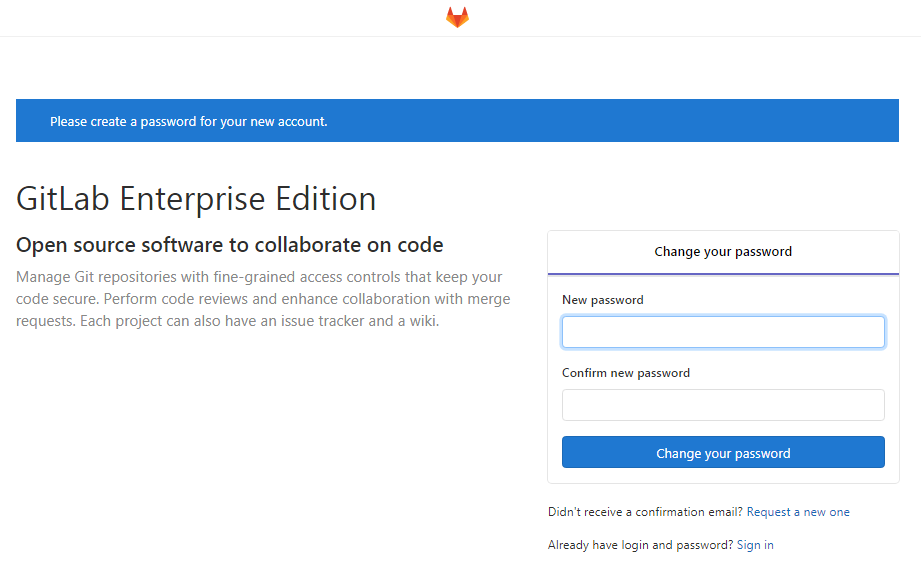

# 私服gitlab搭建

## 官网地址

首页：https://about.gitlab.com/
安装说明：https://about.gitlab.com/installation/

## 安装过程

```bash
sudo yum install -y curl policycoreutils-python openssh-server cronie lokkit
sudo lokkit -s http -s ssh
#sudo yum install postfix
#sudo service postfix start
#sudo chkconfig postfix on
#企业版
curl https://packages.gitlab.com/install/repositories/gitlab/gitlab-ee/script.rpm.sh | sudo bash
sudo EXTERNAL_URL="http://gitlab.example.com" yum -y install gitlab-ee
```

实际问题：yum 安装gitlab-ee(或ce)时，需要联网下载几百M 的安装文件，非常耗时，所以应提前把所需RPM 包下载并安装好。
下载地址为：https://packages.gitlab.com/gitlab/gitlab-ce/packages/el/7/gitlab-ce-10.8.2-ce.0.el7.x86_64.rpm

## 调整后的安装过程

```bash
#curl -s https://packages.gitlab.com/install/repositories/gitlab/gitlab-ce/script.rpm.sh | sudo bash
sudo rpm -ivh /opt/gitlab-ce-10.8.2-ce.0.el7.x86_64.rpm
sudo yum install -y curl policycoreutils-python openssh-server cronie lokkit
sudo lokkit -s http -s ssh
#sudo yum install postfix
#sudo service postfix start
#sudo chkconfig postfix on
#社区版
curl https://packages.gitlab.com/install/repositories/gitlab/gitlab-ce/script.rpm.sh | sudo bash
sudo EXTERNAL_URL="http://gitlab.example.com" yum -y install gitlab-ce
```

## gitlab 服务操作

初始化配置gitlab

```bash
gitlab-ctl reconfigure #这个操作，时间可能会较长，耐心等待完成即可
```

启动gitlab 服务

```bash
gitlab-ctl start
```

停止gitlab 服务

```bash
gitlab-ctl stop
```

重启gitlab 服务

```bash
gitlab-ctl restart
```

## 开机自启动设置

默认为开机启动

```bash
vim /etc/init/gitlab-runsvdir.conf
```

如需要关闭，把对应的运行级别号去掉即可

```bash
start on runlevel [2345]
```

或

```bash
chkconfig gitlab-runsvdir off
```

## 修改gitlab的url

```bash
sudo vim /etc/gitlab/gitlab.rb
```

修改内容
```bash
## GitLab URL
##! URL on which GitLab will be reachable.
##! For more details on configuring external_url see:
##! https://docs.gitlab.com/omnibus/settings/configuration.html#configuring-the-external-url-for-gitlab
external_url 'http://gitlab.example.com'
```

修改gitlab服务配置

```bash
sudo vim /opt/gitlab/embedded/service/gitlab-rails/config/gitlab.yml
```

修改内容

```bash
## GitLab settings
  gitlab:
    ## Web server settings (note: host is the FQDN, do not include http://)
    host: gitlab.example.com
    port: 80
    https: false
```

## 浏览器访问

访问Linux 服务器IP 地址即可，如果想访问EXTERNAL_URL 指定的域名还需要配置域名服务器或本地hosts 文件。

把window中的`C:\Windows\System32\drivers\etc\hosts`映射为：

```bash
192.168.0.126 gitlab.example.com
```

在浏览器上输入地址 http://gitlab.example.com

初次登录时需要为gitlab 的root 用户设置密码。

