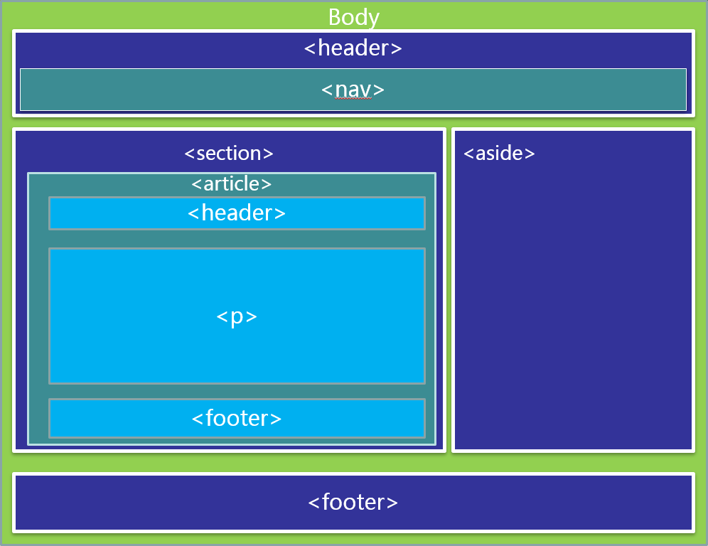

[TOC]

## 学习要求

- 1、了解HTML4.01和XHTML相关知识
- 2、具备CSS2使用能力
- 3、能够熟练应用javascript。
- 4、有耐心和毅力，勤于动手。

## 学习提纲

- HTML5的发展路程
- HTML5标准的改变
- 学习前的准备工作

## 1、HTML5的发展路程

### 一路走来

- HTML1.0 – 在1993年6月发为互联网工程工作小组(IETF)工作草案发布(并非标准)
- HTML 2.0 – 1995年11月作为RFC 1866发布,在RFC 2854于2000年6月发布之后被宣布已经过时
- HTML 3.2 – 1996年1月14日,W3C推荐标准
- HTML 4.0 – 1997年12月18日,W3C推荐标准
- HTML 4.01(微小改进) – 1999年12月24日,W3C推荐标准
- ISO/IEC 15445:2000("ISO HTML") — 2000年5月15日发布,基于严格的HTML 4.01语法,是国际标准化组织和国际电工委员会的标准
- XHTML 1.0 – 发布于2000年1月26日,是W3C推荐标准,后来经过修订于2002年8月1日重新发布
- XHTML 1.1 – 于2001年5月31日发布
- XHTML 2.0


### HTML的BOSS们

> W3C： World Wide Web Consortium	万维网联盟

- 从HTML1.0到HTML4.01
- 从XHTML1.0-XHTML2.1

> WHATWG: Web Hypertext Application Technology Working Group （Web 超文本应用技术工作组 - WHATWG）
- HTML5

### HTML 5是什么

- `HTML5 ≈ HTML + CSS3 + Javascript + API`

## 2、标准的改变

### 标准的改变--不是SGML和XML

- 1、HTML5 并不是定义为SGML或者XML的应用程序。
- 2、在HTML5中并不存在有效性检查，取而代之的是用规范来检测规范的一致性
- 3、HTML5的DTD声明中不需要使用DTD文件
- 4、拥有十分松散的编写手法，但不是没有底线

### 标准的改变—松散的语法

- 不允许写的结束符的标签：

```html
area、base、br、col、command、Embed、hr、img、input、keygen、link、meta、param、source、Track、wbr
```

- 可以省略结束符的标签：

```html
li、dt、dd、p、rt、optgroup、option、Colgroup、thread、tbody、tr、td、th
```

- 可以完全省略的标签：

```html
html、head、body、colgroup、tbody
```

### 标准的改变—HTML5的未来

- 对于HTML5来说，既是一种进步，也是一种妥协。
HTML5诞生之初的目的就是为了向下兼容。所以我们大可不必为了HTML5来临而恐慌，因为：

  - HTML5支持松散的语法。
    - 这种语法极大地兼容了编程人员的不规范代码，同时保证渲染的效果不会改变。
    - HTML4.01版本及语法依然有效。

  - HTML5也没有认为XHTML是错误的。(XHTML5)
    - 这种语法既支持XML的简洁标记，也认为XML的编写方式是正确的
    - XHTML版本及严格的XML编写都是有效的。

## 3、学习前的准备工作

### 支持HTML5的浏览器

- IE9+、Firefox、Opera、Safari、Chrome

### HTML5的推广网站

- http://www.html5cn.org
- http://www.html5china.com
- http://www.mhtml5.com

# HTML标签的改变

- 新的文档类型声明(DTD)
- 新增的HTML5标签
- 删除的HTML标签
- 重新定义的HTML标签
- 崭新新的页面布局

## 1、新的文档类型声明(DTD)

- 文档类型声明
  - HTML5的DTD声明为:
    ```html
        <!doctype html>
        <!DOCTYPE html> 也是正确的，因为HTML语法是不区分大小写的。
    ```
- 在编写HTML5文档时，要求指定文档类型，以确保浏览器能在HTML5的标准模式下进行渲染。

## 2、新增的HTML5标签

- 新增的HTML5标签-结构标签
- 结构标签：(块状元素) 有意义的div

```html
    <article>       标记定义一篇文章
    <header>        标记定义一个页面或一个区域的头部
    <nav>           标记定义导航链接
    <section>       标记定义一个区域
    <aside>         标记定义页面内容部分的侧边栏
    <hgroup>        标记定义文件中一个区块的相关信息
    <figure>        标记定义一组媒体内容以及它们的标题	
    <figcaption>    标签定义 figure 元素的标题。
    <footer>        标记定义一个页面或一个区域的底部
    <dialog>        标记定义一个对话框(会话框)类似微信
```

- 新的结构标签带来的是网页布局的改变及提升对搜索引擎的友好

### 新增的HTML5标签-多媒体标签

- 多媒体交互标签

```html
    <video>     标记定义一个视频
    <audio>     标记定义音频内容
    <source>    标记定义媒体资源
    <canvas>    标记定义图片
    <embed>     标记定义外部的可交互的内容或插件 比如flash
```

- HTML5的多媒体标签的出现意味着富媒体的发展以及支持不使用插件的情况下即可操作媒体文件，极大地提升了用户体验

### 新增的HTML5标签-Web应用标签

- Web应用标签

```html
    <menu>          命令列表
    <menuitem>      menu命令列表标签 FF（嵌入系统）
    <command>       menu标记定义一个命令按钮

    <meter>         状态标签(实时状态显示:气压、气温) C、O
    <progress>      状态标签 (任务过程:安装、加载) C、F、O

    <datalist>      为input标记定义一个下拉列表,配合option， F、O
    <details>       标记定义一个元素的详细内容 ，配合dt、dd， C
```

### 新增的HTML5标签-其他标签

- 注释标签

```html
    <ruby>      标记定义 注释或音标
    <rp>        告诉那些不支持 Ruby元素的浏览器如何去显示
    <rt>        标记定义对ruby的注释内容文本
```

- 其他标签

```html
    <keygen>    标记定义表单里一个生成的键值(加密信息传送)O、F
    <mark>      标记定义有标记的文本 (黄色选中状态)
    <output>    标记定义一些输出类型,计算表单结果配合oninput事件

    <time>      标记定义一个日期/时间 目前所有主流浏览器都不支持
```

## 3、删除的HTML标签

### 删除的HTML标签

- 纯表现的元素：

```html
basefont、big、center、font、s、strike、tt、u
```

- 对可用性产生负面影响的元素：

```html
frame、frameset、noframes
```

- 产生混淆的元素：

```html
acronym、applet、isindex、dir
```

## 4、重新定义的HTML标签

### 重新定义的HTML标签

```html
    <b>         代表内联文本，通常是粗体，没有传递表示重要的意思
    <i>         代表内联文本，通常是斜体，没有传递表示重要的意思
    <dd>        可以同details与figure一同使用，定义包含文本，dialog也可用
    <dt>        可以同details与figure一同使用，汇总细节，dialog也可用
    <hr>        表示主题结束，而不是水平线，虽然显示相同
    <menu>      重新定义用户界面的菜单，配合commond或者menuitem使用
    <small>     表示小字体，例如打印注释或者法律条款
    <strong>    表示重要性而不是强调符号
```

## 5、崭新新的页面布局

### 传统div+CSS页面布局方式


### HTML5布局方式


