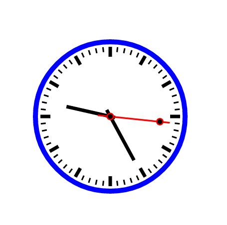

[TOC]

## Canvas 实例 1-时钟

### 本章概要

- 分析时钟的组成
- 分析需要的 canvas 技术
- 动手操作
- 美化时钟

### 效果图预览

### 时钟的组成

- 表盘(蓝色)
- 刻度(黑色)
- 时针(黑色)
- 分针(黑色)
- 秒针(红色)需美化

### 主要应用的技术

- canvas 画线
- canvas 画圆
- 笔触修改和填充笔修改
- 角度旋转
- js 部分对象和方法(Date 对象和 setInterval)
