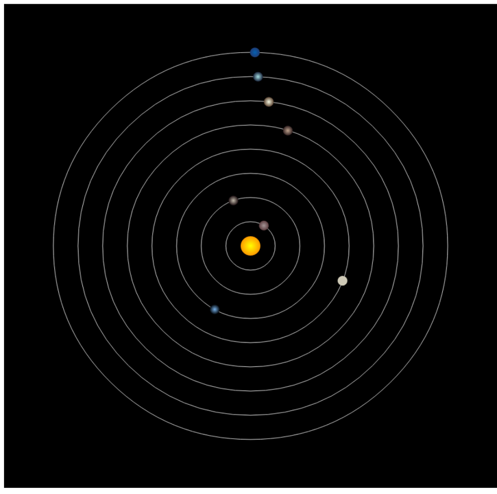

[TOC]

## Canvas实例2-太阳系

### 本章概要

- 分析太阳系的组成
- 分析需要的canvas技术
- 动手操作
  - 先画一个太阳和地球的简单旋转
  - 再画一个太阳和八大行星的组合

### 效果图

### 太阳系的组成

| 星球   | 英文名  | 公转周期    | 光色    | 暗色    |
| ------ | ------- | ----------- | ------- | ------- |
| 太阳   | Sun     | 0           | #FFFF00 | #FF9900 |
| 水星   | Mercury | 87.70 天    | #A69697 | #5C3E40 |
| 金星   | Venus   | 224.701天   | #C4BBAC | #1F1315 |
| 地球   | Earth   | 365.2422天  | #78B1E8 | #050C12 |
| 火星   | Mars    | 686.98 天   | #CEC9B6 | #76422D |
| 木星   | Jupiter | 4332.589天  | #C0A48E | #322222 |
| 土星   | Saturn  | 10759.5 天  | #F7F9E3 | #5C4533 |
| 天王星 | Uranus  | 30799.095天 | #A7E1E5 | #19243A |
| 海王星 | Neptune | 60152天     | #0661B2 | #1E3B73 |

### 主要应用的技术

- canvas画线
- canvas画圆
- 笔触修改和填充笔修改
- 制作渐变色
- 角度旋转
- js部分对象和方法(setInterval)
