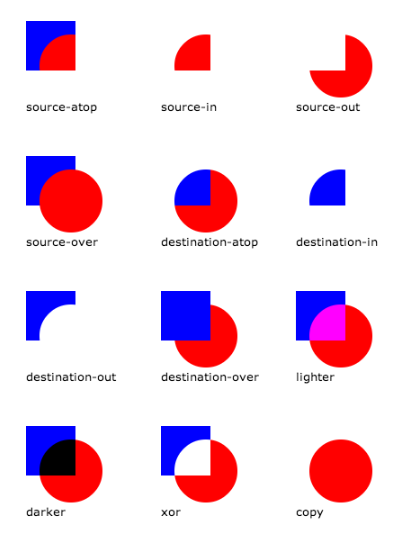

[TOC]

# [HTML5 画布(CANVAS)速查简表](http://www.webhek.com/post/html5-canvas-cheat-sheet.html)

## HTML5 画布(CANVAS)元素

> HTML5 画布(Canvas)元素

```html
<canvas id="myCanvas" width="500" height="300"></canvas>
```

> 浏览器不支持画布(canvas)时的备案

```html
<canvas id="myCanvas" width="500" height="300">
  your browser doesn't support canvas!
</canvas>
```

> 2d context

```js
var context = canvas.getContext("2d");
```

> Webgl context (3d)

```js
var context = canvas.getContext("webgl");
```

## 路径

> 开始路径

```js
context.beginPath();
```

> 画线

```js
context.lineTo(x, y);
```

> 弧形

```js
context.arc(x, y, radius, startAngle, endAngle, counterClockwise);
```

> 二次曲线

```js
context.quadraticCurveTo(cx, cy, x, y);
```

> 三次曲线

```js
context.bezierCurveTo(cx1, cy1, cx2, cy2, x, y);
```

> 关闭路径

```js
context.closePath();
```

## 图形

> 绘制方形

```js
context.rect(x, y, width, height);
context.fill();
context.stroke();
```

> 填充区域

```js
context.fillRect(x, y, width, height);
```

> 绘制方形的边框

```js
context.strokeRect(x, y, width, height);
```

> 绘制圆形

```js
context.arc(x, y, radius, 0, Math.PI * 2);
context.fill();
context.stroke();
```

## 文本

> 写文字

```js
context.font = "40px Arial";
context.fillStyle = "red";
context.fillText("Hello World!", x, y);
```

> 写镂空文字

```js
context.font = "40pt Arial";
context.strokeStyle = "red";
context.strokeText("Hello World!", x, y);
```

> 粗体

```js
context.font = "bold 40px Arial";
```

> 斜体

```js
context.font = "italic 40px Arial";
```

> 对齐方式

```js
context.textAlign = "start|end|left|center|right";
```

> 文字基线

```js
context.textBaseline = "top|hanging|middle|alphabetic|ideographic|bottom";
```

> 获取文本宽度

```js
var width = context.measureText("Hello world").width;
```

## 颜色格式

> 字符串

```js
context.fillStyle = "red";
```

> 16 进制

```js
context.fillStyle = "#ff0000";
```

> 16 进制简写

```js
context.fillStyle = "#f00";
```

> RGB

```js
context.fillStyle = "rgb(255,0,0)";
```

> RGBA

```js
context.fillStyle = "rgba(255,0,0,1)";
```

## 风格

> 填充

```js
context.fillStyle = "red";
context.fill();
```

> 勾勒

```js
context.strokeStyle = "red";
context.stroke();
```

> 线性渐变

```js
var grd = context.createLinearGradient(x1, y1, x2, y2);
grd.addColorStop(0, "red");
grd.addColorStop(1, "blue");
context.fillStyle = grd;
context.fill();
```

> 径向渐变

```js
var grd = context.createRadialGradient(x1, y1, radius1, x2, y2, radius2);
grd.addColorStop(0, "red");
grd.addColorStop(1, "blue");
context.fillStyle = grd;
context.fill();
```

> 图案

```js
var imageObj = new Image();
imageObj.onload = function() {
  var pattern = context.createPattern(imageObj, "repeat");
  context.fillStyle = pattern;
  context.fill();
};
imageObj.src = "path/to/my/image.jpg";
```

> 交点

```js
context.lineJoin = "miter|round|bevel";
```

> 线头

```js
context.lineCap = "butt|round|square";
```

> 阴影

```js
context.shadowColor = "black";
context.shadowBlur = 20;
context.shadowOffsetX = 10;
context.shadowOffsetY = 10;
```

> Alpha (透明)

```js
context.globalAlpha = 0.5; // between 0 and 1
```

## 状态存储

> 存储

```js
context.save();
```

> 恢复

```js
context.restore();
```

## 图片

> 画图

```js
var imageObj = new Image();
imageObj.onload = function() {
  context.drawImage(imageObj, x, y);
};
imageObj.src = "path/to/my/image.jpg";
```

> 指定尺寸画图

```js
var imageObj = new Image();
imageObj.onload = function() {
  context.drawImage(imageObj, x, y, width, height);
};
imageObj.src = "path/to/my/image.jpg";
```

> 裁剪图片

```js
var imageObj = new Image();
imageObj.onload = function() {
  context.drawImage(imageObj, sx, sy, sw, sh, dx, dy, dw, dh);
};
imageObj.src = "path/to/my/image.jpg";
```

## 动画

> 移动

```js
context.translate(x, y);
```

> 扩大缩小

```js
context.scale(x, y);
```

> 旋转

```js
context.rotate(radians);
```

> 水平翻转

```js
context.scale(-1, 1);
```

> 上下翻转

```js
context.scale(1, -1);
```

> 自定义变换

```js
context.transform(a, b, c, d, e, f);
```

> 设置变换

```js
context.setTransform(a, b, c, d, e, f);
```

> 切割

```js
context.transform(1, sy, sx, 1, 0, 0);
```

> 重置

```js
context.setTransform(1, 0, 0, 1, 0, 0);
```

## 裁剪

> 裁剪

```js
// draw path here
context.clip();
```

## 合成

> 合成操作

```js
context.globalCompositeOperation =
  "source-atop|source-in|source-out|source-over|destination-atop|destination-in|destination-out|destination-over|lighter|xor|copy";
```



## DATA URLS

> 获取 Data URL

```js
var dataURL = canvas.toDataURL();
```

> 使用 Data URL 生成图像

```js
var imageObj = new Image();
imageObj.onload = function() {
  context.drawImage(imageObj, 0, 0);
};

imageObj.src = dataURL;
```

## 图像数据

> 获取图像数据

```js
var imageData = context.getImageData(x, y, width, height);
var data = imageData.data;
```

> 遍历像素点

```js
var imageData = context.getImageData(x, y, width, height);
var data = imageData.data;
var len = data.length;
var i, red, green, blue, alpha;

for (i = 0; i < len; i += 4) {
  red = data[i];
  green = data[i + 1];
  blue = data[i + 2];
  alpha = data[i + 3];
}
```

> 沿坐标遍历像素点

```js
var imageData = context.getImageData(x, y, width, height);
var data = imageData.data;
var x, y, red, green, blue, alpha;

for (y = 0; y < imageHeight; y++) {
  for (x = 0; x < imageWidth; x++) {
    red = data[(imageWidth * y + x) * 4];
    green = data[(imageWidth * y + x) * 4 + 1];
    blue = data[(imageWidth * y + x) * 4 + 2];
    alpha = data[(imageWidth * y + x) * 4 + 3];
  }
}
```

> 设置图像数据

```js
context.putImageData(imageData, x, y);
```
