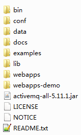
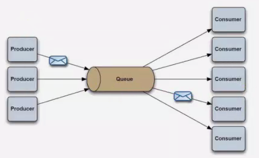
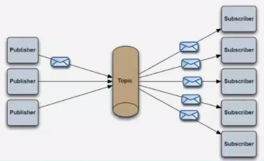

<!-- START doctoc generated TOC please keep comment here to allow auto update -->
<!-- DON'T EDIT THIS SECTION, INSTEAD RE-RUN doctoc TO UPDATE -->
**Table of Contents**  *generated with [DocToc](https://github.com/thlorenz/doctoc)*

- [ActiveMQ](#activemq)
  - [目录](#%E7%9B%AE%E5%BD%95)
  - [1.1 背景 & JMS概述](#11-%E8%83%8C%E6%99%AF--jms%E6%A6%82%E8%BF%B0)
  - [1.2 JMS术语](#12-jms%E6%9C%AF%E8%AF%AD)
  - [1.3 JMS术语概念](#13-jms%E6%9C%AF%E8%AF%AD%E6%A6%82%E5%BF%B5)
  - [1.4 消息格式定义](#14-%E6%B6%88%E6%81%AF%E6%A0%BC%E5%BC%8F%E5%AE%9A%E4%B9%89)
  - [2.1 ActiveMQ简介](#21-activemq%E7%AE%80%E4%BB%8B)
  - [2.2 ActiveMQ使用](#22-activemq%E4%BD%BF%E7%94%A8)
  - [2.3 ActiveMQ Hello World](#23-activemq-hello-world)
  - [2.4 ActiveMQ 安全机制](#24-activemq-%E5%AE%89%E5%85%A8%E6%9C%BA%E5%88%B6)
  - [3.1 Connection方法使用](#31-connection%E6%96%B9%E6%B3%95%E4%BD%BF%E7%94%A8)
  - [3.2 Session方法使用](#32-session%E6%96%B9%E6%B3%95%E4%BD%BF%E7%94%A8)
  - [3.3 MessageProducer](#33-messageproducer)
  - [3.4 MessageConsumer](#34-messageconsumer)
  - [3.5 Message](#35-message)
  - [3.6 创建临时消息](#36-%E5%88%9B%E5%BB%BA%E4%B8%B4%E6%97%B6%E6%B6%88%E6%81%AF)
  - [4.1 高级主题（p2p）](#41-%E9%AB%98%E7%BA%A7%E4%B8%BB%E9%A2%98p2p)
  - [4.2 高级主题（publish-subscribe）](#42-%E9%AB%98%E7%BA%A7%E4%B8%BB%E9%A2%98publish-subscribe)
  - [4.3 高级主题（与spring整合）](#43-%E9%AB%98%E7%BA%A7%E4%B8%BB%E9%A2%98%E4%B8%8Espring%E6%95%B4%E5%90%88)
  - [4.4 高级主题（ActiveMQ集群）](#44-%E9%AB%98%E7%BA%A7%E4%B8%BB%E9%A2%98activemq%E9%9B%86%E7%BE%A4)

<!-- END doctoc generated TOC please keep comment here to allow auto update -->

# ActiveMQ

## 目录

1、JMS

2、ActiveMQ初步

3、ActiveMQ详细使用

4、高级主题（两种经典的消息模式、与spring整合、集群、监控、配置优化等）

## 1.1 背景 & JMS概述

当前，CORBA、DCOM、RMI等RPC中间件技术已广泛应用于各个领域。但是面对规模和复杂度都越来越高的分布式系统，这些技术也显示出其局限性：

1、**同步通信**：客户发出调用后，必须等待服务对象完成处理并返回结果后才能继续执行。

2、**客户和服务对象的生命周期紧密耦合**：客户进程和服务对象进程都必须正常运行；如果由于服务对象崩溃或者网络故障导致客户的请求不可达，客户会接收到异常。

3、**点对点通信**：客户的一次调用只发送给某个单独的对象。

**面向消息的中间件**（Message Oriented Middleware，MOM）较好的解决了以上问题。发送者将消息发送给消息服务器，消息服务器将消息存放在若干队列中，在合适的时候再将消息发送给接收者。这种模式下，发送和接收是异步的，发送者无需等待；二者的生命周期未必相同：发送消息的时候接收者不一定运行，接收消息的时候发送都也不一定运行；一对多通信：对于一个消息可以有多个接收者。

**Java消息服务（JMS）**定义了Java中访问消息中间件的接口。JMS只是接口，并没有给予实现，实现JMS接口的消息中间件称为JMS Provider，已有的MOM系统包括Apache的ActiveMQ，以及阿里巴巴的RocketMQ、IBM的MQSeries、Microsoft的MSMQ和BEA的MessageQ、RabbitMQ等。他们基本都遵循JMS规范。

## 1.2 JMS术语

**JMS**：实现JMS接口的消息中间件

**Provider**（MessageProvider ）：生产者

**Consumer**（MessageConsumer）：消费者

**PTP**（Point to Ponit）：即点对点的消息模型

**Pub/Sub**：Publish/Subscribe，即发布/订阅的消息模型

**Queue**：队列目标

**Topic**：主题目标

**ConnectionFactory**：连接工厂，JMS用它创建连接

**Connection**：JMS客户端到JMS Provider的连接

**Destination**：消息的目的地

**Session**：会话，一个发送或接收消息的线程

## 1.3 JMS术语概念

**ConnectionFactory 接口（连接工厂）**

用户用来创建到JMS提供者的连接的被管对象。JMS客户通过可移植的接口访问连接，这样当下层的实现改变时，代码才需要进行修改。管理员在JNDI名字空间中配置连接工厂，这样，JMS客户才能够查找到它们。根据消息类型的不同，用户将使用队列连接工厂，或者主题连接工厂。

**Connection 接口（连接）**

连接代表了应用程序和消息服务器之间的通信链路。在获得了连接工厂后，就可以创建一个与JMS提供者的连接。根据不同的连接类型，连接允许用户创建会话，以发送和接收队列和主题到目标。

**Destination 接口（目标）**

目标是一个包装了消息目标标识符的被管对象，消息目标是指消息发布和接收的地点，或者是队列，或者是主题。JMS管理员创建这些对象，然后用户通过JNDI发现它们。和连接工厂，管理员可以创建两种类型的目标，点对点模型的队列，以及发布者/订阅者模型的主题。

**MessageConsumer 接口（消息消费者）**

由会话创建的对象，用于接收发送到目标的消息。消费者可以同步地（阻塞模式），或异步（非阻塞）接收队列和主题类型的消息。

**MessageProvider 接口（消息生产者）**

由会话创建的对象，用于发送消息到目标。用户可以创建某个目标的发送者，也可以创建一个通用的发送者，在发送消息时指定目标。

**Message接口（消息）**

是在消费者和生产者之间传送的对象，也就是说从一个应用程序创送到另一个应用程序。一个消息有三个主要部分：

-   **消息头**（必须）：包含用于识别和为消息寻找路由的操作设置。
-   **一组消息属性**（可选）：包含额外的属性，支持其他提供者和用户的兼容。可以创建定制的字段和过滤器（消息选择器）。
-   **一个消息体**（可选）：允许用户创建五种类型的消息（文本消息、映射消息、字节消息、流消息和对象消息）。

消息接口非常灵活，并提供了许多方式来定制消息的内容。

**Session接口（会话）**

表示一个单线程的上下文，用于发送和接收消息。由于会话是单线程的，所以消息是连续的，就是说消息是按照发送的顺序一个一个接收的。会话的好处是它支持事务。如果用户选择了事务支持，会话上下文将保存一组信息，直到事务被提交才发送这些消息。在提交事务之前，用户可以使用回滚操作取消这些消息。一个会话允许用户创建消息生产者来发送消息，创建消息消费者来接收消息。

## 1.4 消息格式定义

JMS定义了一种不同的消息正文格式，以及调用的消息类型，允许你发送并接收一些不同形式的数据，提供现有消息模式的一些级别的兼容性。

-   StreamMessage：Java原始值的数据流
-   MapMessage：一套名称/值对
-   TextMessage：一个字符串对象
-   ObjectMessage：一个序列化的Java对象
-   BytesMessage：一个未解释字节的数据流

## 2.1 ActiveMQ简介

ActiveMQ是 Apache出品，最流行的、能力强劲的开源消息总线。

ActiveMQ是一个完全支持JMS 1.1和J2EE 1.4规范的 JMS Provider实现，尽管JMS规范出台已经是很久的事情了，但是JMS在当今的J2EE应用中间仍然扮演着特殊的地位，可以说 ActiveMQ在业界应用最广泛，当然如果想要有更强大的性能和海量数据处理能力，ActiveMQ还需要不断的升级版本，80%以上的业务我们使用 ActiveMQ以及足够满足需求，当然后续如天猫、淘宝网这种大型的电商网站，尤其是双11这种特殊时间， ActiveMQ需要进行很复杂的优化源码以及架构设计才能完成，我们之后会学习一个更强大的分布式消息中间件 RocketMQ，可以说 ActiveMQ是核心，是基础，所以我们必须要掌握好。

## 2.2 ActiveMQ使用

去官网下载：http://activemq.apache.org/

我们下载最新的版本，学习阶段暂时用windows版本，后期学习RocketMQ的时候使用Linux系统。

下载好进行解压缩，目录如下：



## 2.3 ActiveMQ Hello World

我们首先写一个简单的hello world示例，让大家感受下ActiveMQ，我们需要实现接收者和发送者两部分代码的编写。

Sender/Receiver：

**第一步**：建立ConnectionFactory 工厂对象，需要填入用户名、密码、以及要连接的地址，均使用默认即可，默认端口为“tcp://localhost:61616”。

**第二步**：通过ConnectionFactory 工厂对象我们创建一个Connection连接，并且调用 Connection的start方法开启连接，Connection默认是关闭的。

**第三步**：通过Connection对象创建Session会话（上下文环境对象），用于接收消息，参数配置1为是否启用事务，参数配置2为签收模式，一般我们设置自动签收。

**第四步**：通过Session创建Destination 对象，指的是一个客户端用来指定生产消息目标和消费消息来源的对象，在PTP模式中，Destination 被称作Queue，即队列；在Pub/Sub模式，Destination 被称作Topic，即主题。在程序中可以使用多个Queue和Topic。

**第五步**：我们需要通过Session对象创建消息的发送和接收对象（生产者和消费者）MessageProducer/MessageConsumer。

**第六步**：我们可以使用MessageProducer的setDeliveryMode方法为其设置持久化特性和非持久化特性（DeliveryMode），我们稍后详细介绍。

**第七步**：最后我们使用JMS规范的TextMessage形式创建数据（通过Session对象），并用MessageProducer的send方法发送数据。同理客户端使用receive方法进行接收数据。最后不要忘记关闭Connection连接。

Sender.java

```java
import javax.jms.Connection;
import javax.jms.ConnectionFactory;
import javax.jms.DeliveryMode;
import javax.jms.Destination;
import javax.jms.JMSException;
import javax.jms.MessageProducer;
import javax.jms.Session;
import javax.jms.TextMessage;

import org.apache.activemq.ActiveMQConnectionFactory;

public class Sender {
    public static void main(String[] args) throws JMSException {
        //1.建立ConnectionFactory 工厂对象
        ConnectionFactory connectionFactory = new ActiveMQConnectionFactory(ActiveMQConnectionFactory.DEFAULT_USER,
                ActiveMQConnectionFactory.DEFAULT_PASSWORD, "tcp://localhost:61616");
		//2.通过ConnectionFactory 工厂对象我们创建一个Connection连接
        Connection connection = connectionFactory.createConnection();
        connection.start();
		//3.通过Connection对象创建Session会话（上下文环境对象）
        Session session = connection.createSession(true, Session.CLIENT_ACKNOWLEDGE);
		//4.通过Session创建Destination 对象
        Destination destination = session.createQueue("queue1");
		//5.我们需要通过Session对象创建消息的发送对象（生产者）
        MessageProducer messageProducer = session.createProducer(destination);
        //6.我们可以使用MessageProducer的setDeliveryMode方法为其设置持久化特性和非持久化特性
        messageProducer.setDeliveryMode(DeliveryMode.NON_PERSISTENT);
		//7.最后我们使用JMS规范的TextMessage形式创建数据（通过Session对象），并用MessageProducer的send方法发送数据
        for (int i = 0; i < 5; i++) {
            TextMessage textMessage = session.createTextMessage();
            textMessage.setText("我是消息内容，" + i);
            messageProducer.send(textMessage);
            System.out.println("生产者：" + textMessage.getText());
        }
        //打开事务，则必须提交事务
        session.commit();
		//关闭连接
        if (connection != null) {
            connection.close();
        }
    }
}
```

Receiver.java

```java
public class Receiver {
    public static void main(String[] args) throws JMSException {
        //1.建立ConnectionFactory 工厂对象
        ConnectionFactory connectionFactory = new ActiveMQConnectionFactory(ActiveMQConnectionFactory.DEFAULT_USER,
                ActiveMQConnectionFactory.DEFAULT_PASSWORD, "tcp://localhost:61616");
		//2.通过ConnectionFactory 工厂对象我们创建一个Connection连接
        Connection connection = connectionFactory.createConnection();
        connection.start();
		//3.通过Connection对象创建Session会话（上下文环境对象）
        Session session = connection.createSession(true, Session.CLIENT_ACKNOWLEDGE);
		//4.通过Session创建Destination 对象
        Destination destination = session.createQueue("queue1");
		//5.我们需要通过Session对象创建消息的接收对象（消费者）
        MessageConsumer messageConsumer = session.createConsumer(destination);
		//6.使用JMS规范的TextMessage形式接收数据
        while (true) {
            TextMessage msg = (TextMessage) messageConsumer.receive();
            //CLIENT_ACKNOWLEDGE模式下，必须手工签收
            msg.acknowledge();
            if (msg == null)
                break;
            System.out.println("消费者：接受到的内容：" + msg.getText());
        }
		//关闭连接
        if (connection != null) {
            connection.close();
        }
    }
}
```

## 2.4 ActiveMQ 安全机制

ActiveMQ 的web管理界面：http://127.0.0.1:8161/admin

ActiveMQ 管控台使用jetty部署，所以需要修改密码，则需要到相应的配置文件

**C:\apache-activemq-5.11.1\conf\jetty-realm.properties**

```bash
## ---------------------------------------------------------------------------
## Licensed to the Apache Software Foundation (ASF) under one or more
## contributor license agreements.  See the NOTICE file distributed with
## this work for additional information regarding copyright ownership.
## The ASF licenses this file to You under the Apache License, Version 2.0
## (the "License"); you may not use this file except in compliance with
## the License.  You may obtain a copy of the License at
## 
## http://www.apache.org/licenses/LICENSE-2.0
## 
## Unless required by applicable law or agreed to in writing, software
## distributed under the License is distributed on an "AS IS" BASIS,
## WITHOUT WARRANTIES OR CONDITIONS OF ANY KIND, either express or implied.
## See the License for the specific language governing permissions and
## limitations under the License.
## ---------------------------------------------------------------------------

# Defines users that can access the web (console, demo, etc.)
# username: password [,rolename ...]
admin: admin, admin
user: user, user
```

ActiveMQ 应该设置有安全机制，只有符合认证的用户才能进行发送和获取消息，所以我们也可以在activemq.xml里去添加安全验证配置！

**C:\apache-activemq-5.11.1\conf\activemq.xml**

在第123行之后添加配置！（添加一个插件配置即可）

```xml
<plugins>
    <simpleAuthenticationPlugin>
        <users>
            <authenticationUser username="alien" password="alien" groups="users,admins"/>
        </users>
    </simpleAuthenticationPlugin>
</plugins>
```

## 3.1 Connection方法使用

在成功创建正确的ConnectionFactory后，下一步将是创建一个连接，它是JMS定义的一个接口。ConnectionFactory负责返回可以与底层消息传递系统进行通信的Connection实现。通常客户端只使用单一连接。根据JMS文档，Connection的目的是“利用JMS提供者封装开放的连接”，以及表示“客户端与提供者服务例程之间的开放TCP/IP套接字”。该文档还指出Connection应该是进行客户端身份验证的地方等等。

当一个Connection被创建时，它的传输默认是关闭的，必须使用start方法开启。一个Connection可以建立一个或多个的Session。

当一个程序执行完成后，必须关闭之前创建的Connection，否则ActiveMQ不能释放资源，关闭一个Connection同样也关闭了Session、MessageProducer和MessageConsumer。

```java
Connection createConnection();
Connection createConnection(String userName, String password);
```

## 3.2 Session方法使用

一旦从ConnectionFactory中获取一个Connection，必须从Connection中创建一个或者多个Session。Session是一个发送或接收消息的线程，可以使用Session创建MessageProducer、MessageConsumer和Message。

Session可以被事务化，也可以不被事务化，通常，可以通过Connection上的适当创建方法传递一个布尔参数对此进行设置。

```java
Session createSession(boolean transacted, int acknowledgeMode);
```

其中`transacted`为使用事务标识，`acknowledgeMode`为签收模式。

**结束事务**有两种方法：提交或者回滚。当一个事务提交，消息被处理。如果事务中有一个步骤失败，事务就回滚，这个事务中的已经执行的动作将被撤销。在发送消息最后也必须要使用`session.commit()`方法表示提交事务。

**签收模式**有三种形式：

-   `Session.AUTO_ACKNOWLEDGE`：当客户端从`receive`或`onMessage`成功返回时，Session自动签收客户端的这条消息的收条。
-   `Session.CLIENT_ACKNOWLEDGE`：客户端通过调用消息（Message）的`acknowledge`方法签收消息。在这种情况下，签收发生在Session层面：签收一个已消费的消息会自动地签收这个Session所有已消费消息的收条。

-   `Session.DUPS_OK_ACKNOWLEDGE`：此选项指示Session不必确保对传送消息的签收。它可能引起消息的重复，但是降低了Session的开销，所有只有客户端能容忍重复的消息才可使用。

## 3.3 MessageProducer

`MessageProducer`是一个由Session创建的对象，用来向Destination发送消息。

```java
void send(Message message) throws JMSException;

void send(Message message, int deliveryMode, int priority, long timeToLive) throws JMSException;

void send(Destination destination, Message message) throws JMSException;

void send(
    Destination destination,
    Message message,
    int deliveryMode,
    int priority,
    long timeToLive)
    throws JMSException;
```

其中`deliveryMode`为传递模式，`priority`为消息优先级，`timeToLive`为消息过期时间。ActiveMQ 支持两种消息传送模式：`DeliveryMode.PERSISTENT`和`DeliveryMode.NON_PERSISTENT`。如果不指定传递模式，那么默认是持久性消息。如果容忍消息丢失，那么使用非持久性消息可以改善性能和减少存储的开销。

消息优先级从0-9十个级别，0-4为普通消息，5-9为加急消息。如果不指定优先级，则默认为4。JMS不要求严格按照这十个优先级发送消息，但必须保证加急消息要先于普通信息到达。

默认情况下，消息永不会过期。如果消息在特定周期内失去意义，那么可以设置过期时间，时间单位为毫秒。

## 3.4 MessageConsumer

MessageConsumer是一个由Session创建的对象，用来从Destination接收消息。

```java
MessageConsumer createConsumer(Destination destination)
        throws JMSException;

MessageConsumer createConsumer(
    Destination destination,
    java.lang.String messageSelector)
    throws JMSException;

MessageConsumer createConsumer(
    Destination destination,
    java.lang.String messageSelector,
    boolean NoLocal)
    throws JMSException;

TopicSubscriber createDurableSubscriber(Topic topic, String name)
        throws JMSException;

TopicSubscriber createDurableSubscriber(
    Topic topic,
    String name,
    String messageSelector,
    boolean noLocal)
    throws JMSException;
```

其中`messageSelector`为消息选择器；`noLocal`标志默认为`false`，当设置为`true`时限制消费者只能接收和自己相同的连接（Connection）所发布的消息，此标志只适用于主题，不适用于队列；`name`标识订阅主题所对应的订阅名称，持久订阅时需要设置此参数。

```java
public final String SELECTOR = "JMS_TYPE='MY_TAG1'";
```

该选择器检查了传入消息的`JMS_TYPE`属性，并确定了这个属性的值是否等于`MY_TAG1`。如果相等，则消息被消费，如果不相等，那么消息会被忽略。

**消息的同步和异步接收**：

消息的同步接收是批客户端主动去接收消息，客户端可以采用`MessageConsumer`的`receive`方法去接收下一个消息。

```java
Message receive() throws JMSException;

Message receive(long timeout) throws JMSException;

Message receiveNoWait() throws JMSException;
```

消息的异步接收是指当消息到达时，ActiveMQ主动通知客户端，可以通过注册一个实现`MessageListener`接口的对象到`MessageConsumer`。`MessageListener`只有一个必须实现的方法`onMessage`，它只接收一个参数，即`Message`。在为每个发送到`Destination`的消息实现`onMessage`时，将调用该方法。

## 3.5 Message

JMS程序的最终目的是生产和消费的消息能被其他程序使用，JMS的Message是一个既简单又不乏灵活性的基本格式，允许创建不同平台上符合非JMS程序格式的消息。Message由以下几部分组成：消息头，属性和消息体。

```java
BlobMessage createBlobMessage(File file) throws JMSException;
BlobMessage createBlobMessage(InputStream in) throws JMSException;
BlobMessage createBlobMessage(URL url) throws JMSException;
BlobMessage createBlobMessage(URL url, boolean deletedByBroker) throws JMSException;

BytesMessage createBytesMessage() throws JMSException;

MapMessage createMapMessage() throws JMSException;

Message createMessage() throws JMSException;

ObjectMessage createObjectMessage() throws JMSException;
ObjectMessage createObjectMessage(Serializable object) throws JMSException;

StreamMessage createStreamMessage() throws JMSException;

TextMessage createTextMessage() throws JMSException;
TextMessage createTextMessage(String text) throws JMSException;
```

我们一般会在接收端通过instanceof方法去区别数据类型。

## 3.6 创建临时消息

ActiveMQ通过createTemporaryQueue和createTemporaryTopic创建临时目标，这些目标持续到创建它的Connection关闭。只有创建临时目标的Connection所创建的客户端才可以从临时目标中接收消息，但是任何的生产者都可以向临时目标中发送消息。如果关闭了创建些目标的Connection，那么临时目标被关闭，内容 也将消失。

```java
TemporaryQueue createTemporaryQueue();
TemporaryTopic createTemporaryTopic();
```

## 4.1 高级主题（p2p）

p2p的过程理解起来更加简单，它好比是两个人打电话，这两个人是独享这一条通信链路的。一方发送消息，另外一方接收，就这么简单。在实际应用中因为有多个用户使用p2p的链路，它的通信场景如下图所示：



## 4.2 高级主题（publish-subscribe）

发布订阅模式有点类似于我们日常生活中订阅报纸。每年到年尾的时候，邮局就会发一本报纸集合让我们来选择订阅哪一个。在这个表里头列了所有出版发行的报纸，那么对我们每一个订阅者来说，我们可以选择一份或者多份报纸。比如北京日报、潇湘晨报等。那么这些我们订阅的报纸就相当于发布订阅模式的topic。有很多个人订阅报纸，也有人可能和我订阅了相同的报纸。那么在这里相当于我们在同一个topic里注册了。对于一份报纸发行方来说，它和所有的订阅者就构成了一个一对多的关系。这种关系如下图所示：



## 4.3 高级主题（与spring整合）

ActiveMQ可以很轻松的与Spring进行整合，Spring提供了一系列的接口类，非常的好用！

我们接下来使用spring框架整合ActiveMQ，邮件消息中间件，异步处理任务的机制，比如异步消费数据、异步发送邮件、异步做查询操作等。

http://blog.csdn.net/jiangxuchen/article/details/8004570

## 4.4 高级主题（ActiveMQ集群）

Zookeeper + LevelDB + ActiveMQ搭建集群，提供高可用操作。

官方文档：http://activemq.apache.org/replicated-leveldb-store.html

步骤：详细见ActiveMQ集群使用文档


