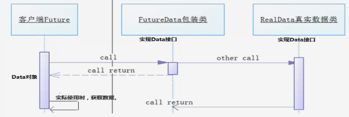
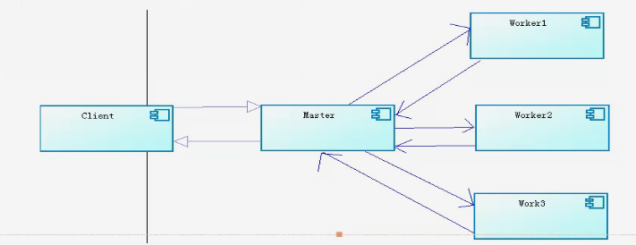
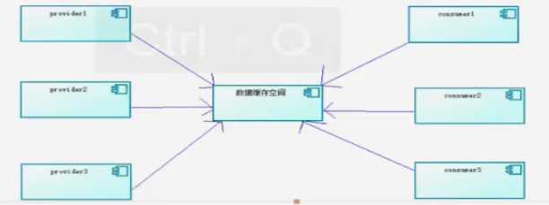

<!-- START doctoc generated TOC please keep comment here to allow auto update -->
<!-- DON'T EDIT THIS SECTION, INSTEAD RE-RUN doctoc TO UPDATE -->
**Table of Contents**  *generated with [DocToc](https://github.com/thlorenz/doctoc)*

- [并发编程](#%e5%b9%b6%e5%8f%91%e7%bc%96%e7%a8%8b)
  - [目录](#%e7%9b%ae%e5%bd%95)
  - [1、并发编程学习目的](#1%e5%b9%b6%e5%8f%91%e7%bc%96%e7%a8%8b%e5%ad%a6%e4%b9%a0%e7%9b%ae%e7%9a%84)
  - [1.1 线程安全](#11-%e7%ba%bf%e7%a8%8b%e5%ae%89%e5%85%a8)
  - [1.2多个线程多个锁](#12%e5%a4%9a%e4%b8%aa%e7%ba%bf%e7%a8%8b%e5%a4%9a%e4%b8%aa%e9%94%81)
  - [1.3 对象锁的同步和异步](#13-%e5%af%b9%e8%b1%a1%e9%94%81%e7%9a%84%e5%90%8c%e6%ad%a5%e5%92%8c%e5%bc%82%e6%ad%a5)
  - [1.4 脏读](#14-%e8%84%8f%e8%af%bb)
  - [1.5 syschronized锁重入（reentrantLock）](#15-syschronized%e9%94%81%e9%87%8d%e5%85%a5reentrantlock)
  - [1.6 synchronized代码块](#16-synchronized%e4%bb%a3%e7%a0%81%e5%9d%97)
  - [1.7 volatile关键字的概念](#17-volatile%e5%85%b3%e9%94%ae%e5%ad%97%e7%9a%84%e6%a6%82%e5%bf%b5)
  - [1.7 volatile关键字的非原子性](#17-volatile%e5%85%b3%e9%94%ae%e5%ad%97%e7%9a%84%e9%9d%9e%e5%8e%9f%e5%ad%90%e6%80%a7)
  - [2.1 线程之间通信](#21-%e7%ba%bf%e7%a8%8b%e4%b9%8b%e9%97%b4%e9%80%9a%e4%bf%a1)
  - [2.2 使用wait/notify模拟Queue](#22-%e4%bd%bf%e7%94%a8waitnotify%e6%a8%a1%e6%8b%9fqueue)
  - [2.3 ThreadLocal](#23-threadlocal)
  - [2.4 单例&多线程](#24-%e5%8d%95%e4%be%8b%e5%a4%9a%e7%ba%bf%e7%a8%8b)
  - [3.1 同步类容器](#31-%e5%90%8c%e6%ad%a5%e7%b1%bb%e5%ae%b9%e5%99%a8)
  - [3.2 并发类容器](#32-%e5%b9%b6%e5%8f%91%e7%b1%bb%e5%ae%b9%e5%99%a8)
  - [4.1 ConcurrentMap](#41-concurrentmap)
  - [4.2 Copy-On-Write容器](#42-copy-on-write%e5%ae%b9%e5%99%a8)
  - [5.1 并发的Queue](#51-%e5%b9%b6%e5%8f%91%e7%9a%84queue)
  - [5.2 ConcurrentLinkedQueue](#52-concurrentlinkedqueue)
  - [5.3 BlockingQueue接口](#53-blockingqueue%e6%8e%a5%e5%8f%a3)
  - [5.4 BlockingQueue接口的重要方法](#54-blockingqueue%e6%8e%a5%e5%8f%a3%e7%9a%84%e9%87%8d%e8%a6%81%e6%96%b9%e6%b3%95)
  - [5.5 Deque双端队列](#55-deque%e5%8f%8c%e7%ab%af%e9%98%9f%e5%88%97)
  - [6.1 多线程的设计模式](#61-%e5%a4%9a%e7%ba%bf%e7%a8%8b%e7%9a%84%e8%ae%be%e8%ae%a1%e6%a8%a1%e5%bc%8f)
  - [6.2 Future模式](#62-future%e6%a8%a1%e5%bc%8f)
  - [6.3 Master-Worker模式](#63-master-worker%e6%a8%a1%e5%bc%8f)
  - [6.4 生产者-消费者模式](#64-%e7%94%9f%e4%ba%a7%e8%80%85-%e6%b6%88%e8%b4%b9%e8%80%85%e6%a8%a1%e5%bc%8f)
  - [7.1 Executor框架](#71-executor%e6%a1%86%e6%9e%b6)
  - [7.2 自定义线程池](#72-%e8%87%aa%e5%ae%9a%e4%b9%89%e7%ba%bf%e7%a8%8b%e6%b1%a0)
  - [7.3 自定义线程池使用详细](#73-%e8%87%aa%e5%ae%9a%e4%b9%89%e7%ba%bf%e7%a8%8b%e6%b1%a0%e4%bd%bf%e7%94%a8%e8%af%a6%e7%bb%86)
  - [8.1 concurrent.util常用类](#81-concurrentutil%e5%b8%b8%e7%94%a8%e7%b1%bb)
  - [8.2 concurrent.util常用类](#82-concurrentutil%e5%b8%b8%e7%94%a8%e7%b1%bb)
  - [9.1 锁](#91-%e9%94%81)
  - [9.2 ReentrantLock（重入锁）](#92-reentrantlock%e9%87%8d%e5%85%a5%e9%94%81)
  - [9.3 锁与等待/通知](#93-%e9%94%81%e4%b8%8e%e7%ad%89%e5%be%85%e9%80%9a%e7%9f%a5)
  - [9.4 多Condition](#94-%e5%a4%9acondition)
  - [9.5 Lock/Conditions其他方法和用法](#95-lockconditions%e5%85%b6%e4%bb%96%e6%96%b9%e6%b3%95%e5%92%8c%e7%94%a8%e6%b3%95)
  - [9.6 ReentrantReadWriteLock（读写锁）](#96-reentrantreadwritelock%e8%af%bb%e5%86%99%e9%94%81)
  - [9.7 锁优化总结](#97-%e9%94%81%e4%bc%98%e5%8c%96%e6%80%bb%e7%bb%93)

<!-- END doctoc generated TOC please keep comment here to allow auto update -->

# 并发编程

## 目录

1、线程安全

2、synchronized & volatile

3、同步类容器、并发类容器 “Concurrent”、"CopyOnWrite"

4、Queue

5、生产者消费者模式

6、Executors线程池

7、JMS规范

8、ActiveMQ初步

9、ActiveMQ API讲解

10、ActiveMQ高级主题（点对点模式/发布与订阅模式）

11、多线程+ActiveMQ负载均衡实战


## 1、并发编程学习目的

**我们为什么要去学习并发编程？**

**第一点**：面试非常重要，企业面试程序员标准，考察因素：

- 1、考察我公司技术你是否熟悉50%以上，或者我们公司有特殊的技术需求，正好 你熟悉。那么可能会考虑录用你。

- 2、细节、态度、人品问题。（1、2条件满足基本上就会录用你）

- 3、知识面、潜力（这是加分项）

**第二点**：如果你学习好了并发编程，在以后的分布式系统中，你都可以找到类似并发、分布式、并行处理问题的概念。

**我们该如何学习并发编程？**

在公司其实很多JAVA程序员，亦或是所谓的技术Leader，他们可能知道多线程中有synchronized、volatile、ReentrantLock、concurrent下数据包等等...这些看似高深的代名词，但是不等于他们就会懂得如何去使用，滥用的结果往往需要自己承担相应的后果：）。其实并发编程没有我们想象的那么复杂，我们只需要掌握最基本的概念就可以很轻松的入门，然后从中剖析这些概念的本质，结合实际业务逻辑去应用上去，那么你就会成为并发编程方面的专家。

## 1.1 线程安全

**编程安全概念**：当多个线程访问某一个类（对象或方法）时，这个类始终都能表现出正确的行为，那么这个类（对象或方法）就是线程安全的。

**synchronized**：可以在任意对象或方法上加锁，而加锁的这段代码称为“互斥区”或临界区。

**示例**：

```java
public class MyThread extends Thread {
    private int count = 5;

    //synchronized加锁, 对象锁，相当于synchronized(this){...}
    public synchronized void run() {
        count--;
        System.out.println(this.currentThread().getName() + " count=" + count);
    }

    public static void main(String[] args) {
        MyThread myThread = new MyThread();
        Thread t1 = new Thread(myThread, "t1");
        Thread t2 = new Thread(myThread, "t2");
        Thread t3 = new Thread(myThread, "t3");
        Thread t4 = new Thread(myThread, "t4");
        Thread t5 = new Thread(myThread, "t5");
        t1.start();
        t2.start();
        t3.start();
        t4.start();
        t5.start();
    }
}
```

**示例总结：**

当多个线程访问myThread的run方法时，以排队的方式进行处理（这里排队是按照CPU分配的先后顺序而定的），一个线程想要执行synchronized修饰的方法里的代码，首先是尝试获得锁，如果拿到锁，执行synchronized代码体内容；拿不到锁，这个线程就会不断地尝试获得这把锁，直到拿到为止，而且是多个线程同时去竞争这把锁。（也就是会有锁竞争的问题）

## 1.2多个线程多个锁

**多个线程多个锁**：多个线程，每个线程都可以拿到自己指定的锁，分别获得锁之后，执行synchronized方法体的内容。

**示例：**

```java
public class MultiThread {
    private static int num = 0;

    // 类一级别的锁（独占.class类），相当于synchronized(MultiThread.class){...}
    // 如果不加static，则为对象锁，对象锁在不同线程中互不影响
    public static synchronized void printNum(String tag) {
        try {
            if (tag.equals("a")) {
                num = 100;
                System.out.println("tag a, set num over!");
                Thread.sleep(1000);
            } else {
                num = 200;
                System.out.println("tag b, set num over!");
            }

            System.out.println("tag " + tag + ", num = " + num);
        } catch (Exception e) {
            e.printStackTrace();
        }
    }

    public static void main(String[] args) {
        final MultiThread m1 = new MultiThread();
        final MultiThread m2 = new MultiThread();
        Thread t1 = new Thread(new Runnable() {
            @Override
            public void run() {
                m1.printNum("a");
            }
        });

        Thread t2 = new Thread(new Runnable() {
            @Override
            public void run() {
                m2.printNum("b");
            }
        });
        t1.start();
        t2.start();
    }
}
```

**示例总结：**

关键字synchronized取得的锁都是对象锁，而不是把一段代码（方法）当做锁，所以示例代码中那个线程先执行synchronized关键字的方法，那个线程就持有该 方法所属**对象的锁（Lock）**，两个对象，线程获得的就是两个不同的锁，他们互不影响。

有一种情况则是相同的锁，即在静态方法上加synchronized关键字，表示锁定.class类，**类一级别的锁**（独占.class类）。

## 1.3 对象锁的同步和异步

**同步：synchronized**

同步的概念就是共享，我们要牢牢记住“共享”这俩个字，如果不是共享的资源，就没有必要进步同步。

**异步：asynchronized**

异步的概念就是独立，相互之间不受到任何制约。就好像我们学习http的时候，在页面发起的Ajax请求，我们还可以继续浏览或操作页面的内容，二者之间没有任何关系。

同步的目的就是为了线程安全，其实对于线程安全来说，需要满足两个特性：

- 原子性（同步）

- 可见性

**示例：**

```java
public class MyObject {
    public synchronized void method1() {
        try {
            System.out.println(Thread.currentThread().getName());
            Thread.sleep(1000);
        } catch (InterruptedException e) {
            e.printStackTrace();
        }
    }

    public synchronized void method2() {
        System.out.println(Thread.currentThread().getName());
    }

    public static void main(String[] args) {
        final MyObject mo = new MyObject();
        // 分析：
        // t1线程先持有object对象的Lock锁，t2线程如果这个时候调用对象的同步（synchronized）方法则需等待，也就是同步
        Thread t1 = new Thread(new Runnable() {
            @Override
            public void run() {
                mo.method1();
            }
        }, "t1");
        // t1线程先持有object对象的Lock锁，t2线程可以以异步的方式调用对象中的非synchronized修饰的方法
        Thread t2 = new Thread(new Runnable() {
            @Override
            public void run() {
                mo.method2();
            }
        }, "t2");

        t1.start();
        t2.start();
    }
}
```

**示例总结：**

A线程先持有Object对象的Lock锁，B线程如果这个时候调用对象中的同步（synchronized）方法则需要等待，也就是同步。

A线程先持有Object对象的Lock锁，B线程可以以异步的方式调用对象中的非synchronized修饰的方法。

## 1.4 脏读

对于对象的同步和异步的方法，我们在设计自己的程序的时候，一定要考虑问题的整体，不然就会出现数据不一致的错误，很经典的错误就是脏读（dirtyread）

**示例：**

```java
public class DirtyRead {
    private String username = "abc";
    private String password = "123";

    public synchronized void setValue(String username, String password) {
        this.username = username;
        try {
            Thread.sleep(2000);
        } catch (InterruptedException e) {
            e.printStackTrace();
        }
        this.password = password;
        System.out.println("setValue : username= " + this.username + ", password=" + this.password);
    }

    public void getValue() {
        System.out.println("getValue : username= " + this.username + ", password=" + this.password);
    }

    public static void main(String[] args) throws Exception {
        final DirtyRead dr = new DirtyRead();
        Thread t1 = new Thread(new Runnable() {
            @Override
            public void run() {
                dr.setValue("jack", "888");
            }
        });
        t1.start();
        Thread.sleep(1000);
        dr.getValue();
    }
}
```

**示例总结：**

在我们对一个对象的方法加锁的时候，需要考虑业务的整体性，即为setValue/getValue方法同时加锁（synchronized同步关键字），保证业务（service）的原子性，不然会出现业务错误（也从侧面保证业务的一致性）。

## 1.5 syschronized锁重入（reentrantLock）

关键字synchronized拥有锁重入的功能，也就是在使用synchronized时，当一个线程得到了一个对象的锁后，再次请求此对象时是可以再次得到该对象的锁。

**示例1：**

```java
public class SyncDubbo {
    //方法嵌套适用于锁重入规则
    public synchronized void method1() {
        System.out.println("method1...");
        method2();
    }

    public synchronized void method2() {
        System.out.println("method2...");
        method3();
    }

    public synchronized void method3() {
        System.out.println("method3...");
    }

    public static void main(String[] args) {
        final SyncDubbo sd = new SyncDubbo();
        Thread t = new Thread(new Runnable() {
            @Override
            public void run() {
                sd.method1();
            }
        });
        t.start();
    }
}
```

**示例2：**

```java
/**
 * 继承也适用于锁重入规则
 */
public class SyncDubbo2 {
    static class Main {
        public int i = 10;

        public synchronized void operationSup() {
            try {
                i--;
                System.out.println("Main print i = " + i);
                Thread.sleep(100);
            } catch (Exception e) {
                e.printStackTrace();
            }
        }
    }

    static class Sub extends Main{
        public synchronized void operationSub() {
            try {
                while (i > 0) {
                    i--;
                    System.out.println("Sub print i = " + i);
                    Thread.sleep(100);
                    this.operationSup();
                }
            } catch (Exception e) {
                // TODO: handle exception
            }
        }
    }

    public static void main(String[] args) {
        Thread t = new Thread(new Runnable() {
            @Override
            public void run() {
                Sub sub = new Sub();
                sub.operationSub();
            }
        });
        t.start();
    }
}
```

**示例3：**

```java
public class SyncException {
    private int i = 0;

    public synchronized void operation() {
        while (true) {
            try {
                i++;
                Thread.sleep(200);
                System.out.println(Thread.currentThread().getName() + ", i = " + i);
                if (i == 10) {
                    // 考虑异常时处理
                    Integer.parseInt("a");
                    // 异常会导致锁释放
                    // throw new RuntimeException();
                }
            } catch (Exception e) {
                e.printStackTrace();
                System.out.println(" log info i = " + i);
            }
        }
    }

    public static void main(String[] args) {
        final SyncException se = new SyncException();
        Thread t1 = new Thread(new Runnable() {
            @Override
            public void run() {
                se.operation();
            }
        });
        t1.start();
    }
}
```

**说明 ：**

对于web应用程序，异常释放锁的情况，如果不及时处理，很可能对你的应用程序业务逻辑产生严重的错误，比如你现在执行一个队列任务，很多对象都在等待第一个对象正确执行完毕再去释放锁，但是第一个对象由于异常的出现，导致业务逻辑 没有正常执行完毕，就释放了锁，那以可想而知后续的对象执行的都是错误的逻辑。所以这一点一定要引起注意，在编写代码的时候，一定要考虑周全。

## 1.6 synchronized代码块

使用synchronized声明的方法在某些情况下是有弊端的，比如A线程调用同步的方法执行一个很长的任务，那么B线程就必须等待比较长的时间才能执行，这样的情况下可以使用synchronized代码块去优化代码执行时间，也就是通常所说的减小锁的粒度。

synchronized可以使用任意的Object进行加锁，用法比较灵活。

**示例：**

```java
public class ObjectLock {
    public void method1() {
        // 对象锁
        synchronized (this) {
            try {
                System.out.println("do method1...");
                Thread.sleep(2000);
            } catch (InterruptedException e) {
                e.printStackTrace();
            }
        }
    }

    public void method2() {
        // 类锁
        synchronized (ObjectLock.class) {
            try {
                System.out.println("do method2...");
                Thread.sleep(2000);
            } catch (InterruptedException e) {
                e.printStackTrace();
            }
        }
    }

    private Object lock = new Object();

    public void method3() {
        // 任意对象锁
        synchronized (lock) {
            try {
                System.out.println("do method3...");
                Thread.sleep(2000);
            } catch (InterruptedException e) {
                e.printStackTrace();
            }
        }
    }
}
```

另外特别注意一个问题，就是不要使用String的常量加锁，会出现死循环的问题。

**示例：**

```java
public class StringLock {
    public void method() {
        // 使用字符串常量会导致其他线程拿不到锁，应尽量避免使用
        // 如果要使用字符串，就要用new String("字符串常量")的形式进行实例化
        synchronized ("字符串常量") {
            try {
                while (true) {
                    System.out.println("当前线程：" + Thread.currentThread().getName() + "开始");
                    Thread.sleep(1000);
                    System.out.println("当前线程：" + Thread.currentThread().getName() + "结束");
                }
            } catch (Exception e) {
                e.printStackTrace();
            }
        }
    }

    public static void main(String[] args) {
        final StringLock stringLock = new StringLock();
        Thread t1 = new Thread(new Runnable() {
            @Override
            public void run() {
                stringLock.method();
            }
        }, "t1");

        Thread t2 = new Thread(new Runnable() {
            @Override
            public void run() {
                stringLock.method();
            }
        }, "t2");

        t1.start();
        t2.start();
    }
}
```

锁对象的改变问题，当使用一个对象进行加锁的时候，要注意对象本身发生改变的时候，那么持有的锁就不同。

**示例：**

```java
public class ChangeLock {
    private String lock = "lock";

    private void method() {
        synchronized (lock) {
            try {
                System.out.println("当前线程：" + Thread.currentThread().getName() + "开始");
                // 尽量不要修改对象锁，否则会造成锁失效
                lock = "change lock";
                Thread.sleep(2000);
                System.out.println("当前线程：" + Thread.currentThread().getName() + "结束");
            } catch (InterruptedException e) {
                e.printStackTrace();
            }
        }
    }

    public static void main(String[] args) throws Exception {
        final ChangeLock changeLock = new ChangeLock();

        Thread t1 = new Thread(new Runnable() {
            @Override
            public void run() {
                changeLock.method();
            }
        }, "t1");

        Thread t2 = new Thread(new Runnable() {
            @Override
            public void run() {
                changeLock.method();
            }
        }, "t2");

        t1.start();
        Thread.sleep(100);
        t2.start();
    }
}
```

如果对象本身不发生改变，那么依然是同步的，即使是对象的属性发生了改变。

**示例2：**

```java
public class ModifyLock {
    private String name;
    private int age;

    public String getName() {
        return name;
    }

    public void setName(String name) {
        this.name = name;
    }

    public int getAge() {
        return age;
    }

    public void setAge(int age) {
        this.age = age;
    }

    // 对象本身不发生改变，只是改变对象属性，不影响锁的使用
    public synchronized void changeAttr(String name, int age) {
        try {
            System.out.println("当前线程：" + Thread.currentThread().getName() + "开始");
            this.setName(name);
            this.setAge(age);
            System.out.println("当前线程：" + Thread.currentThread().getName() + "修改对象内容为：name=" + this.getName() + ", age="
                    + this.getAge());
            Thread.sleep(2000);
            System.out.println("当前线程：" + Thread.currentThread().getName() + "结束");
        } catch (Exception e) {
            e.printStackTrace();
        }
    }

    public static void main(String[] args) throws Exception {
        final ModifyLock modifyLock = new ModifyLock();

        Thread t1 = new Thread(new Runnable() {
            @Override
            public void run() {
                modifyLock.changeAttr("July", 20);
            }
        }, "t1");

        Thread t2 = new Thread(new Runnable() {
            @Override
            public void run() {
                modifyLock.changeAttr("Mary", 18);
            }
        }, "t2");

        t1.start();
        Thread.sleep(100);
        t2.start();
    }
}
```

使用synchronized代码块减小锁的粒度，提高性能。

```java
public class Optimize {
    public void doLongTimeTask() {
        try {
            System.out.println("当前线程开始：" + Thread.currentThread().getName() + ", 正在执行一个较长时间的业务操作，其内容不需要同步");
            Thread.sleep(2000);

            synchronized (this) {
                System.out.println("当前线程：" + Thread.currentThread().getName() + ", 执行同步代码块，对其同步变量进行操作");
                Thread.sleep(1000);
            }
            System.out.println("当前线程结束：" + Thread.currentThread().getName() + ", 执行完毕");

        } catch (InterruptedException e) {
            e.printStackTrace();
        }
    }

    public static void main(String[] args) {
        final Optimize otz = new Optimize();
        Thread t1 = new Thread(new Runnable() {
            @Override
            public void run() {
                otz.doLongTimeTask();
            }
        }, "t1");
        Thread t2 = new Thread(new Runnable() {
            @Override
            public void run() {
                otz.doLongTimeTask();
            }
        }, "t2");
        t1.start();
        t2.start();
    }
}
```

**死锁问题：**

死锁是指两个或两个以上的进程在执行过程中，由于竞争资源或者由于彼此通信而造成的一种阻塞的现象，若无外力作用，它们都将无法推进下去。此时称系统处于死锁状态或系统产生了死锁。

```java
/**
 * 死锁问题，在设计程序时就应该避免双方相互持有对方的锁的情况
 */
public class DeadLock implements Runnable {
    private String tag;
    private static Object lock1 = new Object();
    private static Object lock2 = new Object();

    public void setTag(String tag) {
        this.tag = tag;
    }

    @Override
    public void run() {
        if (tag.equals("a")) {
            synchronized (lock1) {
                try {
                    System.out.println("当前线程 : " + Thread.currentThread().getName() + " 进入lock1执行");
                    Thread.sleep(2000);
                } catch (InterruptedException e) {
                    e.printStackTrace();
                }
                synchronized (lock2) {
                    System.out.println("当前线程 : " + Thread.currentThread().getName() + " 进入lock2执行");
                }
            }
        }
        if (tag.equals("b")) {
            synchronized (lock2) {
                try {
                    System.out.println("当前线程 : " + Thread.currentThread().getName() + " 进入lock2执行");
                    Thread.sleep(2000);
                } catch (InterruptedException e) {
                    e.printStackTrace();
                }
                synchronized (lock1) {
                    System.out.println("当前线程 : " + Thread.currentThread().getName() + " 进入lock1执行");
                }
            }
        }
    }

    public static void main(String[] args) {
        DeadLock d1 = new DeadLock();
        d1.setTag("a");
        DeadLock d2 = new DeadLock();
        d2.setTag("b");

        Thread t1 = new Thread(d1, "t1");
        Thread t2 = new Thread(d2, "t2");

        t1.start();
        try {
            Thread.sleep(500);
        } catch (InterruptedException e) {
            e.printStackTrace();
        }
        t2.start();
    }
}
```

**哲学家就餐问题：**

1 信号量，5个人5只筷子，根据鸽笼原理，是有可能发生死锁的。例如，当所有哲学家都同时拿起左边的筷子时，就会形成死锁。

```java
/**
 * 筷子
 */
class Chopstick {
}

/**
 * 哲学家
 */
class Philosopher {
    private String name;
    private Chopstick chopstick = new Chopstick();
    // 解决方法三：使用ReentrantLock，避免锁竞争
    private Lock lock = new ReentrantLock();

    Philosopher(String name) {
        this.name = name;
    }

    public String getName() {
        return name;
    }

    public Chopstick getChopstick() {
        return chopstick;
    }

    public void eat(Philosopher other) throws Exception {
        // 解决方法二：开放调用
        // 去除synchronized (this.chopstick)
        synchronized (this.chopstick) {// 模拟锁竞争
            System.out.println("哲学家" + this.name + "拿起了自己的筷子");
            Thread.sleep(500); // 模拟持有资源不释放
            System.out.println("哲学家" + this.name + "等待" + other.getName() + "放下筷子");
            synchronized (other.getChopstick()) {
                System.out.println("哲学家" + this.name + "拿到了" + other.getName() + "的筷子，开始吃饭");
            }
        }
    }

    public void eat2(Philosopher other) throws Exception {
        // 避免锁竞争
        if (lock.tryLock()) {
            System.out.println("哲学家" + this.name + "拿起了自己的筷子");
            Thread.sleep(500); // 模拟持有资源不释放
            System.out.println("哲学家" + this.name + "等待" + other.getName() + "放下筷子");
            synchronized (other.getChopstick()) {
                System.out.println("哲学家" + this.name + "拿到了" + other.getName() + "的筷子，开始吃饭");
                lock.unlock();// 吃完饭解锁
            }
        }
    }
}

class HandleThread extends Thread {
    private Philosopher self; // 自己
    private Philosopher other; // 别人
    HandleThread(Philosopher owner, Philosopher other){
        this.self = owner;
        this.other = other;
    }

    public void run() {
        try {
            self.eat(other);
//            self.eat2(other);
        } catch (Exception e) {
            e.printStackTrace();
        }
    }
}

public class DeadLock2 {
    public static void main(String[] args) throws Exception {
        final Philosopher p1 = new Philosopher("p1");
        final Philosopher p2 = new Philosopher("p2");
        final Philosopher p3 = new Philosopher("p3");
        final Philosopher p4 = new Philosopher("p4");
        final Philosopher p5 = new Philosopher("p5");

        HandleThread t1 = new HandleThread(p1, p2);
        HandleThread t2 = new HandleThread(p2, p3);
        HandleThread t3 = new HandleThread(p3, p4);
        HandleThread t4 = new HandleThread(p4, p5);
        HandleThread t5 = new HandleThread(p5, p1);
        t1.start();
        t2.start();
        t3.start();
        t4.start();
        // Thread.sleep(2000);// 解决方法一：p5等其他人吃完饭放下筷子，他才吃，但效率不高
        t5.start();
    }
}
```

避免死锁可以概括成三种方法：

- **固定加锁的顺序**(针对锁顺序死锁)
- **开放调用**(针对对象之间协作造成的死锁)
- **使用定时锁**-->`ReentrantLock.tryLock()`
  - 如果等待获取锁时间超时，则**抛出异常而不是一直等待**！

## 1.7 volatile关键字的概念

**volatile概念**：volatile关键字的主要作用是使变量在多个线程间可见。

```java
public class RunThread extends Thread {
    private volatile boolean isRunning = true;

    private void setRunning(boolean isRunning) {
        this.isRunning = isRunning;
    }

    public void run() {
        System.out.println("进入run方法..");
        int i = 0;
        while (isRunning == true) {
            // ..
        }
        System.out.println("线程停止");
    }

    public static void main(String[] args) throws InterruptedException {
        RunThread rt = new RunThread();
        rt.start();
        Thread.sleep(1000);
        rt.setRunning(false);
        System.out.println("isRunning的值已经被设置了false");
    }
}
```

**示例总结：**

在java中，每一个线程都会有一块工作内存区，其中存放着所有线程共享的主内存中的变量值的拷贝。当线程执行时，他在自己的工作内存区中操作这些变量。为了存取一个共享的变量，一个线程通常先获取锁定并去清除它的内存工作区，把这些共享变量从所有线程的共享内存区中正确的装入到他自己所在的工作内存区中，当线程解锁时保证该工作内存区中变量的值写回到共享内存中。

一个线程可以执行的操作有使用（use）、赋值（assign）、装载（load）、存储（store）、锁定（lock）、解锁（unlock）。

而主内存可以执行的操作有读（read）、写（write）、锁定（lock）、解锁（unlock），每个操作都是原子的。

**volatile的作用就是强制线程到主内存（共享内存）里去读取变量**，而不去线程工作内存区里去读取，从而实现了多个线程间的变量可见。也就是满足线程安全的可见性。

## 1.7 volatile关键字的非原子性

volatile关键字虽然拥有多个线程之间的可见性，但是不具备同步性（也就是原子性），可以算上是一轻量级的synchronized，性能要比synchronized强很多，不会造成阻塞（在很多开源架构里，比如netty的底层代码就大量使用volatile，可见netty性能一定是非常不错的。）这里需要注意：一般volatile用于针对多个线程可见的变量操作，并不能代替synchronized的同步功能。

```java
/**
 * volatile关键字不具备synchronized关键字的原子性（同步）
 */
public class VolatileNoAtomic extends Thread{
    private static volatile int count;
    //private static AtomicInteger count = new AtomicInteger(0);
    private static void addCount(){
        for (int i = 0; i < 1000; i++) {
            count++ ;
            //count.incrementAndGet();
        }
        System.out.println(count);
    }
    
    public void run(){
        addCount();
    }
    
    public static void main(String[] args) {
        
        VolatileNoAtomic[] arr = new VolatileNoAtomic[100];
        for (int i = 0; i < 10; i++) {
            arr[i] = new VolatileNoAtomic();
        }
        
        for (int i = 0; i < 10; i++) {
            arr[i].start();
        }
    }
}
```

示例总结：

volatile关键字只具有可见性，没有原子性。要实现原子性建议使用atomic类的系列对象，支持原子性操作（注意atomic类只保证本身方法原子性，并不保证多次操作的原子性）

```java
public class AtomicUse {
    private static AtomicInteger count = new AtomicInteger(0);

    // 多个addAndGet在一个方法内是非原子性的，需要加synchronized进行修饰，保证4个addAndGet整体原子性
    /** synchronized */
    public synchronized int multiAdd() {
        try {
            Thread.sleep(100);
        } catch (InterruptedException e) {
            e.printStackTrace();
        }
        count.addAndGet(1);
        count.addAndGet(2);
        count.addAndGet(3);
        count.addAndGet(4); // +10
        return count.get();
    }

    public static void main(String[] args) {
        final AtomicUse au = new AtomicUse();

        List<Thread> ts = new ArrayList<Thread>();
        for (int i = 0; i < 100; i++) {
            ts.add(new Thread(new Runnable() {
                @Override
                public void run() {
                    System.out.println(au.multiAdd());
                }
            }));
        }

        for (Thread t : ts) {
            t.start();
        }
    }
}
```

## 2.1 线程之间通信

**线程通信概念**：线程是操作系统中独立的个体，但这些个体如果不经过特殊的处理就不能成为一个整体，线程间的通信就成为整体的必用方式之一。当线程存在通信指挥，系统间的交互会更强大，在提高CPU利用率的同时还会使开发人员对线程任务在处理的过程中进行有效的把控与监督。

使用**wait/notify**方法实现线程间的通信。（注意这两个方法都是object类的方法，换句话说java为所有的对象都提供了这两个方法）

1、wait和notify必须配合synchronized关键字使用

2、wait方法释放锁，notify方法不释放锁。

改造前：

```java
public class ListAdd1 {

    private volatile static List list = new ArrayList();

    public void add() {
        list.add("bjsxt");
    }

    public int size() {
        return list.size();
    }

    public static void main(String[] args) {

        final ListAdd1 list1 = new ListAdd1();

        Thread t1 = new Thread(new Runnable() {
            @Override
            public void run() {
                try {
                    for (int i = 0; i < 10; i++) {
                        list1.add();
                        System.out.println("当前线程：" + Thread.currentThread().getName() + "添加了一个元素..");
                        Thread.sleep(500);
                    }
                } catch (InterruptedException e) {
                    e.printStackTrace();
                }
            }
        }, "t1");

        Thread t2 = new Thread(new Runnable() {
            @Override
            public void run() {
                while (true) {
                    if (list1.size() == 5) {
                        System.out.println("当前线程收到通知：" + Thread.currentThread().getName() + " list size = 5 线程停止..");
                        throw new RuntimeException();
                    }
                }
            }
        }, "t2");

        t1.start();
        t2.start();
    }
}
```

改造后：

```java
/**
 * wait notfiy 方法，wait释放锁，notfiy不释放锁
 */
public class ListAdd2 {
    private volatile static List list = new ArrayList();

    public void add() {
        list.add("bjsxt");
    }

    public int size() {
        return list.size();
    }

    public static void main(String[] args) {
        final ListAdd2 list2 = new ListAdd2();

        // 1 实例化出来一个 lock
        // 当使用wait 和 notify 的时候 ， 一定要配合着synchronized关键字去使用
        final Object lock = new Object();

        Thread t1 = new Thread(new Runnable() {
            @Override
            public void run() {
                try {
                    synchronized (lock) {
                        for (int i = 0; i < 10; i++) {
                            list2.add();
                            System.out.println("当前线程：" + Thread.currentThread().getName() + "添加了一个元素..");
                            Thread.sleep(500);
                            if (list2.size() == 5) {
                                System.out.println("已经发出通知..");
                                //唤醒另一个线程，但是当前线程没有释放锁，导致其他线程无法获得锁，存在不实时通信的问题
                                lock.notify();
                            }
                        }
                    }
                } catch (InterruptedException e) {
                    e.printStackTrace();
                }

            }
        }, "t1");

        Thread t2 = new Thread(new Runnable() {
            @Override
            public void run() {
                synchronized (lock) {
                    if (list2.size() != 5) {
                        try {
                            System.out.println("t2进入...");
                            //阻塞当前线程，等待被唤醒，这里会先释放锁
                            lock.wait();
                        } catch (InterruptedException e) {
                            e.printStackTrace();
                        }
                    }
                    System.out.println("当前线程：" + Thread.currentThread().getName() + "收到通知线程停止..");
                    throw new RuntimeException();
                }
            }
        }, "t2");

        t2.start();
        t1.start();
    }
}
```

最佳方案：

```java
public class ListAdd2 {
    private volatile static List list = new ArrayList();

    public void add() {
        list.add("bjsxt");
    }

    public int size() {
        return list.size();
    }

    public static void main(String[] args) {
        final ListAdd2 list2 = new ListAdd2();
        //并发工具包中的辅助类，倒计数器，解决多个线程并发执行
        final CountDownLatch countDownLatch = new CountDownLatch(1);

        Thread t1 = new Thread(new Runnable() {
            @Override
            public void run() {
                try {
                    for (int i = 0; i < 10; i++) {
                        list2.add();
                        System.out.println("当前线程：" + Thread.currentThread().getName() + "添加了一个元素..");
                        Thread.sleep(500);
                        if (list2.size() == 5) {
                            System.out.println("已经发出通知..");
                            countDownLatch.countDown();//关键代码
                        }
                    }
                } catch (InterruptedException e) {
                    e.printStackTrace();
                }
            }
        }, "t1");

        Thread t2 = new Thread(new Runnable() {
            @Override
            public void run() {
                if (list2.size() != 5) {
                    try {
                        countDownLatch.await();//关键代码
                    } catch (InterruptedException e) {
                        e.printStackTrace();
                    }
                }
                System.out.println("当前线程：" + Thread.currentThread().getName() + "收到通知线程停止..");
                throw new RuntimeException();
            }
        }, "t2");

        t2.start();
        t1.start();
    }
}
```

## 2.2 使用wait/notify模拟Queue

**BlockingQueue**：顾名思义，首先它是一个队列，并且支持阻塞的机制，阻塞的放入和得到数据。我们要实现LinkedBlockingQueue下面两个简单的方法put和take。

**put(anObject)**：把anObject加到BlockingQueue里，如果BlockingQueue没有空间，则调用此方法的线程被阻塞，直到BlockingQueue里面没有空间再继续。

**take**：取走BlockingQueue里排在首位的对象，若BlockingQueue为空，阻断进入等待状态直到BlockingQueue有新的数据被加入。

```Java
public class MyQueue {

    // 1 需要一个承装元素的集合
    private LinkedList<Object> list = new LinkedList<Object>();

    // 2 需要一个计数器
    private AtomicInteger count = new AtomicInteger(0);

    // 3 需要制定上限和下限
    private final int minSize = 0;

    private final int maxSize;

    // 4 构造方法
    public MyQueue(int size) {
        this.maxSize = size;
    }

    // 5 初始化一个对象 用于加锁
    private final Object lock = new Object();

    // put(anObject):
    // 把anObject加到BlockingQueue里,如果BlockQueue没有空间,则调用此方法的线程被阻断，直到BlockingQueue里面有空间再继续.
    public void put(Object obj) {
        synchronized (lock) {
            while (count.get() == this.maxSize) {
                try {
                    lock.wait();
                } catch (InterruptedException e) {
                    e.printStackTrace();
                }
            }
            // 1 加入元素
            list.add(obj);
            // 2 计数器累加
            count.incrementAndGet();
            // 3 通知另外一个线程（唤醒）
            lock.notify();
            System.out.println("新加入的元素为:" + obj);
        }
    }

    // take:
    // 取走BlockingQueue里排在首位的对象,若BlockingQueue为空,阻断进入等待状态直到BlockingQueue有新的数据被加入.
    public Object take() {
        Object ret = null;
        synchronized (lock) {
            while (count.get() == this.minSize) {
                try {
                    lock.wait();
                } catch (InterruptedException e) {
                    e.printStackTrace();
                }
            }
            // 1 做移除元素操作
            ret = list.removeFirst();
            // 2 计数器递减
            count.decrementAndGet();
            // 3 唤醒另外一个线程
            lock.notify();
        }
        return ret;
    }

    public int getSize() {
        return this.count.get();
    }

    public static void main(String[] args) {
        final MyQueue mq = new MyQueue(5);
        mq.put("a");
        mq.put("b");
        mq.put("c");
        mq.put("d");
        mq.put("e");

        System.out.println("当前容器的长度:" + mq.getSize());

        Thread t1 = new Thread(new Runnable() {
            @Override
            public void run() {
                mq.put("f");
                mq.put("g");
            }
        }, "t1");

        t1.start();

        Thread t2 = new Thread(new Runnable() {
            @Override
            public void run() {
                Object o1 = mq.take();
                System.out.println("移除的元素为:" + o1);
                Object o2 = mq.take();
                System.out.println("移除的元素为:" + o2);
            }
        }, "t2");

        try {
            TimeUnit.SECONDS.sleep(2);
        } catch (InterruptedException e) {
            e.printStackTrace();
        }

        t2.start();
    }
}
```

## 2.3 ThreadLocal

**ThreadLocal概念**：线程局部变量，是一种多线程间并发访问变量的解决方案。与其synchronized等加锁的方式不同，ThreadLocal完全不提供锁，而使用空间换时间的手段，为每个线程提供变量的独立副本，以保障线程安全。

从性能上说，ThreadLocal不具有绝对的优势，在并发不是很高的时候，加锁的性能会更好，但作为一套与锁完全无关的线程安全解决方案，在高并发量或者竞争激烈的场景，使用ThreadLocal可以在一定程度上减少锁竞争。

```java
public class ConnThreadLocal {
    public static ThreadLocal<String> th = new ThreadLocal<String>();

    public void setTh(String value) {
        th.set(value);
    }

    public void getTh() {
        System.out.println(Thread.currentThread().getName() + ":" + this.th.get());
    }

    public static void main(String[] args) throws InterruptedException {
        final ConnThreadLocal ct = new ConnThreadLocal();
        Thread t1 = new Thread(new Runnable() {
            @Override
            public void run() {
                ct.setTh("张三");
                ct.getTh();
            }
        }, "t1");

        Thread t2 = new Thread(new Runnable() {
            @Override
            public void run() {
                try {
                    Thread.sleep(1000);
                    ct.getTh();
                } catch (InterruptedException e) {
                    e.printStackTrace();
                }
            }
        }, "t2");

        t1.start();
        t2.start();
    }
}
```

## 2.4 单例&多线程

单例模式，最常见的就是饥饿模式和懒汉模式，一个直接实例化对象，一个在调用方法时进行实例化对象。在多线程模式中，考虑到性能和线程安全问题，我们一般选择下面两种比较经典的单例模式，在性能提高的同时，又保证了线程安全。

示例1：静态内部类实现

```java
public class Singletion {
    //静态内部类，外部调用时才实例化，既线程安全，又节省内存消耗
    private static class InnerSingletion {
        private static Singletion single = new Singletion();
    }
    
    public static Singletion getInstance(){
        return InnerSingletion.single;
    }
}
```

示例2：双校验实现

```java
public class DubbleSingleton {
    private static DubbleSingleton ds;

    public static DubbleSingleton getDs() {
        //第一次校验
        if (ds == null) {
            try {
                // 模拟初始化对象的准备时间...
                Thread.sleep(3000);
            } catch (InterruptedException e) {
                e.printStackTrace();
            }
            synchronized (DubbleSingleton.class) {
                //第二次校验
                if (ds == null) {
                    ds = new DubbleSingleton();
                }
            }
        }
        return ds;
    }

    public static void main(String[] args) {
        Thread t1 = new Thread(new Runnable() {
            @Override
            public void run() {
                System.out.println(DubbleSingleton.getDs().hashCode());
            }
        }, "t1");
        Thread t2 = new Thread(new Runnable() {
            @Override
            public void run() {
                System.out.println(DubbleSingleton.getDs().hashCode());
            }
        }, "t2");
        Thread t3 = new Thread(new Runnable() {
            @Override
            public void run() {
                System.out.println(DubbleSingleton.getDs().hashCode());
            }
        }, "t3");

        t1.start();
        t2.start();
        t3.start();
    }
}
```

## 3.1 同步类容器

同步类容器都是线程安全的，但在某些场景下可能需要加锁来保护复合操作。复合类操作如：迭代（反复访问元素，遍历完容器中所有的元素）、跳转（根据指定的顺序找到当前元素的下一个元素）、以及条件运算。这些复合操作在多线程并发地修改容器时，可能会表现出意外的行为，最经典的便是ConcurrentModificationException,原因是当容器迭代的过程中，被并发的修改了内容，这是由于早期迭代器设计的时候并没有考虑并发修改的问题。

同步类容器：如古老的Vector、HashTable。这些容器的同步功能其实都是有JDK的Collections.synchronized***等工厂方法去创建实现的。其底层的机制无非主是用传统的synchronized关键字对每个公用的方法都进行同步，使得每次只能有一个线程访问容器的状态。这很明显不满足我们今天互联网时代高并发的需求，在保证线程安全的同时，也必须要有足够的性能。

```java
/**
 * 多线程使用Vector或者HashTable的示例（简单线程同步问题）
 */
public class Tickets {

    public static void main(String[] args) {
        //初始化火车票池并添加火车票:避免线程同步可采用Vector替代ArrayList  HashTable替代HashMap
        
        final Vector<String> tickets = new Vector<String>();
        
        //Map<String, String> map = Collections.synchronizedMap(new HashMap<String, String>());

        for(int i = 1; i<= 1000; i++){
            tickets.add("火车票"+i);
        }
        
//        for (Iterator iterator = tickets.iterator(); iterator.hasNext();) {
//            String string = (String) iterator.next();
//            tickets.remove(20);
//        }
        
        for(int i = 1; i <=10; i ++){
            new Thread("线程"+i){
                public void run(){
                    while(true){
                        if(tickets.isEmpty()) break;
                        System.out.println(Thread.currentThread().getName() + "---" + tickets.remove(0));
                    }
                }
            }.start();
        }
    }
}
```

## 3.2 并发类容器

jdk5.0以后提供了多种并发类容器来替代同步类容器从而改善性能。同步类容器的状态都是串行化的。他们虽然实现了线程安全，但是严重降低了并发性，在多线程环境时，严重降低了应用程序的吞吐量。

并发类容器是专门针对并发设计的，使用ConcurrentHashMap来代替给予散列的传统的HashTable，而且在ConcurrentHashMap中，添加了一些常见的操作的支持。以及使用了CopyOnWriteArrayList代替Vector，并发的CopyOnWriteArraySet，以及并发的Queue，ConcurrentLinkedQueue和LinkedBlockingQueue，前者是高性能队列，后者是以阻塞形式的队列，具体实现Queue还有很多，例如ArrayBlockingQueue、PriorityBlockingQueue、SynchronizedQueue等。

```java
public class UseConcurrentMap {

    public static void main(String[] args) {
        ConcurrentHashMap<String, Object> chm = new ConcurrentHashMap<String, Object>();
        chm.put("k1", "v1");
        chm.put("k2", "v2");
        chm.put("k3", "v3");
        //key存在时，不覆盖已有内容
        chm.putIfAbsent("k3", "vvvv");
        //System.out.println(chm.get("k2"));
        //System.out.println(chm.size());
        
        for(Map.Entry<String, Object> me : chm.entrySet()){
            System.out.println("key:" + me.getKey() + ",value:" + me.getValue());
        }        
    }
}

```


## 4.1 ConcurrentMap

ConcurrentMap接口下有两个重要的实现：

- ConcurrentHashMap

- ConcurrentSkipLishMap（支持并发排序功能，弥补ConcurrentHashMap）

ConcurrentHashMap内部使用段（Segment）来表示这些不同的部分，每个段其实都是一个小的HashTable，它们有自己的锁。只要多个修改操作发生在不同的段上，它们就可以并发进行。把一个整体分成了16个段，也就是最高支持16个线程的并发修改操作。这也是多线程场景时减小锁的粒度从而降低锁竞争的一种方案。并且代码中大多共享变量使用volatile关键字声明，目的是第一时间获取修改的内容，性能非常好。

## 4.2 Copy-On-Write容器

Copy-On-Write简称COW，是一种用于程序设计中的优化策略。

JDK里的COW容器有两种：CopyOnWriteArrayList和CopyOnWriteArraySet，COW容器非常有用，可以在非常多的并发场景中使用到。

什么是CopyOnWrite容器？

CopyOnWrite容器即写时复制的容器。通俗的理解是当我们往一个容器添加元素的时候，不直接往当前容器添加，而是先将当前容器进行Copy，复制出一个新的容器，然后新的容器里添加元素，添加完元素之后，再将原容器的引用指向新的容器。这样做的好处是我们可以对CopyOnWrite容器进行并发的读，而不需要加锁，因为当前容器不会添加任何元素。所以CopyOnWrite容器也是一种读写分离的思想，读和写不同的容器。

```java
public class UseCopyOnWrite {
    public static void main(String[] args) {
        CopyOnWriteArrayList<String> cwal = new CopyOnWriteArrayList<String>();
        CopyOnWriteArraySet<String> cwas = new CopyOnWriteArraySet<String>();
        
        cwal.add("a");
        cwal.add("b");
        System.out.println(cwal);
        
        cwas.add("c");
        cwas.add("d");
        System.out.println(cwas);
    }
}
```


## 5.1 并发的Queue

在并发队列上JDK提供了两套实现，一个是以ConcurrentLinkedQueue为代表的高性能队列，一个是以BlockingQueue接口为代表的阻塞队列，无论哪种都继承自Queue

```java
Queue<E>
    AbstractQueue<E>
    ConcurrentLinkedQueue<E>
    BlockingQueue<E>
        ArrayBlockingQueue<E>
        LinkedBlockingQueue<E>
        PriorityBlockingQueue<E>
        SynchronousQueue<E>
        BlockingDeque<E>
            LinkedBlockingDeque<E>
    Deque<E>
```

## 5.2 ConcurrentLinkedQueue

**ConcurrentLinkedQueue**：是一个适用于高并发场景下的队列，通过无锁的方式，实现了高并发状态下的高性能，通常ConcurrentLinkedQueue性能好于BlockingQueue。它是一个基于链接节点的无界线程安全队列。该队列的元素遵循先进先出的原则。头是取先加入的，尾是最近加入的，该队列不允许null元素。

**ConcurrentLinkedQueue重要方法**：

- add()和offer()都是加入元素的方法（在ConcurrentLinkedQueue中，这两个方法没有任何区别）
- poll()和peek()都是取头元素节点，区别在于前者会删除元素，后者不会。

```java
//高性能无阻塞无界队列：ConcurrentLinkedQueue
ConcurrentLinkedQueue<String> q = new ConcurrentLinkedQueue<String>();
q.offer("a");
q.offer("b");
q.offer("c");
q.offer("d");
q.add("e");

System.out.println(q.poll());    //a 从头部取出元素，并从队列里删除
System.out.println(q.size());    //4
System.out.println(q.peek());    //b
System.out.println(q.size());    //4
```

## 5.3 BlockingQueue接口

**ArrayBlockingQueue**：基于数组的阻塞队列实现，在ArrayBlockingQueue内部，维护了一个定长数组，以便缓存队列中的数据对象，其内部没实现读写分离，也就意味着生产和消费不能完全并行，长度是需要定义的，可以指定先进先出或先进后出，也叫有界队列，在很多场合非常适合使用。

```java
ArrayBlockingQueue<String> array = new ArrayBlockingQueue<String>(5);
array.put("a");
array.put("b");
array.add("c");
array.add("d");
array.add("e");
//队列满时，无法再往队列中添加元素
System.out.println(array.offer("a", 3, TimeUnit.SECONDS));//false
```

**LinkedBlockingQueue**：基于链表的阻塞队列，同ArrayBlockingQueue类似，其内部也维持着一个数据缓冲队列（该队列由一个链表构成），LinkedBlockingQueue之所以能够高效处理并发数据，是因为其内部实现采用分离锁（读写分离两个锁），从而实现生产者和消费者操作的完全并行运行，构造函数中传入队列大小，则是一个有界队列，否则是一个无界队列。

```java
//阻塞队列
LinkedBlockingQueue<String> qq = new LinkedBlockingQueue<String>();
qq.offer("a");
qq.offer("b");
qq.offer("c");
qq.offer("d");
qq.offer("e");
qq.add("f");
System.out.println(q.size());//6
```

**SynchronousQueue**：一种没有缓冲的队列，生产者产生的数据直接会被消费者获取并消费。

```java
final SynchronousQueue<String> qe = new SynchronousQueue<String>();
Thread t1 = new Thread(new Runnable() {
    @Override
    public void run() {
        try {
            System.out.println(qe.take());
        } catch (InterruptedException e) {
            e.printStackTrace();
        }
    }
});
t1.start();

Thread t2 = new Thread(new Runnable() {
    @Override
    public void run() {
        //add前要先take，并不是加入到队列中，而是直接给take消费
        qe.add("asdasd");
    }
});
t2.start();        
```

**PriorityBlockingQueue**：基于优先级的阻塞队列（优先级的判断通过构造函数传入的Compator对象来决定，也就是说传入队列的对象必须实现Comparable接口），在实现PriorityBlockingQueue时，内部控制线程同步的锁采用的是公平锁，他是一个无界的队列。

```java
public class UsePriorityBlockingQueue {
    public static void main(String[] args) throws Exception{
        PriorityBlockingQueue<Task> q = new PriorityBlockingQueue<Task>();
        
        Task t1 = new Task();
        t1.setId(3);
        t1.setName("id为3");
        Task t2 = new Task();
        t2.setId(4);
        t2.setName("id为4");
        Task t3 = new Task();
        t3.setId(1);
        t3.setName("id为1");
        
        //return this.id > task.id ? 1 : 0;
        q.add(t1);    //3
        q.add(t2);    //4
        q.add(t3);  //1
        
        // 1 3 4
        System.out.println("容器：" + q);
        //take方法调用时才进行优先级排序
        System.out.println(q.take().getId());
        System.out.println("容器：" + q);
//        System.out.println(q.take().getId());
//        System.out.println(q.take().getId());    
    }
}
```

**DelayQueue**：带有延迟时间的Queue，其中的元素只有当其指定的延迟时间到了，才能够从队列中获取到该元素。DelayQueue中的元素必须实现Delayed接口，DelayQueue是一个没有大小限制的队列，应用场景很多，比如对缓存超时的数据进行移除、任务超时处理、空闲连接的关闭等等。

```java
public class Wangmin implements Delayed {
    private String name;
    // 身份证
    private String id;
    // 截止时间
    private long endTime;
    // 定义时间工具类
    private TimeUnit timeUnit = TimeUnit.SECONDS;

    public Wangmin(String name, String id, long endTime) {
        this.name = name;
        this.id = id;
        this.endTime = endTime;
    }

    public String getName() {
        return this.name;
    }

    public String getId() {
        return this.id;
    }

    /**
     * 用来判断是否到了截止时间
     */
    @Override
    public long getDelay(TimeUnit unit) {
        // return unit.convert(endTime, TimeUnit.MILLISECONDS) -
        // unit.convert(System.currentTimeMillis(), TimeUnit.MILLISECONDS);
        return endTime - System.currentTimeMillis();
    }

    /**
     * 相互批较排序用
     */
    @Override
    public int compareTo(Delayed delayed) {
        Wangmin w = (Wangmin) delayed;
        return this.getDelay(this.timeUnit) - w.getDelay(this.timeUnit) > 0 ? 1 : 0;
    }
}

public class WangBa implements Runnable {  
    private DelayQueue<Wangmin> queue = new DelayQueue<Wangmin>();  
    
    public boolean yinye = true;  
      
    public void shangji(String name,String id,int money){  
        Wangmin man = new Wangmin(name, id, 1000 * money + System.currentTimeMillis());  
        System.out.println("网名"+man.getName()+" 身份证"+man.getId()+"交钱"+money+"块,开始上机...");  
        this.queue.add(man);  
    }  
      
    public void xiaji(Wangmin man){  
        System.out.println("网名"+man.getName()+" 身份证"+man.getId()+"时间到下机...");  
    }  
  
    @Override  
    public void run() {  
        while(yinye){  
            try {  
                Wangmin man = queue.take();  
                xiaji(man);  
            } catch (InterruptedException e) {  
                e.printStackTrace();  
            }  
        }  
    }  
      
    public static void main(String args[]){  
        try{  
            System.out.println("网吧开始营业");  
            WangBa siyu = new WangBa();  
            Thread shangwang = new Thread(siyu);  
            shangwang.start();  
              
            siyu.shangji("路人甲", "123", 1);  
            siyu.shangji("路人乙", "234", 10);  
            siyu.shangji("路人丙", "345", 5);  
        }  
        catch(Exception e){  
            e.printStackTrace();
        }  
    }  
}  
```

## 5.4 BlockingQueue接口的重要方法

**放入数据：**

**offer(anObject)**：表示如果可能的话，将anObject加到BlockingQueue里，即如果BlockingQueue可以容纳，则返回true，否则返回false。（本方法不阻塞当前执行方法的线程）

**offer(E o, long timeout, TimeUnit unit)**：可以设定等待的时间，如果在指定的时间内，还不能往队列中加入BlockingQueue，则返回失败。

**put(anObject)**：把anObject加到BlockingQueue里，如果BlockingQueue没有空间，则调用此方法的线程被阻塞直到BlockingQueue里面有空间再继续。

**获取数据：**8

**poll(time)**：取走BlockingQueue里排在首位的对象，若不能立即取出，则可以等time参数规定的时间，取不到返回null。

**poll(long timeout, TimeUnit unit)**：从BlockingQueue取出一个队首的对象，如果在指定时间内，队列一旦有数据可取，则立即返回队列中数据。否则知道时间超时还没有数据可取，返回失败。

**take()**：取走BlockingQueue里排在首位的对象，若BlockingQueue为空，阻断进入等待状态直到BlockingQueue有新的数据加入。

**drainTo()**：一次性从BlockingQueue获取所有可用的数据对象（还可以指定获取数据的个数），通过该方法，可以提升获取数据效率：不需要多次分批加锁或释放锁。

## 5.5 Deque双端队列

Deque允许在队列的头部尾部进入出队或入队操作。

LinkedBlockingDeque是一个线程安全的双端队列实现，可以说它是最为复杂的一种队列，在内部实现维护了前端和后端节点，但是其没 有实现读写分离，因此同一时间只能有一个线程对其进行操作。在高并发中性能要远低于其他BlockingQueue。更要低于ConcurrentLinkedQueue，在jdk早期有一个非线程安全的Deque就是ArrayQueue了，java6里添加了LinkedBlockingDeque来弥补多线程场景下线程安全问题。

```java
public class UseDeque {
    public static void main(String[] args) {
        LinkedBlockingDeque<String> dq = new LinkedBlockingDeque<String>(10);
        dq.addFirst("a");
        dq.addFirst("b");
        dq.addFirst("c");
        dq.addFirst("d");
        dq.addFirst("e");
        dq.addLast("f");
        dq.addLast("g");
        dq.addLast("h");
        dq.addLast("i");
        dq.addLast("j");
        //dq.offerFirst("k");
        System.out.println("查看头元素：" + dq.peekFirst());
        System.out.println("获取尾元素：" + dq.pollLast());
        Object [] objs = dq.toArray();
        for (int i = 0; i < objs.length; i++) {
            System.out.println(objs[i]);
        }
    }
}
```

## 6.1 多线程的设计模式

并行设计模式属于设计优化的一部分，它是对一些常用的多线程结构的总结和抽象。与串行程序相比，并行程序的结构通常更为复杂。因此合理的使用并行模式在多线程开发中更具有意义，在这里主要介绍Future、Master-Worker和生产者-消费者模型。

## 6.2 Future模式

Future模式有点类似于商品订单。比如在网购时，当看中某一件商品时，就可以提交订单，当订单处理完成后，在家里等待商品送货上门即可。或者说更形象的，我们发Ajax请求的时候，页面是异步的进行后台处理，用户无须一直等待请求的结果，可以继续浏览或操作其他内容。



```java
public interface Data {
    String getRequest();
}

public class FutureClient {
    public Data request(final String queryStr){
        //1 我想要一个代理对象（Data接口的实现类）先返回给发送请求的客户端，告诉他请求已经接收到，可以做其他的事情
        final FutureData futureData = new FutureData();
        //2 启动一个新的线程，去加载真实的数据，传递给这个代理对象
        new Thread(new Runnable() {
            @Override
            public void run() {
                //3 这个新的线程可以去慢慢的加载真实对象，然后传递给代理对象
                RealData realData = new RealData(queryStr);
                futureData.setRealData(realData);
            }
        }).start();
        
        return futureData;
    }
}

public class FutureData implements Data {
    private RealData realData;
    private boolean isReady = false;

    public synchronized void setRealData(RealData realData) {
        // 如果已经装载完毕了，就直接返回
        if (isReady) {
            return;
        }
        // 如果没装载，进行装载真实对象
        this.realData = realData;
        isReady = true;
        // 进行通知
        notify();
    }

    @Override
    public synchronized String getRequest() {
        // 如果没装载好 程序就一直处于阻塞状态
        while (!isReady) {
            try {
                wait();
            } catch (InterruptedException e) {
                e.printStackTrace();
            }
        }
        // 装载好直接获取数据即可
        return this.realData.getRequest();
    }
}

public class RealData implements Data {
    private String result;

    public RealData(String queryStr) {
        System.out.println("根据" + queryStr + "进行查询，这是一个很耗时的操作..");
        try {
            Thread.sleep(5000);
        } catch (InterruptedException e) {
            e.printStackTrace();
        }
        System.out.println("操作完毕，获取结果");
        result = "查询结果";
    }

    @Override
    public String getRequest() {
        return result;
    }
}

public class Main {
    public static void main(String[] args) throws InterruptedException {
        FutureClient fc = new FutureClient();
        Data data = fc.request("请求参数");
        System.out.println("请求发送成功!");
        System.out.println("做其他的事情...");

        String result = data.getRequest();
        System.out.println(result);
    }
}
```

## 6.3 Master-Worker模式

Master-Worker模式是常用的并行模式。它的核心思想是系统由两类进程协作工作：Master进程和Worker进程。Master负责接收和分配任务，Worker负责处理子任务。当各个Worker子进程处理完成后，会将结果返回给Master，由Master做归纳和总结。其好处是能将一个大任务分解成若干个小任务，并行执行，从而提高系统的吞吐量。



```java
public class Task {
    private int id;
    private String name;
    private int price;

    public int getId() {
        return id;
    }

    public void setId(int id) {
        this.id = id;
    }

    public String getName() {
        return name;
    }

    public void setName(String name) {
        this.name = name;
    }

    public int getPrice() {
        return price;
    }

    public void setPrice(int price) {
        this.price = price;
    }
}

public class Master {
    // 1 应该有一个承装任务的集合
    private ConcurrentLinkedQueue<Task> workQueue = new ConcurrentLinkedQueue<Task>();

    // 2 使用HashMap去承装所有的worker对象
    private HashMap<String, Thread> workers = new HashMap<String, Thread>();

    // 3 使用一个容器承装每一个worker并非执行任务的结果集
    private ConcurrentHashMap<String, Object> resultMap = new ConcurrentHashMap<String, Object>();

    // 4 构造方法
    public Master(Worker worker, int workerCount) {
        // 每一个worker对象都需要有Master的引用 workQueue用于任务的领取，resultMap用于任务的提交
        worker.setWorkerQueue(this.workQueue);
        worker.setResultMap(this.resultMap);
        for (int i = 0; i < workerCount; i++) {
            // key表示每一个worker的名字, value表示线程执行对象
            workers.put("子节点" + Integer.toString(i), new Thread(worker));
        }
    }

    // 5 提交方法
    public void submit(Task task) {
        this.workQueue.add(task);
    }

    // 6 需要有一个执行的方法（启动应用程序 让所有的worker工作）
    public void execute() {
        for (Map.Entry<String, Thread> me : workers.entrySet()) {
            me.getValue().start();
        }
    }

    // 8 判断线程是否执行完毕
    public boolean isComplete() {
        for (Map.Entry<String, Thread> me : workers.entrySet()) {
            if (me.getValue().getState() != Thread.State.TERMINATED) {
                return false;
            }
        }
        return true;
    }

    // 9 返回结果集数据
    public int getResult() {
        int ret = 0;
        for (Map.Entry<String, Object> me : resultMap.entrySet()) {
            // 汇总的逻辑..
            ret += (Integer) me.getValue();
        }
        return ret;
    }
}

public class Worker implements Runnable {
    private ConcurrentLinkedQueue<Task> workQueue;
    private ConcurrentHashMap<String, Object> resultMap;

    public void setWorkerQueue(ConcurrentLinkedQueue<Task> workQueue) {
        this.workQueue = workQueue;
    }

    public void setResultMap(ConcurrentHashMap<String, Object> resultMap) {
        this.resultMap = resultMap;
    }

    @Override
    public void run() {
        while (true) {
            Task input = this.workQueue.poll();
            if (input == null)
                break;
            // 真正的去做业务处理
            Object output = MyWorker.handle(input);
            this.resultMap.put(Integer.toString(input.getId()), output);
        }
    }

    public static Object handle(Task input) {
        return null;
    }
}

public class MyWorker extends Worker {
    public static Object handle(Task input) {
        Object output = null;
        try {
            //表示处理task任务的耗时，可能是数据的加工，也可能是操作数据库...
            Thread.sleep(500);
            output = input.getPrice();
        } catch (InterruptedException e) {
            e.printStackTrace();
        }
        return output;
    }
}

public class Main {
    public static void main(String[] args) {
        System.out.println("我的机器可用Processor数量:" + Runtime.getRuntime().availableProcessors());
        Master master = new Master(new MyWorker(), Runtime.getRuntime().availableProcessors());
        Random r = new Random();
        for (int i = 1; i <= 100; i++) {
            Task t = new Task();
            t.setId(i);
            t.setName("任务" + i);
            t.setPrice(r.nextInt(1000));
            master.submit(t);
        }
        master.execute();
        long start = System.currentTimeMillis();
        while (true) {
            if (master.isComplete()) {
                long end = System.currentTimeMillis() - start;
                int ret = master.getResult();
                System.out.println("最终结果：" + ret + "， 执行耗时：" + end);
                break;
            }
        }
    }
}
```

## 6.4 生产者-消费者模式

生产者和消费者也是一个经典的多线程模式，我们在实际开发中应用广泛的思想理念。在生产-消费模式中：通常由两类线程，即若干个生产者的线程和若干个消费者的线程。生产者线程负责提交用户请求，消费者线程则负责具体处理生产者提交的任务，在生产者和消费者之间通过共享内存缓存区进行通信。



```java
public final class Data {
    private String id;
    private String name;
    
    public Data(String id, String name){
        this.id = id;
        this.name = name;
    }
    
    public String getId() {
        return id;
    }

    public void setId(String id) {
        this.id = id;
    }

    public String getName() {
        return name;
    }

    public void setName(String name) {
        this.name = name;
    }

    @Override
    public String toString(){
        return "{id: " + id + ", name: " + name + "}";
    }
}

public class Provider implements Runnable{
    //共享缓存区
    private BlockingQueue<Data> queue;
    //多线程间是否启动变量，有强制从主内存中刷新的功能。即时返回线程的状态
    private volatile boolean isRunning = true;
    //id生成器
    private static AtomicInteger count = new AtomicInteger();
    //随机对象
    private static Random r = new Random(); 
    
    public Provider(BlockingQueue queue){
        this.queue = queue;
    }

    @Override
    public void run() {
        while(isRunning){
            try {
                //随机休眠0 - 1000 毫秒 表示获取数据(产生数据的耗时) 
                Thread.sleep(r.nextInt(1000));
                //获取的数据进行累计...
                int id = count.incrementAndGet();
                //比如通过一个getData方法获取了
                Data data = new Data(Integer.toString(id), "数据" + id);
                System.out.println("当前线程:" + Thread.currentThread().getName() + ", 获取了数据，id为:" + id + ", 进行装载到公共缓冲区中...");
                if(!this.queue.offer(data, 2, TimeUnit.SECONDS)){
                    System.out.println("提交缓冲区数据失败....");
                    //do something... 比如重新提交
                }
            } catch (InterruptedException e) {
                e.printStackTrace();
            }
        }
    }
    
    public void stop(){
        this.isRunning = false;
    }
}

public class Consumer implements Runnable{
    private BlockingQueue<Data> queue;
    
    public Consumer(BlockingQueue queue){
        this.queue = queue;
    }
    
    //随机对象
    private static Random r = new Random(); 

    @Override
    public void run() {
        while(true){
            try {
                //获取数据
                Data data = this.queue.take();
                //进行数据处理。休眠0 - 1000毫秒模拟耗时
                Thread.sleep(r.nextInt(1000));
                System.out.println("当前消费线程：" + Thread.currentThread().getName() + "， 消费成功，消费数据为id: " + data.getId());
            } catch (InterruptedException e) {
                e.printStackTrace();
            }
        }
    }
}

public class Main {
    public static void main(String[] args) throws Exception {
        //内存缓冲区
        BlockingQueue<Data> queue = new LinkedBlockingQueue<Data>(10);
        //生产者
        Provider p1 = new Provider(queue);
        
        Provider p2 = new Provider(queue);
        Provider p3 = new Provider(queue);
        //消费者
        Consumer c1 = new Consumer(queue);
        Consumer c2 = new Consumer(queue);
        Consumer c3 = new Consumer(queue);
        //创建线程池运行,这是一个缓存的线程池，可以创建无穷大的线程，没有任务的时候不创建线程。空闲线程存活时间为60s（默认值）

        ExecutorService cachePool = Executors.newCachedThreadPool();
        cachePool.execute(p1);
        cachePool.execute(p2);
        cachePool.execute(p3);
        cachePool.execute(c1);
        cachePool.execute(c2);
        cachePool.execute(c3);

        try {
            Thread.sleep(3000);
        } catch (InterruptedException e) {
            e.printStackTrace();
        }
        p1.stop();
        p2.stop();
        p3.stop();
        try {
            Thread.sleep(2000);
        } catch (InterruptedException e) {
            e.printStackTrace();
        }        
//        cachePool.shutdown(); 
//        cachePool.shutdownNow();
    }
}
```

## 7.1 Executor框架

为了更好的控制多线程，JDK提供了一套线程框架Executor，帮助开发人员有效地进行线程控制。它们都在java.util.concurrent包中，是JDK并发包的核心。其中有一个比较重要的类：Executors，它扮演这线程工厂的角色，我们通过Executors可以创建特定功能的线程池。

Executors创建线程池方法：

- **newFixedThreadPool**()方法：该方法返回一个固定数量的线程池，该方法的线程数始终不变，当有一个任务提交时，若线程池中空闲，则立即执行，若没有，则会被暂缓在一个任务队列中等待有空闲的线程去执行。
- **newSingleThreadExecutor**()方法：创建一个线程的线程池，若空闲则执行，若没有空闲线程则暂缓在任务队列中。
- **newCachedThreadPool**()方法：返回一个可根据实际情况调整线程个数的线程池，不限制最大线程数量，若用空闲的线程则执行任务，若无任务则不创建线程。并且每一个空闲线程会在60秒后自动回收。
- **newScheduledThreadPool**()方法：该方法返回一个ScheduledExecutorService对象，但该线程池可以指定线程的数量。

## 7.2 自定义线程池

若Executors工厂类无法满足我们的需求，可以自己去创建自定义的线程池，其实Executors工厂类里面的创建线程方法其内部实现均是用了ThreadPoolExecutor这个类，这个类可以自定义线程，构造方法如下：

```java
  public ThreadPoolExecutor(int corePoolSize,
                              int maximumPoolSize,
                              long keepAliveTime,
                              TimeUnit unit,
                              BlockingQueue<Runnable> workQueue,
                              ThreadFactory threadFactory,
                              RejectedExecutionHandler handler) {...}
```

简单实现一个定时器

```java
class Temp extends Thread {
    public void run() {
        System.out.println("run");
    }
}

public class ScheduledJob {
    public static void main(String args[]) throws Exception {
        Temp command = new Temp();
        ScheduledExecutorService scheduler = Executors.newScheduledThreadPool(1);
        // 简单实现一个定时器
        ScheduledFuture<?> scheduleTask = scheduler.scheduleWithFixedDelay(command, 5, 1, TimeUnit.SECONDS);
    }
}
```

## 7.3 自定义线程池使用详细

这个构造方法对于队列是什么类型的比较关键

在使用有界队列时，若有新的任务需要执行，如果线程池实现线程数小于corePoolSize，则优先创建线程，若大于corePoolSize，则会将任务加入队列，若队列已满，则在总线程数不大于maximumPoolSize的前提下，创建新的线程，若线程数大于maximumPoolSize，则执行拒绝策略。或其他自定义方式。

无界的任务队列时：LinkedBlockingQueue。与有界队列相比，除非系统资源耗尽，否则无界的任务队列不存在任务入队失败的情况。当有新的任务到来，系统的线程数小于corePoolSize时，则新建线程执行任务。当达到corePoolSize后，就不会继续增加。若后续仍有新的任务加入，而有没有空闲的线程资源，则任务直接进入队列等待。若任务创建和处理的速度差异很大，无界队列会保持快速增长，直到耗尽系统内存。

JDK拒绝策略：

- AbortPolicy：直接抛出异常组织系统正常工作。（默认）
- CallerRunsPolicy：只要线程池未关闭，该策略直接在调用者线程中，运行当前被丢弃的任务。
- DiscardOldestPolicy：丢弃最老的一个请求，尝试再次提交当前任务。
- DiscardPolicy：丢弃无法处理的任务，不给予任何处理。

如果需要自定义拒绝策略可以实现RejectedExecutionHandler接口。

```java
public class MyTask implements Runnable {
    private int taskId;
    private String taskName;
    
    public MyTask(int taskId, String taskName){
        this.taskId = taskId;
        this.taskName = taskName;
    }
    
    public int getTaskId() {
        return taskId;
    }

    public void setTaskId(int taskId) {
        this.taskId = taskId;
    }

    public String getTaskName() {
        return taskName;
    }

    public void setTaskName(String taskName) {
        this.taskName = taskName;
    }

    @Override
    public void run() {
        try {
            System.out.println("run taskId =" + this.taskId);
            Thread.sleep(5*1000);
            //System.out.println("end taskId =" + this.taskId);
        } catch (InterruptedException e) {
            e.printStackTrace();
        }        
    }
    
    public String toString(){
        return Integer.toString(this.taskId);
    }
}

public class MyRejected implements RejectedExecutionHandler{
    public MyRejected(){
    }
    
    @Override
    public void rejectedExecution(Runnable r, ThreadPoolExecutor executor) {
        System.out.println("自定义处理..");
        System.out.println("当前被拒绝任务为：" + r.toString());
    }
}

public class UseThreadPoolExecutor1 {
    public static void main(String[] args) {
        /**
         * 在使用有界队列时，若有新的任务需要执行，如果线程池实际线程数小于corePoolSize，则优先创建线程，
         * 若大于corePoolSize，则会将任务加入队列，
         * 若队列已满，则在总线程数不大于maximumPoolSize的前提下，创建新的线程，
         * 若线程数大于maximumPoolSize，则执行拒绝策略。或其他自定义方式。
         */    
        ThreadPoolExecutor pool = new ThreadPoolExecutor(
                1,                 //coreSize
                2,                 //MaxSize
                60,             //60
                TimeUnit.SECONDS, 
                new ArrayBlockingQueue<Runnable>(3)            //指定一种队列 （有界队列）
                //new LinkedBlockingQueue<Runnable>()
                , new MyRejected()
                //, new DiscardOldestPolicy()
        );
        
        MyTask mt1 = new MyTask(1, "任务1");
        MyTask mt2 = new MyTask(2, "任务2");
        MyTask mt3 = new MyTask(3, "任务3");
        MyTask mt4 = new MyTask(4, "任务4");
        MyTask mt5 = new MyTask(5, "任务5");
        MyTask mt6 = new MyTask(6, "任务6");
        
        pool.execute(mt1);
        pool.execute(mt2);
        pool.execute(mt3);
        pool.execute(mt4);
        pool.execute(mt5);
        pool.execute(mt6);
        
        pool.shutdown();
    }
}
```

## 8.1 concurrent.util常用类

**CyclicBarrier**使用：

假设有这样一个场景：每个线程代表一个跑步运动员，当运动员都准备好后，才一起出发，只要有一个人没有准备好，大家都等待。示例：

```java
public class UseCyclicBarrier {
    static class Runner implements Runnable {
        private CyclicBarrier barrier;
        private String name;

        public Runner(CyclicBarrier barrier, String name) {
            this.barrier = barrier;
            this.name = name;
        }

        @Override
        public void run() {
            try {
                Thread.sleep(1000 * (new Random()).nextInt(5));
                System.out.println(name + " 准备OK.");
                barrier.await();
            } catch (InterruptedException e) {
                e.printStackTrace();
            } catch (BrokenBarrierException e) {
                e.printStackTrace();
            }
            System.out.println(name + " Go!!");
        }
    }

    public static void main(String[] args) throws IOException, InterruptedException {
        CyclicBarrier barrier = new CyclicBarrier(3); // 3
        ExecutorService executor = Executors.newFixedThreadPool(3);

        executor.submit(new Thread(new Runner(barrier, "zhangsan")));
        executor.submit(new Thread(new Runner(barrier, "lisi")));
        executor.submit(new Thread(new Runner(barrier, "wangwu")));

        executor.shutdown();
    }
}
```

**CountDownLatch**使用：

他经常用于监听某些初始化操作，等初始化执行完毕后，通知主线程继续工作。

```java
public class UseCountDownLatch {
    public static void main(String[] args) {
        final CountDownLatch countDown = new CountDownLatch(2);

        Thread t1 = new Thread(new Runnable() {
            @Override
            public void run() {
                try {
                    System.out.println("进入线程t1" + "等待其他线程处理完成...");
                    countDown.await();
                    System.out.println("t1线程继续执行...");
                } catch (InterruptedException e) {
                    e.printStackTrace();
                }
            }
        }, "t1");

        Thread t2 = new Thread(new Runnable() {
            @Override
            public void run() {
                try {
                    System.out.println("t2线程进行初始化操作...");
                    Thread.sleep(3000);
                    System.out.println("t2线程初始化完毕，通知t1线程继续...");
                    countDown.countDown();
                } catch (InterruptedException e) {
                    e.printStackTrace();
                }
            }
        });
        Thread t3 = new Thread(new Runnable() {
            @Override
            public void run() {
                try {
                    System.out.println("t3线程进行初始化操作...");
                    Thread.sleep(4000);
                    System.out.println("t3线程初始化完毕，通知t1线程继续...");
                    countDown.countDown();
                } catch (InterruptedException e) {
                    e.printStackTrace();
                }
            }
        });

        t1.start();
        t2.start();
        t3.start();
    }
}
```

注意：CyclicBarrier和CountDownLatch的区别

CyclicBarrier是多个线程同时等待，CountDownLatch是一个线程等待。

## 8.2 concurrent.util常用类

**Callable和Future使用**：

这个例子其实就是我们之前实现的Future模式。jdk给予我们一个实现的封装，使用非常简单。

```java
public class UseFuture implements Callable<String>{
    private String para;
    
    public UseFuture(String para){
        this.para = para;
    }
    
    /**
     * 这里是真实的业务逻辑，其执行可能很慢
     */
    @Override
    public String call() throws Exception {
        //模拟执行耗时
        Thread.sleep(5000);
        String result = this.para + "处理完成";
        return result;
    }
    
    //主控制函数
    public static void main(String[] args) throws Exception {
        String queryStr = "query";
        //构造FutureTask，并且传入需要真正进行业务逻辑处理的类,该类一定是实现了Callable接口的类
        FutureTask<String> future = new FutureTask<String>(new UseFuture(queryStr));
        
        FutureTask<String> future2 = new FutureTask<String>(new UseFuture(queryStr));
        //创建一个固定线程的线程池且线程数为1,
        ExecutorService executor = Executors.newFixedThreadPool(2);
        //这里提交任务future,则开启线程执行RealData的call()方法执行
        //submit和execute的区别： 第一点是submit可以传入实现Callable接口的实例对象， 第二点是submit方法有返回值
        
        Future f1 = executor.submit(future);        //单独启动一个线程去执行的
        Future f2 = executor.submit(future2);
        System.out.println("请求完毕");
        
        try {
            //这里可以做额外的数据操作，也就是主程序执行其他业务逻辑
            System.out.println("处理实际的业务逻辑...");
            Thread.sleep(1000);
        } catch (Exception e) {
            e.printStackTrace();
        }
        //调用获取数据方法,如果call()方法没有执行完成,则依然会进行等待
        System.out.println("数据：" + future.get());
        System.out.println("数据：" + future2.get());
        
        executor.shutdown();
    }
}
```

Future模式非常适合在处理很耗时很长的业务逻辑时进行使用，可以有效减小系统的响应时间，提高系统的吞吐量。

**Semaphore信号量**

Semaphore信号量非常适合高并发访问，新系统在上线之前，要对系统的访问量进行评估，当做这个值肯定不是随便拍拍脑袋就能想出来的，是经过以往的经验、数据、历年的访问量，已经推广力度进行一个合理的评估，当然评估的标准不能太大也不能太小，太大的话投入的资源达不到实际效果，纯粹浪费资源，太小的话，某个时候点一个高峰的访问量上来直接可以压垮系统。

相关概念：

- PV（page view）网站的总访问量，页面浏览量或点击量，用户每刷新一次就会被记录一次。
- UV（unique visitor）访问网站的一台电脑客户端为一个访客。一般来说，时间上以0：00--24：00之内相同ip的客户端只记录一次。
- QPS（query per second）即每秒查询数，qps很大程序上代表了系统业务上的繁忙程序，每次请求的背后，可能对应着多次磁盘I/O，多次网络请求，多个CPU时间片等，我们通过qps可以非常直观的了解当前系统业务情况，一旦当前qps超过所设定的预警阀值，可以考虑增加机器对集群扩容，以免压力过大导致宕机，可以根据前期的压力测试得到估值，再结合后期综合运维情况，估算出阀值。
- RT（response time）即请求的响应时间，这个指标非常关键，直接说明前端用户的体验，因此任何系统设计师都想降低rt时间。
- 当然还涉及cpu、内存、网络、磁盘等情况，更细节的问题很多，如select、update、delete/ps等数据库层面的统计。

容量评估：一般来说通过开发、运维、测试，以及业务等相关人员，综合出系统的一系列阀值，然后我们根据关键阀值如gps、rt等，对系统进行有效的变量。

一般来讲，我们进行多轮压力测试以后，可以对系统进行峰值评估，采用所谓的80/20原则，即80%的访问请求将在20%的时间内达到，这样我们可以根据系统对应的PV计算出峰值qps。

峰值qps=（总PV × 80%）/（60 × 60 × 24 × 20%）

然后在将总的峰值qps除以单台机器所能承受的最高的qps值，就是所需机器的数量：机器数 = 总的峰值qps / 压测得出的单机极限qps

那当然不排除系统上线前进行大型促销活动，或者双十一、双十二热点事件、遭受到DDos攻击等情况，系统的开发和运维人员急需要了解当前系统运行的状态我负载情况，一般都会有后台系统去维护。

Semaphore信号量可以控制系统的流量：

拿到信息量的线程可以进入，否则就等待。通过acquire()和release()获取和释放访问许可。

```java
public class UseSemaphore {
    public static void main(String[] args) {
        // 线程池
        ExecutorService exec = Executors.newCachedThreadPool();
        // 只能5个线程同时访问
        final Semaphore semp = new Semaphore(5);
        // 模拟20个客户端访问
        for (int index = 0; index < 20; index++) {
            final int NO = index;
            Runnable run = new Runnable() {
                public void run() {
                    try {
                        // 获取许可
                        semp.acquire();
                        System.out.println("Accessing: " + NO);
                        // 模拟实际业务逻辑
                        Thread.sleep((long) (Math.random() * 10000));
                        // 访问完后，释放
                        semp.release();
                    } catch (InterruptedException e) {
                    }
                }
            };
            exec.execute(run);
        }

        try {
            Thread.sleep(10);
        } catch (InterruptedException e) {
            e.printStackTrace();
        }

        // System.out.println(semp.getQueueLength());

        // 退出线程池
        exec.shutdown();
    }
}
```

## 9.1 锁

在java多线程中，我们知道可以使用synchronized关键字来实现线程间的同步互斥工作，那么其实还有一个更优秀的机制去完成这个“同步互斥”工作，他就是Lock对象，我们主要学习两种锁，重入锁和读写锁。他们具有比synchronized更为强大的功能，并且有嗅探锁定、多路分支等功能。

## 9.2 ReentrantLock（重入锁）

重入锁，在需要进行同步的代码部分加上锁定，但不要忘记最后一定要释放锁定，不然会造成锁永远无法释放，其他线程永远进不来的结果。

```java
public class UseReentrantLock {
    private Lock lock = new ReentrantLock();

    public void method1() {
        try {
            lock.lock();
            System.out.println("当前线程:" + Thread.currentThread().getName() + "进入method1..");
            Thread.sleep(1000);
            System.out.println("当前线程:" + Thread.currentThread().getName() + "退出method1..");
            Thread.sleep(1000);
        } catch (InterruptedException e) {
            e.printStackTrace();
        } finally {
            lock.unlock();
        }
    }

    public void method2() {
        try {
            lock.lock();
            System.out.println("当前线程:" + Thread.currentThread().getName() + "进入method2..");
            Thread.sleep(2000);
            System.out.println("当前线程:" + Thread.currentThread().getName() + "退出method2..");
            Thread.sleep(1000);
        } catch (InterruptedException e) {
            e.printStackTrace();
        } finally {
            lock.unlock();
        }
    }

    public static void main(String[] args) {

        final UseReentrantLock ur = new UseReentrantLock();
        Thread t1 = new Thread(new Runnable() {
            @Override
            public void run() {
                ur.method1();
                ur.method2();
            }
        }, "t1");

        t1.start();
        try {
            Thread.sleep(10);
        } catch (InterruptedException e) {
            e.printStackTrace();
        }
        // System.out.println(ur.lock.getQueueLength());
    }
}
```

## 9.3 锁与等待/通知

还记得我们在使用synchronized的时候，如果需要多线程间进行协作工作则需要Object的wait()和notify()、notifyAll()方法进行配合工作。

那么同样，我们在使用Lock的时候，可以使用一个新的等待/通知的类，它就是Condition。这个Condition一定是针对具体某一把锁的。也就是只有锁的基础之上才会产生Condition。

```java
public class UseCondition {
    private Lock lock = new ReentrantLock();
    private Condition condition = lock.newCondition();

    public void method1() {
        try {
            lock.lock();
            System.out.println("当前线程：" + Thread.currentThread().getName() + "进入等待状态..");
            Thread.sleep(3000);
            System.out.println("当前线程：" + Thread.currentThread().getName() + "释放锁..");
            condition.await(); // Object wait
            System.out.println("当前线程：" + Thread.currentThread().getName() + "继续执行...");
        } catch (Exception e) {
            e.printStackTrace();
        } finally {
            lock.unlock();
        }
    }

    public void method2() {
        try {
            lock.lock();
            System.out.println("当前线程：" + Thread.currentThread().getName() + "进入..");
            Thread.sleep(3000);
            System.out.println("当前线程：" + Thread.currentThread().getName() + "发出唤醒..");
            condition.signal(); // Object notify
        } catch (Exception e) {
            e.printStackTrace();
        } finally {
            lock.unlock();
        }
    }

    public static void main(String[] args) {
        final UseCondition uc = new UseCondition();
        Thread t1 = new Thread(new Runnable() {
            @Override
            public void run() {
                uc.method1();
            }
        }, "t1");
        Thread t2 = new Thread(new Runnable() {
            @Override
            public void run() {
                uc.method2();
            }
        }, "t2");
        t1.start();
        t2.start();
    }
}
```

## 9.4 多Condition

我们可以通过一个Lock对象产生多个Condition进行多线程间的交互，非常的灵活，可以使得部分需要唤醒的线程唤醒，其他线程则继续等待通知。

```java
public class UseManyCondition {
    private ReentrantLock lock = new ReentrantLock();
    private Condition c1 = lock.newCondition();
    private Condition c2 = lock.newCondition();

    public void m1() {
        try {
            lock.lock();
            System.out.println("当前线程：" + Thread.currentThread().getName() + "进入方法m1等待..");
            c1.await();
            System.out.println("当前线程：" + Thread.currentThread().getName() + "方法m1继续..");
        } catch (Exception e) {
            e.printStackTrace();
        } finally {
            lock.unlock();
        }
    }

    public void m2() {
        try {
            lock.lock();
            System.out.println("当前线程：" + Thread.currentThread().getName() + "进入方法m2等待..");
            c1.await();
            System.out.println("当前线程：" + Thread.currentThread().getName() + "方法m2继续..");
        } catch (Exception e) {
            e.printStackTrace();
        } finally {
            lock.unlock();
        }
    }

    public void m3() {
        try {
            lock.lock();
            System.out.println("当前线程：" + Thread.currentThread().getName() + "进入方法m3等待..");
            c2.await();
            System.out.println("当前线程：" + Thread.currentThread().getName() + "方法m3继续..");
        } catch (Exception e) {
            e.printStackTrace();
        } finally {
            lock.unlock();
        }
    }

    public void m4() {
        try {
            lock.lock();
            System.out.println("当前线程：" + Thread.currentThread().getName() + "唤醒..");
            c1.signalAll();
        } catch (Exception e) {
            e.printStackTrace();
        } finally {
            lock.unlock();
        }
    }

    public void m5() {
        try {
            lock.lock();
            System.out.println("当前线程：" + Thread.currentThread().getName() + "唤醒..");
            c2.signal();
        } catch (Exception e) {
            e.printStackTrace();
        } finally {
            lock.unlock();
        }
    }

    public static void main(String[] args) {

        final UseManyCondition umc = new UseManyCondition();
        Thread t1 = new Thread(new Runnable() {
            @Override
            public void run() {
                umc.m1();
            }
        }, "t1");
        Thread t2 = new Thread(new Runnable() {
            @Override
            public void run() {
                umc.m2();
            }
        }, "t2");
        Thread t3 = new Thread(new Runnable() {
            @Override
            public void run() {
                umc.m3();
            }
        }, "t3");
        Thread t4 = new Thread(new Runnable() {
            @Override
            public void run() {
                umc.m4();
            }
        }, "t4");
        Thread t5 = new Thread(new Runnable() {
            @Override
            public void run() {
                umc.m5();
            }
        }, "t5");

        t1.start(); // c1
        t2.start(); // c1
        t3.start(); // c2

        try {
            Thread.sleep(2000);
        } catch (InterruptedException e) {
            e.printStackTrace();
        }

        t4.start(); // c1
        try {
            Thread.sleep(2000);
        } catch (InterruptedException e) {
            e.printStackTrace();
        }
        t5.start(); // c2
    }
}
```

## 9.5 Lock/Conditions其他方法和用法

公平锁和非公平锁

```java
Lock lock = new ReentrantLock(boolean is Fair)
```

**Lock用法：**

tryLock()：尝试获得锁，获得结果用true/false返回。

tryLock(long timeout, TimeUnit unit)：在给定的时间内尝试获得锁，获得结果用true/false返回。

isFair()：是否是公平锁。

isLocked()：是否锁定。

getHoldCount()：查询当前线程保持此锁的个数，也就是调用lock()次数。

lockInterruptibly()：优先响应中断的锁。

getQueueLength()：返回正在等待获取此锁定的线程数。

getWaitQueueLength(Condition condition) ：返回等待与锁定相关的给定条件Condition的线程数。

hasQueuedThreads()：查询是否有线程正在等待此锁。

hasQueuedThread(Thread thread)：查询指定的线程是否正在等待此锁。

hasWaiters(Condition condition)：查询是否有线程正在等待与此锁定有关的Condition 条件。

```java
/**
 * lock.getHoldCount()方法：只能在当前调用线程内部使用，不能再其他线程中使用
 * 那么我可以在m1方法里去调用m2方法，同时m1方法和m2方法都持有lock锁定即可 测试结果holdCount数递增
 */
public class TestHoldCount {
    // 重入锁
    private ReentrantLock lock = new ReentrantLock();

    public void m1() {
        try {
            lock.lock();
            System.out.println("进入m1方法，holdCount数为：" + lock.getHoldCount());

            // 调用m2方法
            m2();

        } catch (Exception e) {
            e.printStackTrace();
        } finally {
            lock.unlock();
        }
    }

    public void m2() {
        try {
            lock.lock();
            System.out.println("进入m2方法，holdCount数为：" + lock.getHoldCount());
        } catch (Exception e) {
            e.printStackTrace();
        } finally {
            lock.unlock();
        }
    }

    public static void main(String[] args) {
        TestHoldCount thc = new TestHoldCount();
        thc.m1();
    }
}
```

## 9.6 ReentrantReadWriteLock（读写锁）

读写锁ReentrantReadWriteLock，其核心就是实现读写分离的锁。在高并发访问下，尤其是读多写少的情况下，性能要远高于重入锁。

之前学synchronized、ReentrantLock时，我们知道，同一时间内，只能有一个线程进行访问被锁定的代码，那么读写锁则不同，其本质是分成两个锁，即读锁、写锁。在读锁下，多个线程可以并发的进行访问，但是在写锁的时间，只能一个一个的顺序访问。

口诀：读读共享，写写互斥，读写互斥。

```java
public class UseReentrantReadWriteLock {
    private ReentrantReadWriteLock rwLock = new ReentrantReadWriteLock();
    private ReadLock readLock = rwLock.readLock();
    private WriteLock writeLock = rwLock.writeLock();

    public void read() {
        try {
            readLock.lock();
            System.out.println("当前线程:" + Thread.currentThread().getName() + "进入...");
            Thread.sleep(3000);
            System.out.println("当前线程:" + Thread.currentThread().getName() + "退出...");
        } catch (Exception e) {
            e.printStackTrace();
        } finally {
            readLock.unlock();
        }
    }

    public void write() {
        try {
            writeLock.lock();
            System.out.println("当前线程:" + Thread.currentThread().getName() + "进入...");
            Thread.sleep(3000);
            System.out.println("当前线程:" + Thread.currentThread().getName() + "退出...");
        } catch (Exception e) {
            e.printStackTrace();
        } finally {
            writeLock.unlock();
        }
    }

    public static void main(String[] args) {
        final UseReentrantReadWriteLock urrw = new UseReentrantReadWriteLock();

        Thread t1 = new Thread(new Runnable() {
            @Override
            public void run() {
                urrw.read();
            }
        }, "t1");
        Thread t2 = new Thread(new Runnable() {
            @Override
            public void run() {
                urrw.read();
            }
        }, "t2");
        Thread t3 = new Thread(new Runnable() {
            @Override
            public void run() {
                urrw.write();
            }
        }, "t3");
        Thread t4 = new Thread(new Runnable() {
            @Override
            public void run() {
                urrw.write();
            }
        }, "t4");

//        t1.start();
//        t2.start();

//        t1.start(); // R 
//        t3.start(); // W

        t3.start();
        t4.start();
    }
}
```

## 9.7 锁优化总结

1、避免死锁

2、减小锁的持有时间

3、减小锁的粒度

4、锁的分离

5、尽量使用无锁的操作，如原子操作（Atomic系列类），volatile关键字。


