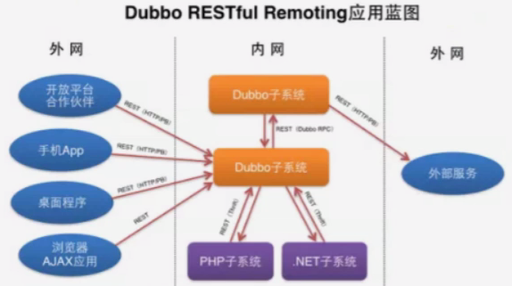
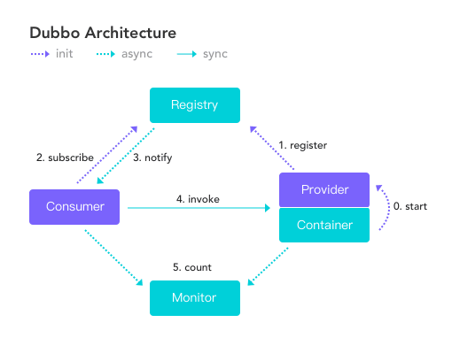

# Dubbo

## 1.1 Dubbo介绍

Dubbo是一个被国内很多互联网公司广泛使用的开源分布式服务框架，即使从国际视野来看应该也是一个非常全面的SOA基础框架。作为一个重要的技术研究课题，当当网根据自身的需求，为Dubbo实现了一些新的功能，并将其命名为**Dubbox**（即Dubbo eXtensions）。

## 1.2 Dubbo简介

**Dubbo是什么？**

**Dubbo是一个分布式服务框架**，致力于提供高性能和透明化的RPC远程服务调用方案，以及SOA服务治理方案。简单的说，Dubbo就是个服务框架，如果没有分布式的需求，其实是不需要用的，只有在分布式的时候，才有Dubbo这样的分布式服务框架的需求，并且本质上是个服务调用的东东，说白了就是个远程服务调用的分布式框架（告别Web Service模式中的WSDL，以服务者与消费者的方式在Dubbo上注册）。

**其核心部分包含**：

1.  **远程通讯**：提供多种基于长连接的NIO框架抽象封装，包括多种线程模型，序列化，以及“请求-响应”模式的信息交换方式。
2.  **集群容错**：提供基于接口方法的透明远程过程调用，包括多协议支持，以及负载均衡，失败容错，地址路由，动态配置等集群支持。
3.  **自动发现**：基于注册中心目录服务，使服务消费方面动态的查找服务提供方，使地址透明，使服务提供方可以平滑增加或减少机器。

## 1.3 Dubbo用途

**Dubbo能做什么？**

1.  **透明化的远程方法调用**，就像调用本地方法一样调用远程方法，只需简单配置，没有任何API侵入。
2.  **软负载均衡及容错机制**，可在内网替代F5等硬件负载均衡器，降低成本，减少单点。
3.  **服务自动注册与发现**，不再需要写死服务提供方地址，注册中心基于接口名查询服务提供者的IP地址，并且能够平滑添加呕吐删除服务提供者。
4.  Dubbo采用**全Spring加载Dubbo配置**即可，Dubbo基于Spring的Schema扩展进行加载。

## 1.4 Dubbo架构

**节点角色说明**：

-   Provider：暴露服务的服务提供方。
-   Consumer：调用远程服务的服务消费方。
-   Registry：服务注册与发现的注册中心。
-   Monitor：统计服务的调用次数和调用时间的监控中心。
-   Container：服务运行容器。

**调用关系说明**：

0.  服务容器负责启动，加载，运行服务提供者。

1.  服务提供者在启动时，向注册中心注册自己提供的服务。
2.  服务消费者在启动时，向注册中心订阅自己所需要的服务。
3.  注册中心返回服务提供者地址列表给消费者，如果有变更，注册中心将基于长连接推送变更数据给消费者。
4.  服务消费者，从提供者地址列表中，基于软负载均衡算法，选一台提供者进行调用，如果调用失败，再选另一台调用。
5.  服务消费者和提供者，在内存中累计调用次数和调用时间，定时每分钟发送一次统计数据到数据中心。

## 1.5 Dubbo入门

**快速入门**：http://dubbo.apache.org/zh-cn/docs/user/quick-start.html

我们完成一个简单的Dubbo入门案例：

我们根据调用方和提供接口方，使用Spring来体验一下Dubbo。

参考文章：http://www.cnblogs.com/javame/p/3632473.html

管理员：http://blog.csdn.net/wilsonke/article/details/39935801

下载地址：https://github.com/alibaba/dubbo

下载`dubbo-admin-2.5.4.war`上传到服务器中的`tomcat/webapps`下

新建文件夹：`dubbo-admin`

解压：`unzip dubbo-admin.war -d dubbo-admin`

删除：`rm -rf dubbo-admin.war`

修改配置文件：`vim dubbo-admin/WEB-INF/dubbo.properties`

修改内容：zookeeper注册中心地址以及用户名密码

Dubbo用户指南：http://dubbo.io

## 1.6 monitor监控中心

下载地址：https://github.com/alibaba/dubbo

## 2.1 Dubbox学习

参考文章：http://dangdangdotcom.github.io/dubbox

## 3.0 Dubbo Admin配置说明

**前端部分dubbo-admin-ui**

-   使用[Vue.js](https://vuejs.org/)作为javascript框架，[Vuetify](https://vuetifyjs.com/)作为UI框架
-   [dubbo-admin-ui/README.md](https://github.com/apache/dubbo-admin/blob/develop/dubbo-admin-ui/README.md)中有更详细的介绍
-   设置 npm **代理镜像** : 可以设置npm代理镜像来加速npm install的过程：在~/.npmrc中增加 `registry =https://registry.npm.taobao.org`
-   构建
    -   `npm run dev`

**后端部分dubbo-admin-server**

-   标准spring boot工程
-   [application.properties配置说明](https://github.com/apache/dubbo-admin/wiki/Dubbo-Admin配置说明)

**生产环境配置**

1.  下载代码: `git clone https://github.com/apache/dubbo-admin.git`

2.  在 `dubbo-admin-server/src/main/resources/application.properties`中指定注册中心地址

3.  构建

    >   -   `mvn clean package`

4.  启动

    -   `mvn --projects dubbo-admin-server spring-boot:run`
        或者
    -   `cd dubbo-admin-distribution/target; java -jar dubbo-admin-0.1.jar`

5.  访问 `http://localhost:8080`

