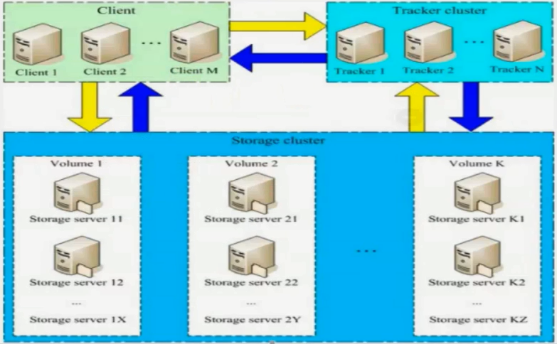

<!-- START doctoc generated TOC please keep comment here to allow auto update -->
<!-- DON'T EDIT THIS SECTION, INSTEAD RE-RUN doctoc TO UPDATE -->
**Table of Contents**  *generated with [DocToc](https://github.com/thlorenz/doctoc)*

- [FastDFS](#fastdfs)
  - [目录](#%E7%9B%AE%E5%BD%95)
  - [1.1 FastDFS简介](#11-fastdfs%E7%AE%80%E4%BB%8B)
  - [1.2 单节点安装](#12-%E5%8D%95%E8%8A%82%E7%82%B9%E5%AE%89%E8%A3%85)
  - [1.3 FastDFS安装](#13-fastdfs%E5%AE%89%E8%A3%85)
  - [2.1 Java操作FastDFS](#21-java%E6%93%8D%E4%BD%9Cfastdfs)
  - [3.1 FastDFS的集群环境搭建介绍（一）](#31-fastdfs%E7%9A%84%E9%9B%86%E7%BE%A4%E7%8E%AF%E5%A2%83%E6%90%AD%E5%BB%BA%E4%BB%8B%E7%BB%8D%E4%B8%80)
  - [3.2 FastDFS的集群环境搭建介绍（二）](#32-fastdfs%E7%9A%84%E9%9B%86%E7%BE%A4%E7%8E%AF%E5%A2%83%E6%90%AD%E5%BB%BA%E4%BB%8B%E7%BB%8D%E4%BA%8C)
  - [3.3 FastDFS的集群环境搭建介绍（三）](#33-fastdfs%E7%9A%84%E9%9B%86%E7%BE%A4%E7%8E%AF%E5%A2%83%E6%90%AD%E5%BB%BA%E4%BB%8B%E7%BB%8D%E4%B8%89)
  - [3.4 FastDFS的集群环境搭建介绍（四）](#34-fastdfs%E7%9A%84%E9%9B%86%E7%BE%A4%E7%8E%AF%E5%A2%83%E6%90%AD%E5%BB%BA%E4%BB%8B%E7%BB%8D%E5%9B%9B)
  - [3.5 FastDFS的集群+Nginx负载均衡（五）](#35-fastdfs%E7%9A%84%E9%9B%86%E7%BE%A4nginx%E8%B4%9F%E8%BD%BD%E5%9D%87%E8%A1%A1%E4%BA%94)
  - [FastDFS集群安装](#fastdfs%E9%9B%86%E7%BE%A4%E5%AE%89%E8%A3%85)

<!-- END doctoc generated TOC please keep comment here to allow auto update -->

# FastDFS

## 目录

1.x FastDFS简介与安装

2.x FastDFS的Java Client端API操作

3.x FastDFS的集群环境搭建

4.x FastDFS的应用场景使用

## 1.1 FastDFS简介

-   FastDFS是一个开源的轻量级分布式文件系统，它对文件进行管理，功能包括：文件存储、文件同步、文件访问（文件上传、文件下载）等，解决了大容量存储与负载均衡的问题。特别适合以文件为载体的在线服务，如相册网站、视频网站等。
-   FastDFS适用的场景以及不适用的场景？
-   FastDFS是为互联网应用量身定做的一套分布式文件存储系统，非常适合用来存储用户图片、视频、文档等文件。对于互联网应用，和其他分布式文件系统相比，优势非常明显。具体情况大家可以看相关的介绍文档，包括FastDFS介绍PPT等等。
-   官方学习网站：http://www.csource.org
-   软件包下载地址：http://sourceforge.net/projects/fastdfs/files
-   源码包下载地址：http://github.com/happyfish100

## 1.2 单节点安装

单个节点安装如下图所示：我们需要安装Tracker、Storage以及要使用Http访问，需要进行集成Nginx模块。


## 1.3 FastDFS安装

1、安装之前首先Linux上要有gcc包：

```bash
yum install -y make cmake gcc gcc-c++
```

2、安装libfastcommon。

3、安装FastDFS。

4、配置跟踪器（tracker）。

5、配置存储器（storage）。

6、环境搭建完成，可以进行测试环境是否搭建成功。

7、跟踪器和存储器安装nginx，之前已经安装完毕了，我们可以对nginx进行整合，实现使用浏览器下载文件。

启动和关闭服务顺序：跟踪器、存储器、Nginx。

详细步骤，参照《fastdfs单节点安装手册.pdf》

------

**一、下载libfastcommon，编译并安装**

```bash
cd /usr/local/softwares
[ -e libfastcommon ] || git clone https://github.com/happyfish100/libfastcommon.git
cd libfastcommon
./make.sh
./make.sh install

# 把库文件重新放到相应位置
mkdir /usr/local/lib/
ln -s /usr/lib64/libfastcommon.so /usr/local/lib/libfastcommon.so
ln -s /usr/lib64/libfastcommon.so /usr/lib/libfastcommon.so
ln -s /usr/lib64/libfdfsclient.so /usr/local/lib/libfdfsclient.so
ln -s /usr/lib64/libfdfsclient.so /usr/lib/libfdfsclient.so
```

**二、安装FastDFS**

```bash
# 安装FastDFS
cd /usr/local/softwares
[ -e fastdfs ] || git clone https://github.com/happyfish100/fastdfs.git
cd fastdfs
./make.sh
./make.sh install
```

服务脚本：

```bash
$ cd /etc/init.d && ls | grep fdfs
fdfs_storaged
fdfs_trackerd
```

配置文件：

```bash
/etc/fdfs/client.conf.sample
/etc/fdfs/storage.conf.sample
/etc/fdfs/tracker.conf.sample
```

命令行工具：

```bash
$ cd /usr/bin && ls | grep fdfs
fdfs_appender_test
fdfs_appender_test1
fdfs_append_file
fdfs_crc32
fdfs_delete_file
fdfs_download_file
fdfs_file_info
fdfs_monitor
fdfs_storaged
fdfs_test
fdfs_test1
fdfs_trackerd
fdfs_upload_appender
fdfs_upload_file
```

**三、因为FastDFS服务脚本设置的bin目录为/usr/local/bin下,但是实际我们安装在了/usr/bin下面。需要在两个文件中替换/usr/local/bin为/usr/bin。**

```bash
cp /etc/init.d/fdfs_storaged /etc/init.d/fdfs_storaged_bak
sed -i 's#/usr/local/bin#/usr/bin#g' /etc/init.d/fdfs_storaged
cp /etc/init.d/fdfs_trackerd /etc/init.d/fdfs_trackerd_bak
sed -i 's#/usr/local/bin#/usr/bin#g' /etc/init.d/fdfs_trackerd
```

**四、配置跟踪器（192.168.0.122节点）**

```bash
# 1、进入 cd /etc/fdfs/目录配置跟踪器文件（注意是192.168.0.122节点），把tracker.conf.sample文件进行cope一份
cp /etc/fdfs/tracker.conf.sample /etc/fdfs/tracker.conf
# 2、修改tracker.conf文件
sed -i 's#base_path=/home/yuqing/fastdfs#base_path=/fastdfs/tracker#g' /etc/fdfs/tracker.conf
# 查看修改内容
cat /etc/fdfs/tracker.conf | grep base_path
# 3、最后我们一定要创建之前定义好的目录（也就是/fastdfs/tracker）
mkdir -p /fastdfs/tracker
# 4、关闭防火墙：（我们在学习时可以不用考虑防火墙的问题）
# 添加
#echo -e "-A INPUT -m state --state NEW -m tcp -p tcp --dport 22122 -j ACCEPT" >> /etc/sysconfig/iptables
# 重启
#systemctl restart iptables
# 5、启动跟踪器
# 目录命令
ll /fastdfs/tracker/
# 启动tracker命令
/etc/init.d/fdfs_trackerd start
# 查看进程命令
ps -el | grep fdfs
# 停止tracker命令
#/etc/init.d/fdfs_trackerd stop
# 6、设置开机启动跟踪器
echo -e "/etc/init.d/fdfs_trackerd start" >> /etc/rc.d/rc.local
```

**五、配置FastDFS存储（192.168.0.123）**

```bash
# 1、进入文件目录：cd /etc/fdfs/，进行copy storage文件一份
cp /etc/fdfs/storage.conf.sample /etc/fdfs/storage.conf
# 2、修改storage.conf文件
sed -i 's#base_path=/home/yuqing/fastdfs#base_path=/fastdfs/storage#g' /etc/fdfs/storage.conf
sed -i 's#store_path0=/home/yuqing/fastdfs#store_path0=/fastdfs/storage#g' /etc/fdfs/storage.conf
sed -i 's#tracker_server=192.168.209.121:22122#tracker_server=192.168.0.122:22122#g' /etc/fdfs/storage.conf
# 查看修改内容
cat /etc/fdfs/storage.conf | grep base_path
cat /etc/fdfs/storage.conf | grep store_path0
cat /etc/fdfs/storage.conf | grep tracker_server
# 3、创建存储目录
mkdir -p /fastdfs/storage
# 4、打开防火墙
#echo -e "-A INPUT -m state --state NEW -m tcp -p tcp --dport 23000 -j ACCEPT" >> /etc/sysconfig/iptables
#systemctl restart iptables
# 5、启动存储（storage）
# 启动
/etc/init.d/fdfs_storaged start
# 关闭
#/etc/init.d/fdfs_storaged stop
# 6、查看FastDFS storage 是否启动成功
ps -el | grep fdfs
# 7、设置开机启动存储器
echo -e "/etc/init.d/fdfs_storaged start" >> /etc/rc.d/rc.local
```

**六、测试环境**

```bash
# copy一份client.conf文件
cp /etc/fdfs/client.conf.sample /etc/fdfs/client.conf
# 修改base_path和tracker_server内容
sed -i 's#base_path=/home/yuqing/fastdfs#base_path=/fastdfs/tracker#g' /etc/fdfs/client.conf
sed -i 's#tracker_server=192.168.0.197:22122#tracker_server=192.168.0.122:22122#g' /etc/fdfs/client.conf
# 查看base_path和tracker_server内容
cat /etc/fdfs/client.conf | grep base_path
cat /etc/fdfs/client.conf | grep tracker_server
# 查看命令脚本
ls /usr/bin | grep fdfs
```

在存储器（192.168.0.123）中查看数据：

```bash
cd /fastdfs/storage/data/00/00
ll
```

在跟踪器（192.168.0.122）中上传文件

```
/usr/bin/fdfs_upload_file /etc/fdfs/client.conf /usr/local/softwares/FastDFS_v5.05.tar.gz
```

跟踪器结果展示：

```bash
$ /usr/bin/fdfs_upload_file /etc/fdfs/client.conf /usr/local/softwares/FastDFS_v5.05.tar.gz
group1/M00/00/00/wKgAe11bu8SAFV-jAAVFOF_dWQA.tar.gz
```

存储器结果展示：

```bash
$ pwd
/fastdfs/storage/data/00/00
$ ll
总用量 340
-rw-r--r--. 1 root root 345400 8月  20 17:22 wKgAe11bu8SAFV-jAAVFOF_dWQA.tar.gz
```

**七、FastDFS与Nginx整合**

```bash
# 1、首先两台机器里必须先安装nginx
# 2、然后我们在存储节点上（192.168.0.123）安装fastdfs-nginxmodule_v1.16.tar.gz包进行整合
mkdir /usr/local/fast
cd /usr/local/fast
[ -e fastdfs-nginx-module ] || git clone https://github.com/happyfish100/fastdfs-nginx-module.git
# 3、进入目录
cd fastdfs-nginx-module/src/
# 4、编辑配置文件config
cat config | grep CORE_INCS
sed -i 's#"$CORE_INCS /usr/local/include"#"$CORE_INCS /usr/include"#g'  config
# 5、FastDFS与nginx进行集成
# 移除原来安装的nginx
rm -rf /usr/local/nginx
# 重新编译安装
cd /usr/local/nginx-1.6.2
./configure --add-module=/usr/local/fast/fastdfs-nginx-module/src/
make -j 4 && make install
# 6、复制fastdfs-ngin-module中的配置文件，到/etc/fdfs目录中
cp /usr/local/fast/fastdfs-nginx-module/src/mod_fastdfs.conf /etc/fdfs/
# 7、进行修改 /etc/fdfs/ 目录下，我们刚刚copy过来的mod_fastdfs.conf 文件
# 修改
sed -i 's#connect_timeout=2#connect_timeout=10#g' /etc/fdfs/mod_fastdfs.conf
sed -i 's#tracker_server=tracker:22122#tracker_server=192.168.0.122:22122#g' /etc/fdfs/mod_fastdfs.conf
sed -i 's#url_have_group_name = false#url_have_group_name = true#g' /etc/fdfs/mod_fastdfs.conf
sed -i 's#store_path0=/home/yuqing/fastdfs#store_path0=/fastdfs/storage#g' /etc/fdfs/mod_fastdfs.conf
# 查看修改内容是否正确
cat /etc/fdfs/mod_fastdfs.conf | grep connect_timeout
cat /etc/fdfs/mod_fastdfs.conf | grep tracker_server
cat /etc/fdfs/mod_fastdfs.conf | grep url_have_group_name
cat /etc/fdfs/mod_fastdfs.conf | grep store_path0
# 8、复制FastDFS里的2个文件，到/etc/fdfs目录中
cd /usr/local/softwares/fastdfs/conf/
cp http.conf mime.types /etc/fdfs/
# 9、创建一个软连接，在/fastdfs/storage文件存储目录下创建软连接，将其链接到实际存放数据的目录
ln -s /fastdfs/storage/data/ /fastdfs/storage/data/M00
# 10、修改Nginx配置文件
cd /usr/local/nginx/conf
vim nginx.conf
# 修改内容
listen 8888;
server_name localhost;
location ~/group([0-9])/M00 {
    #alias /fastdfs/storage/data;
    ngx_fastdfs_module;
}
# 启动nginx
/usr/local/nginx/sbin/nginx
```

在浏览器中输入http://192.168.0.123:8888/group1/M00/00/00/wKgAe11bu8SAFV-jAAVFOF_dWQA.tar.gz，即可下载上传过的文件。

>   运维注意：我们在使用FastDFS的时候，需要正常关机，不要使用kill -9强杀FastDFS进程，不然会在文件上传时出现丢数据的情况。

**八、启动停止服务步骤**

```bash
### 启动命令：
# 启动tracker命令：
/etc/init.d/fdfs_trackerd start
# 查看进程命令：
ps -el | grep fdfs
# 启动storage命令：
/etc/init.d/fdfs_storaged start
# 查看进程命令：
ps -el | grep fdfs
# 启动nginx命令：
/usr/local/nginx/sbin/nginx
### 停止命令：
# 停止tracker命令：
/etc/init.d/fdfs_trackerd stop
# 关闭storage命令：
/etc/init.d/fdfs_storaged stop
# 关闭nginx命令：
/usr/local/nginx/sbin/nginx -s stop
```

## 2.1 Java操作FastDFS

使用java操作FastDFS非常的简单，我们可以下载官方的源码包，自行进行打包，然后应用到自己的项目中。

下载：fastdfs_client_v1.24.jar

封装通用的上传下载工具类，进行上传、下载、删除等操作测试。

## 3.1 FastDFS的集群环境搭建介绍（一）



## 3.2 FastDFS的集群环境搭建介绍（二）

-   client端向tracker节点发送上传文件请求

-   tracker返回一台可用的storage节点
-   client端直接和storage节点通讯完成文件的上传，并返回上传成功后的id给client端程序。


## 3.3 FastDFS的集群环境搭建介绍（三）

-   client端发向tracker节点发送下载请求。
-   Tracker节点返回指定的目标storage节点。
-   client端直接与storage节点通讯完成下载操作。


## 3.4 FastDFS的集群环境搭建介绍（四）


## 3.5 FastDFS的集群+Nginx负载均衡（五）


## FastDFS集群安装

集群部署规划：

```
192.168.0.121 tracker-group1
192.168.0.122 tracker-group2
192.168.0.123 storage-group1-1
192.168.0.124 storage-group1-2
192.168.0.125 storage-group2-1
192.168.0.126 storage-group2-2
```

第一部分：安装相关软件，6台机器都需要安装。

```bash
# 安装gcc
yum install -y make cmake gcc gcc-c++

# 安装libfastcommon
cd /usr/local/softwares
[ -e libfastcommon ] || git clone https://github.com/happyfish100/libfastcommon.git
cd libfastcommon
./make.sh
./make.sh install

# 把库文件重新放到相应位置
mkdir /usr/local/lib/
ln -s /usr/lib64/libfastcommon.so /usr/local/lib/libfastcommon.so
ln -s /usr/lib64/libfastcommon.so /usr/lib/libfastcommon.so
ln -s /usr/lib64/libfdfsclient.so /usr/local/lib/libfdfsclient.so
ln -s /usr/lib64/libfdfsclient.so /usr/lib/libfdfsclient.so

# 安装FastDFS
cd /usr/local/softwares
[ -e fastdfs ] || git clone https://github.com/happyfish100/fastdfs.git
cd fastdfs
./make.sh
./make.sh install

#替换/usr/local/bin为/usr/bin
cp /etc/init.d/fdfs_storaged /etc/init.d/fdfs_storaged_bak
sed -i 's#/usr/local/bin#/usr/bin#g' /etc/init.d/fdfs_storaged
cp /etc/init.d/fdfs_trackerd /etc/init.d/fdfs_trackerd_bak
sed -i 's#/usr/local/bin#/usr/bin#g' /etc/init.d/fdfs_trackerd
```

第二部分：两台节点配置跟踪器（192.168.0.121, 192.168.0.122）

```bash
# 1、进入 cd /etc/fdfs/目录配置跟踪器文件（注意是192.168.0.122节点），把tracker.conf.sample文件进行cope一份
cp /etc/fdfs/tracker.conf.sample /etc/fdfs/tracker.conf
# 2、修改tracker.conf文件
sed -i 's#base_path=/home/yuqing/fastdfs#base_path=/fastdfs/tracker#g' /etc/fdfs/tracker.conf
sed -i 's#store_lookup=2#store_lookup=0#g' /etc/fdfs/tracker.conf
# 查看修改内容
cat /etc/fdfs/tracker.conf | grep base_path
cat /etc/fdfs/tracker.conf | grep store_lookup
# 3、最后我们一定要创建之前定义好的目录（也就是/fastdfs/tracker）
mkdir -p /fastdfs/tracker
# 4、关闭防火墙：（我们在学习时可以不用考虑防火墙的问题）
# 添加
#echo -e "-A INPUT -m state --state NEW -m tcp -p tcp --dport 22122 -j ACCEPT" >> /etc/sysconfig/iptables
# 重启
#service iptables restart
# 5、启动跟踪器
# 目录命令
ll /fastdfs/tracker
# 启动tracker命令
/etc/init.d/fdfs_trackerd start
# 查看进程命令
ps -el | grep fdfs
netstat -tunpl | grep fdfs
# 停止tracker命令
#/etc/init.d/fdfs_trackerd stop
#查看日志
tail -100 /fastdfs/tracker/logs/trackerd.log
# 6、设置开机启动跟踪器
echo -e "/etc/init.d/fdfs_trackerd start" >> /etc/rc.d/rc.local
```

第三部分：四台机器配置存储节点（192.168.0.123, 192.168.0.124, 192.168.0.125, 192.168.0.126）

```bash
### 1、进入文件目录：cd /etc/fdfs/，进行copy storage文件一份
cp /etc/fdfs/storage.conf.sample /etc/fdfs/storage.conf
### 2、修改storage.conf文件
# >>>123、124是group1；125、126是group2，要分开执行<<<
sed -i 's#group_name=group1#group_name=group2#g' /etc/fdfs/storage.conf
# 设置storage的日志目录
sed -i 's#base_path=/home/yuqing/fastdfs#base_path=/fastdfs/storage#g' /etc/fdfs/storage.conf
# 设置存储路径
sed -i 's#store_path0=/home/yuqing/fastdfs#store_path0=/fastdfs/storage#g' /etc/fdfs/storage.conf
# tracker服务器的IP和端口号，多个直接添加多条配置
sed -i 's#tracker_server=192.168.209.121:22122#tracker_server=192.168.0.121:22122#g' /etc/fdfs/storage.conf
sed -i '/tracker_server=192.168.0.121:22122/a tracker_server=192.168.0.122:22122' /etc/fdfs/storage.conf
# 查看修改内容
cat /etc/fdfs/storage.conf | grep group_name
cat /etc/fdfs/storage.conf | grep port
cat /etc/fdfs/storage.conf | grep base_path
cat /etc/fdfs/storage.conf | grep store_path_count
cat /etc/fdfs/storage.conf | grep store_path0
cat /etc/fdfs/storage.conf | grep tracker_server
### 3、创建存储目录
mkdir -p /fastdfs/storage
### 4、打开防火墙
#echo -e "-A INPUT -m state --state NEW -m tcp -p tcp --dport 23000 -j ACCEPT" >> /etc/sysconfig/iptables
#service iptables restart
### 5、启动存储（storage）
# 启动
/etc/init.d/fdfs_storaged start
# 关闭
#/etc/init.d/fdfs_storaged stop
# 查看日志
tail -100 /fastdfs/storage/logs/storaged.log
### 6、查看FastDFS storage 是否启动成功
ps -el | grep fdfs
### 7、设置开机启动存储器
echo -e "/etc/init.d/fdfs_storaged start" >> /etc/rc.d/rc.local

```

使用fdfs_monitor

```bash
$ /usr/bin/fdfs_monitor /etc/fdfs/storage.conf

[2019-08-20 22:42:14] DEBUG - base_path=/fastdfs/storage, connect_timeout=10, network_timeout=60, tracker_server_count=2, anti_steal_token=0, anti_steal_secret_key length=0, use_connection_pool=0, g_connection_pool_max_idle_time=3600s, use_storage_id=0, storage server id count: 0

server_count=2, server_index=0

tracker server is 192.168.0.121:22122

group count: 2

Group 1:
group name = group1
disk total space = 17394 MB
disk free space = 10300 MB
trunk free space = 0 MB
storage server count = 2
active server count = 1
storage server port = 23000
storage HTTP port = 8888
store path count = 1
subdir count per path = 256
current write server index = 0
current trunk file id = 0

	Storage 1:
		id = 192.168.0.123
		ip_addr = 192.168.0.123 (rocketmq-nameserver3)  ACTIVE
		http domain = 
		version = 5.12
		join time = 2019-08-20 16:34:18
		up time = 2019-08-20 22:28:34
		total storage = 17394 MB
		free storage = 10300 MB
		upload priority = 10
		store_path_count = 1
		subdir_count_per_path = 256
		storage_port = 23000
		storage_http_port = 8888
		current_write_path = 0
		source storage id = 
		if_trunk_server = 0
		connection.alloc_count = 256
		connection.current_count = 1
		connection.max_count = 1
		total_upload_count = 1
		success_upload_count = 1
		total_append_count = 0
		success_append_count = 0
		total_modify_count = 0
		success_modify_count = 0
		total_truncate_count = 0
		success_truncate_count = 0
		total_set_meta_count = 0
		success_set_meta_count = 0
		total_delete_count = 0
		success_delete_count = 0
		total_download_count = 0
		success_download_count = 0
		total_get_meta_count = 0
		success_get_meta_count = 0
		total_create_link_count = 0
		success_create_link_count = 0
		total_delete_link_count = 0
		success_delete_link_count = 0
		total_upload_bytes = 345400
		success_upload_bytes = 345400
		total_append_bytes = 0
		success_append_bytes = 0
		total_modify_bytes = 0
		success_modify_bytes = 0
		stotal_download_bytes = 0
		success_download_bytes = 0
		total_sync_in_bytes = 0
		success_sync_in_bytes = 0
		total_sync_out_bytes = 0
		success_sync_out_bytes = 0
		total_file_open_count = 1
		success_file_open_count = 1
		total_file_read_count = 0
		success_file_read_count = 0
		total_file_write_count = 2
		success_file_write_count = 2
		last_heart_beat_time = 2019-08-20 22:42:08
		last_source_update = 2019-08-20 17:22:11
		last_sync_update = 1970-01-01 08:00:00
		last_synced_timestamp = 1970-01-01 08:00:00 
	Storage 2:
		id = 192.168.0.124
		ip_addr = 192.168.0.124 (rocketmq-nameserver4)  WAIT_SYNC
		http domain = 
		version = 5.12
		join time = 2019-08-20 22:28:03
		up time = 2019-08-20 22:28:03
		total storage = 17394 MB
		free storage = 10551 MB
		upload priority = 10
		store_path_count = 1
		subdir_count_per_path = 256
		storage_port = 23000
		storage_http_port = 8888
		current_write_path = 0
		source storage id = 192.168.0.123
		if_trunk_server = 0
		connection.alloc_count = 256
		connection.current_count = 1
		connection.max_count = 1
		total_upload_count = 0
		success_upload_count = 0
		total_append_count = 0
		success_append_count = 0
		total_modify_count = 0
		success_modify_count = 0
		total_truncate_count = 0
		success_truncate_count = 0
		total_set_meta_count = 0
		success_set_meta_count = 0
		total_delete_count = 0
		success_delete_count = 0
		total_download_count = 0
		success_download_count = 0
		total_get_meta_count = 0
		success_get_meta_count = 0
		total_create_link_count = 0
		success_create_link_count = 0
		total_delete_link_count = 0
		success_delete_link_count = 0
		total_upload_bytes = 0
		success_upload_bytes = 0
		total_append_bytes = 0
		success_append_bytes = 0
		total_modify_bytes = 0
		success_modify_bytes = 0
		stotal_download_bytes = 0
		success_download_bytes = 0
		total_sync_in_bytes = 345400
		success_sync_in_bytes = 345400
		total_sync_out_bytes = 0
		success_sync_out_bytes = 0
		total_file_open_count = 1
		success_file_open_count = 1
		total_file_read_count = 0
		success_file_read_count = 0
		total_file_write_count = 2
		success_file_write_count = 2
		last_heart_beat_time = 2019-08-20 22:42:13
		last_source_update = 1970-01-01 08:00:00
		last_sync_update = 2019-08-20 22:28:34
		last_synced_timestamp = 2019-08-20 17:22:12 (-1s delay)

Group 2:
group name = group2
disk total space = 17394 MB
disk free space = 10650 MB
trunk free space = 0 MB
storage server count = 2
active server count = 2
storage server port = 23000
storage HTTP port = 8888
store path count = 1
subdir count per path = 256
current write server index = 0
current trunk file id = 0

	Storage 1:
		id = 192.168.0.125
		ip_addr = 192.168.0.125  ACTIVE
		http domain = 
		version = 5.12
		join time = 2019-08-20 22:28:03
		up time = 2019-08-20 22:28:03
		total storage = 17394 MB
		free storage = 10650 MB
		upload priority = 10
		store_path_count = 1
		subdir_count_per_path = 256
		storage_port = 23000
		storage_http_port = 8888
		current_write_path = 0
		source storage id = 
		if_trunk_server = 0
		connection.alloc_count = 256
		connection.current_count = 1
		connection.max_count = 1
		total_upload_count = 0
		success_upload_count = 0
		total_append_count = 0
		success_append_count = 0
		total_modify_count = 0
		success_modify_count = 0
		total_truncate_count = 0
		success_truncate_count = 0
		total_set_meta_count = 0
		success_set_meta_count = 0
		total_delete_count = 0
		success_delete_count = 0
		total_download_count = 0
		success_download_count = 0
		total_get_meta_count = 0
		success_get_meta_count = 0
		total_create_link_count = 0
		success_create_link_count = 0
		total_delete_link_count = 0
		success_delete_link_count = 0
		total_upload_bytes = 0
		success_upload_bytes = 0
		total_append_bytes = 0
		success_append_bytes = 0
		total_modify_bytes = 0
		success_modify_bytes = 0
		stotal_download_bytes = 0
		success_download_bytes = 0
		total_sync_in_bytes = 0
		success_sync_in_bytes = 0
		total_sync_out_bytes = 0
		success_sync_out_bytes = 0
		total_file_open_count = 0
		success_file_open_count = 0
		total_file_read_count = 0
		success_file_read_count = 0
		total_file_write_count = 0
		success_file_write_count = 0
		last_heart_beat_time = 2019-08-20 22:42:13
		last_source_update = 1970-01-01 08:00:00
		last_sync_update = 1970-01-01 08:00:00
		last_synced_timestamp = 1970-01-01 08:00:00 
	Storage 2:
		id = 192.168.0.126
		ip_addr = 192.168.0.126  ACTIVE
		http domain = 
		version = 5.12
		join time = 2019-08-20 22:28:03
		up time = 2019-08-20 22:28:03
		total storage = 17394 MB
		free storage = 10652 MB
		upload priority = 10
		store_path_count = 1
		subdir_count_per_path = 256
		storage_port = 23000
		storage_http_port = 8888
		current_write_path = 0
		source storage id = 192.168.0.125
		if_trunk_server = 0
		connection.alloc_count = 256
		connection.current_count = 1
		connection.max_count = 1
		total_upload_count = 0
		success_upload_count = 0
		total_append_count = 0
		success_append_count = 0
		total_modify_count = 0
		success_modify_count = 0
		total_truncate_count = 0
		success_truncate_count = 0
		total_set_meta_count = 0
		success_set_meta_count = 0
		total_delete_count = 0
		success_delete_count = 0
		total_download_count = 0
		success_download_count = 0
		total_get_meta_count = 0
		success_get_meta_count = 0
		total_create_link_count = 0
		success_create_link_count = 0
		total_delete_link_count = 0
		success_delete_link_count = 0
		total_upload_bytes = 0
		success_upload_bytes = 0
		total_append_bytes = 0
		success_append_bytes = 0
		total_modify_bytes = 0
		success_modify_bytes = 0
		stotal_download_bytes = 0
		success_download_bytes = 0
		total_sync_in_bytes = 0
		success_sync_in_bytes = 0
		total_sync_out_bytes = 0
		success_sync_out_bytes = 0
		total_file_open_count = 0
		success_file_open_count = 0
		total_file_read_count = 0
		success_file_read_count = 0
		total_file_write_count = 0
		success_file_write_count = 0
		last_heart_beat_time = 2019-08-20 22:41:46
		last_source_update = 1970-01-01 08:00:00
		last_sync_update = 1970-01-01 08:00:00
		last_synced_timestamp = 1970-01-01 08:00:00 
```

第四部分：测试文件上传（192.168.0.122）

```bash
# copy一份client.conf文件
cp /etc/fdfs/client.conf.sample /etc/fdfs/client.conf
# 修改base_path和tracker_server内容
sed -i 's#base_path=/home/yuqing/fastdfs#base_path=/fastdfs/tracker#g' /etc/fdfs/client.conf
sed -i 's#tracker_server=192.168.0.197:22122#tracker_server=192.168.0.121:22122#g' /etc/fdfs/client.conf
sed -i '/tracker_server=192.168.0.121:22122/a tracker_server=192.168.0.122:22122' /etc/fdfs/client.conf
# 查看base_path和tracker_server内容
cat /etc/fdfs/client.conf | grep base_path
cat /etc/fdfs/client.conf | grep tracker_server
# 查看命令脚本
ls /usr/bin | grep fdfs
# 上传文件
/usr/bin/fdfs_upload_file /etc/fdfs/client.conf /usr/local/softwares/FastDFS_v5.05.tar.gz
# 存储节点上查看数据
cd /fastdfs/storage/data/00/00
ll
```

第五部分：配置Nginx，首先4个存储节点配置Nginx，然后两个跟踪节点配置Nginx

```bash
# 1、首先两台机器里必须先安装nginx
# 2、然后我们在存储节点上（192.168.0.123）安装fastdfs-nginxmodule_v1.16.tar.gz包进行整合
mkdir /usr/local/fast
cd /usr/local/fast
[ -e fastdfs-nginx-module ] || git clone https://github.com/happyfish100/fastdfs-nginx-module.git
# 3、进入目录
cd fastdfs-nginx-module/src/
# 4、编辑配置文件config
sed -i 's#"$CORE_INCS /usr/local/include"#"$CORE_INCS /usr/include"#g'  config
# 查看修改结果
cat config | grep CORE_INCS
# 5、FastDFS与nginx进行集成
# 移除原来安装的nginx
rm -rf /usr/local/nginx
# 重新编译安装
cd /usr/local/softwares/
[ -e nginx-1.6.2.tar.gz ] || wget http://nginx.org/download/nginx-1.6.2.tar.gz
tar -zxvf nginx-1.6.2.tar.gz -C /usr/local
cd /usr/local/nginx-1.6.2
./configure --add-module=/usr/local/fast/fastdfs-nginx-module/src/
make -j 2 && make install
# 6、复制fastdfs-ngin-module中的配置文件，到/etc/fdfs目录中
cp /usr/local/fast/fastdfs-nginx-module/src/mod_fastdfs.conf /etc/fdfs/
# 7、进行修改 /etc/fdfs/ 目录下，我们刚刚copy过来的mod_fastdfs.conf 文件
# 修改
sed -i 's#connect_timeout=2#connect_timeout=10#g' /etc/fdfs/mod_fastdfs.conf
sed -i 's#tracker_server=tracker:22122#tracker_server=192.168.0.121:22122#g' /etc/fdfs/mod_fastdfs.conf
sed -i '/tracker_server=192.168.0.121:22122/a tracker_server=192.168.0.122:22122' /etc/fdfs/mod_fastdfs.conf
sed -i 's#url_have_group_name = false#url_have_group_name = true#g' /etc/fdfs/mod_fastdfs.conf
sed -i 's#store_path0=/home/yuqing/fastdfs#store_path0=/fastdfs/storage#g' /etc/fdfs/mod_fastdfs.conf
# 只针对125、126节点
sed -i 's#group_name=group1#group_name=group2#g' /etc/fdfs/mod_fastdfs.conf
sed -i 's#group_count = 0#group_count = 2#g' /etc/fdfs/mod_fastdfs.conf
# 查看修改内容是否正确
cat /etc/fdfs/mod_fastdfs.conf | grep connect_timeout
cat /etc/fdfs/mod_fastdfs.conf | grep tracker_server
cat /etc/fdfs/mod_fastdfs.conf | grep url_have_group_name
cat /etc/fdfs/mod_fastdfs.conf | grep store_path0
cat /etc/fdfs/mod_fastdfs.conf | grep group_name
cat /etc/fdfs/mod_fastdfs.conf | grep group_count
# 在配置文件末尾追加
cat>>/etc/fdfs/mod_fastdfs.conf<<EOF
[group1]
group_name=group1
storage_server_port=23000
store_path_count=1
store_path0=/fastdfs/storage

[group2]
group_name=group2
storage_server_port=23000
store_path_count=1
store_path0=/fastdfs/storage
EOF
# 8、复制FastDFS里的2个文件，到/etc/fdfs目录中
cd /usr/local/softwares/fastdfs/conf/
cp http.conf mime.types /etc/fdfs/
# 9、创建一个软连接，在/fastdfs/storage文件存储目录下创建软连接，将其链接到实际存放数据的目录
ln -s /fastdfs/storage/data/ /fastdfs/storage/data/M00
# 10、修改Nginx配置文件
cd /usr/local/nginx/conf
vim nginx.conf
# 修改内容
listen 8888;
server_name localhost;
location ~/group([0-9])/M00 {
    #alias /fastdfs/storage/data;
    ngx_fastdfs_module;
}
# 启动nginx
/usr/local/nginx/sbin/nginx
```

第六部分：我们需要在两个跟踪器上安装nginx（121、122），以提供反向代理服务，目的是使用一个IP地址对外提供服务。

```bash
# 下载ngx_cache_purge并解压
cd /usr/local/fast
[ -e ngx_cache_purge-2.3.tar.gz ] || wget http://labs.frickle.com/files/ngx_cache_purge-2.3.tar.gz
tar -zxvf ngx_cache_purge-2.3.tar.gz
# 安装依赖库
yum install -y pcre pcre-devel zlib zlib-devel
# 解压并安装nginx，加入ngx_cache_purge（加入缓存模块）
cd /usr/local/softwares/
[ -e nginx-1.6.2.tar.gz ] || wget http://nginx.org/download/nginx-1.6.2.tar.gz
tar -zxvf nginx-1.6.2.tar.gz -C /usr/local
cd /usr/local/nginx-1.6.2
./configure --add-module=/usr/local/fast/ngx_cache_purge-2.3
make -j 2 && make install
```

修改nginx配置

```bash
cd /usr/local/nginx/conf
vim nginx.conf
```

修改内容如下：

```bash
worker_processes  1;

events {
    worker_connections  1024;
    use epoll;
}

http {
    include       mime.types;
    default_type  application/octet-stream;

    sendfile        on;
    tcp_nopush      on;

    keepalive_timeout  65;

    server_names_hash_bucket_size 128;   
    client_header_buffer_size 32k;   
    large_client_header_buffers 4 32k;   
    client_max_body_size 300m;

    proxy_redirect off;
    proxy_set_header Host $http_host;
    proxy_set_header X-Real-IP $remote_addr;
    proxy_set_header X-Forwarded-For $proxy_add_x_forwarded_for;
    
    proxy_connect_timeout    90;   
    proxy_read_timeout       90;   
    proxy_send_timeout       90;   
    proxy_buffer_size        16k;   
    proxy_buffers            4 64k;   
    proxy_busy_buffers_size 128k;   
    proxy_temp_file_write_size 128k;

    proxy_cache_path /fastdfs/cache/nginx/proxy_cache levels=1:2
    keys_zone=http-cache:200m max_size=1g inactive=30d;
    proxy_temp_path /fastdfs/cache/nginx/proxy_cache/tmp;

    upstream fdfs_group1 {   
        server 192.168.0.123:8888 weight=1 max_fails=2 fail_timeout=30s;   
        server 192.168.0.124:8888 weight=1 max_fails=2 fail_timeout=30s;   
    } 
    
    upstream fdfs_group2 {   
        server 192.168.0.125:8888 weight=1 max_fails=2 fail_timeout=30s;   
        server 192.168.0.126:8888 weight=1 max_fails=2 fail_timeout=30s;   
    } 

    server {
        listen       8000;
        server_name  localhost;
 
        location /group1/M00 {
            proxy_next_upstream http_502 http_504 error timeout invalid_header;
            proxy_cache http-cache;
            proxy_cache_valid  200 304 12h;
            proxy_cache_key $uri$is_args$args;
            proxy_pass http://fdfs_group1;
            expires 30d;
        }
        
        location /group2/M00 {
            proxy_next_upstream http_502 http_504 error timeout invalid_header;
            proxy_cache http-cache;
            proxy_cache_valid  200 304 12h;
            proxy_cache_key $uri$is_args$args;
            proxy_pass http://fdfs_group2;
            expires 30d;
        }
        
        location ~/purge(/.*) {
            allow 127.0.0.1;
            allow 192.168.0.0/24;
            deny all;
            proxy_cache_purge http-cache $1$is_args$args;
        }

        # redirect server error pages to the static page /50x.html
        error_page   500 502 503 504  /50x.html;
        location = /50x.html {
            root   html;
        }
    }
}
```

新建缓存目录

```bash
mkdir -p /fastdfs/cache/nginx/proxy_cache
mkdir -p /fastdfs/cache/nginx/proxy_cache/tmp
```

配置防火墙

```bash
# 添加
#echo -e "-A INPUT -m state --state NEW -m tcp -p tcp --dport 22122 -j ACCEPT" >> /etc/sysconfig/iptables
# 重启
#systemctl restart iptables
```

启动nginx

```bash
/usr/local/nginx/sbin/nginx
ps -el | grep nginx
```

在121、122节点上传文件

```bash
# 上传文件
/usr/bin/fdfs_upload_file /etc/fdfs/client.conf /usr/local/test.txt
```

在存储节点（123、124、125、126）上查看数据

```bash
cd /fastdfs/storage/data/00/00
ll
```

在121、122节点上配置keepalived+nginx

```bash
cd /usr/local/nginx/conf
vim nginx.conf
```

修改内容如下：

```bash
    upstream fastdfs_tracker {   
        server 192.168.0.121:8000 weight=1 max_fails=2 fail_timeout=30s;   
        server 192.168.0.122:8000 weight=1 max_fails=2 fail_timeout=30s;   
    }
    
    server {
        location /fastdfs {
    	    root html;
    	    index index.html index.htm;
    	    proxy_pass http://fastdfs_tracker/;
    	    proxy_set_header Host $http_host;
    	    proxy_set_header Cookie $http_cookie;
            proxy_set_header X-Real-IP $remote_addr;
            proxy_set_header X-Forwarded-For $proxy_add_x_forwarded_for;
            proxy_set_header X-Forwarded-Proto $scheme;
            client_max_body_size 300m;
        }
    }
```

