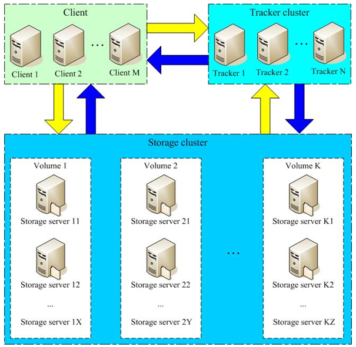
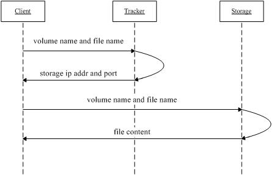
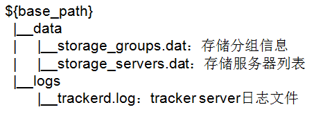
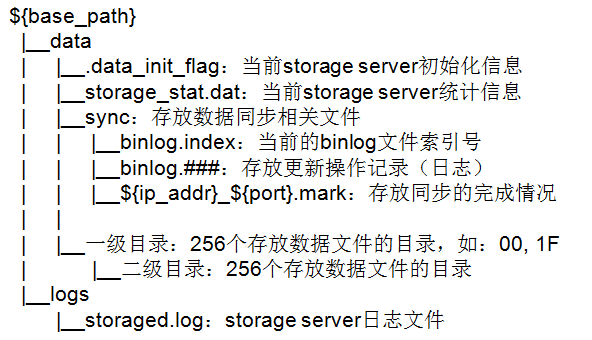

<!-- START doctoc generated TOC please keep comment here to allow auto update -->
<!-- DON'T EDIT THIS SECTION, INSTEAD RE-RUN doctoc TO UPDATE -->
**Table of Contents**  *generated with [DocToc](https://github.com/thlorenz/doctoc)*

- [FastDFS介绍](#fastdfs%E4%BB%8B%E7%BB%8D)
  - [提纲](#%E6%8F%90%E7%BA%B2)
  - [FastDFS简介](#fastdfs%E7%AE%80%E4%BB%8B)
  - [系统架构－架构图](#%E7%B3%BB%E7%BB%9F%E6%9E%B6%E6%9E%84%E6%9E%B6%E6%9E%84%E5%9B%BE)
  - [系统架构－上传文件流程图](#%E7%B3%BB%E7%BB%9F%E6%9E%B6%E6%9E%84%E4%B8%8A%E4%BC%A0%E6%96%87%E4%BB%B6%E6%B5%81%E7%A8%8B%E5%9B%BE)
  - [相关术语](#%E7%9B%B8%E5%85%B3%E6%9C%AF%E8%AF%AD)
  - [同步机制](#%E5%90%8C%E6%AD%A5%E6%9C%BA%E5%88%B6)
  - [通信协议](#%E9%80%9A%E4%BF%A1%E5%8D%8F%E8%AE%AE)
  - [运行时目录结构－tracker server](#%E8%BF%90%E8%A1%8C%E6%97%B6%E7%9B%AE%E5%BD%95%E7%BB%93%E6%9E%84tracker-server)
  - [运行时目录结构－storage server](#%E8%BF%90%E8%A1%8C%E6%97%B6%E7%9B%AE%E5%BD%95%E7%BB%93%E6%9E%84storage-server)
  - [安装和运行](#%E5%AE%89%E8%A3%85%E5%92%8C%E8%BF%90%E8%A1%8C)
  - [FastDFS和集中存储方式对比](#fastdfs%E5%92%8C%E9%9B%86%E4%B8%AD%E5%AD%98%E5%82%A8%E6%96%B9%E5%BC%8F%E5%AF%B9%E6%AF%94)
  - [FastDFS和mogileFS对比](#fastdfs%E5%92%8Cmogilefs%E5%AF%B9%E6%AF%94)
  - [参考网站](#%E5%8F%82%E8%80%83%E7%BD%91%E7%AB%99)

<!-- END doctoc generated TOC please keep comment here to allow auto update -->

# FastDFS介绍

## 提纲

• FastDFS简介

• 系统架构

• 相关术语

• 同步机制

• 通信协议

• 目录结构

• 安装和运行

• 和其他系统对比

## FastDFS简介

•FastDFS是一个轻量级的开源分布式文件系统

•FastDFS主要解决了大容量的文件存储和高并发访问的问题，文件存取时实现了负载均衡

•FastDFS实现了软件方式的RAID，可以使用廉价的IDE硬盘进行存储

•支持存储服务器在线扩容

•支持相同内容的文件只保存一份，节约磁盘空间

•FastDFS只能通过Client API访问，不支持POSIX访问方式

•FastDFS特别适合大中型网站使用，用来存储资源文件（如：图片、文档、音频、视频等等）

## 系统架构－架构图



## 系统架构－上传文件流程图



1.  client询问tracker下载文件的storage，参数为文件标识（组名和文件名）；

2.  tracker返回一台可用的storage；

3.  clientstorage

## 相关术语

• Tracker Server：跟踪服务器，主要做调度工作，在访问上起负载均衡的作用。记录storage server的状态，是连接Client和Storage server的枢纽。

• Storage Server：存储服务器，文件和meta data都保存到存储服务器上

• group：组，也可称为卷。同组内服务器上的文件是完全相同的

• 文件标识：包括两部分：组名和文件名（包含路径）

• meta data：文件相关属性，键值对（Key Value Pair）方式，如：width=1024,heigth=768

## 同步机制

•同一组内的storage server之间是对等的，文件上传、删除等操作可以在任意一台storage server上进行；

•文件同步只在同组内的storage server之间进行，采用push方式，即源服务器同步给目标服务器；

•源头数据才需要同步，备份数据不需要再次同步，否则就构成环路了；

•上述第二条规则有个例外，就是新增加一台storage server时，由已有的一台storage server将已有的所有数据（包括源头数据和备份数据）同步给该新增服务器。

## 通信协议

• 协议包由两部分组成：header和body

• header共10字节，格式如下：

–  8 bytes body length

–  1 byte command

–  1 byte status

• body数据包格式由取决于具体的命令，body可以为空

## 运行时目录结构－tracker server



## 运行时目录结构－storage server



## 安装和运行

```bash
#step 1. download FastDFS source package and unpack it,
# if you use HTTP to download file, please download libevent 1.4.x and install it
tar xzf FastDFS_v1.x.tar.gz
#for example:
tar xzf FastDFS_v1.20.tar.gz

#step 2. enter the FastDFS dir
cd FastDFS

#step 3. if HTTP supported, modify make.sh, uncomment the line:
# WITH_HTTPD=1, then execute:
./make.sh

#step 4. make install
./make.sh install

#step 5. edit/modify the config file of tracker and storage

#step 6. run server programs
#start the tracker server:
/usr/local/bin/fdfs_trackerd <tracker_conf_filename>

#start the storage server:
/usr/local/bin/fdfs_storaged <storage_conf_filename>
```

## FastDFS和集中存储方式对比

| **指标**               | **FastDFS** | **NFS** | **集中存储设备   如NetApp、NAS** |
| ---------------------- | ----------- | ------- | -------------------------------- |
| 线性扩容性             | 高          | 差      | 差                               |
| 文件高并发访问性能     | 高          | 差      | 一般                             |
| 文件访问方式           | 专有API     | POSIX   | 支持POSIX                        |
| 硬件成本               | 较低        | 中等    | 高                               |
| 相同内容文件只保存一份 | 支持        | 不支持  | 不支持                           |

## FastDFS和mogileFS对比

| **指标**                  | **FastDFS**                                                  | **mogileFS**                                                 |
| ------------------------- | ------------------------------------------------------------ | ------------------------------------------------------------ |
| 系统简洁性                | 简洁   只有两个角色：tracker和storage                        | 一般   有三个角色：tracker、storage和存储文件信息的mysql db  |
| 系统性能                  | 很高（没有使用数据库，文件同步直接点对点，不经过tracker中转） | 高（使用mysql来存储文件索引等信息，文件同步通过tracker调度和中转） |
| 系统稳定性                | 高（C语言开发，可以支持高并发和高负载）                      | 一般（Perl语言开发，高并发和高负载支持一般）                 |
| RAID方式                  | 分组（组内冗余），灵活性较大                                 | 动态冗余，灵活性一般                                         |
| 通信协议                  | 专有协议   下载文件支持HTTP                                  | HTTP                                                         |
| 技术文档                  | 较详细                                                       | 较少                                                         |
| 文件附加属性（meta data） | 支持                                                         | 不支持                                                       |
| 相同内容文件只保存一份    | 支持                                                         | 不支持                                                       |
| 下载文件时支持文件偏移量  | 支持                                                         | 不支持                                                       |

## 参考网站

• FastDFS中文：http://www.csource.org/


• FastDFS英文：http://code.google.com/p/fastdfs/


