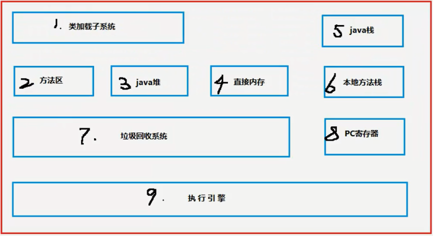
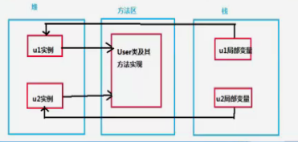
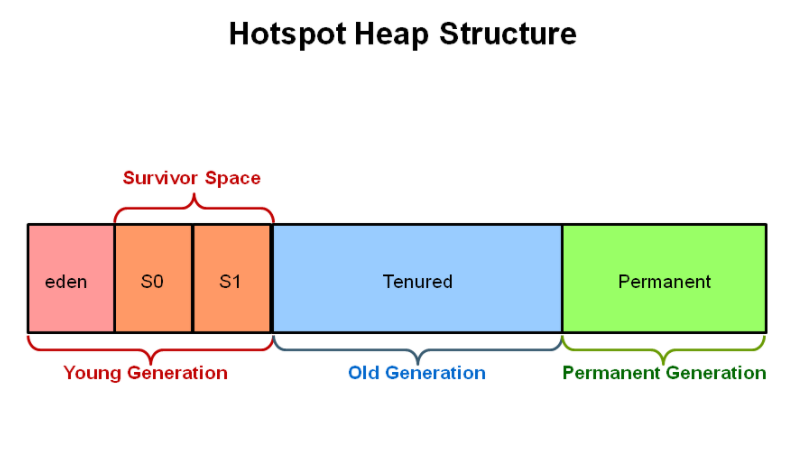
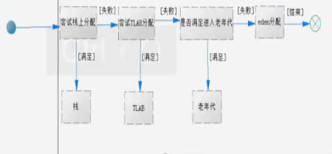
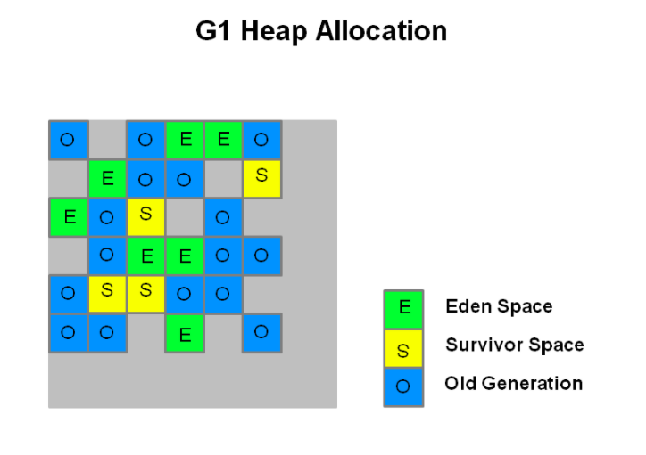

<!-- START doctoc generated TOC please keep comment here to allow auto update -->
<!-- DON'T EDIT THIS SECTION, INSTEAD RE-RUN doctoc TO UPDATE -->
**Table of Contents**  *generated with [DocToc](https://github.com/thlorenz/doctoc)*

- [JAVA虚拟机](#java%e8%99%9a%e6%8b%9f%e6%9c%ba)
  - [目录](#%e7%9b%ae%e5%bd%95)
  - [1.1 Java虚拟机的原理](#11-java%e8%99%9a%e6%8b%9f%e6%9c%ba%e7%9a%84%e5%8e%9f%e7%90%86)
  - [1.2 认识Java虚拟机的基本结构](#12-%e8%ae%a4%e8%af%86java%e8%99%9a%e6%8b%9f%e6%9c%ba%e7%9a%84%e5%9f%ba%e6%9c%ac%e7%bb%93%e6%9e%84)
  - [1.3 基本概念说明](#13-%e5%9f%ba%e6%9c%ac%e6%a6%82%e5%bf%b5%e8%af%b4%e6%98%8e)
  - [2.1 堆、栈、方法区概念和联系](#21-%e5%a0%86%e6%a0%88%e6%96%b9%e6%b3%95%e5%8c%ba%e6%a6%82%e5%bf%b5%e5%92%8c%e8%81%94%e7%b3%bb)
  - [2.2 辨清Java堆](#22-%e8%be%a8%e6%b8%85java%e5%a0%86)
  - [2.3 Java栈](#23-java%e6%a0%88)
  - [2.4 Java方法区](#24-java%e6%96%b9%e6%b3%95%e5%8c%ba)
  - [3.1 虚拟机参数](#31-%e8%99%9a%e6%8b%9f%e6%9c%ba%e5%8f%82%e6%95%b0)
  - [3.2 堆分配参数（一）](#32-%e5%a0%86%e5%88%86%e9%85%8d%e5%8f%82%e6%95%b0%e4%b8%80)
  - [3.3 堆分配参数（二）](#33-%e5%a0%86%e5%88%86%e9%85%8d%e5%8f%82%e6%95%b0%e4%ba%8c)
  - [3.4 堆溢出处理](#34-%e5%a0%86%e6%ba%a2%e5%87%ba%e5%a4%84%e7%90%86)
  - [3.5 栈配置](#35-%e6%a0%88%e9%85%8d%e7%bd%ae)
  - [3.6 方法区](#36-%e6%96%b9%e6%b3%95%e5%8c%ba)
  - [3.7 直接内存配置](#37-%e7%9b%b4%e6%8e%a5%e5%86%85%e5%ad%98%e9%85%8d%e7%bd%ae)
  - [3.8 Client和Server虚拟机工作模式](#38-client%e5%92%8cserver%e8%99%9a%e6%8b%9f%e6%9c%ba%e5%b7%a5%e4%bd%9c%e6%a8%a1%e5%bc%8f)
  - [4.1 垃圾回收概念和其算法](#41-%e5%9e%83%e5%9c%be%e5%9b%9e%e6%94%b6%e6%a6%82%e5%bf%b5%e5%92%8c%e5%85%b6%e7%ae%97%e6%b3%95)
  - [4.2 垃圾收集算法（一）](#42-%e5%9e%83%e5%9c%be%e6%94%b6%e9%9b%86%e7%ae%97%e6%b3%95%e4%b8%80)
  - [4.3 垃圾收集算法（二）](#43-%e5%9e%83%e5%9c%be%e6%94%b6%e9%9b%86%e7%ae%97%e6%b3%95%e4%ba%8c)
  - [4.4 垃圾回收时的停顿现象](#44-%e5%9e%83%e5%9c%be%e5%9b%9e%e6%94%b6%e6%97%b6%e7%9a%84%e5%81%9c%e9%a1%bf%e7%8e%b0%e8%b1%a1)
  - [4.5 对象如何进入老年代](#45-%e5%af%b9%e8%b1%a1%e5%a6%82%e4%bd%95%e8%bf%9b%e5%85%a5%e8%80%81%e5%b9%b4%e4%bb%a3)
  - [4.6 TLAB](#46-tlab)
  - [4.7 对象创建流程图](#47-%e5%af%b9%e8%b1%a1%e5%88%9b%e5%bb%ba%e6%b5%81%e7%a8%8b%e5%9b%be)
  - [5.1 垃圾收集器](#51-%e5%9e%83%e5%9c%be%e6%94%b6%e9%9b%86%e5%99%a8)
  - [5.2 串行回收器](#52-%e4%b8%b2%e8%a1%8c%e5%9b%9e%e6%94%b6%e5%99%a8)
  - [5.3 并行回收器（ ParDew回收器）](#53-%e5%b9%b6%e8%a1%8c%e5%9b%9e%e6%94%b6%e5%99%a8-pardew%e5%9b%9e%e6%94%b6%e5%99%a8)
  - [5.4 并行回收器（ParalleIGC回收器）](#54-%e5%b9%b6%e8%a1%8c%e5%9b%9e%e6%94%b6%e5%99%a8paralleigc%e5%9b%9e%e6%94%b6%e5%99%a8)
  - [5.4 并行回收器（ParalleIOldGC回收器）](#54-%e5%b9%b6%e8%a1%8c%e5%9b%9e%e6%94%b6%e5%99%a8paralleioldgc%e5%9b%9e%e6%94%b6%e5%99%a8)
  - [5.5 CMS回收器](#55-cms%e5%9b%9e%e6%94%b6%e5%99%a8)
  - [5.6 G1回收器](#56-g1%e5%9b%9e%e6%94%b6%e5%99%a8)
  - [6.1 Tomcat性能影响实验](#61-tomcat%e6%80%a7%e8%83%bd%e5%bd%b1%e5%93%8d%e5%ae%9e%e9%aa%8c)
  - [6.2 测试串行回收器](#62-%e6%b5%8b%e8%af%95%e4%b8%b2%e8%a1%8c%e5%9b%9e%e6%94%b6%e5%99%a8)
  - [6.3 扩大堆内存以提升系统性能](#63-%e6%89%a9%e5%a4%a7%e5%a0%86%e5%86%85%e5%ad%98%e4%bb%a5%e6%8f%90%e5%8d%87%e7%b3%bb%e7%bb%9f%e6%80%a7%e8%83%bd)
  - [6.4 调整初始堆大小](#64-%e8%b0%83%e6%95%b4%e5%88%9d%e5%a7%8b%e5%a0%86%e5%a4%a7%e5%b0%8f)
  - [6.5 测试ParNew回收器的表现](#65-%e6%b5%8b%e8%af%95parnew%e5%9b%9e%e6%94%b6%e5%99%a8%e7%9a%84%e8%a1%a8%e7%8e%b0)
  - [6.6 使用ParallelOldGC回收器](#66-%e4%bd%bf%e7%94%a8paralleloldgc%e5%9b%9e%e6%94%b6%e5%99%a8)
  - [6.7 测试CMS回收器的性能](#67-%e6%b5%8b%e8%af%95cms%e5%9b%9e%e6%94%b6%e5%99%a8%e7%9a%84%e6%80%a7%e8%83%bd)
  - [6.8 G1垃圾收集器的文章](#68-g1%e5%9e%83%e5%9c%be%e6%94%b6%e9%9b%86%e5%99%a8%e7%9a%84%e6%96%87%e7%ab%a0)

<!-- END doctoc generated TOC please keep comment here to allow auto update -->

# JAVA虚拟机

## 目录

1、Java虚拟机概述和基本概念

2、堆、栈、方法区

3、了解虚拟机参数

4、垃圾回收概念和算法及对象的分代转换

5、垃圾收集器

6、Tomcat性能影响实验

7、性能监控工具

## 1.1 Java虚拟机的原理

所谓虚拟机，就是一台虚拟的机器。它是一款软件，用来执行一系列虚拟计算机指令，大体上虚拟机可以分为系统虚拟机和程序虚拟机，大名鼎鼎的VirtualBox、VMare就属于系统虚拟机，他们完全是对物理计算机的仿真，提供了一个可运行完整操作系统的软件平台。程序虚拟机典型代表就是Java虚拟机，它专门为执行单个计算机程序而设计，在Java虚拟机中执行的指令我们称为Java字节码指令。无论是系统虚拟机还是程序虚拟机，在上面运行的软件都被限制于虚拟机提供的资源中。Java发展至今，出现过很多虚拟机，最初Sun使用的一款叫Classic的Java虚拟机，到现在引用最广泛的是HotSpot虚拟机，除了Sun以外，还有BEA的JRockit，目前JRockit和HotSpot都被Oracle收入旗下，大有整合的趋势。

## 1.2 认识Java虚拟机的基本结构

1、类加载子系统

2、方法区

3、Java堆

4、直接内存

5、Java栈

6、本地方法栈

7、垃圾回收系统

8、PC寄存器

9、执行引擎



##  1.3 基本概念说明

1、**类加载子系统**：负责从文件系统或者网络中加载class信息，加载的信息存放在一块称之为方法区的内存空间。

2、**方法区**：就是存放类信息、常量信息、常量池消息、包括字符串字面量和数字常量等。

3、**Java堆**：在Java虚拟机启动的时候建立Java堆，它是Java程序最主要的内存工作区域，几乎所有的对象实例都存放到Java堆中，堆空间是所有线程共享的。

4、**直接内存**：Java的NIO库允许Java程序使用直接内存，从而提高性能，通常直接内存速度会优于Java堆。读写频繁的场合可能会考虑使用。

5、每个虚拟机线程都有一个私有的**栈**，一个线程的Java栈在线程创建的时候被创建，Java栈中保存着局部变量、方法参数，同时Java的方法调用、返回值等。

6、**本地方法栈**和Java栈非常类似，最大不同为本地方法栈用于本地方法调用。Java虚拟机允许Java直接调用本地方法（通常使用C编写）。

7、**垃圾收集**系统是Java的核心，也是必不可少的，Java有一套自己进行垃圾清理的机制，开发人员无需手工清理，我们稍后详细说明。

8、**PC（Program Counter）寄存器**也是每个线程私有的空间，Java虚拟机会为每个线程创建PC寄存器，在任意时刻，一个Java线程总是执行一个方法，这个方法被称为当前方法，如果当前方法不是本地方法，PC寄存器就会执行当前正在被执行的指令，如果是本地方法，则PC寄存器值为undefined，寄存器存放如当前执行环境指针、程序计数器、操作栈指针、计算的变量指针等信息。

9、虚拟机最核心的组件就是**执行引擎**了，它负责执行虚拟机的字节码。一般先编译成机器在码，后执行。

## 2.1 堆、栈、方法区概念和联系

堆解决的是数据存储的问题，即数据怎么放、放哪里。

栈解决程序的运行问题，即程序如何执行，或者说如何处理数据。

**方法区**则是辅助堆栈的快永久区（Perm），解决堆栈信息的产生，是先决条件。

我们创建一个新的对象，User：那么User类的一些信息（类信息、静态信息都存在于方法区中）

- 而User类被实例化出来之后，被存储到Java堆中，一块内存空间

- 当我们去使用的时候，都是使用User对象的引用，形如`User user=new User();`

- 这里的User就是存放在Java栈中的，即User真实对象的一个引用。



## 2.2 辨清Java堆

Java堆是和Java应用程序关系最密切的内存空间，几乎所有的对象都存入在其中，并且Java堆完全是自动化管理的，通过垃圾回收机制，垃圾对象会自动清理，不需要显示地释放。

根据垃圾回收机制不同，Java堆有可能拥有不同的结构。最为常见的就是将整个Java堆分为新生代和老年代。其中新生代存放新生的对象或者年龄不大的对象，**老年代**则存放老年对象。

**新生代**分为eden区、S0区、S1区，S0和S1也被称为from和to区域，他们是两块大小相等并且可以互换角色的空间。

绝大多数情况下，对象首先分配在eden区，在一次新生代回收后，如果对象还存活，则会进入s0或者s1区，之后经过新生代回收，如果对象存活则它的年龄就加1，当对象达到一定的年龄后，则进入老年代。



## 2.3 Java栈

**Java栈**是一块线程私有的存在空间，一个栈，一般由三部分组成：局部变量表、操作数栈和帧数据区。

**局部变量表**：用于报错函数的参数及局部变量。

**操作数栈**：主要保存计算过程的中间结果，同时作为计算过程中变量临时的存储空间。

**帧数据区**：除了局部变量表和操作数栈以外，栈还需要一些数据来支持常量池的解析，这里帧数据区保存着访问常量池的指针，方便程序访问常量池，另外，当函数返回或者出现异常时，虚拟机必须有一个异常修理表，方便发送异常的时候找到异常的代码，因此异常处理表也是帧数据区的一部分。


## 2.4 Java方法区

**Java方法区**和堆一样，方法区是一块所有线程共享的内存区域，它保存系统的类信息，比如类的字段、方法、常量池等。方法区的大小决定了系统可以保存多少个类，如果系统定义大多的类，导致方法区溢出。虚拟机同样会抛出内存溢出错误。**方法区可以理解为永久区（Perm）**

## 3.1 虚拟机参数

在虚拟机运行的过程中，如果可以跟踪系统的运行状态，那么对于问题的故障排查会有一定的帮助，为此，虚拟机提供了一些跟踪系统状态的参数，使用给定的参数执行Java虚拟机，就可以在系统运行时打印相关日志，用于分析实际问题。我们进行虚拟机参数设置，其实主要就是围绕着堆、栈、方法区进行配置。

## 3.2 堆分配参数（一）

**-XX:+PrintGC**：使用这个参数，虚拟机启动后，只要遇到GCc就会打印日志。

**-XX:+UseSerialGC**：使用串行垃圾回收器

**-XX:+PrintGCDetails**：可以查看详细信息，包括各个区的情况

**-Xms**：设置Java程序启动时初始堆大小

**-Xmx**：设置Java程序能获得的最大堆大小

**-Xmx20m -Xms5m -XX:+PrintCommandLineFlags**：或以将隐式或者显式传给虚拟机的参数输出。

```java
public class Test01 {
    public static void main(String[] args) {
        //-Xms5m -Xmx20m -XX:+PrintGCDetails -XX:+UseSerialGC -XX:+PrintCommandLineFlags
        
        //查看GC信息
        System.out.println("max memory:" + Runtime.getRuntime().maxMemory());
        System.out.println("free memory:" + Runtime.getRuntime().freeMemory());
        System.out.println("total memory:" + Runtime.getRuntime().totalMemory());
        
        byte[] b1 = new byte[1*1024*1024];
        System.out.println("分配了1M");
        System.out.println("max memory:" + Runtime.getRuntime().maxMemory());
        System.out.println("free memory:" + Runtime.getRuntime().freeMemory());
        System.out.println("total memory:" + Runtime.getRuntime().totalMemory());
        
        byte[] b2 = new byte[4*1024*1024];
        System.out.println("分配了4M");
        System.out.println("max memory:" + Runtime.getRuntime().maxMemory());
        System.out.println("free memory:" + Runtime.getRuntime().freeMemory());
        System.out.println("total memory:" + Runtime.getRuntime().totalMemory());
    }
}
```

输出：

```powershell
[0.013s][warning][gc] -XX:+PrintGCDetails is deprecated. Will use -Xlog:gc* instead.
-XX:InitialHeapSize=5242880 -XX:MaxHeapSize=20971520 -XX:+PrintCommandLineFlags -XX:+PrintGCDetails -XX:ReservedCodeCacheSize=251658240 -XX:+SegmentedCodeCache -XX:+UseCompressedClassPointers -XX:+UseCompressedOops -XX:-UseLargePagesIndividualAllocation -XX:+UseSerialGC 
[0.067s][info   ][gc] Using Serial
[0.067s][info   ][gc,heap,coops] Heap address: 0x00000000fec00000, size: 20 MB, Compressed Oops mode: 32-bit
max memory:20316160
free memory:5159064
total memory:6094848
[0.389s][info   ][gc,start     ] GC(0) Pause Young (Allocation Failure)
[0.394s][info   ][gc,heap      ] GC(0) DefNew: 913K->191K(1856K)
[0.394s][info   ][gc,heap      ] GC(0) Tenured: 0K->508K(4096K)
[0.395s][info   ][gc,metaspace ] GC(0) Metaspace: 3863K->3863K(1056768K)
[0.395s][info   ][gc           ] GC(0) Pause Young (Allocation Failure) 0M->0M(5M) 5.848ms
[0.395s][info   ][gc,cpu       ] GC(0) User=0.00s Sys=0.00s Real=0.01s
分配了1M
max memory:20316160
free memory:4296600
total memory:6094848
[0.396s][info   ][gc,start     ] GC(1) Pause Young (Allocation Failure)
[0.400s][info   ][gc,start     ] GC(2) Pause Full (Allocation Failure)
[0.400s][info   ][gc,phases,start] GC(2) Phase 1: Mark live objects
[0.403s][info   ][gc,phases      ] GC(2) Phase 1: Mark live objects 3.017ms
[0.403s][info   ][gc,phases,start] GC(2) Phase 2: Compute new object addresses
[0.404s][info   ][gc,phases      ] GC(2) Phase 2: Compute new object addresses 0.565ms
[0.404s][info   ][gc,phases,start] GC(2) Phase 3: Adjust pointers
[0.405s][info   ][gc,phases      ] GC(2) Phase 3: Adjust pointers 1.257ms
[0.405s][info   ][gc,phases,start] GC(2) Phase 4: Move objects
[0.405s][info   ][gc,phases      ] GC(2) Phase 4: Move objects 0.024ms
[0.405s][info   ][gc             ] GC(2) Pause Full (Allocation Failure) 1M->1M(5M) 5.292ms
[0.405s][info   ][gc,heap        ] GC(1) DefNew: 1247K->0K(1856K)
[0.405s][info   ][gc,heap        ] GC(1) Tenured: 508K->1724K(4096K)
[0.405s][info   ][gc,metaspace   ] GC(1) Metaspace: 3863K->3863K(1056768K)
[0.406s][info   ][gc             ] GC(1) Pause Young (Allocation Failure) 1M->1M(5M) 9.599ms
[0.406s][info   ][gc,cpu         ] GC(1) User=0.02s Sys=0.00s Real=0.01s
分配了4M
max memory:20316160
free memory:4364736
total memory:10358784
[0.411s][info   ][gc,heap,exit   ] Heap
[0.411s][info   ][gc,heap,exit   ]  def new generation   total 1920K, used 50K [0x00000000fec00000, 0x00000000fee10000, 0x00000000ff2a0000)
[0.411s][info   ][gc,heap,exit   ]   eden space 1728K,   2% used [0x00000000fec00000, 0x00000000fec0cb78, 0x00000000fedb0000)
[0.411s][info   ][gc,heap,exit   ]   from space 192K,   0% used [0x00000000fedb0000, 0x00000000fedb0000, 0x00000000fede0000)
[0.411s][info   ][gc,heap,exit   ]   to   space 192K,   0% used [0x00000000fede0000, 0x00000000fede0000, 0x00000000fee10000)
[0.411s][info   ][gc,heap,exit   ]  tenured generation   total 8196K, used 5820K [0x00000000ff2a0000, 0x00000000ffaa1000, 0x0000000100000000)
[0.411s][info   ][gc,heap,exit   ]    the space 8196K,  71% used [0x00000000ff2a0000, 0x00000000ff84f158, 0x00000000ff84f200, 0x00000000ffaa1000)
[0.411s][info   ][gc,heap,exit   ]  Metaspace       used 3872K, capacity 4486K, committed 4864K, reserved 1056768K
[0.411s][info   ][gc,heap,exit   ]   class space    used 345K, capacity 386K, committed 512K, reserved 1048576K
```

**总结**：在实际工作中，我们可以直接将初始的堆大小与最大堆大小设置相等，这样的好处是可以减少程序运行时的垃圾回收次数，从而提高性能。

## 3.3 堆分配参数（二）

**新生代的配置**

**-Xmn**：可以设置新生代的大小，设置一个比较大的新生代会减少老年代的大小，这个参数对系统性能以及GC行为有很大的影响，新生代大小一般会设置整个堆空间的1/3到1/4左右。

**-XX:SurvivorRatio**：用来设置新生代中eden空间和from/to空间的比例。含义：-XX:SurvivorRatio=eden/from=eden/to

```java
public class Test02 {
    public static void main(String[] args) {
        //第一次配置
        //-Xms20m -Xmx20m -Xmn1m -XX:SurvivorRatio=2 -XX:+PrintGCDetails -XX:+UseSerialGC
        
        //第二次配置
        //-Xms20m -Xmx20m -Xmn7m -XX:SurvivorRatio=2 -XX:+PrintGCDetails -XX:+UseSerialGC
        
        //第三次配置
        //-XX:NewRatio=老年代/新生代
        //-Xms20m -Xmx20m -XX:SurvivorRatio=2 -XX:+PrintGCDetails -XX:+UseSerialGC
        
        byte[] b = null;
        //连续向系统申请10MB空间
        for(int i = 0 ; i <10; i ++){
            b = new byte[1*1024*1024];
        }
    }
}
```

**总结**：不同的堆分布情况，对系统执行会产生一定的影响，在实际工作中，应该根据系统的特点做出合理的配置，基本策略：尽可能将对象预留在新生代，减少老年代的GC次数。

除了可以设置新生代的绝对大小（-Xmn），还可以使用（-XX:NewRatio）设置新生代和老年代的比例：-XX:NewRatio=老年代/新生代

## 3.4 堆溢出处理

在Java程序的运行过程中，如果堆空间不足，则会抛出内存溢出的错误（Out Of Memory）OOM，一旦这类问题发生在生产环境，可能引起严重的业务中断，Java虚拟机提供了**-XX:+HeapDumpOnOutOfMemoryError**，使用该参数可以在内存溢出时导出整个堆信息，与之配合使用的还有参数**-XX:HeapDumpPath**，可以设置导出堆的存放路径。

内存分析工具：Memory Analyzer 1.5.0

地址：http://download.eclipse.org/mat/1.5/update-site

示例：

```java
public class Test03 {
    public static void main(String[] args) {
        //-Xms1m -Xmx1m -XX:+HeapDumpOnOutOfMemoryError -XX:HeapDumpPath=d:/Test03.dump
        //堆内存溢出
        Vector v = new Vector();
        for(int i=0; i < 5; i ++){
            v.add(new Byte[1*1024*1024]);
        }
    }
}
```

## 3.5 栈配置

Java虚拟机提供了参数**-Xss**来指定线程的最大栈空间，整个参数也直接决定了函数可调用的最大深度。

示例：

```java
public class Test04 {
    //-Xss1m  
    //-Xss5m
    
    //栈调用深度
    private static int count;
    
    public static void recursion(){
        count++;
        recursion();
    }
    public static void main(String[] args){
        try {
            recursion();
        } catch (Throwable t) {
            System.out.println("调用最大深入：" + count);
            t.printStackTrace();
        }
    }
}
```

## 3.6 方法区

和Java堆一样，方法区是一块所有线程共享的内存区域，它用于保存系统的类信息，方法区（永久区）可以保存多少信息可以对其进行配置，在默认情况下，-XX:MaxPermSize为64MB，如果系统运行时生产大量的类，就需要设置一个相对合适的方法区，以免出现永久区内存溢出的问题。

**-XX:PermSize=64M -XX:MaxPermSize=64M**

## 3.7 直接内存配置

直接内存也是Java程序中非常重要的组成部分，特别是广泛用在NIO中，直接内存路过了Java堆，使Java程序可以直接访问原生堆空间，因此在一定程序上加快了内存空间的访问速度。但是说直接内存一定就提高内存访问速度也不见得，具体情况具体分析。

相关配置参数：**-XX:MaxDirectMemorySize**，如果不设置默认值为最大堆空间，即-Xmx。直接内存使用达到上限时，就会触发垃圾回收，如果不能有效的释放空间，也会引起系统的OOM。

## 3.8 Client和Server虚拟机工作模式

目前Java虚拟机支持Client和Server两种运行模式，使用参数-client可以指定Client模式，使用-server即使用Server模式。可以直接在命令行查看当前计算机系统自动选择的运行模式。java -version即可。

**二者区别**：Client模式相对Server启动较快，如果不追求系统的长时间使用性能，仅仅是测试，可能使用Client模式。而Server模式则启动比较慢，原因是会对其进行复杂的系统性能信息收集和使用更复杂的算法对程序进行优化，一般我们的生产环境都会使用Server模式，长期运行其性能要远远快于Client模式。

JVM不错的博客：

http://www.cnblogs.com/redcreen/archive/2011/05/04/2037057.html

## 4.1 垃圾回收概念和其算法

谈到**垃圾回收（Garbage Collection，简称GC）**，需要先澄清什么是垃圾，类比日常生活中的垃圾，我们会把他们丢入垃圾桶，然后倒掉。GC中的垃圾，特指存于内存中，不会再被使用的对象，而回收就是相当于把垃圾“倒掉”。垃圾回收有很多种算法：如引用计数法、标记压缩法、复制算法、分代、分区的思想。

## 4.2 垃圾收集算法（一）

**引用计数法**：这是个比较古老而经典的垃圾收集算法，其核心就是在对象被其他引用时计数器加1，而当引用失效时则减1，但是这种方式有非常严重的问题：无法处理循环引用的情况、还有就是每次进行加减操作比较浪费系统性能。

**标记清除法**：就是分为标记和清除两个阶段进行处理内存中的对象，当然这种方式也有非常大的弊端，就是空间碎片问题，垃圾回收后的空间不是连续的，不连续的内存空间的工作效率要低于连续的内存空间。

**复制算法**：其核心思想就是将内存空间分为两块，每次只使用其中一块，在垃圾回收时，将正在使用的内存中的存留对象复制到未被使用的内存块中去，之后去清除之前正在使用的内存块中所有的对象，反复去交换两个内存的角色，完成垃圾收集。（Java中新生代的from和to空间就是使用这个算法）

**标记压缩法**：标记压缩法在标记清除基础上做了优化，把存活的对象压缩到内存一端，而后进行垃圾清理。（Java中老年代使用的就是标记压缩法）

考虑一个问题：为什么新生代和老年代使用不同的算法？

## 4.3 垃圾收集算法（二）

**分代算法**：就是根据对象的特点把内存分成N块，而后根据每个内存的特点使用不同的算法。

对于新生代和老年代来说，新生代回收频率很高，但是每次回收耗时都很短，而老年代回收频率较低，但是耗时会相对较长，所以尽量减少老年代的GC。

**分区算法**：其主要就是将整个内存分为N多个小的独立空间，每个小空间都可以独立使用，这样细粒度的控制一次回收多少个小空间和哪些个小空间，而不是对整个空间进行GC，从而提升性能，并减少GC的停顿时间。

## 4.4 垃圾回收时的停顿现象

垃圾回收器的任务是识别和回收垃圾对象进行内存清理，为了让垃圾回收器可以高效的执行，大部分情况下，会要求系统进入一个停顿的状态。停顿的目的是终止所有应用线程，只有这样系统才不会有新的垃圾产生，同时停顿保证了系统状态在某一个瞬间的一致性，也有益于更好的标记垃圾对象。因此在垃圾回收时，都会产生应用程序的停顿。

## 4.5 对象如何进入老年代

一般而言对象首次创建会被放置在新生代的eden区，如果没有GC介入，则对象不会离开eden区，那么eden区的对象如何进入老年代呢？一般来讲，只要对象的年龄达到一定的大小，就会自动离开年轻代进入老年代，对象年龄是由对象经历数次GC决定的，在新生代每次GC之后如果对象没有被回收则年龄加１。虚拟机提供了一个参数来控制新生代对象的最大年龄，当超过这个年龄范围就会晋升老年代。

**-XX:MaxTenuringThreshold**，默认情况下为15

示例：

```java
public class Test05 {
    public static void main(String[] args) {
        //初始的对象在eden区
        //参数：-Xmx64M -Xms64M -XX:+PrintGCDetails
        for(int i=0; i< 5; i++){
            byte[] b = new byte[1024*1024];
        }
        
        //测试进入老年代的对象
        //参数：-Xmx1024M -Xms1024M -XX:+UseSerialGC -XX:MaxTenuringThreshold=15 -XX:+PrintGCDetails 
        //-XX:+PrintHeapAtGC
        Map<Integer, byte[]> m = new HashMap<Integer, byte[]>();
        for(int i =0; i <5 ; i++) {
            byte[] b = new byte[1024*1024];
            m.put(i, b);
        }
        
        for(int k = 0; k<20; k++) {
            for(int j = 0; j<300; j++){
                byte[] b = new byte[1024*1024]; 
            }
        }
    }
}
```

总结：根据设置MaxTenuringThreshold参数，可以指定新生代对象经过多少次回收后进入老年代。

另外，大对象（新生代eden区无法装入时，也会直接进入老年代）。JVM里有个参数可以设置对象的大小超过指定的大小之后，直接晋升老年代。

**-XX:PretenureSizeThreshold**

示例：

```java
public class Test06 {
    public static void main(String[] args) {
        //参数：-Xmx30M -Xms30M -XX:+UseSerialGC -XX:+PrintGCDetails -XX:PretenureSizeThreshold=1000
        //这种现象原因为：虚拟机对于体积不大的对象 会优先把数据分配到TLAB区域中，因此就失去了在老年代分配的机会
        //参数：-Xmx30M -Xms30M -XX:+UseSerialGC -XX:+PrintGCDetails -XX:PretenureSizeThreshold=1000 -XX:-UseTLAB
        Map<Integer, byte[]> m = new HashMap<Integer, byte[]>();
        for(int i=0; i< 5*1024; i++){
            byte[] b = new byte[1024];
            m.put(i, b);
        }
    }
}
```

总结：使用PretenureSizeThreshold可以进行指定进入老年代的对象大小，但是要注意TLAB区域优先分配空间。

## 4.6 TLAB

**TLAB**全称是Thread Local Allocation Buffer即线程本地分配缓存，从名字上看是一个线程专用的内存分配区域，是为了回速对象分配而生的。每一个线程都会产生一个TLAB，该线程独享的工作区域，Java虚拟机使用这种TLAB区来避免多线程冲突问题，提高了对象分配的效率。TLAB空间一般不会太大，当大对象无法在TLAB分配时，则会直接分配到堆上。

**-XX:+UseTLAB**：使用TLAB。

**-XX:+TLABSize**：设置TLAB大小。

**-XX:TLABRefillWasteFraction**： 设置维护进入TLAB空间的单个对象大小，他是一个比例值，默认为64，即如果对象大于整个空间的1/64，则在堆创建对象。

**-XX:+PrintTLAB**：查看TLAB信息。

**-XX:ResizeTLAB**：自调整TLABRefillWasteFraction阀值。

```java
public class Test07 {

    public static void alloc(){
        byte[] b = new byte[2];
    }
    
    public static void main(String[] args) {
        //TLAB分配
        //参数：-XX:+UseTLAB -XX:+PrintTLAB -XX:+PrintGC -XX:TLABSize=102400 -XX:-ResizeTLAB -XX:TLABRefillWasteFraction=100 -XX:-DoEscapeAnalysis -server
        for(int i=0; i<10000000;i++){
            alloc();
        }
    }
}
```

## 4.7 对象创建流程图

一个对象创建在什么位置，我们的jvm会有一个比较细节的流程，根据数据的大小，参数的设置，决定如何创建分配，以及其位置。



## 5.1 垃圾收集器

在Java虚拟机中，垃圾回收器不仅仅只有一种，什么情况下该使用哪种，对性能有什么样的影响，这都是我们需要了解的。

**串行垃圾回收器**

**并行垃圾回收器**

**CMS回收器**

**G1回收器**

## 5.2 串行回收器

串行回收器是指使用单线程进行垃圾回收的回收器。每次回收时，串行回收器只有一个工作线程，对于并行能力较弱的计算机来说，串行回收器的专注性和独古性往往有更好的性能表现。

串行回收器可以在新生代和老年代使用，根据作用于不同的堆空间，分为新生代串行回收器和老年代串行回收器。
使用**-XX:+UseSerialGC**参数可以设置使用新生代串行回收器和老年代串行回收器。

## 5.3 并行回收器（ ParDew回收器）

并行回收器在串行回收器基础上做了改进，他可以使用多个线程同时进行垃圾回收，对于计算能力强的计算机而言，可以有效的缩短垃圾回收所需的实际时间。

ParNew回收器是一个工作在新生代的垃圾收集器，他只是简单的将串行回收回器多线程化，他的回收策略和算法和串行回收器一样。

使用**-XX:+UseParNewGC**新生代ParNew回收器，老年代则使用串行回收器。

ParNew回收器工作时的线程数量可以使用**-XX:ParalleIGCThreads**参数指定，一般最好和计算机的CPU相当，避免过多的线程影响性能。

## 5.4 并行回收器（ParalleIGC回收器）

**新生代 ParalleIGC回收器**，使用了复制算法的收集器，也是多线程独占形式的收集器，但ParallelGCI回收器有个非常重要的特点，就是它非常关注系统的吞吐量。

提供了俩个非常关键的参数控制系统的吞吐量**-XX:MaxGCPauseMillis**：设置最大垃圾收集停顿时间，可用把虚拟机在GC停顿的时间控制在MaxGCPauseMiLlis范围内，如果希望减少GC停顿时间，可以将MaxGCPauseMillis设置的很小，但是会导致GC频繁，从而增加了GC的总时间，降低了吞吐量。所以需要根据实际情况设置该值。

**-XX:GCTimeRatio**：设置吞吐量大小，它是一个0到100之间的整数，默认情况下他的取值是99，那么系统将花费不超过1/(1+n)的时间用于垃圾回收，也就是1/(1+99)=1%的时间。

另外还可以指定**-XX:+UseAdaptiveSizePolicy**打开自适应模式，在这种模式下，新生代的大小、eden、from/to的比例，以及晋升老年代的对象年龄参数会被自动调整，以达到在堆大小、吞吐量和停顿时间之间的平衡点。

## 5.4 并行回收器（ParalleIOldGC回收器）

老年代 ParalleIOldGC回收器也是一种多线程的回收器，和新生代的ParallelGC回收器一样，也是一种关注吞吐量的回器，他使用了标记压缩算法进行实现。

**-XX:+UseParallelOldGC**：进行设置

**-XX:ParallelGCThreads**：也可以设置应圾收集时的线程数量

## 5.5 CMS回收器

**CMS**全称为: Concurrent Mark Sweep，意为并发标记清除，他使用的是标记清除法,主要关注系统停顿时间。

使用**-XX:+UseConcMarkSweepGC**进行设置。

使用**-XX:ConcGCThreads**设置并发线程数量。

CMS并不是独占的回收器，也统说CMS回收的过程中，应用程序仍然在不停的工作，又会有新的垃圾不断的产生，所以在使用CMS的过程中应该确保应用程序的内存足够可用，CMS不会等到应用程序饱和的时候才去回收垃圾，而是在某一阀值的时候开始回收，回收阀值可用指定的参数进行配置，**-XX:CMSInitiatingOccupancyFraction**来指定，默认为68，也就是说**当老年代的空间使用率达到68%的时候，会执行CMS回收**。如果内存使用率增长的很快，在CMS执行的过程中，已经出现了内存不足的情况，此时CMS回收就会失败，虚拟机将启动老年代串行回收器进行垃圾回收，这会导致应用程序中断，直到垃圾回收完成后才会正常工作，这个过程GC的停顿时间可能较长，所以**-XX:CMSInitiatingOccupancyFraction**的设置要根据实际的情况。

之前我们在学习算法的时候说过，标记清除法有个缺点就是存在内存碎片的问题，那么CMS有个参数设置**-XX:+UseCMSCompactAtFullCollecion**可以使CMS回收完成之后进行一次碎片整理，**-XX:CMSFullGCsBeforeCompaction**参数可以设置进行多少次CMS回收之后，对内存进行一次压缩。

## 5.6 G1回收器

**G1回收器（Garbage-First）**是在jdk1.7中提出的垃圾回收器，从长期日标来看是为了取代CMS回收器，G1回收器拥有独特的垃圾回收策略，G1属于分代垃圾回收器，区分新生代和老年代，依然有eden和from/to区，它并不要求整个eden区或者新生代、老年代的空间都连续，它使用了分区算法。



**并行性**：G1回收期间可多线程同时工作。

**并发性**：G1拥有与应用程序交替执行能力，部分工作可与应用程序同时执行，在整个GC期间不会完全阻塞应用程序。

**分代GC**：G1依然是一个分代的收集器，但是它是兼顾新生代和老年代一起工作，之前的垃圾收集器他们或者在新生代工作，或者在老年代工作，因此这是一个很大的不同。

**空间整理**：G1在回收过程中，不会像CMS那样在若干次GC后需要进行碎片整理，G1采用了有效复制对象的方式，减少空间碎片。

**可预见性**：由于分区的原因，G1可以只选取部分区域进行回收，缩小了回收的范围，提升了性能。

使用**-XX:+UseG1GC**：应用G1收集器。

使用**-XX:MaxGCPauseMillis**：指定最大停顿时间。

使用**-XX:ParallelGCThreads**：设置并行回收的线程数量。

| 选项                                 | 描述                                                         |
| ------------------------------------ | ------------------------------------------------------------ |
| -XX:+UseG1GC                         | 开启G1回收器                                                 |
| -XX:MaxGCPauseMillis=n               | 设定最大的GC停顿时间。 这是一个软目标，JVM将近最大限度去实现。因此 这个停顿时间可能不会被满足。 |
| -XX:InitiatingHeapOccupancyPercent=n | 开始并发GC的百分比。G1 通过该比例来触发GC，这个比例是基于全部的heap,而不是单单某个分区。 默认值是45%。 |
| -XX:NewRatio=n                       | Ratio of new/old generation sizes. The default value is 2.   |
| -XX:SurvivorRatio=n                  | Ratio of eden/survivor space size. The default value is 8.   |
| -XX:MaxTenuringThreshold=n           | Maximum value for tenuring threshold. The default value is 15. |
| -XX:ParallelGCThreads=n              | 设置并行回收阶段，GC所要用到的线程数。默认值随着JVM所运行的平台不同而变化。 |
| -XX:ConcGCThreads=n                  | 设置GC并发的线程数。默认值随着JVM所运行的平台不同而变化。    |
| -XX:G1ReservePercent=n               | 加大-XX:G1ReservePercent=n,来为 'to-space'预留更多空间，防止晋升失败。默认值是10。 |
| -XX:G1HeapRegionSize=n               | 指定region的大小。默认值是根据所开堆空间大小来计算的。region最大值是32Mb,最小值是1Mb。 |

## 6.1 Tomcat性能影响实验

配置环境说明：

**Tomcat7**

一个JSP网站

测试网站吞吐量（1个指标、停顿时间，内存的使用情况，包括回收的效率...）

工具：

**Apache JMeter**

下载地址：

htp: Jmeter. apache. org/download_jmeter.cgi

实验原理：

通过 JMeter对 Tomcat增加压力,不同的虚拟机参数应该会有不同的表现

目的：

观察不同配置参数对吞叶量的影响

## 6.2 测试串行回收器

-XX:+PrintGCDetails -Xmx32M -Xms32M

-XX:+HeapDumpOnOutOfMemoryError

-XX:+UseSerialGC

-XX:PermSize=32M

测试结果显示吞吐量为：860    85

## 6.3 扩大堆内存以提升系统性能

-XX:+PrintGCDetails -Xmx512M -Xms32M

-XX:+HeapDumpOnOutOfMemoryError

-XX:+UseSerialGC

-XX:PermSize=32M

-Xloggc:d:/gc.log

测试结果显示吞吐量为：980    100

## 6.4 调整初始堆大小

-XX:+PrintGCDetails -Xmx512M -Xms128M

-XX:+HeapDumpOnOutOfMemoryError

-XX:+UseSerialGC

-XX:PermSize=32M

-Xloggc:d:/gc.log

测试结果显示吞吐量为：1550    155

## 6.5 测试ParNew回收器的表现

-XX:+PrintGCDetails -Xmx512M -Xms128M

-XX:+HeapDumpOnOutOfMemoryError

-XX:+UseParNewGC

-XX:PermSize=32M

-Xloggc:d:/gc.log

测试结果显示吞吐量为：2000    200

## 6.6 使用ParallelOldGC回收器

-XX:+PrintGCDetails -Xmx512M -Xms128M

-XX:+HeapDumpOnOutOfMemoryError

-XX:+UseParallelGC

-XX:+UseParallelOldGC

-XX:ParallelGCThreads=8

-XX:PermSize=32M

-Xloggc:d:/gc.log

测试结果显示吞吐量为：2200    220

## 6.7 测试CMS回收器的性能

-XX:+PrintGCDetails -Xmx512M -Xms128M

-XX:+HeapDumpOnOutOfMemoryError

-XX:+UseConcMarkSweepGC

-XX:ConcGCThreads=8

-XX:PermSize=32M

-Xloggc:d:/gc.log

测试结果显示吞吐量为：1740    173

## 6.8 G1垃圾收集器的文章

http://blog.csdn.net/woshiqjs/article/details/7290513

http://developer.51cto.com/art/200907/138943.htm