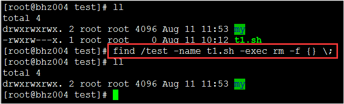

<!-- START doctoc generated TOC please keep comment here to allow auto update -->
<!-- DON'T EDIT THIS SECTION, INSTEAD RE-RUN doctoc TO UPDATE -->
**Table of Contents**  *generated with [DocToc](https://github.com/thlorenz/doctoc)*

- [Linux](#linux)
  - [目录](#%e7%9b%ae%e5%bd%95)
  - [1.1 Linux初步](#11-linux%e5%88%9d%e6%ad%a5)
  - [1.2 安装Linux](#12-%e5%ae%89%e8%a3%85linux)
  - [1.3 规范和文件说明](#13-%e8%a7%84%e8%8c%83%e5%92%8c%e6%96%87%e4%bb%b6%e8%af%b4%e6%98%8e)
  - [2.0 常用命令](#20-%e5%b8%b8%e7%94%a8%e5%91%bd%e4%bb%a4)
  - [2.1 文件处理命令](#21-%e6%96%87%e4%bb%b6%e5%a4%84%e7%90%86%e5%91%bd%e4%bb%a4)
  - [2.2 权限处理命令](#22-%e6%9d%83%e9%99%90%e5%a4%84%e7%90%86%e5%91%bd%e4%bb%a4)
  - [2.3 文件搜索命令](#23-%e6%96%87%e4%bb%b6%e6%90%9c%e7%b4%a2%e5%91%bd%e4%bb%a4)
  - [2.4 压缩解压缩命令](#24-%e5%8e%8b%e7%bc%a9%e8%a7%a3%e5%8e%8b%e7%bc%a9%e5%91%bd%e4%bb%a4)
  - [2.5 其他命令](#25-%e5%85%b6%e4%bb%96%e5%91%bd%e4%bb%a4)
  - [3.1 vi/vim](#31-vivim)
  - [3.2 vi/vim的工作模式图](#32-vivim%e7%9a%84%e5%b7%a5%e4%bd%9c%e6%a8%a1%e5%bc%8f%e5%9b%be)
  - [3.3 插入模式](#33-%e6%8f%92%e5%85%a5%e6%a8%a1%e5%bc%8f)
  - [3.4 定位命令](#34-%e5%ae%9a%e4%bd%8d%e5%91%bd%e4%bb%a4)
  - [3.5 删除命令](#35-%e5%88%a0%e9%99%a4%e5%91%bd%e4%bb%a4)
  - [3.6 复制和粘贴](#36-%e5%a4%8d%e5%88%b6%e5%92%8c%e7%b2%98%e8%b4%b4)
  - [3.7 替换和搜索](#37-%e6%9b%bf%e6%8d%a2%e5%92%8c%e6%90%9c%e7%b4%a2)
  - [3.8 保存和退出](#38-%e4%bf%9d%e5%ad%98%e5%92%8c%e9%80%80%e5%87%ba)
  - [3.9 自定义快捷键](#39-%e8%87%aa%e5%ae%9a%e4%b9%89%e5%bf%ab%e6%8d%b7%e9%94%ae)
  - [4.0 用户管理](#40-%e7%94%a8%e6%88%b7%e7%ae%a1%e7%90%86)
  - [4.1.0 用户管理配置文件](#410-%e7%94%a8%e6%88%b7%e7%ae%a1%e7%90%86%e9%85%8d%e7%bd%ae%e6%96%87%e4%bb%b6)
  - [4.1.1 用户信息文件](#411-%e7%94%a8%e6%88%b7%e4%bf%a1%e6%81%af%e6%96%87%e4%bb%b6)
  - [4.1.2 用户类型](#412-%e7%94%a8%e6%88%b7%e7%b1%bb%e5%9e%8b)
  - [4.1.3 密码文件](#413-%e5%af%86%e7%a0%81%e6%96%87%e4%bb%b6)
  - [4.1.4 用户配置文件](#414-%e7%94%a8%e6%88%b7%e9%85%8d%e7%bd%ae%e6%96%87%e4%bb%b6)
  - [4.1.5 用户配置文件](#415-%e7%94%a8%e6%88%b7%e9%85%8d%e7%bd%ae%e6%96%87%e4%bb%b6)
  - [4.1.6 用户组](#416-%e7%94%a8%e6%88%b7%e7%bb%84)
  - [4.2.1 用户组管理命令](#421-%e7%94%a8%e6%88%b7%e7%bb%84%e7%ae%a1%e7%90%86%e5%91%bd%e4%bb%a4)
  - [4.2.2 用户管理命令](#422-%e7%94%a8%e6%88%b7%e7%ae%a1%e7%90%86%e5%91%bd%e4%bb%a4)
  - [4.2.3 用户管理命令](#423-%e7%94%a8%e6%88%b7%e7%ae%a1%e7%90%86%e5%91%bd%e4%bb%a4)
  - [4.2.4 用户组操作](#424-%e7%94%a8%e6%88%b7%e7%bb%84%e6%93%8d%e4%bd%9c)
  - [4.2.5 用户组授权](#425-%e7%94%a8%e6%88%b7%e7%bb%84%e6%8e%88%e6%9d%83)
  - [5.0 进程管理](#50-%e8%bf%9b%e7%a8%8b%e7%ae%a1%e7%90%86)
  - [5.1 程序和进程的概念](#51-%e7%a8%8b%e5%ba%8f%e5%92%8c%e8%bf%9b%e7%a8%8b%e7%9a%84%e6%a6%82%e5%bf%b5)
  - [5.2.1 进程管理命令](#521-%e8%bf%9b%e7%a8%8b%e7%ae%a1%e7%90%86%e5%91%bd%e4%bb%a4)
  - [5.2.2 进程查看命令](#522-%e8%bf%9b%e7%a8%8b%e6%9f%a5%e7%9c%8b%e5%91%bd%e4%bb%a4)
  - [5.2.3 进程查看命令](#523-%e8%bf%9b%e7%a8%8b%e6%9f%a5%e7%9c%8b%e5%91%bd%e4%bb%a4)
  - [5.2.4 进程查看命令](#524-%e8%bf%9b%e7%a8%8b%e6%9f%a5%e7%9c%8b%e5%91%bd%e4%bb%a4)
  - [5.2.5 杀死进程](#525-%e6%9d%80%e6%ad%bb%e8%bf%9b%e7%a8%8b)
  - [5.2.6 进程相关常用命令](#526-%e8%bf%9b%e7%a8%8b%e7%9b%b8%e5%85%b3%e5%b8%b8%e7%94%a8%e5%91%bd%e4%bb%a4)
  - [5.2.7 进程相关常用命令](#527-%e8%bf%9b%e7%a8%8b%e7%9b%b8%e5%85%b3%e5%b8%b8%e7%94%a8%e5%91%bd%e4%bb%a4)
  - [5.3.0 任务计划](#530-%e4%bb%bb%e5%8a%a1%e8%ae%a1%e5%88%92)
  - [5.3.1 一次性计划任务](#531-%e4%b8%80%e6%ac%a1%e6%80%a7%e8%ae%a1%e5%88%92%e4%bb%bb%e5%8a%a1)
  - [5.3.2 一次性计划任务](#532-%e4%b8%80%e6%ac%a1%e6%80%a7%e8%ae%a1%e5%88%92%e4%bb%bb%e5%8a%a1)
  - [5.3.3 周期性任务计划](#533-%e5%91%a8%e6%9c%9f%e6%80%a7%e4%bb%bb%e5%8a%a1%e8%ae%a1%e5%88%92)
  - [5.3.4 周期性任务计划](#534-%e5%91%a8%e6%9c%9f%e6%80%a7%e4%bb%bb%e5%8a%a1%e8%ae%a1%e5%88%92)
  - [6.0 系统文件构成](#60-%e7%b3%bb%e7%bb%9f%e6%96%87%e4%bb%b6%e6%9e%84%e6%88%90)
  - [7.0 软件包管理](#70-%e8%bd%af%e4%bb%b6%e5%8c%85%e7%ae%a1%e7%90%86)
  - [8.0 Shell编程](#80-shell%e7%bc%96%e7%a8%8b)

<!-- END doctoc generated TOC please keep comment here to allow auto update -->

# Linux

## 目录

1、Linux初步与环境安装

2、常用命令介绍

3、vi/vim 文本编辑器介绍

4、用户管理

5、进程管理

6、系统文件构成

7、软件包管理

8、Shell编程

## 1.1 Linux初步

Linux系统出现于 1991 年，由芬兰大学生**李纳斯（ Linus Torvalds ）**和后来陆续加入的众多爱好
者共同开发完成。 Linux 是一个自由软件，是源代码开放的 UNIX 。当然 UNIX 是 Linux 的前辈了，
早在 Linux 出现前 20 年就产生了。

**Linux优点：**

-   稳定的系统

-   开源免费

-   安全性、漏洞的快速修补

-   多任务、多用户

-   良好的可移植性和灵活性

-   可供选择的厂商多
-   .....

**Linux用于做什么？**

-   网络服务器
-   关键任务的应用（金融数据库、大型企业网管环境等）
-   高性能运算任务
-   .....

------

**我们使用（CentOS6.4 64bit 的操作系统）**
Linux目前有两种操作模式，一种是图形化界面，一种则为命令行。那么到底
是图形界面好还是命令行好？在这里强调下，初学者建议采用图形界面，一
些相关的主机操作方便简单，如果有一定基础的可以使用命令行，另外在企
业里一般都会使用命令行模式，原因就是图形化界面比较耗资源。

**如何学习Linux 系统？**

-   首先放弃Windows 系统的概念，要以全新的角度和思维方式去对待
-   多多动手敲命令，实践再实践（如有深入研究兴趣选择一本比较易读的书，增加多
    Linux 的了解）。

**使用Linux需要什么样配置的机器？**

一般来说CPU只有不是太老旧i5+已经足够你玩的了

对于RAM，当然越大越好，我们可以进行多机环境切换等。

硬盘要求不高，有个20G完全够用了。

网卡是必不可少的

其他的声卡、显卡等等，我们是进行学习，不是娱乐，不需要这些。

好吧你已经看到了，如此简单的配置即可，Linux的配置需求门槛特别低，那么还等什么，我们开始Linux之旅吧。

## 1.2 安装Linux

我们使用VMware虚拟机软件，他是一款性能各方面都非常不错的软件，官网地址：http://www.vmware.com。**VMware**介绍：是一个虚拟PC的软件，可以在现有的操作系统上虚拟出一个新的硬件环境，相当于模拟出一台新的PC机。

我们使用CentOS6.4版本的Linux系统。

远程登录管理工具，这里有很多比较好的工具，如Putty、SecureCRT、Xshell，这里使用**Xshell**，个人认为使用比较顺手。

使用安装说明：**http://www.jb51.net/os/85895.html**

------

**安装步骤：**

1、新建虚拟机，配置对应的硬件参数，然后修改镜像文件，重启。

2、直接回车进入图形化安装界面，开始安装Linux

3、注意选择自定义分区，进行分区。注意Linux必须要有根分区和swap分区。一般跟分区存放系统文件，大小5、6个G足够用。swap分区一般1G足够用。

4、分区完成后选择图形界面安装。

5、重新启动，用户名root，输入密码。

6、设置ip地址、禁用防火墙。

## 1.3 规范和文件说明

1、除了/之外，所有的字符都合法，尽量不要使用如空格、制表符、退格符号、@、#、￥、&、（）、“.”、“-”等特殊字符 ，他们很多都有特殊的含义，并且linux的大小写敏感，表示不同的文件。

2、命令格式：`命令 -选项 参数` 例如：`ls -la /usr`；当有多个选项时可以写在一起。

3、使用**cd命令进行前进和后退，在linux里面有俩个特殊的目录： “.”表示当前目录  ".."表示当前目录的上一级目录。**

4、使用**ls命令查看当前目录内容，使用ll命令查看详细信息。**

5、使用**pwd**

------

**文件的详细说明：**


------

**文件的权限说明：**


`d`：开始为d，表示目录 directory，表示文件夹

`-` : 开始为-，表示普通的二进制文件

`l `: 开始为l，表示软连接文件（link）  

`r`: read 读权限。  `w`：write 写权限。  `x`：execute 执行权限。

Linux中的文件如：`drwxr-xr-x` 可以看做三个部分（rwx r-x r-x），分别是文件的所有者rwx（user）的权限、所属组r-x（group）的权限和其他人r-x（others）的权限。

## 2.0 常用命令

2.1 文件处理命令

2.2 权限处理命令

2.3 文件搜索命令

2.4 压缩解压缩命令

2.5 其他命令

## 2.1 文件处理命令

**命令**：ls（list）

**权限**：所有用户（此后如不显示，则为所有用户）

**描述**：显示文件目录

**语法**：ls 选项 [-al] [文件或目录]

`a`：显示所有文件，包括隐藏文件                    

`l`： 显示详细信息

------

**命令**：touch

**语法**：touch [文件名]

**描述**：创建一个空文件

------

**命令**：mkdir

**语法**：mkdir [-p**选项表示递归创建文件夹]** [文件夹名称]

**描述**：创建一个文件夹

------

**命令**：cp （copy）

**语法**：cp  [源文件] [目标文件]  

​           cp -r [源目录] [目标目录]

**描述**：复制文件或目录 

------

**命令**：rm（remove）

**语法**：rm -f [文件] 

​           rm -r [目录]

​           rm -rf [目录，包含目录下内容]

**描述**：删除文件或目录

------

**命令**：cat

**语法**：cat [文件名称]

**描述**：查看文件内容（内如过多，显示内容可能不全）

------

**命令**：more

**语法**：more [文件名称]

**描述**：查看文件内容，可完全显示

**用法**：**使用空格进行翻页，回车显示下一行，q退出（或者ctrl+c）**

------

**命令**：head

**语法**：head -number [文件名]

**描述**：查看文件的前多少行

------

**命令**：tail

**语法**：tail -number [文件名]

**描述**：查看文件的后多少行

------

**mv** 

1、修改文件名称的功能 ： mv [源文件名称] [新文件名称]

2 、移动文件位置  : mv [源文件名称] [新文件位置+ 新文件名称]

------

**命令**：ln（link）

**语法**：ln -s [源文件] [目标文件] （硬链接则不需要-s选项）

**描述**：创建软链接文件


**软链接特点**：权限是所有人都可以访问，并且软连接文件指向源文件。软链接就像windows系统中的快捷方式一样，特点也都类似。

**硬链接**：类似copy，硬链接大小和源文件一样，并且是同步更新的。


**另外：硬链接不能跨文件系统分区，而软连接可以。**

## 2.2 权限处理命令

**命令**：chmod

**语法**：chmod [{ugo}{+-=}{rwx}] [文件或目录]

​           chmod [mode=421] [文件目录]

**描述**：改变文件或目录的权限

形如：**chmod g+w filename**

形如：**chmod 761 filename**


**问题示例**：新建一个新目录，下面一个新文件，尝试用普通用户去删除新目录下的新文件。

1、尝试修改：新文件的读写权限设置为 777，进行删除文件操作

2、尝试修改：新目录的读写权限设置为 777，进行删除文件操作

------

**文件的rwx权限：**

r：可以执行catch、more等读操作。

w：修改文件的内容等写操作，但是不代表你可以把这个文件删除。

x：对文件进行执行操作。

**目录的rwx权限：**

r：可读操作，可以列出目录的内容，比如ls命令。

w：表示可以在目录下创建或删除文件的权限。

x：表示可以进入这个目录（基本上所以的目录都会有rx权限）。

**所以：删除文件的权限，是拥有你当前文件所在的目录的写权限。**

------


------

**命令**：chown

**语法**：`chown user 文件`

**描述**：改变文件的所有者

**示例**：`chown newuser t1.sh`

------

`useradd username` 添加用户

`passwd  username `为用户设置密码

------

**命令**：chgrp

**语法**：`chgrp group 文件`

**描述**：改变文件的所属组 

**示例**：`chgrp adm t1.sh`

**查看系统默认的权限** ：`umask -S` （umask查看权限掩码值022 使用777-022得到真实权限）


------

## 2.3 文件搜索命令

**命令**：find

**语法**：

```shell
find [搜索范围路径] -name 【文件名称】（根据文件名查找）

find [搜索范围路径] -size [（+-）文件大小] （根据文件大小查找，大于+ 小于-）

find [搜索范围路径] -user（文件的所有者）

find [时间查找] [以天为单位]
```

[以天为单位] 1 ctime、atime、mtime 

[以分钟为单位] 2 cmin、amin、mmin

**描述**：查找任何文件或目录（所有）

------

**find命令示例**：**find [搜索范围路径] -name**


匹配任意字符 *


匹配指定字符 ？


------

**find [搜索范围路径] -size [+-文件大小] （根据文件大小查找，大于+小于-）**

注意，对于文件的大小是以数据块为单位。数据块大小是512bit

形如：如需查找100M的文件，那么就要知道100M为多少block？

100M = ? block

1M = 1024K

100M = 102400K

1K = 2 block

100M = 2*102400 block

------

**find [搜索范围路径] -user（文件的所有者）**

**描述**：查找隶属于某个用户的文件


------

 **find [时间查找] [以天为单位]**

 天： ctime、atime、mtime

 分钟：cmin、amin、mmin

c表示：change 改变文件属性的意思（比如所有者、所属组、权限变更）。

a表示：access 表示被访问过的意思（比如被查看过等）。

m表示：modify 更改内容的意思。

在时间前面添加：-表示之内，+表示之外


------

**find应用的连接符：**

 -a （and的意思，逻辑与）

 -o（or的意思，逻辑或）


------

**find查找：根据文件类型进行查找：**

-type 

其中：f表示二进制文件，l表示软连接文件 d表示目录


------

**命令**：which

**语法**：`which [命令名称]`

**描述**：查看命令所在的目录位置

在linux里面一般只有两种命令，第一种是所有用户都可以使用，第二种则是只允许管理员使用，还有一个命令叫`whereis`，和`which`使用类似

**比如**： rm命令，其实我们可以使用 which rm查看其命令内容：


`alias`就是别名的意思，说明我们使用的rm命令在默认的情况下加了 -i选项，意思是在删除的时候进行询问是否需要删除，那么添加""就使用真正的rm命令而不是别名，直接就可以删除不需要提示询问。

**find的连接执行符号：**

`find ... -exec [执行命令] {} \;  `

注意：“{}"表示find命令查找的结果，而""表示转义符



`find ... -ok [执行命令] {} \;`

**ok和exec的区别就是ok有询问确认的意思。**


------

有时候我们看到find命令非常的长，这样你可能会很晕，其实其中的道理非常简单，就是使用之前我们所学习的命令，把这些弄清楚，完全可以应付离开别人写的很长的命令操作。


------

`find -inum [i节点标号]`

根据i节点查找文件，在linux系统中，所有的文件都有一个唯一的标识，方便linux内核去调用，这就是i节点

------

**命令**：locate

**语法**：`locate [文件名称]`

**描述**：查找文件，根据linux数据库内部的索引（updatedb命令，可以手工更新updatedb数据库，一般和locate配合使用）


**注意：locate的查找速度非常快，比find查找快很多，原因是locate查找的是linux系统构建的文件数据库的索引值，所以速度非常快，但是有的时候新创建的文件使用locate命令查找不到，原因是这个文件的索引没有马上更新到linux系统文件数据库里。**

------

**命令**：man

**语法**：`man [命令或者配置文件]`

**描述**：帮助命令，非常的有用，可以获得命令的帮助文档，如何使用等。


**命令**：whatis 

**语法**：`whatis [命令]`

**描述**：查看命令的描述。


**命令**：--help

**语法**：`[命令] --help`

**描述**： 查看命令的选项用法。

------

## 2.4 压缩解压缩命令

**命令**：gzip

**语法**：`gzip [文件名称]`

**描述**：压缩的时候不保留原文件，并且只能压缩文件不能压缩目录


**命令**：gunzip 

**语法**：`gunzip [已压缩的文件]`

**描述**：解压缩文件，不不保留源文件

------

**命令**：tar

**语法**：`tar [zcvf]  [zxvf] [打包文件名.tar.gz] [源文件]`

​           -c 产生tar打包文件（必选）

​           -x 产生的解压缩文件（必选）

​           -v 显示详细信息

​           -f 指定压缩后的文件名

​           -z 打包同时压缩

**描述**：打包目录 生成的后缀名 .tar.gz，或者进行解压，最后配置加-c 表示文件解压后存放的路径。

`file`命令可以查看任何文件的类型

------

**命令**：zip

**语法**：`zip 选项[-r] [压缩后文件名称] [源文件]`

**描述**：zip的格式是windows和linux通用的格式，可以压缩文件和目录，压缩目录时需要选项-r。


**命令**：unzip

**语法**：`unzip [解压缩的文件]`

**描述**：进行解压缩

最后配置加**-d** 表示文件解压后存放的路径

------

## 2.5 其他命令

**ping** 

（注意：ping 不通对方网络的原因有很多种，需要一步步详细排查）

（1）首先ping一下回环地址 127.0.0.1 检查自己本机的网络协议是否正确

（2）再ping一下本机ip 查看自己本机的网络是否正确

（3）然后检查对方网络设置、防火墙、插件等等

（4）如果发现丢包率里有丢失数据包，可能是网络、网线的原因

（5）ping 配置选项 `ping -c 6 192.168.80.100`（表示ping 6次之后断开）

（6）ping 配置选项 `ping -s  60000 `（最大65507）

------

查看网卡信息：`ifconfig`

关机：`shutdown -h now `

重启：`reboot`

ctrl + l 清屏。

ctrl + c 退出应用。

tab键，信息补全。

------

**过滤**：**grep，可以将指定内容进行过滤然后输出。**

------

**管道**：

将一个命令的输出传送给另一个命令，作为另外一个命令的输入。管道可以连接N个命令。

`ls -l /etc | more` （表示将ls -l /etc的输出，当做more命令的输入，即more命令浏览的内容为前面命令的输出结果）

`ls -l /etc | grep init`（表示将ls -l /etc的输出结果进行过滤，显示为init的结果）

`ls -l /etc | grep init | wc -l`(最后进行统计显示的个数)

------

**逻辑与（&&）** 

形如：`ls && pwd`（第一个命令如果执行成功。第二个命令才会执行）

**逻辑或（||）**

形如：`ls || pwd` （第一个命令执行成功，则第二个不执行，第一个命令执行失败，则执行第二个）

------

**输入输出重定向：**

Shell对每一个进程预先定义了3个文件描述字（0,1,2）

**0** （stdin） 标准输入      **1** （stdout）标准输出       **2** （stderr）标准错误输出

**输出重定向**：就是把输出的结果显示到一个文件上 （>表示输出重定向）


如果想进行结果的追加，使用">>"


------

**输入重定向**：就是把输入的信息重定向，比如把一个文件里的内容，进行发出


**错误重定向**：一般是把程序执行的错误日志信息存放到指定的log日志中去。


------

## 3.1 vi/vim

vi/vim是一个功能强大的全屏幕文本编辑器，也是linux最常用的文本编辑器，它的作用是建立、编辑、显示文本文件。vi/vim没有菜单，只能依靠命令去操作。

vi/vim工作模式：

刚进入vi/vim进入命令模式

当使用insert等操作时插入模式

当使用文档编辑时需要编辑模式

## 3.2 vi/vim的工作模式图


## 3.3 插入模式

aio，就是vi/vim的插入模式

| 命令 | 作用               |
| ---- | ------------------ |
| a    | 在光标后附加文本   |
| A    | 在本行行末附加文本 |
| i    | 在光标前插入文本   |
| I    | 在本行开始插入文本 |
| o    | 在光标下插入新行   |
| O    | 在光标上插入新行   |

## 3.4 定位命令

**set nu** 设置行号（set number）

**set nonu** 取消行号

如果想选择跳转到指定行。直接进入编辑模式**：**输入行号即可

| 命令 | 作用         |
| ---- | ------------ |
| h或← | 左移一个字符 |
| j或↓ | 下移一行     |
| k或↑ | 上移一行     |
| l或→ | 右移一个字符 |
| $    | 移至行尾     |
| 0    | 移至行首     |
| H    | 移至屏幕上端 |
| M    | 移至屏幕中央 |
| L    | 移至屏幕下端 |

## 3.5 删除命令

| 命令    | 作用                       |
| ------- | -------------------------- |
| x       | 删除光标所在处字符         |
| nx      | 删除光标所在处后n个字符    |
| dd      | 删除光标所在行，ndd删除n行 |
| dG      | 删除光标所在行到末尾的内容 |
| D       | 删除从光标所在处到行尾     |
| :n1,n2d | 删除指定范围的行           |

## 3.6 复制和粘贴

| 命令    | 作用                         |
| ------- | ---------------------------- |
| yy或Y   | 复制当前行                   |
| nyy或nY | 复制当前行以下n行            |
| dd      | 剪切当前行                   |
| ndd     | 剪切当前行以下n行            |
| p或P    | 粘贴在当前光标所有行下或行上 |

## 3.7 替换和搜索

| 命令              | 作用                                         |
| ----------------- | -------------------------------------------- |
| r                 | 取代光标所在处字符                           |
| R                 | 从光标所在处开始替换字符，按ESC结束          |
| u                 | 取消上一步操作                               |
| /string           | 向前搜索指定字符串，搜索时忽略大小写 :set ic |
| n                 | 搜索指定字符串的下一个出现位置               |
| :%s/old/new/g     | 全文替换指定字符串                           |
| :n1,n2s/old/new/g | 在一定范围内替换指定字符串                   |

## 3.8 保存和退出

| 命令            | 作用                                           |
| --------------- | ---------------------------------------------- |
| :w              | 保存修改                                       |
| :w new_filename | 另存为指定文件                                 |
| :wq             | 保存修改并退出                                 |
| ZZ              | 快捷键，保存修改并退出                         |
| :q!             | 不保存修改退出                                 |
| :wq!            | 保存修改并退出（文件所有者可忽略文件的只读性） |

## 3.9 自定义快捷键

使用：map ctrl+v+自定义按键 设置自定义快捷键，比如我们需要把文本内容进行注释，linux里面使用#进行注释，那么我们就自定义一个注释的快捷键。可以定义很多快捷键，方便自己去使用。

我们在行首添加注释（#）：map ctrl+v+m I#<ESC>

我们去掉行首的注释（#）：map ctrl+v+n 0x

注意：误操作，强制关闭vi/vim时，所关闭的文件显示：


我们需要删除相关的一些临时文件，注意是以“.”开头的即可。


## 4.0 用户管理

4.1用户管理配置文件 

4.2用户管理的命令、用户组管理命令、组授权

## 4.1.0 用户管理配置文件

用户信息文件：/etc/passwd

密码文件：/etc/shadow

用户配置文件：/etc/login.defs	/etc/default/useradd

新用户信息文件：/etc/skel

用户组文件：/etc/group

用户组密码文件：/etc/gshadow

## 4.1.1 用户信息文件

| 字段       | 含义                        |
| ---------- | --------------------------- |
| 用户名     | 用户登录系统时使用的用户名  |
| 密码       | 密码位                      |
| UID        | 用户标识号                  |
| GID        | 缺省组标识号                |
| 注释性描述 | 例如存放用户信息命名等信息  |
| 宿主目录   | 用户登录系统后的缺省目录    |
| 命令解释器 | 用户使用的Shell，默认为bash |

## 4.1.2 用户类型

Linux用户一般分为三种：

**超级用户（root UID=0）**

一般来说UID为0的用户就是超级用户，但一般来讲我们说root的权限特别的大，很多linux操作命令，都会不考虑root。

**普通用户（UID 500-60000）**

普通用户添加则按照UID=500开始默认递增

**伪用户（UID 1-499）**

伪用户一般是Linux系统和进程服务相关的，比如bin、daemon、shutdown等，任何的linux系统都会有这些伪用户，比如我们进行关机操作，其实就调用了一个系统的伪用户的身份，在linux系统里任何的进程操作都必须要有一个用户身份。伪用户一般无法登陆系统。

## 4.1.3 密码文件

| 字段             | 含义                           |
| ---------------- | ------------------------------ |
| 用户名           | 用户登陆系统时使用的用户名     |
| 密码             | 加密密码                       |
| 最后一次修改时间 | 用户最后一次修改密码的天数     |
| 最小时间间隔     | 两次修改密码之间的最小天数     |
| 最大时间间隔     | 密码保持有效的最多天数         |
| 警告时间         | 从系统开始警告到密码失效的天数 |
| 帐号闲置时间     | 帐号闲置时间                   |
| 失效时间         | 密码失效的绝对天数             |
| 标志             | 一般不使用                     |

**密码写入命令**：pwconv

**密码回写命令**：pwunconv

## 4.1.4 用户配置文件

`/etc/login.defs`  定义了我们添加用户的缺省信息

```
MAIL_DIR		/var/spool/mail
PASS_MAX_DAYS	99999
PASS_MIN_DAYS	0
PASS_MIN_LEN	5
PASS_WARN_AGE	7
UID_MIN			500
UID_MAX			60000
GID_MIN			500
GID_MAX			60000
CREATE_HOME		yes
UMASK			077
```

## 4.1.5 用户配置文件

**/etc/default/useradd**

```bash
# useradd defaults file
GROUP=100				#用户组定义
HOME=/home				#用户缺省宿主目录
INACTIVE=-1				#是否禁用帐号，如果是0就是禁用
EXPIRE=					#帐号失效时间
SHELL=/bin/bash			#缺省的解释器
SKEL=/etc/skel			#新添加用户的一些默认配置文件位置
CREATE_MAIL_SPOOL=yes	#添加用户之后是否为该用户创建一个邮件目录
```

## 4.1.6 用户组

每个用户至少属于一个用户组

每个用户组可以包括多个用户

同一用户组的用户享有该组共有的权限

文件**/etc/group**文件格式：

| 字段         | 含义                   |
| ------------ | ---------------------- |
| 组名         | 用户登录时所在的组     |
| 组密码       | 一般不使用             |
| GID          | 组标识号               |
| 组内用户列表 | 属于该组的所有用户列表 |

## 4.2.1 用户组管理命令

**添加用户组**：

```bash
groupadd [配置选项] [组名]
groupadd -g 1001 webs
```

**删除用户组**：

```bash
groupdel [组名]
groupdel webs
```

**修改用户组**：

```bash
groupmod -n 新组名 旧组名
```

**查看用户属于那些组**：

```bash
groups webs
```

## 4.2.2 用户管理命令

**添加用户**：

```bash
useradd 设置选项 用户名 -D 查看缺省参数
u：UID
g：缺省所属用户组的名称和GID
G：指定用户所属多个组
d：宿主目录
s：命令解释器Shell
c：描述信息
e：指定用户失效时间
```

示例：

```bash
useradd -u 1002 -g web -G sys,root -d /web -s /bin/bash -c "custom user" -e 2022-12-12 u2
```

**修改用户**：

```bash
usermod -l [新用户名] [旧用户名]
usermod -l u3 u2
```

**删除用户**：

```bash
userdel -r [用户名]
userdel -r u3
```

## 4.2.3 用户管理命令

设置用户的禁用和恢复。

禁用：

```bash
usermod -L 用户名
passwd -l 用户名
```

恢复：

```bash
usermod -U 用户名
passwd -u 用户名
```

## 4.2.4 用户组操作

**命令**：gpasswd

-a	添加用户到用户组中

-d	从用户组中删除用户

-A	设置用户组管理员

**描述**：管理组内成员


## 4.2.5 用户组授权

我们知道给一个文件授权很简单，就是使用chmod命令加上相应的权限即可，比如`chmod u+rwx`或者`chmod 751`即可，但是你会发现，这个文件只能为其中一个用户设置权限，如果想要多个普通用户同时对这个文件有读写权限，那么该怎么办？很简单，就是使用用户组授权。


## 5.0 进程管理

5.1 程序和进程的概念

5.2 进程相关命令

5.3 计划任务

## 5.1 程序和进程的概念

程序是静态概念，本身作为一种软件资源长期保持；而进程是程序执行的过程，它是动态的，是有一定的生命周期的，是动态产生和消亡的。一个程序可以有多个进程共用，一个进程在活动中可顺序地执行若干程序。他们没有任何对应关系。

在Linux系统中，分为前台进程和后台进程，前台进程的意思是当一个命令执行的过程中，不允许另外其他的命令执行，只能等待该命令执行完毕后（也就是该进程结束后）才能执行其他命令，我们之前学习的常用命令，基本上都是前台进程。

比如我们查找一个文件：`find / -name init` 在这个命令执行中是不可以进行其他命令执行的。

面后台进程则允许多个进程一起同步执行：只需要在最后加上“&”即表示为后台进程（注意后台进程不能是交互执行的，比如ping命令等）。

```bash
find / -name init > /test/init.sh &
```

## 5.2.1 进程管理命令

**命令**：w(who)

**描述**：查看用户信息

```bash
➜  ~ w
 16:43:58 up 9 min,  2 users,  load average: 0.79, 0.34, 0.18
USER     TTY      FROM             LOGIN@   IDLE   JCPU   PCPU WHAT
super    pts/0    :0               16:43    5.00s  0.12s  0.05s w
```

**TTY**：表示以什么方式登录这台计算机（pts/0 远程登录）。

**FROM**：表示从什么位置登录的。

**LOGIN@**：表示登录时间。

**IDLE**：表示用户闲置的时间。

**JCPU**：表示这个用户执行的所有进程所耗时的总和。

**PCPU**：表示执行程序耗费的时间。

**load average**：表示系统的负载值，分别显示过去的1、5、15分钟系统的负载程度，如果想知道系统的平均负载：三者之和除3即可，最终结果结果在**0.8以下**表示系统正常，如果达到几十或上百，那么系统负载非常高，可能无法响应任何命令。

**WHAT**：表示当前执行的什么任务。

## 5.2.2 进程查看命令

**命令**：**ps（process status）**

-a：显示所有用户的进程

-l：长格式显示

-u：显示用户名和启动时间

-x：显示没有控制终端的进程

-e：显示所有进程，包括没有控制终端的进程

-w：宽行显示，可以使用多个w进行加宽显示

```bash
➜  ~ ps -l
F S   UID   PID  PPID  C PRI  NI ADDR SZ WCHAN  TTY          TIME CMD
0 S  1000  3373  3363  0  80   0 - 35142 sigsus pts/0    00:00:00 zsh
0 R  1000  3579  3373  0  80   0 - 38309 -      pts/0    00:00:00 ps
```

**STAT**： 当前状态 

-   S 休眠
-   D 不可中断的休眠状态
-   R 运行状态
-   Z 僵死状态
-   T 停止

**UID**：表示当前启动进程的用户

**PID**：进程号

**PPID**：父进程号

**TTY**：进程启动的终端

**NI**：进程的优先级

**TIME**：进程启动以来占用的实际时间

**CMD**：进程的命令

## 5.2.3 进程查看命令

命令：`ps -el` 查看所有的进程，包括没有终端的进程

```bash
➜  ~ ps -el
F S   UID   PID  PPID  C PRI  NI ADDR SZ WCHAN  TTY          TIME CMD
4 S     0     1     0  0  80   0 - 48456 ep_pol ?        00:00:02 systemd
1 S     0     2     0  0  80   0 -     0 kthrea ?        00:00:00 kthreadd
1 S     0     3     2  0  80   0 -     0 smpboo ?        00:00:00 ksoftirqd/0
1 S     0     5     2  0  60 -20 -     0 worker ?        00:00:00 kworker/0:0H
1 S     0     7     2  0 -40   - -     0 smpboo ?        00:00:00 migration/0
1 S     0     8     2  0  80   0 -     0 rcu_gp ?        00:00:00 rcu_bh
```

命令：`ps -aux` 这个命令可以显示当前进程所占用的CPU和内存的百分比

```bash
➜  ~ ps aux
USER       PID %CPU %MEM    VSZ   RSS TTY      STAT START   TIME COMMAND
root         1  0.1  0.1 193824  6964 ?        Ss   16:34   0:02 /usr/lib/systemd/systemd --switched-root
root         2  0.0  0.0      0     0 ?        S    16:34   0:00 [kthreadd]
root         3  0.0  0.0      0     0 ?        S    16:34   0:00 [ksoftirqd/0]
root         5  0.0  0.0      0     0 ?        S<   16:34   0:00 [kworker/0:0H]
root         7  0.0  0.0      0     0 ?        S    16:34   0:00 [migration/0]
```

## 5.2.4 进程查看命令

命令：`ps -el --sort pid` 对进程进行排序，也可以使用其他字段排序

```bash
➜  ~ ps -el --sort pid
F S   UID   PID  PPID  C PRI  NI ADDR SZ WCHAN  TTY          TIME CMD
4 S     0     1     0  0  80   0 - 48456 ep_pol ?        00:00:02 systemd
1 S     0     2     0  0  80   0 -     0 kthrea ?        00:00:00 kthreadd
1 S     0     3     2  0  80   0 -     0 smpboo ?        00:00:00 ksoftirqd/0
1 S     0     5     2  0  60 -20 -     0 worker ?        00:00:00 kworker/0:0H
1 S     0     7     2  0 -40   - -     0 smpboo ?        00:00:00 migration/0
1 S     0     8     2  0  80   0 -     0 rcu_gp ?        00:00:00 rcu_bh
```

命令：`ps -aux | grep rpc ` 对进程结果进行过滤

```bash
➜  ~ ps -aux | grep rpc
root       790  0.0  0.0      0     0 ?        S<   16:36   0:00 [rpciod]
rpc        835  0.0  0.0  69264  1212 ?        Ss   16:36   0:00 /sbin/rpcbind -w
```

## 5.2.5 杀死进程

该进程占用了过多的CPU时间

该进程锁住了一个终端，使用其他前台进程无法运行

运行时间过长，没有预期的效果

成为了系统负载的主要负担

无法正常退出

……

命令：

`kill [进程号] `：关闭进程

`kill -9 [进程号]` ：强制关闭进程

`kill -1 [进程号]` ：重启进程

`xkill` ：关闭图形程序

`killall` ：结束所有进程

`pgrep [进程名称]`：查找服务进程号

`pkill [进程名称]`：关闭进程

## 5.2.6 进程相关常用命令

**命令**：nohup

**语法**：nohup program &

**描述**：使进程在用户退出登陆后仍旧继续执行


终止一个程序的运行：ctrl + c

挂起一个程序的运行：ctrl + z


**命令**：jobs

**语法**：jobs

**描述**：放在后台执行的进程可以使用进行查看


把任务恢复到前台继续执行`fg [任务编号]`

把任务恢复到后台继续执行`bg [任务编号]`

## 5.2.7 进程相关常用命令

命令：top

语法：top

-   d：指定刷新的时间间隔
-   c：显示整个命令行的详细信息
-   u：可以查看指定用户的进程
-   k：终止正在执行的进程

描述：进程状态显示和进程控制，每5秒钟自动刷新一次（动态显示）


## 5.3.0 任务计划

计划任务的命令

at安排作业在某一时刻执行一次

cron安排周期性运行的作业

## 5.3.1 一次性计划任务

命令：at

语法：at [-f 文件名] 时间

绝对计时方法：HH:MM YYYY-MM-DD

相对计时方法：now + n minutes    now + n hours    now + n days

描述：安排一个或多个命令在指定的时间运行一次（ctrl+d）保存任务退出


## 5.3.2 一次性计划任务

`at -d` or `atrm` 删除队列中的任务

`at -l` or `atq` 查看队列中的任务

如果/etc/at.allow存在，则在里面的用户可以使用at执行计划

如果/etc/at.deny存在，则在里面的用户不可以使用at执行计划

如果文件都不存在，则只有root可以使用at执行计划

## 5.3.3 周期性任务计划

**命令**：crontab

**语法**：crontab {-l | -r | -e}

-   -l：显示当前的crontab
-   -r：删除当前的crontab
-   -e：使用编辑器编辑当前的crontab

**文件描述**：用于生成cron进程所需要的crontab文件

**计划命令的时间格式**：


**注意**：时间选项都不能为空，不知道的值统一用*，表示任何时间，每个时间字段都可以指定多个值，不连续的值用“,”分隔，连续的值用“-”分隔，注意命令应该使用绝对路径，用户必须要具有运行所有对应命令的权限。

## 5.3.4 周期性任务计划

如果crontab程序没有启动，则需要手工启动：

```bash
ps -el | grep crond
/etc/rc.d/init.d/crond start
```

crontab文件建立好以后可以到`/var/spool/cron`目录确认

## 6.0 系统文件构成

/usr/bin、/bin：存放所有用户可以执行的命令

/usr/sbin、/sbin：存放只有root可以执行的命令

/home：用户缺省的宿主目录

/proc：虚拟文件系统，存放当前进程信息

/dev：存放设备文件

/lib：存放系统程序运行所需的共享库

/lost+found：存放一下系统出错的检查结果

/tmp：存放临时文件

/etc：存放系统配置文件

/var：包含经常发生变动的文件，如日志文件、计划任务等

/usr：存放所有命令、库、手册等

/boot：内核文件及自举程序文件保存位置

/mnt：临时文件系统的安装点

## 7.0 软件包管理

二进制软件包管理（RPM、YUM）

YUM应用的好处：

-   自动解决软件包依赖关系
-   方便的软件包升级

查找软件包：`yum search [package-name]`

安装软件包：`yum install [package-name]`

检测升级：`yum check-update [package-name]`

升级：`yum update [package-name]`

软件包查询：`yum list | grep [package-name]`

软件包信息：`yum info [package-name]`

卸载：`yum remove [package-name]`

帮助：`yum –help	man yum`

清除所有缓存：`yum clean all`

## 8.0 Shell编程

https://github.com/super825/My-summary-of-learning/blob/master/linux/Shell%E7%BC%96%E7%A8%8B/shell%E7%BC%96%E7%A8%8B.md