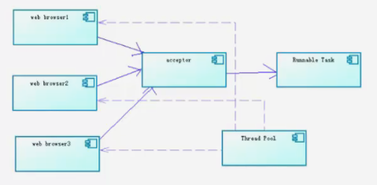

<!-- START doctoc generated TOC please keep comment here to allow auto update -->
<!-- DON'T EDIT THIS SECTION, INSTEAD RE-RUN doctoc TO UPDATE -->
**Table of Contents**  *generated with [DocToc](https://github.com/thlorenz/doctoc)*

- [Socket网络编程（基础篇）](#socket%e7%bd%91%e7%bb%9c%e7%bc%96%e7%a8%8b%e5%9f%ba%e7%a1%80%e7%af%87)
  - [目录](#%e7%9b%ae%e5%bd%95)
  - [1.1 基本概念](#11-%e5%9f%ba%e6%9c%ac%e6%a6%82%e5%bf%b5)
  - [1.2 传统的BIO编程](#12-%e4%bc%a0%e7%bb%9f%e7%9a%84bio%e7%bc%96%e7%a8%8b)
  - [1.3 伪异步IO（BIO2）](#13-%e4%bc%aa%e5%bc%82%e6%ad%a5iobio2)
  - [2.1 NIO编程介绍](#21-nio%e7%bc%96%e7%a8%8b%e4%bb%8b%e7%bb%8d)
  - [2.2 Buffer](#22-buffer)
  - [2.3 Channel](#23-channel)
  - [2.4 Selector](#24-selector)
  - [2.5 NIO作业要求](#25-nio%e4%bd%9c%e4%b8%9a%e8%a6%81%e6%b1%82)
  - [3.1 AIO](#31-aio)

<!-- END doctoc generated TOC please keep comment here to allow auto update -->

# Socket网络编程（基础篇）

## 目录

1、学习基本概念、传统的同步阻塞式I/O编程、伪异步IO实现。

2、学习基于NIO的同步非阻塞式编程。

3、了解基于NIO2.0的异步非阻塞（AIO）编程。

## 1.1 基本概念

Socket又称“套接字”，应用程序通常通过“套接字”向网络发出请求或者应答网络请求。

Socket和ServerSocket类库位于java.net包中。ServerSocket用于服务端，Socket是建立网络连接时使用的。在连接成功时，应用程序两端都会产生一个Socket实例，操作这个实例，完成所需的会话。对于一个网络连接来说，套接字是平等的，不因为在服务器端或客户端而产生不同级别。不管是Socket还是ServerSocket它们的工作都是通过SocketImpl类及子类完成的。

套接字之间的连接过程可以分为四个步骤：服务器监听，客户端请求服务器，服务器确认，客户端确认，进行通信。

- 服务器监听：是服务器端套接字并不定位具体的客户端套接字，而是处于等待连接的状态，实时监控网络状态。
- 客户端请求：是指客户端的套接字提出连接请求，要连接的目标是服务端的套接字。为此，客户端的套接字必须首先描述它要连接的服务的套接字，指出服务器端套接字的地址和端口号，然后就向服务器端套接字提出连接请求。
- 服务器端连接确认：是指当服务器端套接字监听到或都说客户端套接字的连接请求，它就响应客户端套接字的请求，建立一个新的线程，报服务器端套接字的描述发给客户端。
- 客户端连接确认：一旦客户端确认了此描述，连接就建立好了。双方开始进行通信。而服务器端套接字继续处于监听状态，继续接收其他客户端套接字的连接请求。

**IO(BIO)和NIO的区别**

其本质就是阻塞和非阻塞的区别。

阻塞概念：应用程序在获取网络数据的时候，如果网络传输数据很慢，那么程序就一直等着，直到传输完毕为止。

非阻塞概念：应用程序直接可以获取已经准备就绪好的数据，无需等待。

BIO为同步阻塞形式，NIO为同步非阻塞形式。NIO并没有实现异步，在JDK1.7之后，升级了NIO库包，支持异步非阻塞通信模型即NIO2.0(AIO)

**同步和异步**

同步和异步一般是面向操作系统与应用程序对IO操作的层面上来区别的。

同步时，应用程序会直接参与IO读写操作，并且我们的应用程序会直接阻塞到某个方法上，直到数据准备就绪，或者采用轮询的策略实时检查数据的就绪状态，如果就绪则获取数据。

异步时，则所有的IO读写操作交给操作系统处理，与我们的应用程序没有直接关系，我们程序不需要关心IO读写，当操作系统完成了IO读写操作时，会给我们应用程序发送通知，我们的应用程序直接拿走数据即可。

同步说的是你server服务器端的执行方式。

阻塞说的是具体的技术，接收数据的方式、状态（IO、NIO）

## 1.2 传统的BIO编程

网络编程的基本模型是Client/Server模型，也就是两个进程直接进行相互通信，其中服务器提供配置信息（绑定的IP地址和监听端口），客户端通过连接操作向服务器端监听的地址发起连接请求，通过三次握手建立连接，如果连接成功，则双方可以进行通信（网络套接字socket）。


**BIO示例**：

Client.java

```java
public class Client {
    final static String ADDRESS = "127.0.0.1";
    final static int PORT = 8765;
    
    public static void main(String[] args) {
        Socket socket = null;
        BufferedReader in = null;
        PrintWriter out = null;
        
        try {
            socket = new Socket(ADDRESS, PORT);
            in = new BufferedReader(new InputStreamReader(socket.getInputStream()));
            out = new PrintWriter(socket.getOutputStream(), true);
            
            //向服务器端发送数据
            out.println("接收到客户端的请求数据...");
            String response = in.readLine();
            System.out.println("Client: " + response);    
        } catch (Exception e) {
            e.printStackTrace();
        } finally {
            if(in != null){
                try {
                    in.close();
                } catch (IOException e) {
                    e.printStackTrace();
                }
            }
            if(out != null){
                try {
                    out.close();
                } catch (Exception e) {
                    e.printStackTrace();
                }
            }
            if(socket != null){
                try {
                    socket.close();
                } catch (IOException e) {
                    e.printStackTrace();
                }
            }
            socket = null;
        }
    }
}
```

Sever.java

```java
public class Server {
    final static int PROT = 8765;
    
    public static void main(String[] args) {
        ServerSocket server = null;
        try {
            server = new ServerSocket(PROT);
            System.out.println(" server start .. ");
            //进行阻塞
            Socket socket = server.accept();
            //新建一个线程执行客户端的任务
            new Thread(new ServerHandler(socket)).start();
        } catch (Exception e) {
            e.printStackTrace();
        } finally {
            if(server != null){
                try {
                    server.close();
                } catch (IOException e) {
                    e.printStackTrace();
                }
            }
            server = null;
        }
    }
}
```

ServerHandler.java

```java
public class ServerHandler implements Runnable{
    private Socket socket ;
    
    public ServerHandler(Socket socket){
        this.socket = socket;
    }
    
    @Override
    public void run() {
        BufferedReader in = null;
        PrintWriter out = null;
        try {
            in = new BufferedReader(new InputStreamReader(this.socket.getInputStream()));
            out = new PrintWriter(this.socket.getOutputStream(), true);
            String body = null;
            while(true){
                body = in.readLine();
                if(body == null) break;
                System.out.println("Server :" + body);
                out.println("服务器端回送响的应数据.");
            }
            
        } catch (Exception e) {
            e.printStackTrace();
        } finally {
            if(in != null){
                try {
                    in.close();
                } catch (IOException e) {
                    e.printStackTrace();
                }
            }
            if(out != null){
                try {
                    out.close();
                } catch (Exception e) {
                    e.printStackTrace();
                }
            }
            if(socket != null){
                try {
                    socket.close();
                } catch (IOException e) {
                    e.printStackTrace();
                }
            }
            socket = null;
        }
    }
}
```

## 1.3 伪异步IO（BIO2）

采用线程池和任务队列可以实现一种伪异步的IO通信框架。

我们学过连接池的使用和队列的使用，其实就是将客户端的socket封装成一个task任务（实现runnable接口的类）然后投递到线程池中去，配置相应的队列进行实现。



Client.java

```java
public class Client {
    final static String ADDRESS = "127.0.0.1";
    final static int PORT =8765;
    
    public static void main(String[] args) {
        Socket socket = null;
        BufferedReader in = null;
        PrintWriter out = null;
        try {
            socket = new Socket(ADDRESS, PORT);
            in = new BufferedReader(new InputStreamReader(socket.getInputStream()));
            out = new PrintWriter(socket.getOutputStream(), true);
            
            out.println("Client request");
            
            String response = in.readLine();
            System.out.println("Client:" + response);
            
            
        }  catch (Exception e) {
            // TODO Auto-generated catch block
            e.printStackTrace();
        } finally {
            if(in != null){
                try {
                    in.close();
                } catch (Exception e1) {
                    e1.printStackTrace();
                }
            }
            if(out != null){
                try {
                    out.close();
                } catch (Exception e2) {
                    e2.printStackTrace();
                }
            }
            if(socket != null){
                try {
                    socket.close();
                } catch (Exception e3) {
                    e3.printStackTrace();
                }
            }
            socket = null;                
        }    
    }
}
```

Server.java

```java
public class Server {
    final static int PORT = 8765;
    public static void main(String[] args) {
        ServerSocket server = null;
        BufferedReader in = null;
        PrintWriter out = null;
        try {
            server = new ServerSocket(PORT);
            System.out.println("server start");
            Socket socket = null;
            HandlerExecutorPool executorPool = new HandlerExecutorPool(50, 1000);
            while(true){
                socket = server.accept();
                executorPool.execute(new ServerHandler(socket));
            }
            
        } catch (Exception e) {
            e.printStackTrace();
        } finally {
            if(in != null){
                try {
                    in.close();
                } catch (Exception e1) {
                    e1.printStackTrace();
                }
            }
            if(out != null){
                try {
                    out.close();
                } catch (Exception e2) {
                    e2.printStackTrace();
                }
            }
            if(server != null){
                try {
                    server.close();
                } catch (Exception e3) {
                    e3.printStackTrace();
                }
            }
            server = null;                
        }
    }
}
```

HandlerExecutorPool.java

```java
public class HandlerExecutorPool {
    private ExecutorService executor;
    public HandlerExecutorPool(int maxPoolSize, int queueSize){
        this.executor = new ThreadPoolExecutor(
                Runtime.getRuntime().availableProcessors(),
                maxPoolSize, 
                120L, 
                TimeUnit.SECONDS,
                new ArrayBlockingQueue<Runnable>(queueSize));
    }
    
    public void execute(Runnable task){
        this.executor.execute(task);
    }
}
```

ServerHandler.java

```java
public class ServerHandler implements Runnable {
    private Socket socket;
    public ServerHandler (Socket socket){
        this.socket = socket;
    }
    
    @Override
    public void run() {
        BufferedReader in = null;
        PrintWriter out = null;
        try {
            in = new BufferedReader(new InputStreamReader(this.socket.getInputStream()));
            out = new PrintWriter(this.socket.getOutputStream(), true);
            String body = null;
            while(true){
                body = in.readLine();
                if(body == null) break;
                System.out.println("Server:" + body);
                out.println("Server response");
            }
        } catch (Exception e) {
            e.printStackTrace();
        } finally {
            if(in != null){
                try {
                    in.close();
                } catch (Exception e1) {
                    e1.printStackTrace();
                }
            }
            if(out != null){
                try {
                    out.close();
                } catch (Exception e2) {
                    e2.printStackTrace();
                }
            }
            if(socket != null){
                try {
                    socket.close();
                } catch (Exception e3) {
                    e3.printStackTrace();
                }
            }
            socket = null;            
        }    
    }
}
```

## 2.1 NIO编程介绍

在介绍NIO之前，称澄清一个概念，有的人叫NIO为new IO， 有的人把NIO叫做Non block IO， 这里我们是习惯说后者，即非阻塞IO。

学习NIO编程，我们首先要了解几个概念：

Buffer（缓冲区）、Channel（管道、通道）、Selector（选择器、多路复用器）


## 2.2 Buffer

Buffer是一个对象，它包含一些写入或者读取的数据，在NIO类库加入Buffer对象，体现了新库与原IO的一个重要的区别。在面向流的IO中，可以将数据直接写入或读取到stream对象中。在NIO库中，所有数据都是用缓冲区处理的（读写）。缓冲区实质上是一个数组，通常它是一个字节数组（ByteBuffer），也可以使用其他类型的数组。这个数组为缓冲区提供了数据的访问读写等操作属性，如位置、容量、上限等概念，参考API文档。

**Buffer类型**：我们最常用的就是ByteBuffer，实际上每一种Java基本类型都对应了一种缓冲区（除了Boolean类型）

- ByteBuffer
- CharBuffer
- ShortBuffer
- IntBuffer
- LongBuffer
- FloatBuffer
- DoubleBuffer

**基本操作**

```java
        //创建指定长度的缓冲区
        IntBuffer buf = IntBuffer.allocate(10);
        buf.put(13);// position位置：0 - > 1
        buf.put(21);// position位置：1 - > 2
        buf.put(35);// position位置：2 - > 3
        //把位置复位为0，也就是position位置：3 - > 0
        buf.flip();
        System.out.println("使用flip复位：" + buf);
        System.out.println("容量为: " + buf.capacity());    //容量一旦初始化后不允许改变（warp方法包裹数组除外）
        System.out.println("限制为: " + buf.limit());        //由于只装载了三个元素,所以可读取或者操作的元素为3 则limit=3
        
        
        System.out.println("获取下标为1的元素：" + buf.get(1));
        System.out.println("get(index)方法，position位置不改变：" + buf);
        buf.put(1, 4);
        System.out.println("put(index, change)方法，position位置不变：" + buf);;
        
        for (int i = 0; i < buf.limit(); i++) {
            //调用get方法会使其缓冲区位置（position）向后递增一位
            System.out.print(buf.get() + "\t");
        }
        System.out.println("buf对象遍历之后为: " + buf);
```

**wrap方法使用**

```java
        //  wrap方法会包裹一个数组: 一般这种用法不会先初始化缓存对象的长度，因为没有意义，最后还会被wrap所包裹的数组覆盖掉。 
        //  并且wrap方法修改缓冲区对象的时候，数组本身也会跟着发生变化。                     
        int[] arr = new int[]{1,2,5};
        IntBuffer buf1 = IntBuffer.wrap(arr);
        System.out.println(buf1);
        
        IntBuffer buf2 = IntBuffer.wrap(arr, 0 , 2);
        //这样使用表示容量为数组arr的长度，但是可操作的元素只有实际进入缓存区的元素长度
        System.out.println(buf2);
```

**其他方法**

```java
        IntBuffer buf1 = IntBuffer.allocate(10);
        int[] arr = new int[]{1,2,5};
        buf1.put(arr);
        System.out.println(buf1);
        //一种复制方法
        IntBuffer buf3 = buf1.duplicate();
        System.out.println(buf3);
        
        //设置buf1的位置属性
        //buf1.position(0);
        buf1.flip();
        System.out.println(buf1);
        
        System.out.println("可读数据为：" + buf1.remaining());
        
        int[] arr2 = new int[buf1.remaining()];
        //将缓冲区数据放入arr2数组中去
        buf1.get(arr2);
        for(int i : arr2){
            System.out.print(Integer.toString(i) + ",");
        }
```

## 2.3 Channel

通道（Channel），它就像自来水管道一样，网络数据通过Channel读取和写入，通道与流不同之处在于通道是双向的，而流只是一个方向上移动（一个流必须是InputStream或者OutputStream的子类），而通道可以用于读、写或者二者同时进行，最关键的是可以与多路复用器结合起来，有多种状态位，方便多路复用器去识别。事实上通道分为两大类：一类是网络读写的（SelectableChannel），一类用于文件操作的（FileChannel），我们使用的SocketChannel和ServerSocketChannel都是SelectableChannel的子类。

## 2.4 Selector

多路复用器（Selector），它是NIO编程的基础，非常重要。多路复用器提供选择已经就绪的任务的能力。

简单来说，就是Selector会不断地轮询注册在其上的通道（Channel），如果某个通道发生了读写操作，这个通道就处于就绪状态，会被Selector轮询出来，然后通过SelectionKey可以取得就绪的Channel集合，从而进行后续的IO操作。

一个多路复用器（Selector）可以负责成千上万Channel通道，没有上限，这也是JDK使用了epoll代替了传统的select实现，获得连接句柄没有限制。这也就意味着我们只要一个线程负责Selector的轮询，就可以接入成千上万个客户端，就是JDK NIO库的巨大进步。

Selector线程就类似一个管理都（Master）， 管理了成千上万个管道，然后轮询那个管道的数据已准备好，通知cpu执行IO的读取或写入操作。

**Selector模式**：当IO事件（管道）注册到选择器以后，Selector会分配每个管道一个key值，相当于标签。Selector选择器以轮询的方式进行查找注册的所有IO事件（管道），当我们的IO事件（管道）准备就绪后，Selector就会识别，会通过key值来找到相应的管道，进行相关的数据处理操作（从管道里读或写数据，写到我们的数据缓冲区中）。

每个管道都会对选择器进行注册不同的事件状态，以便选择器查找。

SelectionKey.OP_CONNECT

SelectionKey.OP_ACCEPT

SelectionKey.OP_READ

SelectionKey.OP_WRITE

**NIO示例**：

Client.java

```java
public class Client {
    //需要一个Selector 
    public static void main(String[] args) {
        //创建连接的地址
        InetSocketAddress address = new InetSocketAddress("127.0.0.1", 8765);
        
        //声明连接通道
        SocketChannel sc = null;
        
        //建立缓冲区
        ByteBuffer buf = ByteBuffer.allocate(1024);
        
        try {
            //打开通道
            sc = SocketChannel.open();
            //进行连接
            sc.connect(address);
            
            while(true){
                //定义一个字节数组，然后使用系统录入功能：
                byte[] bytes = new byte[1024];
                System.in.read(bytes);
                
                //把数据放到缓冲区中
                buf.put(bytes);
                //对缓冲区进行复位
                buf.flip();
                //写出数据
                sc.write(buf);
                //清空缓冲区数据
                buf.clear();
            }
        } catch (IOException e) {
            e.printStackTrace();
        } finally {
            if(sc != null){
                try {
                    sc.close();
                } catch (IOException e) {
                    e.printStackTrace();
                }
            }
        }
    }
}
```

Server.java

```java
public class Server implements Runnable{
    //1 多路复用器（管理所有的通道）
    private Selector seletor;
    //2 建立缓冲区
    private ByteBuffer readBuf = ByteBuffer.allocate(1024);
    //3 
    private ByteBuffer writeBuf = ByteBuffer.allocate(1024);
    public Server(int port){
        try {
            //1 打开路复用器
            this.seletor = Selector.open();
            //2 打开服务器通道
            ServerSocketChannel ssc = ServerSocketChannel.open();
            //3 设置服务器通道为非阻塞模式
            ssc.configureBlocking(false);
            //4 绑定地址
            ssc.bind(new InetSocketAddress(port));
            //5 把服务器通道注册到多路复用器上，并且监听阻塞事件
            ssc.register(this.seletor, SelectionKey.OP_ACCEPT);
            
            System.out.println("Server start, port :" + port);
            
        } catch (IOException e) {
            e.printStackTrace();
        }
    }

    @Override
    public void run() {
        while(true){
            try {
                //1 必须要让多路复用器开始监听
                this.seletor.select();
                //2 返回多路复用器已经选择的结果集
                Iterator<SelectionKey> keys = this.seletor.selectedKeys().iterator();
                //3 进行遍历
                while(keys.hasNext()){
                    //4 获取一个选择的元素
                    SelectionKey key = keys.next();
                    //5 直接从容器中移除就可以了
                    keys.remove();
                    //6 如果是有效的
                    if(key.isValid()){
                        //7 如果为阻塞状态
                        if(key.isAcceptable()){
                            this.accept(key);
                        }
                        //8 如果为可读状态
                        if(key.isReadable()){
                            this.read(key);
                        }
                        //9 写数据
                        if(key.isWritable()){
                            //this.write(key); //ssc
                        }
                    }
                    
                }
            } catch (IOException e) {
                e.printStackTrace();
            }
        }
    }
    
    private void write(SelectionKey key){
        //ServerSocketChannel ssc =  (ServerSocketChannel) key.channel();
        //ssc.register(this.seletor, SelectionKey.OP_WRITE);
    }

    private void read(SelectionKey key) {
        try {
            //1 清空缓冲区旧的数据
            this.readBuf.clear();
            //2 获取之前注册的socket通道对象
            SocketChannel sc = (SocketChannel) key.channel();
            //3 读取数据
            int count = sc.read(this.readBuf);
            //4 如果没有数据
            if(count == -1){
                key.channel().close();
                key.cancel();
                return;
            }
            //5 有数据则进行读取 读取之前需要进行复位方法(把position 和limit进行复位)
            this.readBuf.flip();
            //6 根据缓冲区的数据长度创建相应大小的byte数组，接收缓冲区的数据
            byte[] bytes = new byte[this.readBuf.remaining()];
            //7 接收缓冲区数据
            this.readBuf.get(bytes);
            //8 打印结果
            String body = new String(bytes).trim();
            System.out.println("Server : " + body);
            
            // 9..可以写回给客户端数据 
            
        } catch (IOException e) {
            e.printStackTrace();
        }
    }

    private void accept(SelectionKey key) {
        try {
            //1 获取服务通道
            ServerSocketChannel ssc =  (ServerSocketChannel) key.channel();
            //2 执行阻塞方法
            SocketChannel sc = ssc.accept();
            //3 设置阻塞模式
            sc.configureBlocking(false);
            //4 注册到多路复用器上，并设置读取标识
            sc.register(this.seletor, SelectionKey.OP_READ);
        } catch (IOException e) {
            e.printStackTrace();
        }
    }
    
    public static void main(String[] args) {
        new Thread(new Server(8765)).start();;
    }
}
```

## 2.5 NIO作业要求

作业1：实现客户端和服务器端的双向通信，（如客户端给服务器发一条数据，服务器收到并给客户端做出回应，最后客户端收到服务器响应，程序结束）

- 提示1：客户端和服务器端都需要自己的缓冲区（byteBuffer）。
- 提示2：客户端和服务器端都需要选择器，也就是说他们都可以进行读取和写出操作，（客户端也需要一个选择器不停的轮询注册在该选择器中的通道的状态，客户端也要实现runnable接口）
- 提示3：可以上网找一些资料把SelectionKey.OP_*这四种操作位的情况都用上，客户端和服务器端都分别有读写2个缓冲区，当读取完数据后，直接设置SelectionKey.OP_WRITE操作位，然后在多路复用器里判断，当前写缓冲区有数据的时候直接执行写操作。

作业2：要求详细写出BIO和NIO的区别，从BIO的缺点以及NIO的优点，减小了连接数量、抽象画出来通道、以及技术实现，如NIO采用Buffer、Channel、Selector等技术要详细说明。

作业3：把NIO服务端和客户端的通信流程（实现步骤）用思维导图记录笔记。

## 3.1 AIO

AIO编程，在NIO基础之上引入了异步通道的概念，并提供了异步文件和异步套接字通道的实现，从而在真正意义上实现异步非阻塞，之前我们学习的NIO只是非阻塞并非异步。而AIO它不需要通过多路复用器对注册的通道进行轮询操作即可实现异步读写，从而简化了NIO编程模型。也可以称之为NIO2.0，这种模式才真正属于我们异步非阻塞的模型。

- AsynchronousServerSocketChannel
- AsynchronousSocketChannel

Client.java

```java
public class Client implements Runnable{
    private AsynchronousSocketChannel asc ;
    
    public Client() throws Exception {
        asc = AsynchronousSocketChannel.open();
    }
    
    public void connect(){
        asc.connect(new InetSocketAddress("127.0.0.1", 8765));
    }
    
    public void write(String request){
        try {
            asc.write(ByteBuffer.wrap(request.getBytes())).get();
            read();
        } catch (Exception e) {
            e.printStackTrace();
        }
    }

    private void read() {
        ByteBuffer buf = ByteBuffer.allocate(1024);
        try {
            asc.read(buf).get();
            buf.flip();
            byte[] respByte = new byte[buf.remaining()];
            buf.get(respByte);
            System.out.println(new String(respByte,"utf-8").trim());
        } catch (InterruptedException e) {
            e.printStackTrace();
        } catch (ExecutionException e) {
            e.printStackTrace();
        } catch (UnsupportedEncodingException e) {
            e.printStackTrace();
        }
    }
    
    @Override
    public void run() {
        while(true){
            
        }
    }
    
    public static void main(String[] args) throws Exception {
        Client c1 = new Client();
        c1.connect();
        
        Client c2 = new Client();
        c2.connect();
        
        Client c3 = new Client();
        c3.connect();
        
        new Thread(c1, "c1").start();
        new Thread(c2, "c2").start();
        new Thread(c3, "c3").start();
        
        Thread.sleep(1000);
        
        c1.write("c1 aaa");
        c2.write("c2 bbbb");
        c3.write("c3 ccccc");
    }
}
```

Server.java

```java
public class Server {
    //线程池
    private ExecutorService executorService;
    //线程组
    private AsynchronousChannelGroup threadGroup;
    //服务器通道
    public AsynchronousServerSocketChannel assc;
    
    public Server(int port){
        try {
            //创建一个缓存池
            executorService = Executors.newCachedThreadPool();
            //创建线程组
            threadGroup = AsynchronousChannelGroup.withCachedThreadPool(executorService, 1);
            //创建服务器通道
            assc = AsynchronousServerSocketChannel.open(threadGroup);
            //进行绑定
            assc.bind(new InetSocketAddress(port));
            
            System.out.println("server start , port : " + port);
            //进行阻塞
            assc.accept(this, new ServerCompletionHandler());
            //一直阻塞 不让服务器停止
            Thread.sleep(Integer.MAX_VALUE);
            
        } catch (Exception e) {
            e.printStackTrace();
        }
    }
    
    public static void main(String[] args) {
        Server server = new Server(8765);
    }
}
```

ServerCompletionHandler.java

```java
public class ServerCompletionHandler implements CompletionHandler<AsynchronousSocketChannel, Server> {
    @Override
    public void completed(AsynchronousSocketChannel asc, Server attachment) {
        //当有下一个客户端接入的时候 直接调用Server的accept方法，这样反复执行下去，保证多个客户端都可以阻塞
        attachment.assc.accept(attachment, this);
        read(asc);
    }

    private void read(final AsynchronousSocketChannel asc) {
        //读取数据
        ByteBuffer buf = ByteBuffer.allocate(1024);
        asc.read(buf, buf, new CompletionHandler<Integer, ByteBuffer>() {
            @Override
            public void completed(Integer resultSize, ByteBuffer attachment) {
                //进行读取之后,重置标识位
                attachment.flip();
                //获得读取的字节数
                System.out.println("Server -> " + "收到客户端的数据长度为:" + resultSize);
                //获取读取的数据
                String resultData = new String(attachment.array()).trim();
                System.out.println("Server -> " + "收到客户端的数据信息为:" + resultData);
                String response = "服务器响应, 收到了客户端发来的数据: " + resultData;
                write(asc, response);
            }
            @Override
            public void failed(Throwable exc, ByteBuffer attachment) {
                exc.printStackTrace();
            }
        });
    }
    
    private void write(AsynchronousSocketChannel asc, String response) {
        try {
            ByteBuffer buf = ByteBuffer.allocate(1024);
            buf.put(response.getBytes());
            buf.flip();
            asc.write(buf).get();
        } catch (InterruptedException e) {
            e.printStackTrace();
        } catch (ExecutionException e) {
            e.printStackTrace();
        }
    }
    
    @Override
    public void failed(Throwable exc, Server attachment) {
        exc.printStackTrace();
    }
}
```

