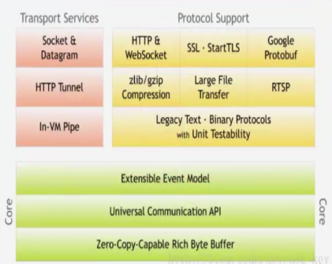

<!-- START doctoc generated TOC please keep comment here to allow auto update -->
<!-- DON'T EDIT THIS SECTION, INSTEAD RE-RUN doctoc TO UPDATE -->
**Table of Contents**  *generated with [DocToc](https://github.com/thlorenz/doctoc)*

- [Socket网络编程（二）](#socket%e7%bd%91%e7%bb%9c%e7%bc%96%e7%a8%8b%e4%ba%8c)
  - [目录](#%e7%9b%ae%e5%bd%95)
  - [1.1 为什么选择Netty](#11-%e4%b8%ba%e4%bb%80%e4%b9%88%e9%80%89%e6%8b%a9netty)
  - [1.2 Netty简介](#12-netty%e7%ae%80%e4%bb%8b)
  - [1.3 Netty架构组成](#13-netty%e6%9e%b6%e6%9e%84%e7%bb%84%e6%88%90)
  - [1.4 Netty的特性](#14-netty%e7%9a%84%e7%89%b9%e6%80%a7)
  - [2.1 Helloworld（一）](#21-helloworld%e4%b8%80)
  - [2.2 Helloworld（二）](#22-helloworld%e4%ba%8c)
  - [3.1 TCP粘包、拆包问题](#31-tcp%e7%b2%98%e5%8c%85%e6%8b%86%e5%8c%85%e9%97%ae%e9%a2%98)
  - [3.2 TCP粘包、拆包问题解决方案](#32-tcp%e7%b2%98%e5%8c%85%e6%8b%86%e5%8c%85%e9%97%ae%e9%a2%98%e8%a7%a3%e5%86%b3%e6%96%b9%e6%a1%88)
  - [3.3 Netty如何去解决粘包、拆包问题](#33-netty%e5%a6%82%e4%bd%95%e5%8e%bb%e8%a7%a3%e5%86%b3%e7%b2%98%e5%8c%85%e6%8b%86%e5%8c%85%e9%97%ae%e9%a2%98)
  - [4.1 Netty编解码技术](#41-netty%e7%bc%96%e8%a7%a3%e7%a0%81%e6%8a%80%e6%9c%af)
  - [4.2 Jboss Marshalling](#42-jboss-marshalling)
  - [5 Netty的UDP协议](#5-netty%e7%9a%84udp%e5%8d%8f%e8%ae%ae)
  - [6 Netty的WebSocket](#6-netty%e7%9a%84websocket)
  - [7.1 最佳实践（实际场景一，数据通信）](#71-%e6%9c%80%e4%bd%b3%e5%ae%9e%e8%b7%b5%e5%ae%9e%e9%99%85%e5%9c%ba%e6%99%af%e4%b8%80%e6%95%b0%e6%8d%ae%e9%80%9a%e4%bf%a1)
  - [7.2 最佳实践（实际场景二，心跳监控）](#72-%e6%9c%80%e4%bd%b3%e5%ae%9e%e8%b7%b5%e5%ae%9e%e9%99%85%e5%9c%ba%e6%99%af%e4%ba%8c%e5%bf%83%e8%b7%b3%e7%9b%91%e6%8e%a7)
  - [8.1 HTTP协议](#81-http%e5%8d%8f%e8%ae%ae)
  - [8.2 Netty HTTP文件服务端开发](#82-netty-http%e6%96%87%e4%bb%b6%e6%9c%8d%e5%8a%a1%e7%ab%af%e5%bc%80%e5%8f%91)

<!-- END doctoc generated TOC please keep comment here to allow auto update -->

# Socket网络编程（二）

## 目录

1、Netty初步

2、HelloWorld示例

3、Netty核心技术之（TCP拆包和粘包问题）

4、Netty核心技术之（编解码技术）

5、Netty的UDP实现

6、Netty的WebSocket实现

## 1.1 为什么选择Netty

我们已经了解了Socket通信/io/nio/aio编程，对于通信模型已经有了一个初步的认识。其实我们之前所学习的仅仅是一个模型，如果想把这些真正的用于实际工作中去，那么还需要不断的完善、扩展和优化。比如很经典的TCP读包写包问题，或者是数据接收的大小，实际的通信读取与应答的片逻辑等等一些细节问题需要我们认真的去思考，而这些我们都需要大量的时间和经历，以及丰富的经验。所以想学好socket通信不是件容易的事情，那么现在，我们就要学习一门新的技术Netty，我们为什么选择Netty，原因无他，简单！我们再也不必去编写复杂的代码逻辑去实现通信，我们再也不需要去考虑性能问题，不需要考虑编解码问题，半包读写问题等，这些强大的Netty已经帮我们实现好了，我们只需要使用即可。

Netty是最流行的NIO框架，他的健壮性、功能、性能、可定制性和可扩展性在同类框架都是首屈一指的。它已经得到成百上千的商业/商用项目验证，如Hadoop的RPC框架Avro、以及我们之后学习的JMS框架，强大的RocketMQ、还有主流的分布式通信框架Dubbo等等。

## 1.2 Netty简介

Netty是基于NIO的网络应用框架。

Netty是一个NIO client-server（客户端服务器框架），使用Netty可以快速开发网络应用，例如服务器和客户端协议。Netty提供了一种新的方式来使开发网络应用程序，这种新的方式使得它很容易使用和有很强的扩展性。Netty的内部实现是很复杂的，但是Netty提供了简单易用的API从网络处理代码中解耦业务逻辑。Netty是完全基于NIO实现的，所以整个Netty都是异步的。

网络应用程序通常需要有较高的可扩展性，无论是Netty还是其他基于Java NIO的框架，都会提供可扩展性的解决方案。Netty中一个关键组成部分是它的异步特性，本章将讨论同步（阻塞）和异步（非阻塞）的IO来说明为什么使用异步代码来解决扩展性问题以及如何使用异步。

## 1.3 Netty架构组成



## 1.4 Netty的特性

| Development Area        | Netty Features                                               |
| ----------------------- | ------------------------------------------------------------ |
| Design（设计）          | 各种传输类型，阻塞和非阻塞套接字统一的API，使用灵活简单但功能强大的线程模型无连接的DatagramSocket，支持链逻辑，易于重用。 |
| Ease of Use（易于使用） | 提供了大量的文档和例子除了依赖jdk1.6+，没有额外的依赖关系，某些功能依赖jdk1.7+，其他特性可能有相关依赖，但都是可选的。 |
| Performance（性能）     | 比Java APIS更好的吞吐量和更低的延迟，因为线程池和重用所有消耗较少的资源，尽量减少不必要的内存拷贝。 |
| Robustness（鲁棒性）    | 鲁棒性，可以理解为健壮性，链接快或慢或超载不会导致更多的OutOfMemoryError，在调整的网络程序中不会有不公平的 read/write |
| Security（安全性）      | 完整的SSL/TLS和Start TLS，支持可以在如Applet或OSGI这些受限制的环境中运行。 |
| Community（社区性）     | 版本发布频繁，社区活跃                                       |

## 2.1 Helloworld（一）

有学习Netty之前，我们先回顾下NIO通信步骤：

1、创建ServerSocketChannel，为它配置非阻塞模式。

2、绑定监听，配置TCP参数，录入backlog大小等。

3、创建一个独立的IO线程，用于轮询多路复用器Selector。

4、创建Selector，将之前创建的ServerSocketChannel注册到Selector上，并设置监听标识位SelectionKey.ACCEPT。

5、启动IO线程，在循环体中执行Selector.select()方法，轮询就绪的通道。

6、当轮询到处于就绪的通道时，需要进行判断操作位，如果是ACCEPT状态，说明是新的客户端接入，则调用accept方法接受新的客户端。

7、设置新接入客户端的一些参数，如非阻塞、并将通道继续注册到Selector之中，设置监听标识位等。

8、如果轮询的通道操作位是READ，则进行读取，构造Buffer对象等。

9、更细节的还有数据没发送完成继续发送的问题...

ok，一个简单的NIO服务端程序，就是如此的复制，下面我们看看Netty完成这件事情

需要几个步骤。

## 2.2 Helloworld（二）

- 安装JDK7

下载地址：http://www.oracle.com/technetwork/java/javase/archive-139210.html

- 下载Netty包

下载地址：http://netty.io

**Netty实现通信的步骤：**

1、创建两个线程组，一个专门用于网络事件处理（接受客户端的连接），另一个则进行网络通信读写。

2、创建一个ServerBootstrap对象，配置Netty的一系列参数，例如接受传出数据的缓存大小等等。

3、创建一个实际处理数据的类ChannelInitialize，进行初始化的准备工作，比如设置接受传出数据的字符集、格式、已经实际处理数据的接口。

4、绑定端口，执行同步阻塞方法等待服务器端启动即可。

如此简单的四个步骤，我们的服务器就编写完成了，几十行代码就可以把它完成的健壮、性能稳定，这在我们之前NIO学习的时候是不可能的。

解读Netty示例：http://ifeve.com/netty5-user-guide/

Server.java

```java
public class Server {
    public static void main(String[] args) throws Exception {
        //1 创建线两个程组 
        //一个是用于处理服务器端接收客户端连接的
        //一个是进行网络通信的（网络读写的）
        EventLoopGroup pGroup = new NioEventLoopGroup();
        EventLoopGroup cGroup = new NioEventLoopGroup();
        
        //2 创建辅助工具类，用于服务器通道的一系列配置
        ServerBootstrap b = new ServerBootstrap();
        b.group(pGroup, cGroup)        //绑定俩个线程组
        .channel(NioServerSocketChannel.class)        //指定NIO的模式
        .option(ChannelOption.SO_BACKLOG, 1024)        //设置tcp缓冲区
        .option(ChannelOption.SO_SNDBUF, 32*1024)    //设置发送缓冲大小
        .option(ChannelOption.SO_RCVBUF, 32*1024)    //这是接收缓冲大小
        .option(ChannelOption.SO_KEEPALIVE, true)    //保持连接
        .childHandler(new ChannelInitializer<SocketChannel>() {
            @Override
            protected void initChannel(SocketChannel sc) throws Exception {
                //3 在这里配置具体数据接收方法的处理
                sc.pipeline().addLast(new ServerHandler());
            }
        });
        
        //4 进行绑定 
        ChannelFuture cf1 = b.bind(8765).sync();
        //ChannelFuture cf2 = b.bind(8764).sync();
        //5 等待关闭
        cf1.channel().closeFuture().sync();
        //cf2.channel().closeFuture().sync();
        pGroup.shutdownGracefully();
        cGroup.shutdownGracefully();
    }
}
```

ServerHandler.java

```java
public class ServerHandler extends ChannelHandlerAdapter {
    @Override
    public void channelActive(ChannelHandlerContext ctx) throws Exception {
        System.out.println("server channel active... ");
    }

    @Override
    public void channelRead(ChannelHandlerContext ctx, Object msg)
            throws Exception {
            ByteBuf buf = (ByteBuf) msg;
            byte[] req = new byte[buf.readableBytes()];
            buf.readBytes(req);
            String body = new String(req, "utf-8");
            System.out.println("Server :" + body );
            String response = "进行返回给客户端的响应：" + body ;
            ctx.writeAndFlush(Unpooled.copiedBuffer(response.getBytes()));
            //.addListener(ChannelFutureListener.CLOSE);
    }

    @Override
    public void channelReadComplete(ChannelHandlerContext ctx)
            throws Exception {
        System.out.println("读完了");
        ctx.flush();
    }

    @Override
    public void exceptionCaught(ChannelHandlerContext ctx, Throwable t)
            throws Exception {
        ctx.close();
    }
}
```

Client.java

```java
public class Client {
    public static void main(String[] args) throws Exception{
        EventLoopGroup group = new NioEventLoopGroup();
        Bootstrap b = new Bootstrap();
        b.group(group)
        .channel(NioSocketChannel.class)
        .handler(new ChannelInitializer<SocketChannel>() {
            @Override
            protected void initChannel(SocketChannel sc) throws Exception {
                sc.pipeline().addLast(new ClientHandler());
            }
        });
        
        ChannelFuture cf1 = b.connect("127.0.0.1", 8765).sync();
        //ChannelFuture cf2 = b.connect("127.0.0.1", 8764).sync();
        //发送消息
        Thread.sleep(1000);
        cf1.channel().writeAndFlush(Unpooled.copiedBuffer("777".getBytes()));
        cf1.channel().writeAndFlush(Unpooled.copiedBuffer("666".getBytes()));
        //cf2.channel().writeAndFlush(Unpooled.copiedBuffer("888".getBytes()));
        Thread.sleep(2000);
        cf1.channel().writeAndFlush(Unpooled.copiedBuffer("888".getBytes()));
        //cf2.channel().writeAndFlush(Unpooled.copiedBuffer("666".getBytes()));
        
        cf1.channel().closeFuture().sync();
        //cf2.channel().closeFuture().sync();
        group.shutdownGracefully();
    }
}
```

ClientHandler.java

```java
public class ClientHandler extends ChannelHandlerAdapter{
    @Override
    public void channelActive(ChannelHandlerContext ctx) throws Exception {
    }

    @Override
    public void channelRead(ChannelHandlerContext ctx, Object msg) throws Exception {
        try {
            ByteBuf buf = (ByteBuf) msg;
            
            byte[] req = new byte[buf.readableBytes()];
            buf.readBytes(req);
            
            String body = new String(req, "utf-8");
            System.out.println("Client :" + body );
            String response = "收到服务器端的返回信息：" + body;
        } finally {
            ReferenceCountUtil.release(msg);
        }
    }

    @Override
    public void channelReadComplete(ChannelHandlerContext ctx) throws Exception {

    }

    @Override
    public void exceptionCaught(ChannelHandlerContext ctx, Throwable cause)
            throws Exception {
        ctx.close();
    }
}
```

## 3.1 TCP粘包、拆包问题

熟悉TCP编程的可能都知道，无论是服务器还是客户端，当我们读取或者发送数据的时候，都需要考虑TCP底层的粘包/拆包机制。

TCP是一个“流”协议，所谓流就是没有界限的遗传数据。大家可以想象下如果河里的水就好比数据，他们是连成一片的，没有分界线，TCP底层并不了解上层的业务数据具体的含义，它根据TCP缓冲区的实际情况进行包的划分，也就是说，在业务上，我们一个完整的包可能会被TCP分成多个包进行发送，也可能把多个小包封装成一个大的数据包发送出去，这就是所谓TCP粘包、拆包问题。

分析TCP粘包、拆包问题的产生原因：

1、应用程序write写入的字节大小大于套接字发送缓冲区的大小。

2、进行MSS大小的TCP分段。

3、以太网帧payload大于MTU进行IP分片。

## 3.2 TCP粘包、拆包问题解决方案

粘包拆包问题的解决方案，根据业界主流协议，有三种方案：

1、消息定长，例如第报文的大小固定为200个字节，如果不够，空位补空格

2、在包尾部增加特殊字符进行分割，例如加回车等

3、讲消息分为消息头和消息体，在消息头中包含表格消息总长度的字段，然后进行业务逻辑的处理。

## 3.3 Netty如何去解决粘包、拆包问题

**1、分隔符类DelimiterBasedFrameDecoder（自定义分隔符）**

Client.java

```java
public class Client {

    public static void main(String[] args) throws Exception {
        
        EventLoopGroup group = new NioEventLoopGroup();
        
        Bootstrap b = new Bootstrap();
        b.group(group)
         .channel(NioSocketChannel.class)
         .handler(new ChannelInitializer<SocketChannel>() {
            @Override
            protected void initChannel(SocketChannel sc) throws Exception {
                ByteBuf buf = Unpooled.copiedBuffer("$_".getBytes());
                sc.pipeline().addLast(new DelimiterBasedFrameDecoder(1024, buf));
                sc.pipeline().addLast(new StringDecoder());
                sc.pipeline().addLast(new ClientHandler());
            }
        });
        
        ChannelFuture cf = b.connect("127.0.0.1", 8765).sync();
        
        cf.channel().writeAndFlush(Unpooled.wrappedBuffer("bbbb$_".getBytes()));
        cf.channel().writeAndFlush(Unpooled.wrappedBuffer("cccc$_".getBytes()));
        
        
        //等待客户端端口关闭
        cf.channel().closeFuture().sync();
        group.shutdownGracefully();
        
    }
}
```

ClientHandler.java

```java
public class ClientHandler extends ChannelHandlerAdapter{

    @Override
    public void channelActive(ChannelHandlerContext ctx) throws Exception {
        System.out.println("client channel active... ");
    }

    @Override
    public void channelRead(ChannelHandlerContext ctx, Object msg) throws Exception {
        try {
            String response = (String)msg;
            System.out.println("Client: " + response);
        } finally {
            ReferenceCountUtil.release(msg);
        }
    }

    @Override
    public void channelReadComplete(ChannelHandlerContext ctx) throws Exception {
    }

    @Override
    public void exceptionCaught(ChannelHandlerContext ctx, Throwable cause) throws Exception {
        ctx.close();
    }

}
```

Server.java

```java
public class Server {
    public static void main(String[] args) throws Exception{
        //1 创建2个线程，一个是负责接收客户端的连接。一个是负责进行数据传输的
        EventLoopGroup pGroup = new NioEventLoopGroup();
        EventLoopGroup cGroup = new NioEventLoopGroup();
        
        //2 创建服务器辅助类
        ServerBootstrap b = new ServerBootstrap();
        b.group(pGroup, cGroup)
         .channel(NioServerSocketChannel.class)
         .option(ChannelOption.SO_BACKLOG, 1024)
         .option(ChannelOption.SO_SNDBUF, 32*1024)
         .option(ChannelOption.SO_RCVBUF, 32*1024)
         .childHandler(new ChannelInitializer<SocketChannel>() {
            @Override
            protected void initChannel(SocketChannel sc) throws Exception {
                //设置特殊分隔符
                ByteBuf buf = Unpooled.copiedBuffer("$_".getBytes());
                sc.pipeline().addLast(new DelimiterBasedFrameDecoder(1024, buf));
                //设置字符串形式的解码
                sc.pipeline().addLast(new StringDecoder());
                sc.pipeline().addLast(new ServerHandler());
            }
        });
        
        //4 绑定连接
        ChannelFuture cf = b.bind(8765).sync();
        
        //等待服务器监听端口关闭
        cf.channel().closeFuture().sync();
        pGroup.shutdownGracefully();
        cGroup.shutdownGracefully();
    }
}
```

ServerHandler.java

```java
public class ServerHandler extends ChannelHandlerAdapter {
    @Override
    public void channelActive(ChannelHandlerContext ctx) throws Exception {
        System.out.println(" server channel active... ");
    }

    @Override
    public void channelRead(ChannelHandlerContext ctx, Object msg) throws Exception {
        String request = (String)msg;
        System.out.println("Server :" + msg);
        String response = "服务器响应：" + msg + "$_";
        ctx.writeAndFlush(Unpooled.copiedBuffer(response.getBytes()));
    }

    @Override
    public void channelReadComplete(ChannelHandlerContext ctx) throws Exception {
        
    }

    @Override
    public void exceptionCaught(ChannelHandlerContext ctx, Throwable t) throws Exception {
        ctx.close();
    }
}
```

**2、FixedLengthFrameDecoder（定长）**

Client.java

```java
public class Client {

    public static void main(String[] args) throws Exception {
        
        EventLoopGroup group = new NioEventLoopGroup();
        
        Bootstrap b = new Bootstrap();
        b.group(group)
         .channel(NioSocketChannel.class)
         .handler(new ChannelInitializer<SocketChannel>() {
            @Override
            protected void initChannel(SocketChannel sc) throws Exception {
                sc.pipeline().addLast(new FixedLengthFrameDecoder(5));
                sc.pipeline().addLast(new StringDecoder());
                sc.pipeline().addLast(new ClientHandler());
            }
        });
        
        ChannelFuture cf = b.connect("127.0.0.1", 8765).sync();
        
        cf.channel().writeAndFlush(Unpooled.wrappedBuffer("aaaaabbbbb".getBytes()));
        cf.channel().writeAndFlush(Unpooled.copiedBuffer("ccccccc".getBytes()));
        
        //等待客户端端口关闭
        cf.channel().closeFuture().sync();
        group.shutdownGracefully();
        
    }
}
```

ClientHandler.java

```java
public class ClientHandler extends ChannelHandlerAdapter{

    @Override
    public void channelActive(ChannelHandlerContext ctx) throws Exception {
        System.out.println("client channel active... ");
    }

    @Override
    public void channelRead(ChannelHandlerContext ctx, Object msg) throws Exception {
        String response = (String)msg;
        System.out.println("Client: " + response);
    }

    @Override
    public void channelReadComplete(ChannelHandlerContext ctx) throws Exception {
    }

    @Override
    public void exceptionCaught(ChannelHandlerContext ctx, Throwable cause) throws Exception {
    }

}
```

Server.java

```java
public class Server {
    public static void main(String[] args) throws Exception{
        //1 创建2个线程，一个是负责接收客户端的连接。一个是负责进行数据传输的
        EventLoopGroup pGroup = new NioEventLoopGroup();
        EventLoopGroup cGroup = new NioEventLoopGroup();
        
        //2 创建服务器辅助类
        ServerBootstrap b = new ServerBootstrap();
        b.group(pGroup, cGroup)
         .channel(NioServerSocketChannel.class)
         .option(ChannelOption.SO_BACKLOG, 1024)
         .option(ChannelOption.SO_SNDBUF, 32*1024)
         .option(ChannelOption.SO_RCVBUF, 32*1024)
         .childHandler(new ChannelInitializer<SocketChannel>() {
            @Override
            protected void initChannel(SocketChannel sc) throws Exception {
                //设置定长字符串接收
                sc.pipeline().addLast(new FixedLengthFrameDecoder(5));
                //设置字符串形式的解码
                sc.pipeline().addLast(new StringDecoder());
                sc.pipeline().addLast(new ServerHandler());
            }
        });
        
        //4 绑定连接
        ChannelFuture cf = b.bind(8765).sync();
        
        //等待服务器监听端口关闭
        cf.channel().closeFuture().sync();
        pGroup.shutdownGracefully();
        cGroup.shutdownGracefully();
    }
}
```

ServerHandler.java

```java
public class ServerHandler extends ChannelHandlerAdapter {
    @Override
    public void channelActive(ChannelHandlerContext ctx) throws Exception {
        System.out.println(" server channel active... ");
    }

    @Override
    public void channelRead(ChannelHandlerContext ctx, Object msg) throws Exception {
        String request = (String)msg;
        System.out.println("Server :" + msg);
        String response =  request ;
        ctx.writeAndFlush(Unpooled.copiedBuffer(response.getBytes()));
    }

    @Override
    public void channelReadComplete(ChannelHandlerContext ctx) throws Exception {
        
    }

    @Override
    public void exceptionCaught(ChannelHandlerContext ctx, Throwable t) throws Exception {

    }
}
```

## 4.1 Netty编解码技术

编解码技术，说白了就是Java序列化技术，序列化目的就两个，第一进行网络传输，第二对象持久化。

虽然我们可以使用Java进行对象序列化，netty去传输，但是Java序列化的硬伤太多，比如Java序列化没法跨语言、序列化后码流太大，序列化性能太低等等

**主流的编解码框架：**

Jboss的Marshalling包

Google的Protobuf

基于Protobuf的Kyro

MessagePack框架

## 4.2 Jboss Marshalling

Jboss Marshalling 是一个java对象序列化包，对JDK默认的序列化框架进行了优化，但又保持跟java.io.Serializable接口的兼容，同时增加了一些可调的参数和附加特性。

类库：

jboss-marshalling-1.3.0、jboss-marshalling-serial-1.3.0

下载地址：

https://www.jboss.org/jbossmarshalling/downloads

Jboss Marshalling与Netty结合后进行序列化对象的代码编写非常简单，我们一起来看下。

Server.java

```java
public class Server {
    public static void main(String[] args) throws Exception{
        EventLoopGroup pGroup = new NioEventLoopGroup();
        EventLoopGroup cGroup = new NioEventLoopGroup();
        
        ServerBootstrap b = new ServerBootstrap();
        b.group(pGroup, cGroup)
         .channel(NioServerSocketChannel.class)
         .option(ChannelOption.SO_BACKLOG, 1024)
         //设置日志
         .handler(new LoggingHandler(LogLevel.INFO))
         .childHandler(new ChannelInitializer<SocketChannel>() {
            protected void initChannel(SocketChannel sc) throws Exception {
                sc.pipeline().addLast(MarshallingCodeCFactory.buildMarshallingDecoder());
                sc.pipeline().addLast(MarshallingCodeCFactory.buildMarshallingEncoder());
                sc.pipeline().addLast(new ServerHandler());
            }
        });
        
        ChannelFuture cf = b.bind(8765).sync();
        
        cf.channel().closeFuture().sync();
        pGroup.shutdownGracefully();
        cGroup.shutdownGracefully();
    }
}
```

ServerHandler.java

```java
public class ServerHandler extends ChannelHandlerAdapter{
    @Override
    public void channelActive(ChannelHandlerContext ctx) throws Exception {

    }

    @Override
    public void channelRead(ChannelHandlerContext ctx, Object msg) throws Exception {
        Req req = (Req)msg;
        System.out.println("Server : " + req.getId() + ", " + req.getName() + ", " + req.getRequestMessage());
        byte[] attachment = GzipUtils.ungzip(req.getAttachment());
        
        String path = System.getProperty("user.dir") + File.separatorChar + "receive" +  File.separatorChar + "001.jpg";
        FileOutputStream fos = new FileOutputStream(path);
        fos.write(attachment);
        fos.close();
        
        Resp resp = new Resp();
        resp.setId(req.getId());
        resp.setName("resp" + req.getId());
        resp.setResponseMessage("响应内容" + req.getId());
        ctx.writeAndFlush(resp);//.addListener(ChannelFutureListener.CLOSE);
    }

    @Override
    public void channelReadComplete(ChannelHandlerContext ctx) throws Exception {
        
    }

    @Override
    public void exceptionCaught(ChannelHandlerContext ctx, Throwable cause) throws Exception {
        ctx.close();
    }
}
```

Client.java

```java
public class Client {
    public static void main(String[] args) throws Exception{
        EventLoopGroup group = new NioEventLoopGroup();
        Bootstrap b = new Bootstrap();
        b.group(group)
         .channel(NioSocketChannel.class)
         .handler(new ChannelInitializer<SocketChannel>() {
            @Override
            protected void initChannel(SocketChannel sc) throws Exception {
                sc.pipeline().addLast(MarshallingCodeCFactory.buildMarshallingDecoder());
                sc.pipeline().addLast(MarshallingCodeCFactory.buildMarshallingEncoder());
                sc.pipeline().addLast(new ClientHandler());
            }
        });
        
        ChannelFuture cf = b.connect("127.0.0.1", 8765).sync();
        
        for(int i = 0; i < 5; i++ ){
            Req req = new Req();
            req.setId("" + i);
            req.setName("pro" + i);
            req.setRequestMessage("数据信息" + i);    
            String path = System.getProperty("user.dir") + File.separatorChar + "sources" +  File.separatorChar + "001.jpg";
            File file = new File(path);
            FileInputStream in = new FileInputStream(file);  
            byte[] data = new byte[in.available()];  
            in.read(data);  
            in.close(); 
            req.setAttachment(GzipUtils.gzip(data));
            cf.channel().writeAndFlush(req);
        }

        cf.channel().closeFuture().sync();
        group.shutdownGracefully();
    }
}
```

ClientHandler.java

```java
public class ClientHandler extends ChannelHandlerAdapter{
    @Override
    public void channelActive(ChannelHandlerContext ctx) throws Exception {
    }

    @Override
    public void channelRead(ChannelHandlerContext ctx, Object msg) throws Exception {
        try {
            Resp resp = (Resp)msg;
            System.out.println("Client : " + resp.getId() + ", " + resp.getName() + ", " + resp.getResponseMessage());            
        } finally {
            ReferenceCountUtil.release(msg);
        }
    }

    @Override
    public void channelReadComplete(ChannelHandlerContext ctx) throws Exception {
    }

    @Override
    public void exceptionCaught(ChannelHandlerContext ctx, Throwable cause) throws Exception {
        ctx.close();
    }
}
```

other

```java
/**
 * Marshalling工厂
 */
public final class MarshallingCodeCFactory {
    /**
     * 创建Jboss Marshalling解码器MarshallingDecoder
     * @return MarshallingDecoder
     */
    public static MarshallingDecoder buildMarshallingDecoder() {
        //首先通过Marshalling工具类的精通方法获取Marshalling实例对象 参数serial标识创建的是java序列化工厂对象。
        final MarshallerFactory marshallerFactory = Marshalling.getProvidedMarshallerFactory("serial");
        //创建了MarshallingConfiguration对象，配置了版本号为5 
        final MarshallingConfiguration configuration = new MarshallingConfiguration();
        configuration.setVersion(5);
        //根据marshallerFactory和configuration创建provider
        UnmarshallerProvider provider = new DefaultUnmarshallerProvider(marshallerFactory, configuration);
        //构建Netty的MarshallingDecoder对象，俩个参数分别为provider和单个消息序列化后的最大长度
        MarshallingDecoder decoder = new MarshallingDecoder(provider, 1024 * 1024 * 1);
        return decoder;
    }

    /**
     * 创建Jboss Marshalling编码器MarshallingEncoder
     * @return MarshallingEncoder
     */
    public static MarshallingEncoder buildMarshallingEncoder() {
        final MarshallerFactory marshallerFactory = Marshalling.getProvidedMarshallerFactory("serial");
        final MarshallingConfiguration configuration = new MarshallingConfiguration();
        configuration.setVersion(5);
        MarshallerProvider provider = new DefaultMarshallerProvider(marshallerFactory, configuration);
        //构建Netty的MarshallingEncoder对象，MarshallingEncoder用于实现序列化接口的POJO对象序列化为二进制数组
        MarshallingEncoder encoder = new MarshallingEncoder(provider);
        return encoder;
    }
}

public class Req implements Serializable{
    private static final long  SerialVersionUID = 1L;
    private String id ;
    private String name ;
    private String requestMessage ;
    private byte[] attachment;
    
    public String getId() {
        return id;
    }
    public void setId(String id) {
        this.id = id;
    }
    public String getName() {
        return name;
    }
    public void setName(String name) {
        this.name = name;
    }
    public String getRequestMessage() {
        return requestMessage;
    }
    public void setRequestMessage(String requestMessage) {
        this.requestMessage = requestMessage;
    }
    public byte[] getAttachment() {
        return attachment;
    }
    public void setAttachment(byte[] attachment) {
        this.attachment = attachment;
    }
}

public class Resp implements Serializable{
    private static final long serialVersionUID = 1L;
    private String id;
    private String name;
    private String responseMessage;
    
    public String getId() {
        return id;
    }
    public void setId(String id) {
        this.id = id;
    }
    public String getName() {
        return name;
    }
    public void setName(String name) {
        this.name = name;
    }
    public String getResponseMessage() {
        return responseMessage;
    }
    public void setResponseMessage(String responseMessage) {
        this.responseMessage = responseMessage;
    }
}
```

GzipUtils.java

```java
public class GzipUtils {
    public static byte[] gzip(byte[] data) throws Exception{
        ByteArrayOutputStream bos = new ByteArrayOutputStream();
        GZIPOutputStream gzip = new GZIPOutputStream(bos);
        gzip.write(data);
        gzip.finish();
        gzip.close();
        byte[] ret = bos.toByteArray();
        bos.close();
        return ret;
    }
    
    public static byte[] ungzip(byte[] data) throws Exception{
        ByteArrayInputStream bis = new ByteArrayInputStream(data);
        GZIPInputStream gzip = new GZIPInputStream(bis);
        byte[] buf = new byte[1024];
        int num = -1;
        ByteArrayOutputStream bos = new ByteArrayOutputStream();
        while((num = gzip.read(buf, 0 , buf.length)) != -1 ){
            bos.write(buf, 0, num);
        }
        gzip.close();
        bis.close();
        byte[] ret = bos.toByteArray();
        bos.flush();
        bos.close();
        return ret;
    }
}
```

## 5 Netty的UDP协议

UDP是User Datagram Protocol的简称，中文名是用户数据报协议，是OSI（Open System Interconnection，开放式系统互联）参考模型中一种无连接的传输层协议，提供面向事务的简单不可靠信息传送服务。

UDP协议全称是用户数据报协议[1]，在网络中它与TCP协议一样用于处理数据包，是一种无连接的协议。在OSI模型中，在第四层--传输层，处理IP协议的上一层。UDP有不提供数据包分组、组装和不能对数据包进行排序的缺点，也就是说，当报文发送之后，是无法得知其是否安全完整到达的。

UDP用来支持那么需要在计算机之间传输数据的网络应用。包括网络视频会议系统在内的众多的客户/服务器模式的网络应用都需要使用UDP协议。UDP协议从问世至今已经被使用了很多年，虽然其最初的光彩已经被一些类似协议所掩盖，但是即使是今天UDP仍然不失为一项非常实用和可行的网络传输层协议。

Server.java

```java
public class Server {
    public void run(int port) throws Exception {
        EventLoopGroup group = new NioEventLoopGroup();
        try {
            Bootstrap b = new Bootstrap();
            b.group(group).channel(NioDatagramChannel.class)
                .option(ChannelOption.SO_BROADCAST, true)
                .handler(new ServerHandler());
            b.bind(port).sync().channel().closeFuture().await();
        } finally {
            group.shutdownGracefully();
        }
    }

    public static void main(String[] args) throws Exception {
        new Server().run(8765);
        new Server().run(8764);
    }
}
```

ServerHandler.java

```java
public class ServerHandler extends
    SimpleChannelInboundHandler<DatagramPacket> {

    // 谚语列表
    private static final String[] DICTIONARY = { 
        "只要功夫深，铁棒磨成针。",
        "旧时王谢堂前燕，飞入寻常百姓家。", 
        "洛阳亲友如相问，一片冰心在玉壶。",
        "一寸光阴一寸金，寸金难买寸光阴。",
        "老骥伏枥，志在千里。烈士暮年，壮心不已!"
    };

    private String nextQuote() {
        int quoteId = ThreadLocalRandom.current().nextInt(DICTIONARY.length);
        return DICTIONARY[quoteId];
    }

    @Override
    public void messageReceived(ChannelHandlerContext ctx, DatagramPacket packet)
        throws Exception {
        String req = packet.content().toString(CharsetUtil.UTF_8);
        System.out.println(req);
        if ("谚语字典查询?".equals(req)) {
            ctx.writeAndFlush(
                    new DatagramPacket(Unpooled.copiedBuffer("谚语查询结果: " + nextQuote(),
                    CharsetUtil.UTF_8), packet.sender()));
        }
    }

    @Override
    public void exceptionCaught(ChannelHandlerContext ctx, Throwable cause)
        throws Exception {
        ctx.close();
        cause.printStackTrace();
    }
}
```

Client.java

```java
public class Client {
    public void run(int port) throws Exception {
        EventLoopGroup group = new NioEventLoopGroup();
        try {
            Bootstrap b = new Bootstrap();
            b.group(group).channel(NioDatagramChannel.class)
                .option(ChannelOption.SO_BROADCAST, true)
                .handler(new ClientHandler());
            Channel ch = b.bind(0).sync().channel();
            // 向网段内的所有机器广播UDP消息
            ch.writeAndFlush(new DatagramPacket(Unpooled.copiedBuffer("谚语字典查询?", CharsetUtil.UTF_8), 
                    new InetSocketAddress("255.255.255.255", port))).sync();
            if (!ch.closeFuture().await(15000)) {
                System.out.println("查询超时!");
            }
        } finally {
            group.shutdownGracefully();
        }
    }

    public static void main(String[] args) throws Exception {
        new Client().run(8765);
    }
}
```

ClientHandler.java

```java
public class ClientHandler extends SimpleChannelInboundHandler<DatagramPacket> {

    @Override
    public void messageReceived(ChannelHandlerContext ctx, DatagramPacket msg)
        throws Exception {
        String response = msg.content().toString(CharsetUtil.UTF_8);
        if (response.startsWith("谚语查询结果: ")) {
            System.out.println(response);
            ctx.close();
        }
    }

    @Override
    public void exceptionCaught(ChannelHandlerContext ctx, Throwable cause)
        throws Exception {
        cause.printStackTrace();
        ctx.close();
    }
}
```


## 6 Netty的WebSocket

WebSocket将网络套接字引入到了客户端和服务端，众所周知，我们之前实现聊天功能，可能需要古老的Socket技术，亦或是古老的DWR框架，反射Ajax技术，再有可能就是Comet服务器技术，H5的WebSocket很轻松的可以进行聊天功能实现，Netty和H5的WebSocket结合非常的简单，Netty为我们封装了其协议类，我们可以很方便的进行使用。

WebSocket特点：

- 单一的TCP连接，双方可通信。
- 对代理、防火墙和路由器透明。
- 无头部信息、Cookie和身份验证。
- 无安全开锁。
- 通过ping/pong帧保持链路激活。
- 服务器可主动传递信息给客户端，不再需要客户端轮询。

WebSocketServer.java

```java
public class WebSocketServer {
    public void run(int port) throws Exception {
    EventLoopGroup bossGroup = new NioEventLoopGroup();
    EventLoopGroup workerGroup = new NioEventLoopGroup();
    try {
        ServerBootstrap b = new ServerBootstrap();
        b.group(bossGroup, workerGroup)
            .channel(NioServerSocketChannel.class)
            .childHandler(new ChannelInitializer<SocketChannel>() {

            @Override
            protected void initChannel(SocketChannel ch)
                throws Exception {
                ChannelPipeline pipeline = ch.pipeline();
                pipeline.addLast("http-codec",
                    new HttpServerCodec());
                pipeline.addLast("aggregator",
                    new HttpObjectAggregator(65536));
                ch.pipeline().addLast("http-chunked",
                    new ChunkedWriteHandler());
                pipeline.addLast("handler",
                    new WebSocketServerHandler());
            }
            });

        Channel ch = b.bind(port).sync().channel();
        System.out.println("Web socket server started at port " + port + '.');
        System.out.println("Open your browser and navigate to http://localhost:" + port + '/');

        ch.closeFuture().sync();
    } finally {
        bossGroup.shutdownGracefully();
        workerGroup.shutdownGracefully();
    }
    }

    public static void main(String[] args) throws Exception {

        new WebSocketServer().run(8765);
    }
}
```

WebSocketServerHandler.java

```java
public class WebSocketServerHandler extends SimpleChannelInboundHandler<Object> {
    private static final Logger logger = Logger.getLogger(WebSocketServerHandler.class.getName());

    private WebSocketServerHandshaker handshaker;

    @Override
    public void messageReceived(ChannelHandlerContext ctx, Object msg)
        throws Exception {
        // 传统的HTTP接入
        if (msg instanceof FullHttpRequest) {
            handleHttpRequest(ctx, (FullHttpRequest) msg);
        }
        // WebSocket接入
        else if (msg instanceof WebSocketFrame) {
            handleWebSocketFrame(ctx, (WebSocketFrame) msg);
        }
    }

    @Override
    public void channelReadComplete(ChannelHandlerContext ctx) throws Exception {
        ctx.flush();
    }

    private void handleHttpRequest(ChannelHandlerContext ctx, FullHttpRequest req) throws Exception {
        // 如果HTTP解码失败，返回HHTP异常
        if (!req.decoderResult().isSuccess()
            || (!"websocket".equals(req.headers().get("Upgrade")))) {
            sendHttpResponse(ctx, req, new DefaultFullHttpResponse(HTTP_1_1, BAD_REQUEST));
            return;
        }
    
        // 构造握手响应返回，本机测试
        WebSocketServerHandshakerFactory wsFactory = new WebSocketServerHandshakerFactory("ws://localhost:8080/websocket", null, false);
        handshaker = wsFactory.newHandshaker(req);
        
        if (handshaker == null) {
            WebSocketServerHandshakerFactory.sendUnsupportedVersionResponse(ctx.channel());
        } else {
            handshaker.handshake(ctx.channel(), req);
        }
    }

    private void handleWebSocketFrame(ChannelHandlerContext ctx, WebSocketFrame frame) {

        // 判断是否是关闭链路的指令
        if (frame instanceof CloseWebSocketFrame) {
            handshaker.close(ctx.channel(), (CloseWebSocketFrame) frame.retain());
            return;
        }
        // 判断是否是Ping消息
        if (frame instanceof PingWebSocketFrame) {
            ctx.channel().write(new PongWebSocketFrame(frame.content().retain()));
            return;
        }
        // 本例程仅支持文本消息，不支持二进制消息
        if (!(frame instanceof TextWebSocketFrame)) {
            throw new UnsupportedOperationException(String.format("%s frame types not supported", frame.getClass().getName()));
        }
    
        // 返回应答消息
        String request = ((TextWebSocketFrame) frame).text();
        if (logger.isLoggable(Level.FINE)) {
            logger.fine(String.format("%s received %s", ctx.channel(), request));
        }
        ctx.channel().write(
            new TextWebSocketFrame(request + " , 欢迎使用Netty WebSocket服务，现在时刻：" + new java.util.Date().toString()));
    }

    private static void sendHttpResponse(ChannelHandlerContext ctx, FullHttpRequest req, FullHttpResponse res) {
        // 返回应答给客户端
        if (res.status().code() != 200) {
            ByteBuf buf = Unpooled.copiedBuffer(res.status().toString(), CharsetUtil.UTF_8);
            res.content().writeBytes(buf);
            buf.release();
            HttpHeaderUtil.setContentLength(res, res.content().readableBytes());
        }
    
        // 如果是非Keep-Alive，关闭连接
        ChannelFuture f = ctx.channel().writeAndFlush(res);
        if (!HttpHeaderUtil.isKeepAlive(req) || res.status().code() != 200) {
            f.addListener(ChannelFutureListener.CLOSE);
        }
    }

    @Override
    public void exceptionCaught(ChannelHandlerContext ctx, Throwable cause)
        throws Exception {
        cause.printStackTrace();
        ctx.close();
    }
}
```

## 7.1 最佳实践（实际场景一，数据通信）

我们需要了解下在真正项目应用中如何去考虑Netty的使用，大体上对于一些参数设置都是根据服务器性能决定的。这个不是最主要的。

我们需要考虑的问题是两台机器（甚至多台）使用Netty的怎样进行通信，我个人大体上分为三种：

- 第一种，使用长连接通道不断开的形式进行通信，也就是服务器和客户端的通道一直处于开启状态，如果服务器性能足够好，并且我们的客户端数量也比较少的情况下，我还是推荐这种方式的。
- 第二种，一次性批量提交数据，采用短连接方式。也就是我们会把数据保存在本地临时缓冲区或者临时表里，当达到临界值时进行一次性批量提交，又或者根据实时任务轮询提交，这促情况弊端是做不到实时性传输，在对实时性不高的应用程序中可以推荐使用。
- 第三种，我们可以使用一种特殊的长连接，在指定某一时间之内，服务器与某台客户端没有任何通信，则断开连接。下次连接则是客户端向服务器发送请求的时候，再次建立连接。但是这种模式我们需要考虑两个因素：
  - 1、如何在超时（即服务器和客户端没有任何通信）后关闭通道？关闭通道后我们又如何再次建立连接？
  - 2、客户端宕机时，我们无需考虑，下次客户端重启之后我们就可以与服务器建立连接，但是服务器宕机时，我们的客户端如何与服务器进行连接呢？

Server.java

```java
public class Server {
    public static void main(String[] args) throws Exception{
        
        EventLoopGroup pGroup = new NioEventLoopGroup();
        EventLoopGroup cGroup = new NioEventLoopGroup();
        
        ServerBootstrap b = new ServerBootstrap();
        b.group(pGroup, cGroup)
         .channel(NioServerSocketChannel.class)
         .option(ChannelOption.SO_BACKLOG, 1024)
         //设置日志
         .handler(new LoggingHandler(LogLevel.INFO))
         .childHandler(new ChannelInitializer<SocketChannel>() {
            protected void initChannel(SocketChannel sc) throws Exception {
                sc.pipeline().addLast(MarshallingCodeCFactory.buildMarshallingDecoder());
                sc.pipeline().addLast(MarshallingCodeCFactory.buildMarshallingEncoder());
                sc.pipeline().addLast(new ReadTimeoutHandler(5)); 
                sc.pipeline().addLast(new ServerHandler());
            }
        });
        
        ChannelFuture cf = b.bind(8765).sync();
        
        cf.channel().closeFuture().sync();
        pGroup.shutdownGracefully();
        cGroup.shutdownGracefully();
    }
}
```

ServerHandler.java

```java
public class ServerHandler extends ChannelHandlerAdapter{
    @Override
    public void channelActive(ChannelHandlerContext ctx) throws Exception {

    }

    @Override
    public void channelRead(ChannelHandlerContext ctx, Object msg) throws Exception {
        Request request = (Request)msg;
        System.out.println("Server : " + request.getId() + ", " + request.getName() + ", " + request.getRequestMessage());
        Response response = new Response();
        response.setId(request.getId());
        response.setName("response" + request.getId());
        response.setResponseMessage("响应内容" + request.getId());
        ctx.writeAndFlush(response);//.addListener(ChannelFutureListener.CLOSE);
    }

    @Override
    public void channelReadComplete(ChannelHandlerContext ctx) throws Exception {
        
    }

    @Override
    public void exceptionCaught(ChannelHandlerContext ctx, Throwable cause) throws Exception {
        ctx.close();
    }
}
```

Client.java

```java
public class Client {
    
    private static class SingletonHolder {
        static final Client instance = new Client();
    }
    
    public static Client getInstance(){
        return SingletonHolder.instance;
    }
    
    private EventLoopGroup group;
    private Bootstrap b;
    private ChannelFuture cf ;
    
    private Client(){
            group = new NioEventLoopGroup();
            b = new Bootstrap();
            b.group(group)
             .channel(NioSocketChannel.class)
             .handler(new LoggingHandler(LogLevel.INFO))
             .handler(new ChannelInitializer<SocketChannel>() {
                    @Override
                    protected void initChannel(SocketChannel sc) throws Exception {
                        sc.pipeline().addLast(MarshallingCodeCFactory.buildMarshallingDecoder());
                        sc.pipeline().addLast(MarshallingCodeCFactory.buildMarshallingEncoder());
                        //超时handler（当服务器端与客户端在指定时间以上没有任何进行通信，则会关闭响应的通道，主要为减小服务端资源占用）
                        sc.pipeline().addLast(new ReadTimeoutHandler(5)); 
                        sc.pipeline().addLast(new ClientHandler());
                    }
            });
    }
    
    public void connect(){
        try {
            this.cf = b.connect("127.0.0.1", 8765).sync();
            System.out.println("远程服务器已经连接, 可以进行数据交换..");                
        } catch (Exception e) {
            e.printStackTrace();
        }
    }
    
    public ChannelFuture getChannelFuture(){
        
        if(this.cf == null){
            this.connect();
        }
        if(!this.cf.channel().isActive()){
            this.connect();
        }
        
        return this.cf;
    }
    
    public static void main(String[] args) throws Exception{
        final Client c = Client.getInstance();
        //c.connect();
        
        ChannelFuture cf = c.getChannelFuture();
        for(int i = 1; i <= 3; i++ ){
            Request request = new Request();
            request.setId("" + i);
            request.setName("pro" + i);
            request.setRequestMessage("数据信息" + i);
            cf.channel().writeAndFlush(request);
            TimeUnit.SECONDS.sleep(4);
        }

        cf.channel().closeFuture().sync();
        
        
        new Thread(new Runnable() {
            @Override
            public void run() {
                try {
                    System.out.println("进入子线程...");
                    ChannelFuture cf = c.getChannelFuture();
                    System.out.println(cf.channel().isActive());
                    System.out.println(cf.channel().isOpen());
                    
                    //再次发送数据
                    Request request = new Request();
                    request.setId("" + 4);
                    request.setName("pro" + 4);
                    request.setRequestMessage("数据信息" + 4);
                    cf.channel().writeAndFlush(request);                    
                    cf.channel().closeFuture().sync();
                    System.out.println("子线程结束.");
                } catch (InterruptedException e) {
                    e.printStackTrace();
                }
            }
        }).start();
        
        System.out.println("断开连接,主线程结束..");    
    }
}
```

ClientHandler.java

```java
public class ClientHandler extends ChannelHandlerAdapter{
    
    @Override
    public void channelActive(ChannelHandlerContext ctx) throws Exception {

    }

    @Override
    public void channelRead(ChannelHandlerContext ctx, Object msg) throws Exception {
        try {
            Response resp = (Response)msg;
            System.out.println("Client : " + resp.getId() + ", " + resp.getName() + ", " + resp.getResponseMessage());            
        } finally {
            ReferenceCountUtil.release(msg);
        }
    }

    @Override
    public void channelReadComplete(ChannelHandlerContext ctx) throws Exception {
        
    }

    @Override
    public void exceptionCaught(ChannelHandlerContext ctx, Throwable cause) throws Exception {
        ctx.close();
    }
    
}
```

MarshallingCodeCFactory.java

```java
/**
 * Marshalling工厂
 */
public final class MarshallingCodeCFactory {

    /**
     * 创建Jboss Marshalling解码器MarshallingDecoder
     * @return MarshallingDecoder
     */
    public static MarshallingDecoder buildMarshallingDecoder() {
        //首先通过Marshalling工具类的精通方法获取Marshalling实例对象 参数serial标识创建的是java序列化工厂对象。
        final MarshallerFactory marshallerFactory = Marshalling.getProvidedMarshallerFactory("serial");
        //创建了MarshallingConfiguration对象，配置了版本号为5 
        final MarshallingConfiguration configuration = new MarshallingConfiguration();
        configuration.setVersion(5);
        //根据marshallerFactory和configuration创建provider
        UnmarshallerProvider provider = new DefaultUnmarshallerProvider(marshallerFactory, configuration);
        //构建Netty的MarshallingDecoder对象，俩个参数分别为provider和单个消息序列化后的最大长度
        MarshallingDecoder decoder = new MarshallingDecoder(provider, 1024);
        return decoder;
    }

    /**
     * 创建Jboss Marshalling编码器MarshallingEncoder
     * @return MarshallingEncoder
     */
    public static MarshallingEncoder buildMarshallingEncoder() {
        final MarshallerFactory marshallerFactory = Marshalling.getProvidedMarshallerFactory("serial");
        final MarshallingConfiguration configuration = new MarshallingConfiguration();
        configuration.setVersion(5);
        MarshallerProvider provider = new DefaultMarshallerProvider(marshallerFactory, configuration);
        //构建Netty的MarshallingEncoder对象，MarshallingEncoder用于实现序列化接口的POJO对象序列化为二进制数组
        MarshallingEncoder encoder = new MarshallingEncoder(provider);
        return encoder;
    }
}
```

Request.java

```java
public class Request implements Serializable{
    private static final long  SerialVersionUID = 1L;
    
    private String id ;
    private String name ;
    private String requestMessage ;
    
    public String getId() {
        return id;
    }
    public void setId(String id) {
        this.id = id;
    }
    public String getName() {
        return name;
    }
    public void setName(String name) {
        this.name = name;
    }
    public String getRequestMessage() {
        return requestMessage;
    }
    public void setRequestMessage(String requestMessage) {
        this.requestMessage = requestMessage;
    }
}
```

Response.java

```java
public class Response implements Serializable{
    private static final long serialVersionUID = 1L;
    
    private String id;
    private String name;
    private String responseMessage;
    
    public String getId() {
        return id;
    }
    public void setId(String id) {
        this.id = id;
    }
    public String getName() {
        return name;
    }
    public void setName(String name) {
        this.name = name;
    }
    public String getResponseMessage() {
        return responseMessage;
    }
    public void setResponseMessage(String responseMessage) {
        this.responseMessage = responseMessage;
    }
}
```

## 7.2 最佳实践（实际场景二，心跳监控）

我们使用Socket通信一般经常会处理多个服务器之间的心跳检测，一般来讲我们去维护服务器集群，肯定要有一台（或几台）服务器主机（Master），然后还应该有N台（Slave），那么我们的主机肯定要时时刻刻知道自己下面的从服务器的各方面情况，然后进行实时监控的功能，喧个在分布式架构里叫做心跳检测或者说心跳监控。最佳处理方案我还是觉得是使用一些通信框架进行实现，我们的netty就可以去做这样一件事。

Server.java

```java
public class Server {
    public static void main(String[] args) throws Exception{
        EventLoopGroup pGroup = new NioEventLoopGroup();
        EventLoopGroup cGroup = new NioEventLoopGroup();
        
        ServerBootstrap b = new ServerBootstrap();
        b.group(pGroup, cGroup)
         .channel(NioServerSocketChannel.class)
         .option(ChannelOption.SO_BACKLOG, 1024)
         //设置日志
         .handler(new LoggingHandler(LogLevel.INFO))
         .childHandler(new ChannelInitializer<SocketChannel>() {
            protected void initChannel(SocketChannel sc) throws Exception {
                sc.pipeline().addLast(MarshallingCodeCFactory.buildMarshallingDecoder());
                sc.pipeline().addLast(MarshallingCodeCFactory.buildMarshallingEncoder());
                sc.pipeline().addLast(new ServerHeartBeatHandler());
            }
        });
        
        ChannelFuture cf = b.bind(8765).sync();
        
        cf.channel().closeFuture().sync();
        pGroup.shutdownGracefully();
        cGroup.shutdownGracefully();
    }
}
```

ServerHeartBeatHandler.java

```java
public class ServerHeartBeatHandler extends ChannelHandlerAdapter {
    /** key:ip value:auth */
    private static HashMap<String, String> AUTH_IP_MAP = new HashMap<String, String>();
    private static final String SUCCESS_KEY = "auth_success_key";
    
    static {
        AUTH_IP_MAP.put("192.168.1.200", "1234");
    }
    
    private boolean auth(ChannelHandlerContext ctx, Object msg){
            //System.out.println(msg);
            String [] ret = ((String) msg).split(",");
            String auth = AUTH_IP_MAP.get(ret[0]);
            if(auth != null && auth.equals(ret[1])){
                ctx.writeAndFlush(SUCCESS_KEY);
                return true;
            } else {
                ctx.writeAndFlush("auth failure !").addListener(ChannelFutureListener.CLOSE);
                return false;
            }
    }
    
    @Override
    public void channelRead(ChannelHandlerContext ctx, Object msg) throws Exception {
        if(msg instanceof String){
            auth(ctx, msg);
        } else if (msg instanceof RequestInfo) {
            
            RequestInfo info = (RequestInfo) msg;
            System.out.println("--------------------------------------------");
            System.out.println("当前主机ip为: " + info.getIp());
            System.out.println("当前主机cpu情况: ");
            HashMap<String, Object> cpu = info.getCpuPercMap();
            System.out.println("总使用率: " + cpu.get("combined"));
            System.out.println("用户使用率: " + cpu.get("user"));
            System.out.println("系统使用率: " + cpu.get("sys"));
            System.out.println("等待率: " + cpu.get("wait"));
            System.out.println("空闲率: " + cpu.get("idle"));
            
            System.out.println("当前主机memory情况: ");
            HashMap<String, Object> memory = info.getMemoryMap();
            System.out.println("内存总量: " + memory.get("total"));
            System.out.println("当前内存使用量: " + memory.get("used"));
            System.out.println("当前内存剩余量: " + memory.get("free"));
            System.out.println("--------------------------------------------");
            
            ctx.writeAndFlush("info received!");
        } else {
            ctx.writeAndFlush("connect failure!").addListener(ChannelFutureListener.CLOSE);
        }
    }
}
```

Client.java

```java
public class Client {
    public static void main(String[] args) throws Exception{
        EventLoopGroup group = new NioEventLoopGroup();
        Bootstrap b = new Bootstrap();
        b.group(group)
         .channel(NioSocketChannel.class)
         .handler(new ChannelInitializer<SocketChannel>() {
            @Override
            protected void initChannel(SocketChannel sc) throws Exception {
                sc.pipeline().addLast(MarshallingCodeCFactory.buildMarshallingDecoder());
                sc.pipeline().addLast(MarshallingCodeCFactory.buildMarshallingEncoder());
                sc.pipeline().addLast(new ClienHeartBeattHandler());
            }
        });
        
        ChannelFuture cf = b.connect("127.0.0.1", 8765).sync();

        cf.channel().closeFuture().sync();
        group.shutdownGracefully();
    }
}
```

ClienHeartBeattHandler.java

```java
public class ClienHeartBeattHandler extends ChannelHandlerAdapter {

    private ScheduledExecutorService scheduler = Executors.newScheduledThreadPool(1);
    
    private ScheduledFuture<?> heartBeat;
    //主动向服务器发送认证信息
    private InetAddress addr ;
    
    private static final String SUCCESS_KEY = "auth_success_key";

    @Override
    public void channelActive(ChannelHandlerContext ctx) throws Exception {
        addr = InetAddress.getLocalHost();
        String ip = addr.getHostAddress();
        String key = "1234";
        //证书
        String auth = ip + "," + key;
        ctx.writeAndFlush(auth);
    }
    
    @Override
    public void channelRead(ChannelHandlerContext ctx, Object msg) throws Exception {
        try {
            if(msg instanceof String){
                String ret = (String)msg;
                if(SUCCESS_KEY.equals(ret)){
                    // 握手成功，主动发送心跳消息
                    this.heartBeat = this.scheduler.scheduleWithFixedDelay(new HeartBeatTask(ctx), 0, 2, TimeUnit.SECONDS);
                    System.out.println(msg);                
                }
                else {
                    System.out.println(msg);
                }
            }
        } finally {
            ReferenceCountUtil.release(msg);
        }
    }

    private class HeartBeatTask implements Runnable {
        private final ChannelHandlerContext ctx;

        public HeartBeatTask(final ChannelHandlerContext ctx) {
            this.ctx = ctx;
        }
    
        @Override
        public void run() {
            try {
                RequestInfo info = new RequestInfo();
                //ip
                info.setIp(addr.getHostAddress());
                Sigar sigar = new Sigar();
                //cpu prec
                CpuPerc cpuPerc = sigar.getCpuPerc();
                HashMap<String, Object> cpuPercMap = new HashMap<String, Object>();
                cpuPercMap.put("combined", cpuPerc.getCombined());
                cpuPercMap.put("user", cpuPerc.getUser());
                cpuPercMap.put("sys", cpuPerc.getSys());
                cpuPercMap.put("wait", cpuPerc.getWait());
                cpuPercMap.put("idle", cpuPerc.getIdle());
                // memory
                Mem mem = sigar.getMem();
                HashMap<String, Object> memoryMap = new HashMap<String, Object>();
                memoryMap.put("total", mem.getTotal() / 1024L);
                memoryMap.put("used", mem.getUsed() / 1024L);
                memoryMap.put("free", mem.getFree() / 1024L);
                info.setCpuPercMap(cpuPercMap);
                info.setMemoryMap(memoryMap);
                ctx.writeAndFlush(info);
                
            } catch (Exception e) {
                e.printStackTrace();
            }
        }

        public void exceptionCaught(ChannelHandlerContext ctx, Throwable cause) throws Exception {
            cause.printStackTrace();
            if (heartBeat != null) {
                heartBeat.cancel(true);
                heartBeat = null;
            }
            ctx.fireExceptionCaught(cause);
        }
    }
}
```

RequestInfo.java

```java
public class RequestInfo implements Serializable {
    private String ip ;
    private HashMap<String, Object> cpuPercMap ;
    private HashMap<String, Object> memoryMap;
    //.. other field
    
    public String getIp() {
        return ip;
    }
    public void setIp(String ip) {
        this.ip = ip;
    }
    public HashMap<String, Object> getCpuPercMap() {
        return cpuPercMap;
    }
    public void setCpuPercMap(HashMap<String, Object> cpuPercMap) {
        this.cpuPercMap = cpuPercMap;
    }
    public HashMap<String, Object> getMemoryMap() {
        return memoryMap;
    }
    public void setMemoryMap(HashMap<String, Object> memoryMap) {
        this.memoryMap = memoryMap;
    }
}
```

## 8.1 HTTP协议

HTTP（超文本传输协议）是建立在TCP传输协议之上的应用层协议，他目前主流是针对WEB开发，HTTP协议应用非常广泛，因此掌握HTTP协议的开发非常之重要。我们主要讲解Netty如何基于HTTP协议进行开发，那么使用Netty的HTTP协议也是异步非阻塞的。

**HTTP协议特点：**

- 简单：客户端请求服务器时，我们只需要指定URL和携带必要的参数即可。
- 灵活：HTTP协议允许传输任意类型的数据对象，传输内容由HTTP消息头中的Connect-Type加以标记。
- 无状态：HTTP协议是无状态的，无状态指的是协议对事务处理没有记忆能力。意味着如果后续处理需要之前的信息，则它必须重新获取。也从侧面体现HTTP的设计是为了使网络传输更加的轻量级、敏捷，负载较轻。

**HTTP协议组成部分：**

- 请求行

- 请求头

- 请求正文（实体内容）

**HTTP协议请求方式：**

- GET：获取Request-URI所标识的资源
- POST：在Request-URI所标识的资源附加新的提交数据
- HEAD：语法获取由Request-URI所标识的资源的响应消息头
- PUT：请求服务器存储一个资源，并用Request-URI作为标识
- DELETE：请求服务器删除Request-URI所标识的资源
- TRACE：请求服务器回送收到的请求信息，主要是测试和诊断使用（@trace）
- CONNECT：保留将来使用
- OPTIONS：请求查询服务器的性能忙活着查询相关资源的选项和需求

HTTP协议的响应消息：响应消息也是由三部分组成的：状态行、消息头、响应正文。

**响应状态种类：**

- 1xx：提示信息。表示请求已经接收继续处理。
- 2xx：成功。表示请求已经接收成功。
- 3xx：重定向。要完成的请求必须进行更进一步的操作。
- 4xx：客户端错误。可能是请求语法错误或者请求无法实现。
- 5xx：服务器端错误。服务器未能处理请求（可能内部出现异常）

**常见相应状态码：**

- 200：OK 成功。
- 400：Bad Request 错误的请求语法，不能被服务器理解。
- 401：Unauthorized 请求未经授权
- 403：Forbidden 服务器收到请求，但请求被服务器拒绝。
- 404：Not Found 请求资源不存在。
- 405：Method Not Allowed 请求方式不被允许，如只支持get请求，但客户端使用了post请求。
- 500：Internal Server Error 服务器发送不可预期的错误。
- 503：Server Unavailable 服务器当前不能处理客户端请求，一段时间后可能恢复正常。

## 8.2 Netty HTTP文件服务端开发

Netty的HTTP协议栈无论从性能上还是可靠性上都表现优异，非常适合WEB容器场景下引用，相比于传统的Tomcat、Jetty等web容器，它更加的轻量和小巧，灵活性和制定性也更好。

**我们来看一个简单的HTTP服务器开发实例**

HttpHelloWorldServer.java

```java
/**
 * An HTTP server that sends back the content of the received HTTP request
 * in a pretty plaintext form.
 */
public final class HttpHelloWorldServer {
      static final boolean SSL = System.getProperty("ssl") != null;
      static final int PORT = Integer.parseInt(System.getProperty("port", SSL? "8443" : "8080"));
  
      public static void main(String[] args) throws Exception {
          // Configure SSL.
          final SslContext sslCtx;
          if (SSL) {
              SelfSignedCertificate ssc = new SelfSignedCertificate();
              sslCtx = SslContext.newServerContext(ssc.certificate(), ssc.privateKey());
          } else {
              sslCtx = null;
          }
  
          // Configure the server.
          EventLoopGroup bossGroup = new NioEventLoopGroup(1);
          EventLoopGroup workerGroup = new NioEventLoopGroup();
          try {
              ServerBootstrap b = new ServerBootstrap();
              b.option(ChannelOption.SO_BACKLOG, 1024);
              b.group(bossGroup, workerGroup)
               .channel(NioServerSocketChannel.class)
               .handler(new LoggingHandler(LogLevel.INFO))
               .childHandler(new HttpHelloWorldServerInitializer(sslCtx));
  
              Channel ch = b.bind(PORT).sync().channel();
  
              System.err.println("Open your web browser and navigate to " +
                      (SSL? "https" : "http") + "://127.0.0.1:" + PORT + '/');
  
              ch.closeFuture().sync();
          } finally {
              bossGroup.shutdownGracefully();
              workerGroup.shutdownGracefully();
          }
      }
}
```

HttpHelloWorldServerHandler.java

```java
public class HttpHelloWorldServerHandler extends ChannelHandlerAdapter {
    private static final byte[] CONTENT = { 'H', 'e', 'l', 'l', 'o', ' ', 'W', 'o', 'r', 'l', 'd' };

    @Override
    public void channelReadComplete(ChannelHandlerContext ctx) {
        ctx.flush();
    }

    @Override
    public void channelRead(ChannelHandlerContext ctx, Object msg) {
        if (msg instanceof HttpRequest) {
            HttpRequest req = (HttpRequest) msg;

            if (HttpHeaderUtil.is100ContinueExpected(req)) {
                ctx.write(new DefaultFullHttpResponse(HTTP_1_1, CONTINUE));
            }
            boolean keepAlive = HttpHeaderUtil.isKeepAlive(req);
            FullHttpResponse response = new DefaultFullHttpResponse(HTTP_1_1, OK, Unpooled.wrappedBuffer(CONTENT));
            response.headers().set(CONTENT_TYPE, "text/plain");
            response.headers().setInt(CONTENT_LENGTH, response.content().readableBytes());

            if (!keepAlive) {
                ctx.write(response).addListener(ChannelFutureListener.CLOSE);
            } else {
                response.headers().set(CONNECTION, HttpHeaderValues.KEEP_ALIVE);
                ctx.write(response);
            }
        }
    }

    @Override
    public void exceptionCaught(ChannelHandlerContext ctx, Throwable cause) {
        cause.printStackTrace();
        ctx.close();
    }
}
```

HttpHelloWorldServerInitializer.java

```java
public class HttpHelloWorldServerInitializer extends ChannelInitializer<SocketChannel> {
    private final SslContext sslCtx;

    public HttpHelloWorldServerInitializer(SslContext sslCtx) {
        this.sslCtx = sslCtx;
    }

    @Override
    public void initChannel(SocketChannel ch) {
        ChannelPipeline p = ch.pipeline();
        if (sslCtx != null) {
            p.addLast(sslCtx.newHandler(ch.alloc()));
        }
        p.addLast(new HttpServerCodec());
        p.addLast(new HttpHelloWorldServerHandler());
    }
}
```

**然后我们看一个HTTP文件服务端下载示例**

HttpFileServer.java

```java
public class HttpFileServer {
    private static final String DEFAULT_URL = "/sources/";
    
    public void run(final int port, final String url) throws Exception {
        EventLoopGroup bossGroup = new NioEventLoopGroup();
        EventLoopGroup workerGroup = new NioEventLoopGroup();
        try {
            ServerBootstrap b = new ServerBootstrap();
            b.group(bossGroup, workerGroup).channel(NioServerSocketChannel.class)
                    .childHandler(new ChannelInitializer<SocketChannel>() {
                        @Override
                        protected void initChannel(SocketChannel ch) throws Exception {
                            // 加入http的解码器
                            ch.pipeline().addLast("http-decoder", new HttpRequestDecoder());
                            // 加入ObjectAggregator解码器，作用是他会把多个消息转换为单一的FullHttpRequest或者FullHttpResponse
                            ch.pipeline().addLast("http-aggregator", new HttpObjectAggregator(65536));
                            // 加入http的编码器
                            ch.pipeline().addLast("http-encoder", new HttpResponseEncoder());
                            // 加入chunked 主要作用是支持异步发送的码流（大文件传输），但不专用过多的内存，防止java内存溢出
                            ch.pipeline().addLast("http-chunked", new ChunkedWriteHandler());
                            // 加入自定义处理文件服务器的业务逻辑handler
                            ch.pipeline().addLast("fileServerHandler", new HttpFileServerHandler(url));
                        }
                    });
            ChannelFuture future = b.bind("192.168.1.200", port).sync();
            System.out.println("HTTP文件目录服务器启动，网址是 : " + "http://192.168.1.200:" + port + url);
            future.channel().closeFuture().sync();
        } finally {
            bossGroup.shutdownGracefully();
            workerGroup.shutdownGracefully();
        }
    }

    public static void main(String[] args) throws Exception {
        int port = 8765;
        String url = DEFAULT_URL;
        new HttpFileServer().run(port, url);
    }
}
```

HttpFileServerHandler.java

```java
public class HttpFileServerHandler extends SimpleChannelInboundHandler<FullHttpRequest> {

    private final String url;

    public HttpFileServerHandler(String url) {
        this.url = url;
    }

    @Override
    public void messageReceived(ChannelHandlerContext ctx, FullHttpRequest request) throws Exception {
        // 对请求的解码结果进行判断：
        if (!request.decoderResult().isSuccess()) {
            // 400
            sendError(ctx, BAD_REQUEST);
            return;
        }
        // 对请求方式进行判断：如果不是get方式（如post方式）则返回异常
        if (request.method() != GET) {
            // 405
            sendError(ctx, METHOD_NOT_ALLOWED);
            return;
        }
        // 获取请求uri路径
        final String uri = request.uri();
        // 对url进行分析，返回本地系统
        final String path = sanitizeUri(uri);
        // 如果 路径构造不合法，则path为null
        if (path == null) {
            // 403
            sendError(ctx, FORBIDDEN);
            return;
        }
        // 创建file对象
        File file = new File(path);
        // 判断文件是否为隐藏或者不存在
        if (file.isHidden() || !file.exists()) {
            // 404
            sendError(ctx, NOT_FOUND);
            return;
        }
        // 如果为文件夹
        if (file.isDirectory()) {
            if (uri.endsWith("/")) {
                // 如果以正常"/"结束 说明是访问的一个文件目录：则进行展示文件列表（web服务端则可以跳转一个Controller，遍历文件并跳转到一个页面）
                sendListing(ctx, file);
            } else {
                // 如果非"/"结束 则重定向，补全"/" 再次请求
                sendRedirect(ctx, uri + '/');
            }
            return;
        }
        // 如果所创建的file对象不是文件类型
        if (!file.isFile()) {
            // 403
            sendError(ctx, FORBIDDEN);
            return;
        }

        // 随机文件读写类
        RandomAccessFile randomAccessFile = null;
        try {
            randomAccessFile = new RandomAccessFile(file, "r");// 以只读的方式打开文件
        } catch (FileNotFoundException fnfe) {
            // 404
            sendError(ctx, NOT_FOUND);
            return;
        }

        // 获取文件长度
        long fileLength = randomAccessFile.length();
        // 建立响应对象
        HttpResponse response = new DefaultHttpResponse(HTTP_1_1, OK);
        // 设置响应信息
        HttpHeaderUtil.setContentLength(response, fileLength);
        // 设置响应头
        setContentTypeHeader(response, file);
        // 如果一直保持连接则设置响应头信息为：HttpHeaders.Values.KEEP_ALIVE
        if (HttpHeaderUtil.isKeepAlive(request)) {
            response.headers().set(CONNECTION, HttpHeaderValues.KEEP_ALIVE);
        }
        // 进行写出
        ctx.write(response);

        // 构造发送文件线程，将文件写入到Chunked缓冲区中
        ChannelFuture sendFileFuture;
        // 写出ChunkedFile
        sendFileFuture = ctx.write(new ChunkedFile(randomAccessFile, 0, fileLength, 8192), ctx.newProgressivePromise());
        // 添加传输监听
        sendFileFuture.addListener(new ChannelProgressiveFutureListener() {
            @Override
            public void operationProgressed(ChannelProgressiveFuture future, long progress, long total) {
                if (total < 0) { // total unknown
                    System.err.println("Transfer progress: " + progress);
                } else {
                    System.err.println("Transfer progress: " + progress + " / " + total);
                }
            }

            @Override
            public void operationComplete(ChannelProgressiveFuture future) throws Exception {
                System.out.println("Transfer complete.");
            }
        });

        // 如果使用Chunked编码，最后则需要发送一个编码结束的看空消息体，进行标记，表示所有消息体已经成功发送完成。
        ChannelFuture lastContentFuture = ctx.writeAndFlush(LastHttpContent.EMPTY_LAST_CONTENT);
        // 如果当前连接请求非Keep-Alive ，最后一包消息发送完成后 服务器主动关闭连接
        if (!HttpHeaderUtil.isKeepAlive(request)) {
            lastContentFuture.addListener(ChannelFutureListener.CLOSE);
        }
    }

    @Override
    public void exceptionCaught(ChannelHandlerContext ctx, Throwable cause) throws Exception {
        // cause.printStackTrace();
        if (ctx.channel().isActive()) {
            sendError(ctx, INTERNAL_SERVER_ERROR);
            ctx.close();
        }
    }

    // 非法URI正则
    private static final Pattern INSECURE_URI = Pattern.compile(".*[<>&\"].*");

    /**
     * <B>方法名称：</B>解析URI<BR>
     * <B>概要说明：</B>对URI进行分析<BR>
     * 
     * @param uri netty包装后的字符串对象
     * @return path 解析结果
     */
    private String sanitizeUri(String uri) {
        try {
            // 使用UTF-8字符集
            uri = URLDecoder.decode(uri, "UTF-8");
        } catch (UnsupportedEncodingException e) {
            try {
                // 尝试ISO-8859-1
                uri = URLDecoder.decode(uri, "ISO-8859-1");
            } catch (UnsupportedEncodingException e1) {
                // 抛出预想外异常信息
                throw new Error();
            }
        }
        // 对uri进行细粒度判断：4步验证操作
        // step 1 基础验证
        if (!uri.startsWith(url)) {
            return null;
        }
        // step 2 基础验证
        if (!uri.startsWith("/")) {
            return null;
        }
        // step 3 将文件分隔符替换为本地操作系统的文件路径分隔符
        uri = uri.replace('/', File.separatorChar);
        // step 4 二次验证合法性
        if (uri.contains(File.separator + '.') || uri.contains('.' + File.separator) || uri.startsWith(".")
                || uri.endsWith(".") || INSECURE_URI.matcher(uri).matches()) {
            return null;
        }
        // 当前工程所在目录 + URI构造绝对路径进行返回
        return System.getProperty("user.dir") + File.separator + uri;
    }

    // 文件是否被允许访问下载验证
    private static final Pattern ALLOWED_FILE_NAME = Pattern.compile("[A-Za-z0-9][-_A-Za-z0-9\\.]*");

    private static void sendListing(ChannelHandlerContext ctx, File dir) {
        // 设置响应对象
        FullHttpResponse response = new DefaultFullHttpResponse(HTTP_1_1, OK);
        // 响应头
        response.headers().set(CONTENT_TYPE, "text/html; charset=UTF-8");
        // 追加文本内容
        StringBuilder ret = new StringBuilder();
        String dirPath = dir.getPath();
        ret.append("<!DOCTYPE html>\r\n");
        ret.append("<html><head><title>");
        ret.append(dirPath);
        ret.append(" 目录：");
        ret.append("</title></head><body>\r\n");
        ret.append("<h3>");
        ret.append(dirPath).append(" 目录：");
        ret.append("</h3>\r\n");
        ret.append("<ul>");
        ret.append("<li>链接：<a href=\"../\">..</a></li>\r\n");

        // 遍历文件 添加超链接
        for (File f : dir.listFiles()) {
            // step 1: 跳过隐藏或不可读文件
            if (f.isHidden() || !f.canRead()) {
                continue;
            }
            String name = f.getName();
            // step 2: 如果不被允许，则跳过此文件
            if (!ALLOWED_FILE_NAME.matcher(name).matches()) {
                continue;
            }
            // 拼接超链接即可
            ret.append("<li>链接：<a href=\"");
            ret.append(name);
            ret.append("\">");
            ret.append(name);
            ret.append("</a></li>\r\n");
        }
        ret.append("</ul></body></html>\r\n");
        // 构造结构，写入缓冲区
        ByteBuf buffer = Unpooled.copiedBuffer(ret, CharsetUtil.UTF_8);
        // 进行写出操作
        response.content().writeBytes(buffer);
        // 重置写出区域
        buffer.release();
        // 使用ctx对象写出并且刷新到SocketChannel中去 并主动关闭连接(这里是指关闭处理发送数据的线程连接)
        ctx.writeAndFlush(response).addListener(ChannelFutureListener.CLOSE);
    }

    // 重定向操作
    private static void sendRedirect(ChannelHandlerContext ctx, String newUri) {
        // 建立响应对象
        FullHttpResponse response = new DefaultFullHttpResponse(HTTP_1_1, FOUND);
        // 设置新的请求地址放入响应对象中去
        response.headers().set(LOCATION, newUri);
        // 使用ctx对象写出并且刷新到SocketChannel中去 并主动关闭连接(这里是指关闭处理发送数据的线程连接)
        ctx.writeAndFlush(response).addListener(ChannelFutureListener.CLOSE);
    }

    // 错误信息
    private static void sendError(ChannelHandlerContext ctx, HttpResponseStatus status) {
        // 建立响应对象
        FullHttpResponse response = new DefaultFullHttpResponse(HTTP_1_1, status,
                Unpooled.copiedBuffer("Failure: " + status.toString() + "\r\n", CharsetUtil.UTF_8));
        // 设置响应头信息
        response.headers().set(CONTENT_TYPE, "text/plain; charset=UTF-8");
        // 使用ctx对象写出并且刷新到SocketChannel中去 并主动关闭连接(这里是指关闭处理发送数据的线程连接)
        ctx.writeAndFlush(response).addListener(ChannelFutureListener.CLOSE);
    }

    private static void setContentTypeHeader(HttpResponse response, File file) {
        // 使用mime对象获取文件类型
        MimetypesFileTypeMap mimeTypesMap = new MimetypesFileTypeMap();
        response.headers().set(CONTENT_TYPE, mimeTypesMap.getContentType(file.getPath()));
    }
}
```

**上传示例**

HttpUploadServer.java

```java
/**
 * A HTTP server showing how to use the HTTP multipart package for file uploads and decoding post data.
 */
public final class HttpUploadServer {

    static final boolean SSL = System.getProperty("ssl") != null;
    static final int PORT = Integer.parseInt(System.getProperty("port", SSL? "8443" : "8080"));

    public static void main(String[] args) throws Exception {
        // Configure SSL.
        final SslContext sslCtx;
        if (SSL) {
            SelfSignedCertificate ssc = new SelfSignedCertificate();
            sslCtx = SslContext.newServerContext(ssc.certificate(), ssc.privateKey());
        } else {
            sslCtx = null;
        }

        EventLoopGroup bossGroup = new NioEventLoopGroup(1);
        EventLoopGroup workerGroup = new NioEventLoopGroup();
        try {
            ServerBootstrap b = new ServerBootstrap();
            b.group(bossGroup, workerGroup);
            b.channel(NioServerSocketChannel.class);
            b.handler(new LoggingHandler(LogLevel.INFO));
            b.childHandler(new HttpUploadServerInitializer(sslCtx));

            Channel ch = b.bind(PORT).sync().channel();

            System.err.println("Open your web browser and navigate to " +
                    (SSL? "https" : "http") + "://127.0.0.1:" + PORT + '/');

            ch.closeFuture().sync();
        } finally {
            bossGroup.shutdownGracefully();
            workerGroup.shutdownGracefully();
        }
    }
}
```

HttpUploadServerHandler.java

```java
public class HttpUploadServerHandler extends SimpleChannelInboundHandler<HttpObject> {

    private static final Logger logger = Logger.getLogger(HttpUploadServerHandler.class.getName());

    private HttpRequest request;

    private boolean readingChunks;

    private final StringBuilder responseContent = new StringBuilder();

    private static final HttpDataFactory factory =
            new DefaultHttpDataFactory(DefaultHttpDataFactory.MINSIZE); // Disk if size exceed

    private HttpPostRequestDecoder decoder;
    
    static {
        DiskFileUpload.deleteOnExitTemporaryFile = true; // should delete file
                                                         // on exit (in normal
                                                         // exit)
        DiskFileUpload.baseDirectory = "D:" + File.separatorChar + "aa"; // system temp directory
        DiskAttribute.deleteOnExitTemporaryFile = true; // should delete file on
                                                        // exit (in normal exit)
        DiskAttribute.baseDirectory = "D:" + File.separatorChar + "aa"; // system temp directory
    }

    @Override
    public void channelInactive(ChannelHandlerContext ctx) throws Exception {
        if (decoder != null) {
            decoder.cleanFiles();
        }
    }

    @Override
    public void messageReceived(ChannelHandlerContext ctx, HttpObject msg) throws Exception {
        if (msg instanceof HttpRequest) {
            HttpRequest request = this.request = (HttpRequest) msg;
            URI uri = new URI(request.uri());
            if (!uri.getPath().startsWith("/form")) {
                // Write Menu
                writeMenu(ctx);
                return;
            }
            responseContent.setLength(0);
            responseContent.append("WELCOME TO THE WILD WILD WEB SERVER\r\n");
            responseContent.append("===================================\r\n");

            responseContent.append("VERSION: " + request.protocolVersion().text() + "\r\n");

            responseContent.append("REQUEST_URI: " + request.uri() + "\r\n\r\n");
            responseContent.append("\r\n\r\n");

            // new getMethod
            for (Entry<CharSequence, CharSequence> entry : request.headers()) {
                responseContent.append("HEADER: " + entry.getKey() + '=' + entry.getValue() + "\r\n");
            }
            responseContent.append("\r\n\r\n");

            // new getMethod
            Set<Cookie> cookies;
            String value = request.headers().getAndConvert(HttpHeaderNames.COOKIE);
            if (value == null) {
                cookies = Collections.emptySet();
            } else {
                cookies = ServerCookieDecoder.decode(value);
            }
            for (Cookie cookie : cookies) {
                responseContent.append("COOKIE: " + cookie + "\r\n");
            }
            responseContent.append("\r\n\r\n");

            QueryStringDecoder decoderQuery = new QueryStringDecoder(request.uri());
            Map<String, List<String>> uriAttributes = decoderQuery.parameters();
            for (Entry<String, List<String>> attr: uriAttributes.entrySet()) {
                for (String attrVal: attr.getValue()) {
                    responseContent.append("URI: " + attr.getKey() + '=' + attrVal + "\r\n");
                }
            }
            responseContent.append("\r\n\r\n");

            // if GET Method: should not try to create a HttpPostRequestDecoder
            if (request.method().equals(HttpMethod.GET)) {
                // GET Method: should not try to create a HttpPostRequestDecoder
                // So stop here
                responseContent.append("\r\n\r\nEND OF GET CONTENT\r\n");
                // Not now: LastHttpContent will be sent writeResponse(ctx.channel());
                return;
            }
            try {
                decoder = new HttpPostRequestDecoder(factory, request);
            } catch (ErrorDataDecoderException e1) {
                e1.printStackTrace();
                responseContent.append(e1.getMessage());
                writeResponse(ctx.channel());
                ctx.channel().close();
                return;
            }

            readingChunks = HttpHeaderUtil.isTransferEncodingChunked(request);
            responseContent.append("Is Chunked: " + readingChunks + "\r\n");
            responseContent.append("IsMultipart: " + decoder.isMultipart() + "\r\n");
            if (readingChunks) {
                // Chunk version
                responseContent.append("Chunks: ");
                readingChunks = true;
            }
        }

        // check if the decoder was constructed before
        // if not it handles the form get
        if (decoder != null) {
            if (msg instanceof HttpContent) {
                // New chunk is received
                HttpContent chunk = (HttpContent) msg;
                try {
                    decoder.offer(chunk);
                } catch (ErrorDataDecoderException e1) {
                    e1.printStackTrace();
                    responseContent.append(e1.getMessage());
                    writeResponse(ctx.channel());
                    ctx.channel().close();
                    return;
                }
                responseContent.append('o');
                // example of reading chunk by chunk (minimize memory usage due to
                // Factory)
                readHttpDataChunkByChunk();
                // example of reading only if at the end
                if (chunk instanceof LastHttpContent) {
                    writeResponse(ctx.channel());
                    readingChunks = false;

                    reset();
                }
            }
        } else {
            writeResponse(ctx.channel());
        }
    }

    private void reset() {
        request = null;

        // destroy the decoder to release all resources
        decoder.destroy();
        decoder = null;
    }

    /**
     * Example of reading request by chunk and getting values from chunk to chunk
     */
    private void readHttpDataChunkByChunk() throws Exception {
        try {
            while (decoder.hasNext()) {
                InterfaceHttpData data = decoder.next();
                if (data != null) {
                    try {
                        // new value
                        writeHttpData(data);
                    } finally {
                        data.release();
                    }
                }
            }
        } catch (EndOfDataDecoderException e1) {
            // end
            responseContent.append("\r\n\r\nEND OF CONTENT CHUNK BY CHUNK\r\n\r\n");
        }
    }

    private void writeHttpData(InterfaceHttpData data) throws Exception {
        if (data.getHttpDataType() == HttpDataType.Attribute) {
            Attribute attribute = (Attribute) data;
            String value;
            try {
                value = attribute.getValue();
            } catch (IOException e1) {
                // Error while reading data from File, only print name and error
                e1.printStackTrace();
                
                responseContent.append("\r\nBODY Attribute: " + attribute.getHttpDataType().name() + ": "
                        + attribute.getName() + " Error while reading value: " + e1.getMessage() + "\r\n");
                return;
            }
            if (value.length() > 100) {
                responseContent.append("\r\nBODY Attribute: " + attribute.getHttpDataType().name() + ": "
                        + attribute.getName() + " data too long\r\n");
            } else {
                responseContent.append("\r\nBODY Attribute: " + attribute.getHttpDataType().name() + ": "
                        + attribute + "\r\n");
            }
        } else {
            responseContent.append("\r\n -----------start-------------" + "\r\n");
            responseContent.append("\r\nBODY FileUpload: " + data.getHttpDataType().name() + ": " + data
                    + "\r\n");
            responseContent.append("\r\n ------------end------------" + "\r\n");
            if (data.getHttpDataType() == HttpDataType.FileUpload) {
                FileUpload fileUpload = (FileUpload) data;
                if (fileUpload.isCompleted()) {
                    
                    System.out.println("file name : " + fileUpload.getFilename());
                    System.out.println("file length: " + fileUpload.length());
                    System.out.println("file maxSize : " + fileUpload.getMaxSize());
                    System.out.println("file path :" + fileUpload.getFile().getPath());
                    System.out.println("file absolutepath :" + fileUpload.getFile().getAbsolutePath());
                    System.out.println("parent path :" + fileUpload.getFile().getParentFile());
                    
                    if (fileUpload.length() < 1024*1024*10) {
                        responseContent.append("\tContent of file\r\n");
                        try {
                            //responseContent.append(fileUpload.getString(fileUpload.getCharset()));
                        } catch (Exception e1) {
                            // do nothing for the example
                            e1.printStackTrace();
                        }
                        responseContent.append("\r\n");
                    } else {
                        responseContent.append("\tFile too long to be printed out:" + fileUpload.length() + "\r\n");
                    }
                    // fileUpload.isInMemory();// tells if the file is in Memory
                    // or on File
                    fileUpload.renameTo(new File(fileUpload.getFile().getPath())); // enable to move into another
                    // File dest
                    //decoder.removeFileUploadFromClean(fileUpload); //remove
                    // the File of to delete file
                } else {
                    responseContent.append("\tFile to be continued but should not!\r\n");
                }
            }
        }
    }

    private void writeResponse(Channel channel) {
        // Convert the response content to a ChannelBuffer.
        ByteBuf buf = copiedBuffer(responseContent.toString(), CharsetUtil.UTF_8);
        responseContent.setLength(0);

        // Decide whether to close the connection or not.
        boolean close = request.headers().contains(HttpHeaderNames.CONNECTION, HttpHeaderValues.CLOSE, true)
                || request.protocolVersion().equals(HttpVersion.HTTP_1_0)
                && !request.headers().contains(HttpHeaderNames.CONNECTION, HttpHeaderValues.KEEP_ALIVE, true);

        // Build the response object.
        FullHttpResponse response = new DefaultFullHttpResponse(
                HttpVersion.HTTP_1_1, HttpResponseStatus.OK, buf);
        response.headers().set(HttpHeaderNames.CONTENT_TYPE, "text/plain; charset=UTF-8");

        if (!close) {
            // There's no need to add 'Content-Length' header
            // if this is the last response.
            response.headers().setInt(HttpHeaderNames.CONTENT_LENGTH, buf.readableBytes());
        }

        Set<Cookie> cookies;
        String value = request.headers().getAndConvert(HttpHeaderNames.COOKIE);
        if (value == null) {
            cookies = Collections.emptySet();
        } else {
            cookies = ServerCookieDecoder.decode(value);
        }
        if (!cookies.isEmpty()) {
            // Reset the cookies if necessary.
            for (Cookie cookie : cookies) {
                response.headers().add(HttpHeaderNames.SET_COOKIE, ServerCookieEncoder.encode(cookie));
            }
        }
        // Write the response.
        ChannelFuture future = channel.writeAndFlush(response);
        // Close the connection after the write operation is done if necessary.
        if (close) {
            future.addListener(ChannelFutureListener.CLOSE);
        }
    }

    private void writeMenu(ChannelHandlerContext ctx) {
        // print several HTML forms
        // Convert the response content to a ChannelBuffer.
        responseContent.setLength(0);

        // create Pseudo Menu
        responseContent.append("<html>");
        responseContent.append("<head>");
        responseContent.append("<title>Netty Test Form</title>\r\n");
        responseContent.append("</head>\r\n");
        responseContent.append("<body bgcolor=white><style>td{font-size: 12pt;}</style>");

        responseContent.append("<table border=\"0\">");
        responseContent.append("<tr>");
        responseContent.append("<td>");
        responseContent.append("<h1>Netty Test Form</h1>");
        responseContent.append("Choose one FORM");
        responseContent.append("</td>");
        responseContent.append("</tr>");
        responseContent.append("</table>\r\n");

        // GET
        responseContent.append("<CENTER>GET FORM<HR WIDTH=\"75%\" NOSHADE color=\"blue\"></CENTER>");
        responseContent.append("<FORM ACTION=\"/formget\" METHOD=\"GET\">");
        responseContent.append("<input type=hidden name=getform value=\"GET\">");
        responseContent.append("<table border=\"0\">");
        responseContent.append("<tr><td>Fill with value: <br> <input type=text name=\"info\" size=10></td></tr>");
        responseContent.append("<tr><td>Fill with value: <br> <input type=text name=\"secondinfo\" size=20>");
        responseContent
                .append("<tr><td>Fill with value: <br> <textarea name=\"thirdinfo\" cols=40 rows=10></textarea>");
        responseContent.append("</td></tr>");
        responseContent.append("<tr><td><INPUT TYPE=\"submit\" NAME=\"Send\" VALUE=\"Send\"></INPUT></td>");
        responseContent.append("<td><INPUT TYPE=\"reset\" NAME=\"Clear\" VALUE=\"Clear\" ></INPUT></td></tr>");
        responseContent.append("</table></FORM>\r\n");
        responseContent.append("<CENTER><HR WIDTH=\"75%\" NOSHADE color=\"blue\"></CENTER>");

        // POST
        responseContent.append("<CENTER>POST FORM<HR WIDTH=\"75%\" NOSHADE color=\"blue\"></CENTER>");
        responseContent.append("<FORM ACTION=\"/formpost\" METHOD=\"POST\">");
        responseContent.append("<input type=hidden name=getform value=\"POST\">");
        responseContent.append("<table border=\"0\">");
        responseContent.append("<tr><td>Fill with value: <br> <input type=text name=\"info\" size=10></td></tr>");
        responseContent.append("<tr><td>Fill with value: <br> <input type=text name=\"secondinfo\" size=20>");
        responseContent
                .append("<tr><td>Fill with value: <br> <textarea name=\"thirdinfo\" cols=40 rows=10></textarea>");
        responseContent.append("<tr><td>Fill with file (only file name will be transmitted): <br> "
                + "<input type=file name=\"myfile\">");
        responseContent.append("</td></tr>");
        responseContent.append("<tr><td><INPUT TYPE=\"submit\" NAME=\"Send\" VALUE=\"Send\"></INPUT></td>");
        responseContent.append("<td><INPUT TYPE=\"reset\" NAME=\"Clear\" VALUE=\"Clear\" ></INPUT></td></tr>");
        responseContent.append("</table></FORM>\r\n");
        responseContent.append("<CENTER><HR WIDTH=\"75%\" NOSHADE color=\"blue\"></CENTER>");

        // POST with enctype="multipart/form-data"
        responseContent.append("<CENTER>POST MULTIPART FORM<HR WIDTH=\"75%\" NOSHADE color=\"blue\"></CENTER>");
        responseContent.append("<FORM ACTION=\"/formpostmultipart\" ENCTYPE=\"multipart/form-data\" METHOD=\"POST\">");
        responseContent.append("<input type=hidden name=getform value=\"POST\">");
        responseContent.append("<table border=\"0\">");
        responseContent.append("<tr><td>Fill with value: <br> <input type=text name=\"info\" size=10></td></tr>");
        responseContent.append("<tr><td>Fill with value: <br> <input type=text name=\"secondinfo\" size=20>");
        responseContent
                .append("<tr><td>Fill with value: <br> <textarea name=\"thirdinfo\" cols=40 rows=10></textarea>");
        responseContent.append("<tr><td>Fill with file: <br> <input type=file name=\"myfile\">");
        responseContent.append("</td></tr>");
        responseContent.append("<tr><td><INPUT TYPE=\"submit\" NAME=\"Send\" VALUE=\"Send\"></INPUT></td>");
        responseContent.append("<td><INPUT TYPE=\"reset\" NAME=\"Clear\" VALUE=\"Clear\" ></INPUT></td></tr>");
        responseContent.append("</table></FORM>\r\n");
        responseContent.append("<CENTER><HR WIDTH=\"75%\" NOSHADE color=\"blue\"></CENTER>");

        responseContent.append("</body>");
        responseContent.append("</html>");

        ByteBuf buf = copiedBuffer(responseContent.toString(), CharsetUtil.UTF_8);
        // Build the response object.
        FullHttpResponse response = new DefaultFullHttpResponse(
                HttpVersion.HTTP_1_1, HttpResponseStatus.OK, buf);

        response.headers().set(HttpHeaderNames.CONTENT_TYPE, "text/html; charset=UTF-8");
        response.headers().setInt(HttpHeaderNames.CONTENT_LENGTH, buf.readableBytes());

        // Write the response.
        ctx.channel().writeAndFlush(response);
    }

    @Override
    public void exceptionCaught(ChannelHandlerContext ctx, Throwable cause) throws Exception {
        logger.log(Level.WARNING, responseContent.toString(), cause);
        ctx.channel().close();
    }
}
```

HttpUploadServerInitializer.java

```java
public class HttpUploadServerInitializer extends ChannelInitializer<SocketChannel> {

    private final SslContext sslCtx;

    public HttpUploadServerInitializer(SslContext sslCtx) {
        this.sslCtx = sslCtx;
    }

    @Override
    public void initChannel(SocketChannel ch) {
        ChannelPipeline pipeline = ch.pipeline();

        if (sslCtx != null) {
            pipeline.addLast(sslCtx.newHandler(ch.alloc()));
        }

        pipeline.addLast(new HttpRequestDecoder());
        pipeline.addLast(new HttpResponseEncoder());

        // Remove the following line if you don't want automatic content compression.
        pipeline.addLast(new HttpContentCompressor());

        pipeline.addLast(new HttpUploadServerHandler());
    }
}
```


