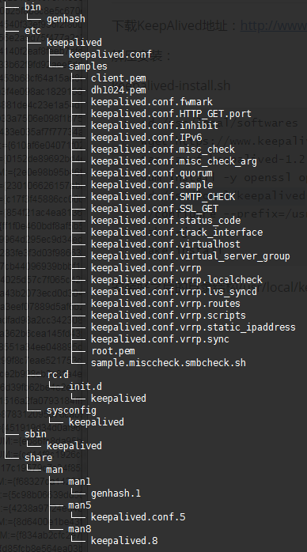

<!-- START doctoc generated TOC please keep comment here to allow auto update -->
<!-- DON'T EDIT THIS SECTION, INSTEAD RE-RUN doctoc TO UPDATE -->
**Table of Contents**  *generated with [DocToc](https://github.com/thlorenz/doctoc)*

- [Nginx](#nginx)
  - [目录](#%E7%9B%AE%E5%BD%95)
  - [1.1 Nginx概述](#11-nginx%E6%A6%82%E8%BF%B0)
  - [1.2 负载均衡策略](#12-%E8%B4%9F%E8%BD%BD%E5%9D%87%E8%A1%A1%E7%AD%96%E7%95%A5)
  - [1.3 Nginx优点](#13-nginx%E4%BC%98%E7%82%B9)
  - [2.1 Nginx环境搭建](#21-nginx%E7%8E%AF%E5%A2%83%E6%90%AD%E5%BB%BA)
  - [2.2 Nginx配置文件说明](#22-nginx%E9%85%8D%E7%BD%AE%E6%96%87%E4%BB%B6%E8%AF%B4%E6%98%8E)
  - [3.1 Nginx + KeepAlived实现高可用](#31-nginx--keepalived%E5%AE%9E%E7%8E%B0%E9%AB%98%E5%8F%AF%E7%94%A8)
  - [3.2 安装KeepAlived](#32-%E5%AE%89%E8%A3%85keepalived)
  - [3.3 keepalived配置文件说明](#33-keepalived%E9%85%8D%E7%BD%AE%E6%96%87%E4%BB%B6%E8%AF%B4%E6%98%8E)

<!-- END doctoc generated TOC please keep comment here to allow auto update -->

# Nginx

## 目录

1、Nginx概述

2、Nginx环境搭建和配置文件说明

3、Nginx + KeepAlived实现高可用

## 1.1 Nginx概述

Nginx是一款**轻量级的Web服务器/反向代理服务器**及电子邮件（IMAP/POP3）代理服务器，并在一个BSD-like协议下发行。由俄罗斯和程序设计师Igor Sysoen所开发，供俄国大型的入口网站及搜索引擎Rambler（俄文Рамблер）使用。其特点是占有内存少，并发能力强，事实上Nginx的并发能力确实在同类型的网页服务中表现较好，中国大陆使用Nginx网站用户有：百度、新浪、网易、腾讯等。

## 1.2 负载均衡策略

1、使用硬件负载均衡策略实现，如使用F5、Array等负载均衡器。

2、使用软件进行负载均衡。

-   如使用阿里云服务器SLB。
-   使用我们今天所学习的Nginx + KeepAlived。
-   其他软件，如LVS（Linux Virtual Server）、haproxy等技术。

## 1.3 Nginx优点

Nginx 可以在大多数Unix Like OS上编译运行，并有Windows移植版。Nginx 的1.4.0稳定版已经于2013年4月24日发布，一般情况下，对于新建站点，建议使用最新稳定版作为生产版本，已有站点的升级急迫性不高。Nginx 的源代码使用**2-clause BSD-like license**。

Nginx 是一个很强大的高性能Web和反向代理服务器，它具有很多优越的特性。

在高连接并发的情况下，Nginx 是Apache服务器不错的替代品：Nginx在美国是做虚拟主机生意的老板们经常选择的软件平台之一。能够支持高达**50000**个并发连接数的响应，感谢Nginx为我们选择了**epoll and kqueue**作为开发模型。

## 2.1 Nginx环境搭建

```bash
# wget下载
cd /usr/local/softwares/
[ -e nginx-1.6.2.tar.gz ] || wget http://nginx.org/download/nginx-1.6.2.tar.gz
# 解压
tar -zxvf nginx-1.6.2.tar.gz -C /usr/local
# 下载依赖库文件
yum install -y pcre pcre-devel zlib zlib-devel
# 进行configure配置
cd /usr/local/nginx-1.6.2
./configure --prefix=/usr/local/nginx
# 编译安装
make -j 4
make install
# nginx目录下有四个目录：conf配置文件、html网页文件、logs日志文件、sbin主要二进制程序
cd /usr/local/nginx
# 启动Nginx
/usr/local/nginx/sbin/nginx
# 关闭
/usr/local/nginx/sbin/nginx -s stop
# 重启
/usr/local/nginx/sbin/nginx -s reload
# 查看是否启动，如果失败：可能为80端口被占用等
ps -ef | grep nginx
netstat -ano | grep 80
```

浏览器访问地址：http://192.168.0.122:80（看到欢迎页面即可）

## 2.2 Nginx配置文件说明

**Nginx虚拟主机配置**：

```bash
vim /usr/local/nginx/conf/nginx.conf
```

增加配置：

```bash
server{
	listen 1234;
	server_name abc.com;
	location / {
		root abc.com;
		index index.html;
	}
}
```

以上配置需要在/usr/local/nginx下新建目录abc.com，并在目录中生成index.html文件

**Nginx日志管理**：

Nginx访问日志放在logs/host.access.log下，并且使用main格式（还可以自定义格式）

对main格式如下定义：

```bash
    log_format  main  '$remote_addr - $remote_user [$time_local] "$request" '
                      '$status $body_bytes_sent "$http_referer" '
                      '"$http_user_agent" "$http_x_forwarded_for"';

    access_log  logs/access.log  main;
```

查看日志内容命令：

```bash
tail -f -n 100 /usr/local/nginx/logs/access.log
```

**日志切分**

我们在日常生活中，对nginx日志的分析非常重要，通常需要运维去对nginx的日志进行切割和分析处理。比如实现一个定时任务，去处理nginx日志等。

第一步：分析如何实现日志切分，编写shell脚本。

第二步：定时任务对脚本进行调度：`crontab -e`

```bash
# 每天凌晨4点执行
0 4 * * * sh /usr/local/nginx/sbin/log.sh
```

**log.sh**

```bash
#!/bin/sh

BASE_DIR=/usr/local/nginx
BASE_FILE_NAME=access.log

CURRENT_PATH=$BASE_DIR/logs
BAK_PATH=$BASE_DIR/datalogs

CURRENT_FILE=$CURRENT_PATH/$BASE_FILE_NAME
#BAK_TIME=`/bin/date -d yesterday +%Y%m%d%H%M`
BAK_TIME=`/bin/date -d yesterday +%Y%m%d%`
BAK_FILE=$BAK_PATH/$BAK_TIME-$BASE_FILE_NAME
echo $BAK_FILE

$BASE_DIR/sbin/nginx -s stop

mv $CURRENT_FILE $BAK_FILE

$BASE_DIR/sbin/nginx
```

**Location语法**

Location语法：表示uri方式定位。

基础语法有三种：

```bash
location = pattern {}    # 精确匹配
location pattern {}      # 一般匹配
location ~ pattern {}    # 正则匹配
```

**Nginx语法**：

if(条件为：= ~ ~*)、return、break、rewrite
-f是否为文件、-d是否为目录、-e是否存在

```bash
location ~ test {
	# 重写语法：if return （条件 = ~ ~*）
	if ($remote_addr = 192.168.1.200) {
	       return 401;
	}		
			
	if ($http_user_agent ~* firefox) {
		   rewrite ^.*$ /firefox.html;
		   break;
	}			
					
	root bhz.com;
	index index.html;
}
```

Nginx可以对数据进行压缩，对一些图片、html、css、js等文件进行缓存，从而实现动静分离等等优化功能，在网站优化的时候非常有用。

```bash
http {
	#打开gzip压缩
	gzip  on;
}
```

Nginx反向代理proxy与负载均衡upstream

```bash
http {
    upstream myapp {   
        server 192.168.0.121:8080 weight=1 max_fails=2 fail_timeout=30s;   
        server 192.168.0.122:8080 weight=1 max_fails=2 fail_timeout=30s;   
    } 
}
```

配置反向代理proxy：`proxy_pass url地址`

```bash
http {
    server {
        #返回的相应文件地址
        location / {
            #设置客户端真实ip地址
            proxy_set_header X-real-ip $remote_addr;		
            #负载均衡反向代理
            proxy_pass http://myapp;

            #返回根路径地址（相对路径:相对于/usr/local/nginx/）
            root   html;
            #默认访问文件
            index  index.html index.htm;
        }
    }
}
```

官方配置：http://nginx.org/en/docs

注意：反向代理之后获得客户端IP地址为Nginx服务器地址，这里需要Nginx进行forward，设置真实的ip地址。

```bash
proxy_set_header X-real-ip $remote_addr;
```

## 3.1 Nginx + KeepAlived实现高可用

首先介绍一下KeepAlived，这是一个高性能的服务器高可用或热备解决方案，KeepAlived主要来防止服务器单点故障的发生问题，可以通过其与Nginx 的配合实现web服务端的高可用。

KeepAlived以VRRP（Virtual Router Redundancy Protocol）协议是用于实现路由器冗余的协议，VRRP协议由两台或多台路由器设置虚拟成一个设备，对外提供虚拟路由器IP（一个或多个），如下图所示：


## 3.2 安装KeepAlived

下载KeepAlived地址：http://www.keepalived.org/download.html

解压安装：

**keepalived-install.sh**

```bash
cd /usr/local/softwares
[ -e keepalived-1.2.18.tar.gz ] || wget https://www.keepalived.org/software/keepalived-1.2.18.tar.gz
tar -zxvf keepalived-1.2.18.tar.gz -C /usr/local
yum install -y openssl openssl-devel
cd /usr/local/keepalived-1.2.18
make clean
./configure --prefix=/usr/local
make -j 4
make install
# 设置开机启动
chkconfig keepalived on
# 启动服务
systemctl start keepalived
# 查看进程
ps -el | grep keepalived
```

>   注： 我们默认安装在/usr/local下，这样可以不用配置，默认就是系统服务。

安装好之后的目录结构/usr/local/keepalived



将keepalived安装成Linux系统服务，因为没有使用keepalived的默认安装路径（默认路径：/usr/local），安装完成之后，需要做一些修改工作（**这里跳过这个步骤**）：

```bash
# 1、首先创建文件夹，将keepalived配置文件进行复制
mkdir /etc/keepalived
cp /usr/local/keepalived/etc/keepalived/keepalived.conf /etc/keepalived/
# 2、然后复制keepalived脚本文件
cp /usr/local/keepalived/etc/rc.d/init.d/keepalived /etc/init.d/
cp /usr/local/keepalived/etc/sysconfig/keepalived /etc/sysconfig/
ln -s /usr/local/sbin/keepalived /usr/sbin/
ln -s /usr/local/keepalived/sbin/keepalived /sbin/
```

## 3.3 keepalived配置文件说明

对配置文件进行修改

```bash
vim /etc/keepalived/keepalived.conf
```

参考文档：keepalived配置手册

参考文章：http://blog.csdn.net/jibcy/article/details/7826158

配置完毕以后，我们先启动两个服务器的nginx，然后我们再启动两个服务器的keepalived。使用

```bash
# 停止服务
systemctl stop keepalived
# 启动服务
systemctl start keepalived
```

然后我们输入命令：`ip a`查看后会发现多了一个虚拟IP（vip地址）。

我们进行两个简单的测试：

1、关闭keepalived进行测试。

2、手动修改nginx配置文件。让其变得不能使用，然后kill掉nginx进程，进行测试。

**主节点配置** 

位置：/etc/keepalived/keepalived.conf

```bash
! Configuration File for keepalived

global_defs {
   router_id k122 ##标识节点的字符串，通常为hostname
}

vrrp_script chk_nginx {
    script "/etc/keepalived/nginx_check.sh" ##执行脚本位置
    interval 2 ##检测时间间隔
    weight -20 ## 如果条件成立则权重减20（-20）
}

vrrp_instance VI_1 {
    state MASTER   ## 主节点为MASTER，备份节点为BACKUP
    ## 绑定虚拟IP的网络接口（网卡），与本机IP地址所在的网络接口相同（我这里是eth6）
    interface enp0s3  
    virtual_router_id 122  ## 虚拟路由ID号
    mcast_src_ip 192.168.0.122  ## 本机ip地址
    priority 100  ##优先级配置（0-254的值）
    Nopreempt  ## 不抢占
    advert_int 1 ## 组播信息发送间隔，俩个节点必须配置一致，默认1s
    authentication {  
        auth_type PASS
        auth_pass kkk ## 真实生产环境下对密码进行匹配，同一集群要相同
    }

    track_script {
        chk_nginx
    }

    virtual_ipaddress {
        192.168.0.220 ## 虚拟ip(vip)，可以指定多个
    }
}
```

**热备节点配置**

位置：/etc/keepalived/keepalived.conf

```bash
! Configuration File for keepalived

global_defs {
   router_id k123 ##标识节点的字符串，通常为hostname
}

vrrp_script chk_nginx {
    script "/etc/keepalived/nginx_check.sh" ##执行脚本位置
    interval 2 ##检测时间间隔
    weight -20 ## 如果条件成立则权重减20（-20）
}

vrrp_instance VI_1 {
    state BACKUP   ## 主节点为MASTER，备份节点为BACKUP
    ## 绑定虚拟IP的网络接口（网卡），与本机IP地址所在的网络接口相同（我这里是eth6）
    interface enp0s3  
    virtual_router_id 122  ## 虚拟路由ID号，同一集群要相同
    mcast_src_ip 192.168.0.123  ## 本机ip地址
    priority 90  ##优先级配置（0-254的值）
    advert_int 1 ## 组播信息发送间隔，俩个节点必须配置一致，默认1s
    authentication {  
        auth_type PASS
        auth_pass kkk ## 真实生产环境下对密码进行匹配，同一集群要相同
    }

    track_script {
        chk_nginx
    }

    virtual_ipaddress {
        192.168.0.220 ## 虚拟ip(vip)，可以指定多个
    }
}
```

**nginx_check.sh 脚本**

位置：/etc/keepalived/nginx_check.sh

```bash
#!/bin/bash
A=`ps -C nginx –no-header |wc -l`
if [ $A -eq 0 ];then
    /usr/local/nginx/sbin/nginx
    sleep 2
    if [ `ps -C nginx --no-header |wc -l` -eq 0 ];then
        killall keepalived
    fi
fi
```

**nginx_check.sh脚本授权**

```bash
chmod +x /etc/keepalived/nginx_check.sh
```

启动2台机器的nginx之后。我们启动两台机器的keepalived

```bash
# 启动nginx
/usr/local/nginx/sbin/nginx
# 启动keepalived
systemctl start keepalived
# 查看相关进程
ps -ef | grep nginx 
ps -ef | grep keepalived
```

keepalived进程操作

```bash
# 启动keepalived
systemctl start keepalived
# 重启keepalived
systemctl restart keepalived
# 停止keepalived
systemctl stop keepalived
```

