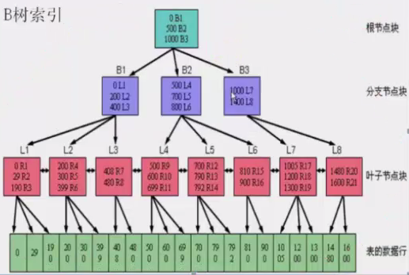
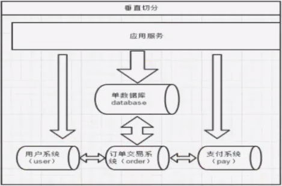
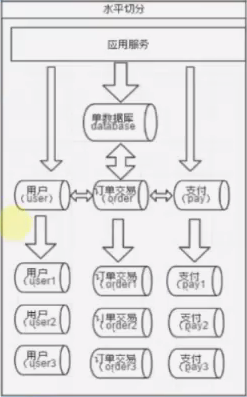

<!-- START doctoc generated TOC please keep comment here to allow auto update -->
<!-- DON'T EDIT THIS SECTION, INSTEAD RE-RUN doctoc TO UPDATE -->
**Table of Contents**  *generated with [DocToc](https://github.com/thlorenz/doctoc)*

- [Oracle](#oracle)
  - [概述](#%E6%A6%82%E8%BF%B0)
  - [数据库类型](#%E6%95%B0%E6%8D%AE%E5%BA%93%E7%B1%BB%E5%9E%8B)
  - [关系型数据库](#%E5%85%B3%E7%B3%BB%E5%9E%8B%E6%95%B0%E6%8D%AE%E5%BA%93)
  - [1.1 Sql基础篇（数据库语言）](#11-sql%E5%9F%BA%E7%A1%80%E7%AF%87%E6%95%B0%E6%8D%AE%E5%BA%93%E8%AF%AD%E8%A8%80)
  - [1.2 Sql基础篇（数据类型）](#12-sql%E5%9F%BA%E7%A1%80%E7%AF%87%E6%95%B0%E6%8D%AE%E7%B1%BB%E5%9E%8B)
  - [1.3 Sql基础篇（常用数据类型转换）](#13-sql%E5%9F%BA%E7%A1%80%E7%AF%87%E5%B8%B8%E7%94%A8%E6%95%B0%E6%8D%AE%E7%B1%BB%E5%9E%8B%E8%BD%AC%E6%8D%A2)
  - [1.4 Sql基础篇（常用函数）](#14-sql%E5%9F%BA%E7%A1%80%E7%AF%87%E5%B8%B8%E7%94%A8%E5%87%BD%E6%95%B0)
  - [1.5 Sql基础篇（分组）](#15-sql%E5%9F%BA%E7%A1%80%E7%AF%87%E5%88%86%E7%BB%84)
  - [1.6 Sql基础篇（集合查询操作）](#16-sql%E5%9F%BA%E7%A1%80%E7%AF%87%E9%9B%86%E5%90%88%E6%9F%A5%E8%AF%A2%E6%93%8D%E4%BD%9C)
  - [1.7 Sql基础篇（子查询）](#17-sql%E5%9F%BA%E7%A1%80%E7%AF%87%E5%AD%90%E6%9F%A5%E8%AF%A2)
  - [1.8 Sql基础篇（rownum的使用）](#18-sql%E5%9F%BA%E7%A1%80%E7%AF%87rownum%E7%9A%84%E4%BD%BF%E7%94%A8)
  - [2.1 Sql高级篇（CT和IS）](#21-sql%E9%AB%98%E7%BA%A7%E7%AF%87ct%E5%92%8Cis)
  - [2.2 Sql高级篇（merge用法）](#22-sql%E9%AB%98%E7%BA%A7%E7%AF%87merge%E7%94%A8%E6%B3%95)
  - [2.3 Sql高级篇（递归函数）](#23-sql%E9%AB%98%E7%BA%A7%E7%AF%87%E9%80%92%E5%BD%92%E5%87%BD%E6%95%B0)
  - [2.4 Sql高级篇（分析函数）](#24-sql%E9%AB%98%E7%BA%A7%E7%AF%87%E5%88%86%E6%9E%90%E5%87%BD%E6%95%B0)
  - [3.1.1 用户操作](#311-%E7%94%A8%E6%88%B7%E6%93%8D%E4%BD%9C)
  - [3.1.2 简单赋权](#312-%E7%AE%80%E5%8D%95%E8%B5%8B%E6%9D%83)
  - [3.1.3 权限的传递和回收](#313-%E6%9D%83%E9%99%90%E7%9A%84%E4%BC%A0%E9%80%92%E5%92%8C%E5%9B%9E%E6%94%B6)
  - [3.2.1 事务特性](#321-%E4%BA%8B%E5%8A%A1%E7%89%B9%E6%80%A7)
  - [3.2.2 事务的开始和结束](#322-%E4%BA%8B%E5%8A%A1%E7%9A%84%E5%BC%80%E5%A7%8B%E5%92%8C%E7%BB%93%E6%9D%9F)
  - [3.3.1 锁](#331-%E9%94%81)
  - [3.3.2 锁类型](#332-%E9%94%81%E7%B1%BB%E5%9E%8B)
  - [3.3.3 加锁模式](#333-%E5%8A%A0%E9%94%81%E6%A8%A1%E5%BC%8F)
  - [oracle查看谁锁了表](#oracle%E6%9F%A5%E7%9C%8B%E8%B0%81%E9%94%81%E4%BA%86%E8%A1%A8)
  - [3.3.4 死锁问题](#334-%E6%AD%BB%E9%94%81%E9%97%AE%E9%A2%98)
  - [3.4.1 索引](#341-%E7%B4%A2%E5%BC%95)
  - [3.4.2 SQL索引概念](#342-sql%E7%B4%A2%E5%BC%95%E6%A6%82%E5%BF%B5)
  - [3.4.3 索引的说明和目的](#343-%E7%B4%A2%E5%BC%95%E7%9A%84%E8%AF%B4%E6%98%8E%E5%92%8C%E7%9B%AE%E7%9A%84)
  - [3.4.4 索引的使用](#344-%E7%B4%A2%E5%BC%95%E7%9A%84%E4%BD%BF%E7%94%A8)
  - [3.4.5 索引的问题](#345-%E7%B4%A2%E5%BC%95%E7%9A%84%E9%97%AE%E9%A2%98)
  - [3.4.6 解决索引碎片的问题](#346-%E8%A7%A3%E5%86%B3%E7%B4%A2%E5%BC%95%E7%A2%8E%E7%89%87%E7%9A%84%E9%97%AE%E9%A2%98)
  - [3.5.1 物化视图](#351-%E7%89%A9%E5%8C%96%E8%A7%86%E5%9B%BE)
  - [3.5.2 物化视图的使用](#352-%E7%89%A9%E5%8C%96%E8%A7%86%E5%9B%BE%E7%9A%84%E4%BD%BF%E7%94%A8)
  - [3.5.3 COMMIT 刷新](#353-commit-%E5%88%B7%E6%96%B0)
  - [3.5.4 DEMAND 刷新](#354-demand-%E5%88%B7%E6%96%B0)
  - [3.5.5 快速刷新的建立](#355-%E5%BF%AB%E9%80%9F%E5%88%B7%E6%96%B0%E7%9A%84%E5%BB%BA%E7%AB%8B)
  - [3.6.1 同义语](#361-%E5%90%8C%E4%B9%89%E8%AF%AD)
  - [3.6.2 同义语使用要点](#362-%E5%90%8C%E4%B9%89%E8%AF%AD%E4%BD%BF%E7%94%A8%E8%A6%81%E7%82%B9)
  - [3.7.1 DBLINK](#371-dblink)
  - [4.x PL/SQL编程](#4x-plsql%E7%BC%96%E7%A8%8B)
  - [5.1.1 表空间使用](#511-%E8%A1%A8%E7%A9%BA%E9%97%B4%E4%BD%BF%E7%94%A8)
  - [5.1.2 查看表空间](#512-%E6%9F%A5%E7%9C%8B%E8%A1%A8%E7%A9%BA%E9%97%B4)
  - [5.2.1 ORACLE表类型](#521-oracle%E8%A1%A8%E7%B1%BB%E5%9E%8B)
  - [5.2.2 OLTP和OLAP](#522-oltp%E5%92%8Colap)
  - [5.2.3 OLTP和OLAP区别](#523-oltp%E5%92%8Colap%E5%8C%BA%E5%88%AB)
  - [5.2.4 关系型数据库和NOSQL数据库对比](#524-%E5%85%B3%E7%B3%BB%E5%9E%8B%E6%95%B0%E6%8D%AE%E5%BA%93%E5%92%8Cnosql%E6%95%B0%E6%8D%AE%E5%BA%93%E5%AF%B9%E6%AF%94)
  - [5.2.5 何为数据切分](#525-%E4%BD%95%E4%B8%BA%E6%95%B0%E6%8D%AE%E5%88%87%E5%88%86)
  - [5.2.6 垂直切分（分库）](#526-%E5%9E%82%E7%9B%B4%E5%88%87%E5%88%86%E5%88%86%E5%BA%93)
  - [5.2.7 水平切分（分表）](#527-%E6%B0%B4%E5%B9%B3%E5%88%87%E5%88%86%E5%88%86%E8%A1%A8)
  - [5.2.8 数据拆分优点和最佳实践方案](#528-%E6%95%B0%E6%8D%AE%E6%8B%86%E5%88%86%E4%BC%98%E7%82%B9%E5%92%8C%E6%9C%80%E4%BD%B3%E5%AE%9E%E8%B7%B5%E6%96%B9%E6%A1%88)
  - [5.2.9 数据拆分缺点和解决方案](#529-%E6%95%B0%E6%8D%AE%E6%8B%86%E5%88%86%E7%BC%BA%E7%82%B9%E5%92%8C%E8%A7%A3%E5%86%B3%E6%96%B9%E6%A1%88)
  - [5.2.10 分区表介绍](#5210-%E5%88%86%E5%8C%BA%E8%A1%A8%E4%BB%8B%E7%BB%8D)
  - [5.2.11 range分区](#5211-range%E5%88%86%E5%8C%BA)
  - [5.2.12 分区索引](#5212-%E5%88%86%E5%8C%BA%E7%B4%A2%E5%BC%95)
  - [5.2.13 hash分区](#5213-hash%E5%88%86%E5%8C%BA)
  - [5.2.14 list分区](#5214-list%E5%88%86%E5%8C%BA)
  - [5.2.15 复合分区](#5215-%E5%A4%8D%E5%90%88%E5%88%86%E5%8C%BA)
  - [5.2.16 间隔分区](#5216-%E9%97%B4%E9%9A%94%E5%88%86%E5%8C%BA)

<!-- END doctoc generated TOC please keep comment here to allow auto update -->

# Oracle

## 概述

我们知道，目前数据库大体上分为两类，一类是关系型数据库，一类是非关系型数据库，那么我们现在就详细来学习下这些数据库。本课程我们以Oracle、Redis为参照。

其实在业界中，大体上可以分为三大类软件公司：

-   互联网行业（如电商、P2P、O2O、互联网金融等）
-   传统领域软件行业（如交通、气象、电信、银行等某个领域的软件需求）
-   产品软件行业（如医疗、军工、OA、企业级管理系统、小行业等第三方的软件需求）

但是无论任何软件公司，他们都离不开数据库，根据需求不同，选择相应的数据库作为存储，有人说一般互联网行业都会选择使用mysql数据库，原因很简单，开源且成本低，其实一般的大型互联公司，往往不是只单单使用一种数据库。可能是多种混合使用，比如互联网金融公司的核心数据库一般采用Oracle和DB2，为了对安全做保证，外围数据库可能使用mysql，一些即时的信息或安全不是特别高的信息可能会使用缓存。所以，使用什么数据库是要看具体的需求而定的，并不能一概而论，Oracle的强大是大家有目共睹的，论综合能力mysql与之差了不知道多少倍。

## 数据库类型

对于关系型数据库，我不在强调具体细节，关系型数据库的最大特点就是事务的一致性：传统的关系型数据库读写操作都是事务的，具有ACID的特点，这个特性使得关系型数据库可以用于几乎所有对一致性有要求的系统中，如典型的银行系统。

相反地，关系型数据库为了维护一致性所付出的巨大代价就是其读写性能比较差，而像微博、facebook这类SNS的应用，对并发读写能力要求极高，关系型数据库已经无法应付，所以会采用一系列的非关系型数据库，或者缓存来提供系统的性能，尤其是web2.0的兴起。

**关系型数据库和非关系型数据库的区别？**

最终无论数据怎么做处理都要有数据落地（入库），一般我们会存储在关系型数据库中，所以无论关系型、非关系型数据库，我们都要掌握它们的使用和应用范围、场景，一个好的数据设计，往往可以规避很多复杂的逻辑和后期的不可预见性，所以一般设计数据库的工程师在企业里都是很重要的核心成员。

## 关系型数据库

我们所接触了解最多的当然是关系型数据库了，如Oracle、Mysql、DB2、SqlServer等等，这些数据库你不可能每种都精通，但是如果你学会了Oracle，那么其他的数据库学习起来就相对的容易很多，在关系型数据库中，Oracle也是最复杂、最博大精深的。那么我们一起来深入的学习Oracle。

**大纲**：（Oracle 11g）

1、sql基础

2、高级sql

3、用户访问控制、事务、锁、索引、（视图）物化视图、同义词、DBLINK

4、PL/SQL（包、存储过程、触发器、定时任务等）

5、表空间、Oracle表类型、分区、分区索引、设计数据库表结构

6、简单备份和恢复

## 1.1 Sql基础篇（数据库语言）

数据操纵语言：DML（Data Manipulation Language）

```mysql
select insert update delete merge
```

数据定义语言：DDL（Data Definition Language）

```mysql
create alter drop tuncate
```

事务控制语言：TCL（Transaction Control Language）

```mysql
commit rollback savepoint
```

数据控制语言：DCL（Data Control Language）

```mysql
grant revoke
```

## 1.2 Sql基础篇（数据类型）

Oracle的数据类型：

-   字符型
    -   char（固定字符，最长2000个）
    -   varchar2（可变长，最长4000，最小1）
-   数值型
    -   number
-   日期型
    -   date（日期）
    -   timestamp（时间戳）
-   大对象型
    -   clob（存储单字符数据，文本数据）
    -   blob（存储二进制数据）

## 1.3 Sql基础篇（常用数据类型转换）

常用转换：date、char、number三者之间经常进行转换。

```mysql
select to_date('2015-08-19', 'YYYY-MM-DD') as a_day from dual;
select to_char(sysdate, 'YYYY-MM-DD') as today from dual;
select to_timestamp('2015-08-19 17:40:32.11', 'YYYY-MM-DD HH24:MI:SS.FF') as a_day from dual;
select to_char(systimestamp, 'YYYY-MM-DD HH24:MI:SS.FF') as today from dual;
select to_number(replace(to_char(sysdate, 'YYYY-MM-DD'), '-')) from dual;
```

to_char的详细使用：http://blog.csdn.net/delphi308/article/details/25654455

```mysql
select to_char(sysdate, '参数') from dual;
```

## 1.4 Sql基础篇（常用函数）

decode函数

```mysql
select deptno, decode(deptno, 10, '部门1', 20, '部门2', '部门3') from emp;
```

case表达式

```mysql
select deptno,
       case
         when deptno = 10 then
          '部门1'
         when deptno = 20 then
          '部门2'
         else
          '部门3'
       end
  from emp;
```

学习使用函数：

```mysql
trunc
add_months
month_between
last_day
replace
substr
concat
abs
round
```

## 1.5 Sql基础篇（分组）

组函数

```mysql
sum min max avg count
```

分组特性

```mysql
group by ... having
```

练习：

1、查询每个部门的平均薪水之后，显示部门平均薪水大于2000的部门编号和其平均薪水

```mysql
select deptno, avg(sal)
  from emp
 group by deptno
having avg(sal) > 2000;
```

2、查询每个部门的平均薪水之后，显示在平均薪资大于3000，薪水大于2000的部门编号和其平均薪水。

```mysql
select deptno, avg(sal)
  from emp
 where sal > 2000
 group by deptno
having avg(sal) > 3000;
```

3、查询每个部门的薪水和，再算出所有部门的薪水平均值。

```mysql
select deptno, sum(sal), avg(sal)
  from emp
 group by deptno;
```

## 1.6 Sql基础篇（集合查询操作）

1、交叉连接（笛卡尔积）

2、等值、非等值连接

3、内连接

4、外连接（左外、右外、全连接）

5、自连接

6、自然连接（隐含连接条件，自动匹配，连接自动）

7、集合运算

-   union（求并集，重复记录只显示一次）
-   union all（求并集，显示所有记录信息）
-   intersect（求交集，显示公共的数据部分）
-   minus（求差集，集合相减，哪个表在前面以哪个表的数据为主）

```mysql
create table A(id int, name varchar2(10));
create table B(id int, name varchar2(10));
insert into A values(1, 'Zhangsan');
insert into A values(2, 'Lisi');
insert into B values(2, 'Lisi');
insert into B values(3, 'Wangwu');
select * from A;
select * from B;
-- union
select * from A union select * from B;
-- union all
select * from A union all select * from B;
-- intersect
select * from A intersect select * from B;
-- minus(A as master)
select * from A minus select * from B;
-- minus(B as master)
select * from B minus select * from A;
```

## 1.7 Sql基础篇（子查询）

非关联子查询：主查询和子查询是相对独立的，唯一的，子查询查询结果和主查询进行比较。

```mysql
select a.ename, a.sal
  from emp a
 where a.deptno = (select b.deptno from dept b where b.loc = 'NEW YORK');
```

关联子查询：主查询和子查询是产生关联关系的，主查询的一个列字段代入到子查询中进行比较。

```mysql
select a.deptno, (select b.loc from dept b where b.deptno = a.deptno)
  from emp a;
```

in和exists，in是做全表扫描，exists是做是否存在，非全表扫描。

练习：使用exists

查询属于领导（大小领导都算）的员工

```mysql
select * from emp a where exists (select 1 from emp b where b.mgr = a.empno);
```

查询哪个部门不存在员工的部门信息

```mysql
select * from dept d where not exists(select 1 from emp e where e.deptno = d.deptno);
```

## 1.8 Sql基础篇（rownum的使用）

使用rownum需要注意：使用<可以查询结果，使用>没有结果，必须使用别名的形式查询，>才能有结果。

```mysql
-- 查询小于5的记录数
select * from emp where rownum < 5;
-- 查询大于5的记录数
select * from (select e.*, rownum as rn from emp e) where rn > 5;
-- 分页查询5-10条数据
select * from (select e.*, rownum rn from emp e) a where a.rn between 5 and 10;
```

## 2.1 Sql高级篇（CT和IS）

CT：`create table <new table> as select * from <exists table>`

要求目标表不存在，因为插入时会自动创建表，并将查询表中指定字段数据复制到新建的表中。

```mysql
create table myemp as select * from emp where deptno = 10;
```

IS：`insert info table2 (f1,f2,...) select v1,v2,...from table1`

要求目标表table2必须存在，由于目标表table2已经存在，所以我们除了插入源表table1的字段外，还可以插入常量。

```mysql
insert into myemp select * from emp where deptno = 20;
```

## 2.2 Sql高级篇（merge用法）

merge into用法：

```mysql
merge into 表A
using 与表A产生关联的字段值
on 进行和表A关联
when matched then
	update set ...
when not matched then
	insert (...) values ...
```

示例：

```mysql
merge into myemp e
using (select 7912 as empno from dual) a
on (a.empno = e.empno)
when matched then
  update set sal = 3500.00
when not matched then
  insert
    (empno,
     ename,
     job,
     mgr,
     hiredate,
     sal,
     comm,
     deptno)
  values
    (7912,
     'FORD',
     'MANAGER',
     7566,
     sysdate,
     3500,
     null,
     20);
```

## 2.3 Sql高级篇（递归函数）

`start with … connect by …`是Oracle提供的的递归查询（分层查询）函数，非常的好用，我们在进行递归遍历树形结构的时候可以使用。

```mysql
start with (从某个节点id开始)
connect by prior (子节点id和父节点pid直接的关系需要)
```

示例：

```mysql
select * from emp
-- where empno != 7934
start with empno = 7369 --or empno = 7934
connect by prior mgr = empno;

-- 父节点=子节点 向上查询，反之向下查询
select * from emp
start with empno = 7566
connect by prior empno = mgr;
```

可以添加where条件限制

可以指定多个起始节点查询

可以进行排序

## 2.4 Sql高级篇（分析函数）

**over函数**

```mysql
select deptno,
       ename,
       sal,
       sum(sal) over (order by ename) "连续求和",
       sum(sal) over () "总和",
       100*round(sal/sum(sal) over (), 5) "份额（%）"
  from emp;
```

**over、partition by 组合**

```mysql
select deptno,
       ename,
       sal,
       sum(sal) over(partition by deptno order by ename) "部门连续求和",
       sum(sal) over(partition by deptno) "部门总和",
       100 * round(sal / sum(sal) over(partition by deptno), 4) "部门份额（%）",
       sum(sal) over(order by deptno, ename) "连续求和",
       sum(sal) over() "总和",
       100 * round(sal / sum(sal) over(), 4) "总份额（%）"
  from emp;
```

**over、partition by、order by组合**

```mysql
-- 分区与不分区的区别
select deptno,
       ename,
       sal,
       sum(sal) over(partition by deptno order by ename) dept_sum,
       sum(sal) over(order by deptno, ename) sum
  from emp;
```

**row_number函数**

```mysql
-- 根据部门分组，显示每个部门的工资等级
select employees.*,
       row_number() over(partition by DEPARTMENT_ID order by SALARY) rank
  from employees;
```

**rollup函数**

```mysql
-- 先按部门分组，再按工种分组，每个部门每个工种小计后，再按部门小计，最后总计
select e.department_id, e.job_id, sum(e.salary)
  from employees e
  where e.department_id is not null
 group by rollup(e.department_id, e.job_id)
```

**cube函数**

```mysql
-- 在rollup的基础上，分别对每个工种再小计一遍 
 select e.department_id, e.job_id, sum(e.salary)
  from employees e
  where e.department_id is not null
 group by cube(e.department_id, e.job_id)
 order by e.department_id
```

**grouping函数**

```mysql
select e.department_id,
       (case
         when (grouping(e.job_id) = 1 and grouping(e.department_id) = 0) then
          '部门小计'
         when (grouping(e.job_id) = 1 and grouping(e.department_id) = 1) then
          '总计'
         else
          e.job_id
       end) as job,
       sum(e.salary)
  from employees e
 where e.department_id is not null
 group by rollup(e.department_id, e.job_id)
```

## 3.1.1 用户操作

**用户锁定和解锁、密码设置**

```mysql
alter user [USER] account lock;
alter user [USER] account unlock;
alter user scott identified by tiger;
```

**查看用户信息**

```mysql
select * from dba_users;
```

**创建用户**

```mysql
create user [USER] identified by [PASSWD];
```

**删除用户**

```mysql
drop user [USER] cascade;
```

本地练习，把所有用户密码统一使用orcl

```mysql
select 'alter user ' || username || ' identified by orcl;' from dba_users;

alter user MGMT_VIEW identified by orcl;
alter user SYS identified by orcl;
alter user SYSTEM identified by orcl;
alter user DBSNMP identified by orcl;
alter user SYSMAN identified by orcl;
alter user SCOTT identified by orcl;
alter user HR identified by orcl;
alter user OUTLN identified by orcl;
alter user FLOWS_FILES identified by orcl;
alter user MDSYS identified by orcl;
alter user ORDSYS identified by orcl;
alter user EXFSYS identified by orcl;
alter user WMSYS identified by orcl;
alter user APPQOSSYS identified by orcl;
alter user APEX_030200 identified by orcl;
alter user OWBSYS_AUDIT identified by orcl;
alter user ORDDATA identified by orcl;
alter user CTXSYS identified by orcl;
alter user ANONYMOUS identified by orcl;
alter user XDB identified by orcl;
alter user ORDPLUGINS identified by orcl;
alter user OWBSYS identified by orcl;
alter user SI_INFORMTN_SCHEMA identified by orcl;
alter user OLAPSYS identified by orcl;
alter user ORACLE_OCM identified by orcl;
alter user BI identified by orcl;
alter user PM identified by orcl;
alter user MDDATA identified by orcl;
alter user IX identified by orcl;
alter user SH identified by orcl;
alter user DIP identified by orcl;
alter user OE identified by orcl;
alter user APEX_PUBLIC_USER identified by orcl;
alter user SPATIAL_CSW_ADMIN_USR identified by orcl;
alter user SPATIAL_WFS_ADMIN_USR identified by orcl;
--alter user XS$NULL identified by orcl;
```

## 3.1.2 简单赋权

对于权限的赋予和收回语法如下：

```mysql
grant [权限] to [用户]
revoke [权限] from [用户]
```

在oracle里有两个最著名的角色：connect、resource除了DBA之外的最大角色。

查看当前用户的所有权限：

```sql
select * from session_privs;
```

我们与scott用户下的权限进行对比，发现多了一个unlimited，其含义是拥有所有表空间配额的使用权限，这个权限太大了，在般来讲需要进行回收，然后重新进行分配一个表空间配额。

回收unlimited表空间权限

```mysql
revoke unlimited tablespace from [USER];
```

查看用户缺省表空间：

```mysql
select username,default_tablespace from user_users;
```

重新分配一个表空间配额

```mysql
alter user [USER] quota 10m on users;
```

我们想让新建用户拥有对scott.emp表的查询权限：

```mysql
grant select on scott.emp to [USER]
```

我们想让新建用户拥有对scott的建立表操作权限：

```mysql
grant create any table to tim;
```

我们想让新建用户拥有对scott.emp表的修改权限：

```mysql
-- 注意：可以精确到字段
grant select,update(sal) on emp to tim;
```

示例：把hr用户的表授权给scott

```mysql
grant insert,delete,update,select on hr.departments to scott;
grant insert,delete,update,select on hr.employees to scott;
grant insert,delete,update,select on hr.jobs to scott;
grant insert,delete,update,select on hr.job_history to scott;
grant insert,delete,update,select on hr.locations to scott;
grant insert,delete,update,select on hr.regions to scott;
grant insert,delete,update,select on hr.employees to scott;
```

## 3.1.3 权限的传递和回收

**1、系统权限的传递和回收**：`with admin option 选项` （总结：覆水难收）

新建两个用户

```mysql
create user tim1 identified by tim1;
create user tim2 identified by tim2;
```

sys赋予权限create session给tim1，tim1赋予权限create session给tim2（注意：使用权限传递语法）

```mysql
grant create session to tim1 with admin option;
grant create session to tim2;
```

这时候tim1、tim2都可以登录，然后sys收回tim1的create session权限，tim1肯定不能登录，但tim2还可以继续登录

```mysql
revoke create session from tim1;
```

结果：

```mysql
SQL> conn tim1/tim1
ERROR:
ORA-01045: 用户 TIM1 没有 CREATE SESSION 权限；登录被拒绝
SQL> conn tim2/tim2
已连接.
```

**2、对象权限的传递与回收**：`with grant option 选项`（总结：株连九族）

scott赋予权限select给tim1，tim1赋予权限select给tim2（注意：使用权限传递语法）

```mysql
SQL> conn scott/scott
SQL> grant select on emp to tim1 with grant option;
SQL> conn tim1/tim1
SQL> select * from scott.emp  -- 可以看到scott.emp表
SQL> grant select on emp to tim2;
SQL> conn tim2/tim2
SQL> select * from scott.emp  -- 可以看到scott.emp表
SQL> conn scott/scott
SQL> revoke select on emp from tim1
SQL> conn tim1/tim1
SQL> select * from scott.emp  -- 报错，表或视图不存在
SQL> conn tim2/tim2
SQL> select * from scott.emp  -- 报错，表或视图不存在
```

## 3.2.1 事务特性

事务必须具备以下四个属性：简称**ACID**属性：

**原子性（Atomicity）**：事务是一个完整的操作。事务的各步操作是不可分的（原子的）；要么都执行，要么都不执行。

**场景**：银行转帐，A-100，B+100，同时成功或同时失败

**一致性（Consistency）**：一个查询的结果必须与数据库在查询开始的状态一致（读不等待写，写不等待读）。

**场景**：查询数据，9:00开始查询数据，9:15查询完毕，在这期间所查询的数据被其他操作更新，且在9:00-1:15之间查询结果显示的是9:00时候并没有被更新的数据。一般Oracle是把这个没有更新的数据放入undo里，如果Oracle在undo里没有找到数据，则宁可报错，也不会让你看到其他操作更新的新数据。

**隔离性（Isolation）**：对于其他会话来说，未完成的（也就是未提交的）事务必须不可见。

场景：事务和事务之间相互隔离，2个session一个查询一个更新，那么在更新操作没有commit之前，查询所看到的数据是没有提交之前的，相互没有影响。

**持久性（Durablility）**：事务一旦提交完成后，数据库就不可以丢失这个事务的结果，数据库通过日志能够保持事务的持久性。

**场景**：事务提交之后不可逆，提交数据是由内存的数据刷新到磁盘上，这个过程的快慢和性能有关，那么Oracle主要是靠redo日志，先记录日志，再写到磁盘上。

## 3.2.2 事务的开始和结束

事务采用隐性的方式，起始于session的第一条DML语句

**查看事务**：

```mysql
select * from v$transaction;
```

**事务结束于**：

1、commit（提交）或rollback（回滚）

2、DDL语句被执行（提交）

3、DCL语句被执行（提交）

4、用户退出SQLPLUS（正常退出是提交，非正常退出是回滚）

5、机器故障或系统崩溃（回滚）

6、shutdown immediate（回滚）

## 3.3.1 锁

锁大概分为：共享锁和排他锁

-   **排他锁**（独占），排斥其他排他锁和共享锁。

-   **共享锁**，排斥其他排他锁，但不排斥其他共享锁。

**锁类型**：

-   **DML锁**（data locks， 数据锁），用户保护数据的完整性。TX（行级锁），TM（表级锁），我们日常所使用的DML操作就会产生事务和锁。

    查看事务：`select * from v$transaction;`

    查看锁：`select * from v$lock;`

-   **DDL锁**（dictionary locks，数据字典锁），用户保护数据库对象的结构，如表、索引等的结构定义。
-   **SYSTEM锁**（internal locks and latches），保护数据库的内部结构。

**锁用途**：只有事务才会产生锁，保证数据的完整性和正确性。

## 3.3.2 锁类型

**TX**：只有一种锁

**TM**：有五种

```
      RS、RX、S、SRX、X
mode: 2   3   4  5   6
```

-   **ROW SHARE**：行共享（RS），允许其他用户同时更新其他行，允许其他用户同时加共享锁，不允许独占（排他性质）的锁。
-   **ROW EXCLUSIVE**：行排他（RX），允许其他用户同时更新其他行，只允许其他用户同时加行共享锁或者行排他锁。
-   **SHARE**：共享（S），不允许其他用户同时更新任何行，只允许其他用户同时加共享锁或者行共享锁。
-   **SHARE ROW EXCLUSIVE**：共享行排他（SRX），不允许用户同时更新其他行，只允许其他用户同时加行共享锁。
-   **EXCLUSIVE**：排他（X），其他用户禁止更新任何行，禁止其他用户同时加任何排他锁。

| sql语句                                           | 加锁模式 | 许可其他用户的加锁模式 |
| ------------------------------------------------- | -------- | ---------------------- |
| select * from table_name                          | 无       | RS、RX、S、SRX、X      |
| insert, update, delete, merge（DML）              | RX       | RS、RX                 |
| select * from table_name for update               | RX       | RS、RX                 |
| lock table table_name in row share mode           | RS       | RS、RX、S、SRX         |
| lock table table_name in row exclusive mode       | RX       | RS、RX                 |
| lock table table_name in share mode               | S        | RS、S                  |
| lock table table_name in share row exclusive mode | SRX      | RS                     |
| lock table table_name in exclusive mode           | X        | 无                     |

## 3.3.3 加锁模式

**自动加锁**，做DML操作时，如insert、update、delete，以及select …. for update由Oracle自动完成加锁。

```mysql
select * from emp where deptno = 10 for update;
```

修改其部门为10的记录则会被锁定，我们可以进行试探要修改数据记录是否被加锁。如下三种形式均可：

```mysql
select * from emp where empno = 7782 for update nowait;
select * from emp where empno = 7782 for update wait 5;
select * from emp where empno = 7782 for update skip locked;
```

如果这个锁占用时间太长，我们可以通过管理员杀掉session用户。

首先要找到是哪个sid占用了太长时间，查看`v$lock`表。

然后根据`v$lock`表的sid，去`v$session`里面去找到，进行kill操作。

```sql
select * from v$lock;
select sid, serial# from v$session where sid = 170;
alter system kill session 'sid,serial';
```

## oracle查看谁锁了表

```mysql
SELECT /*+ rule */
 s.username,
 decode(l.type, 'TM', 'TABLE LOCK', 'TX', 'ROW LOCK', NULL) LOCK_LEVEL,
 o.owner,
 o.object_name,
 o.object_type,
 s.sid,
 s.serial#,
 s.terminal,
 s.machine,
 s.program,
 s.osuser
  FROM v$session s, v$lock l, dba_objects o
 WHERE l.sid = s.sid
   AND l.id1 = o.object_id(+)
   AND s.username is NOT NULL;
```

## 3.3.4 死锁问题

oracle会自动解决死锁问题

准备数据：

```sql
create table A(id int);
insert into a values(100);
insert into a values(200);
insert into a values(300);
commit;
select * from a;
```

建立死锁机制：

```sql
-- A用户
update a set id = 1000 where id = 100;
-- B用户
update a set id = 2000 where id = 200;
--A用户去触碰B用户正在使用的id=200的数据
update a set id = 3000 where id = 200;
--B用户去触碰A用户正在使用的id=100的数据
update a set id = 4000 where id = 100;
```

这样就会造成死锁，Oracle会自动进行解除死锁。

## 3.4.1 索引

索引分为B树索引和位图索引。下图为B树索引，我们主要研究B树索引。



## 3.4.2 SQL索引概念

**一般SQL优化有几种解决方案**：

1、索引（index）

2、分区（partition）

3、物化视图（view）

4、并行查询

**索引概念**：

索引分为两大结构：

1、**B树索引结构**（balance，就类似于字典查询，最后到leaf block存的是数据rowid和数据项）

-   叶块之间使用双向链连接，为了可以范围查询。
-   删除表行时，索引叶块会更新，但只是逻辑更改，并不做物理的删除叶块。
-   索引叶块中不保存表行键值的null信息。

2、**位图索引结构**（bitmap，离散度比较低的时候，需要用位图索引，离散度指的是重复度【比较多用位图索引】）

```mysql
-- 因为job的值重复分布的比较多，即离散度比较低
create bitmap index job_bitmap on emp(job); 
```

位置索引结构如下：

| 值/行     | 1    | 2    | 3    | 4    | 5    | 6    | 7    | 8    | 9    | 10   | 11   | 12   | 13   | 14   |
| --------- | ---- | ---- | ---- | ---- | ---- | ---- | ---- | ---- | ---- | ---- | ---- | ---- | ---- | ---- |
| ANALYST   | 0    | 0    | 0    | 0    | 0    | 0    | 0    | 1    | 0    | 0    | 0    | 0    | 1    | 0    |
| CLEAK     | 1    | 0    | 0    | 0    | 0    | 0    | 0    | 0    | 0    | 0    | 1    | 1    | 0    | 1    |
| MANAGER   | 0    | 0    | 0    | 1    | 0    | 1    | 1    | 0    | 0    | 0    | 0    | 0    | 0    | 0    |
| PERSIDENT | 0    | 0    | 0    | 0    | 0    | 0    | 0    | 0    | 1    | 0    | 0    | 0    | 0    | 0    |
| SALESMAN  | 0    | 1    | 1    | 0    | 1    | 0    | 0    | 0    | 0    | 0    | 0    | 0    | 0    | 0    |

## 3.4.3 索引的说明和目的

**索引的说明**：

索引是与表相关的一个可选结构，在逻辑上和物理上都独立于表的数据，**索引能优化查询，不能优化DML操作**。Oracle自动维护索引，频繁的DML操作反而会引起大量的索引维护。

如果SQL语句仅访问被索引的列，那么数据库中人需从索引中读取数据，而不用读取表。

如果该语句同时还要访问除索引之外的列，那么，数据库会使用rowid来查找表中的行。

通常，为检索表数据，数据库以交替方式先读取索引块，然后读取相应的表块。

**索引的目的**：

主要是减少IO，这是本质，这样才体现索引的效率。

1、大表，返回的行数<5%

2、经常使用where子句查询的列

3、离散度高的列

4、更新键值代价低

5、逻辑ACID、OR效率高

6、查看索引建在哪个表、列

```mysql
select * from user_indexes;
select * from user_ind_columns;
```

## 3.4.4 索引的使用

1、唯一索引（unique or non_unique）：键值不重复。

```mysql
create unique index empno_idx on emp1(empno);
```

2、一般索引：键值可以重复。

```mysql
create index empno_idx on emp1(empno);
```

3、组合索引（composite）：绑定了两个或更多列的索引。

```mysql
create index job_deptno_idx; on emp1(job, deptno);
```

4、反向键索引（reverse）：为了避免平衡树索引热块，比如emp表中开头都是7，这样在构建索引树的时候很可能把所有数据都分配到一个块里面，使用反向键则使索引值反向，避免此类问题，使索引树的数据分布均匀。

```mysql
create index mgr_idx on emp1(mgr) reverse;
```

5、函数索引 （function index）：查询时必须用到这个函数，才会使用到。

```mysql
create index fun_idx on emp1(lower(ename));
select * from emp1 where lower(ename) = 'scott';
```

6、压缩索引（compress）

```mysql
create index comp_idx on emp1(sal) compress;
```

7、升序降序索引

```mysql
create index deptno_job_idx on emp1(deptno desc, job asc);
```

删除索引

```mysql
drop index [索引名称];
```

## 3.4.5 索引的问题

**查看执行计划**：

```mysql
set autotrace traceonly explain;
```

**索引碎片问题**：由于对基表做DML操作，导致索引表块的版更改操作，尤其是基表的delete操作会引起index表的index_entries的逻辑删除，注意只有当一个索引块中的全部index_entry都被删除了，才会把这个索引块删除，索引对基表的delete、insert操作都会产生索引碎片问题。

在Oracle文档里并没有清晰的给出索引碎片的量化标准，Oracle建议通过Segment Advisor（段顾问）解决表和索引的碎片问题，如果你想自行解决，可以通过查看index_stats视图，当以下三种情形之一发生时，说明积累的碎片应该整理了（仅供参考）。

1、HEIGHT >= 4

2、PCT_USED < 50%

3、DEL_LF_ROWS / LF_ROWS > 0.2

## 3.4.6 解决索引碎片的问题

建立表、索引：

```mysql
create table t(id int);
create index ind_1 on t(id);
```

执行插入记录：

```mysql
begin
for i in 1..1000000 loop
  insert into t values(i);
  if mod(i, 100) = 0 then
    commit;
  end if;
end loop;
end;
/
```

分析索引：

```mysql
analyze index ind_1 validate structure;
select name,HEIGHT,PCT_USED,DEL_LF_ROWS/LF_ROWS from index_stats;

-- 分析结果
NAME	HEIGHT	PCT_USED	DEL_LF_ROWS/LF_ROWS
IND_1	3	    100	        0
```

产生索引碎片：

```mysql
delete t where rownum < 700000
analyze index ind_1 validate structure;
select name,HEIGHT,PCT_USED,DEL_LF_ROWS/LF_ROWS from index_stats;

-- 分析结果
NAME	HEIGHT	PCT_USED	DEL_LF_ROWS/LF_ROWS
IND_1	3	    100	        0.699999
```

解决方法：重建索引

```mysql
alter index ind_1 rebuild [online] [tablespace name];

alter index ind_1 rebuild online;

-- 分析结果
NAME	HEIGHT	PCT_USED	DEL_LF_ROWS/LF_ROWS
IND_1	2	    90	        0
```

## 3.5.1 物化视图

我们都知道**视图（view）是一种虚表**，其目的仅仅是为了方便我们进行综合数据的查询而已，他并不能够帮助我们提高性能。

那么物化视图，这个概念的引出，我们在相应的场景下可以**使用物化视图提高查询效率**。

物化视图是一种**特殊的物理表**，“物化”（Materialized）视图是相对普通视图而言的。

**物化视图的特点**：

-   物化视图在某种意义上说就是一个物理表（而且不仅仅是一个物理表），这通过其可以被**user_tables**查询出来，而得到佐证。
-   物化视图也是一种**段**（segment），所以其有自己的物理存储属性。
-   物化视图会占用数据库磁盘空间，这点从**user_segment**的查询结果，可以得到佐证。

## 3.5.2 物化视图的使用

**物化视图的类型**：Oracle提供了两种方式，手工刷新和自动刷新，默认为手工刷新。即：ON DEMAND、ON COMMIT。

二者的区别在于刷新方法不同，ON DEMAND顾名思义，仅在该物化视图“需要”被刷新了，才进行刷新（REFRESH），即更新物化视图，以保证和基表数据的一致性；而ON COMMIT是说，一旦基表有了COMMIT，即事务提交，则立即刷新，立刻更新物化视图，使得数据和基表一致。

**创建语句**：

```mysql
create materialized view mv_name [选项N] as select * from table_name
```

**[选项1]** `BUILD [FAST, COMPLETE, FORCE, NEVER]` 是否在创建视图时生成数据，默认生成、DEFERRED为不生成数据，需要的时候生成。

**[选项2]** `REFRESH  [FAST, COMPLETE, FORCE, NEVER]` fast是增量刷新，或者说叫快速刷新；complete为全表刷新；force为如果增量刷新可以使用则使用增量刷新，否则全表刷新；never则是不进行刷新（不使用）。

**[选项3]** `ON [DEMAND, COMMIT]` 即手工刷新和提交时刷新

**[选项4]** `START WITH` 通知数据库完成从主表到本地表第一次复制的时间。

**[选项5]** `NEXT` 说明了刷新的时间间隔，下一次刷新的时间=上一次执行完成的时间+时间间隔

##  3.5.3 COMMIT 刷新

注意：我们基表必须要有主键。

```mysql
drop table A;
drop table B;
create table B(clsid int primary key, name varchar2(10));
create table A(id int primary key, name varchar2(10), clsid int,
constraint fk_cls_id foreign key (clsid) references B(clsid));
insert into b values(1, '一班');
insert into b values(2, '二班');
insert into a values(1, '张三', 1);
insert into a values(2, '李四', 1);
insert into a values(3, '王五', 2);
commit;
```

语法如下：

```mysql
drop materialized view v_ab;

create materialized view v_ab
refresh force on commit
as
select
	a.id,
	a.name,
	b.clsid,
	b.name as clsname
from a,b
where a.clsid = b.clsid;

select * from v_ab;
```

## 3.5.4 DEMAND 刷新

语法如下：

```mysql
drop materialized view mv_ab;

create materialized view mv_ab
refresh force on demand
	start with sysdate
	next sysdate+1
as
select
	a.id,
	a.name,
	b.clsid,
	b.name as clsname
from a,b
where a.clsid = b.clsid;

select * from mv_ab;
```

## 3.5.5 快速刷新的建立

语法如下：

```mysql
drop materialized view nv_ab;

create materialized view log on a with rowid;
create materialized view log on b with rowid;

create materialized view nv_ab
refresh fast on demand
	start with sysdate
	next sysdate+1/1440
as
select
    a.rowid as arowid,
    b.rowid as browid,
    a.id,
    a.name,
	b.clsid,
	b.name as clsname
from a,b
where a.clsid = b.clsid;

select * from nv_ab;
```

## 3.6.1 同义语

从字面上理解就是别名的意思，和视图的功能类似，就是一种映射关系。

**私有同义词**：一般是普通用户自己建立的同义词，用于创建这需要create synonym权限。

```mysql
grant create synonym to scott; -- 先用system用户给scott授权
create synonym abc for emp; -- 再用scott用户创建私有同义词
```

**公有同义词**：一般由DBA创建，所有的用户可以使用，创建者需要create public synonym权限。

```mysql
grant public synonym to scott; -- 先用system用户给scott授权
create public synonym xyz for emp; -- 再用scott用户创建公有同义词
drop public synonym xyz; -- 删除同义词
```

## 3.6.2 同义语使用要点

关于同义词的几个要点：

-   私有同义词是模式对象，一般在自己的模式中使用，如其他模式使用则必须用模式名前缀限定。
-   公有同义词不是模式对象，不能用模式名做前缀。
-   私有和公有同义词同名时，如果指向不同的对象，私有同义词优先。
-   引用的同义词的对象（表或视图）被删除了，同义词仍然存在，这同视图类似，重新创建该对象时，下次访问同义词时自动编译。

```mysql
create synonym xyz for emp1;
drop table emp1;
select * from xyz; -- 已删除表，同义词转换不再有效
flashback table emp1 to before drop;
select * from xyz; -- 利用闪回，同义词再次有效
```

## 3.7.1 DBLINK

oracle的dblink用于对不同的数据库实例或者远程进行连接，语法如下：

```mysql
-- 要用system用户创建，不然要把create public database link权限授权给指定用户
create public database link LINKNAME
connect to USERNAME identified by PASSWD
using '(DESCRIPTION = 
(ADDRESS_LIST = 
(ADDRESS = (PROTOCOL = TCP)(HOST = 192.168.0.6)(PORT = 1521))) 
(CONNECT_DATA = (SERVICE_NAME = orcl) 
))';
```

示例：

```mysql
-- 创建dblink
create public database link link_orcl 
connect to scott identified by orcl 
using '(DESCRIPTION = 
(ADDRESS_LIST = 
(ADDRESS = (PROTOCOL = TCP)(HOST = 192.168.0.6)(PORT = 1521))) 
(CONNECT_DATA = (SERVICE_NAME = orcl) 
))';
-- 用dblink查询数据
select * from emp@link_orcl;
-- 删除dblink
drop  database link link_orcl;
```

dblink分私有和公有，用public区分，一般用公有。

## 4.x PL/SQL编程

PL/SQL编程很重要，入门很容易（相对都是基础内容），要精通PL/SQL编程需要相对很长的时间，课程里不做为重点，需要提前自学，我们后期项目中会使用PL/SQL编写大量的后台job。

## 5.1.1 表空间使用

Oracle创建表空间

1、创建临时表空间

```mysql
-- 创建临时表空间
create temporary tablespace zcdb_temp
tempfile 'C:\app\oracle\oradata\orcl\zcdb_temp.dbf'
size 1024M
autoextend on
next 50M maxsize 20480M
extent management local;
-- 删除临时表空间
drop tablespace zcdb_temp including contents and datafiles CASCADE CONSTRAINTS;
```

2、创建数据表空间

```mysql
-- 创建表空间
create tablespace zcdb
datafile 'C:\app\oracle\oradata\orcl\zcdb.dbf' -- 目录必须已存在，不然会报错
size 1024M
autoextend on
next 50M maxsize 20480M
extent management local;
-- 删除表空间
drop tablespace zcdb including contents and datafiles CASCADE CONSTRAINTS;
-- 增加数据文件
alter tablespace zcdb 
add datafile 'C:\app\oracle\oradata\orcl\zcdb2.dbf'
size 1024m autoextend on;
```

3、创建用户并指定表空间

```mysql
create user zcdb identified by orcl
default tablespace zcdb
temporary tablespace zcdb_temp
```

4、给用户授予权限

```mysql
grant dba to zcdb;
```

## 5.1.2 查看表空间

查看Oracle表空间和使用率：

```mysql
select t.tablespace_name, round(sum(bytes/(1024*1024)),0) ts_size
from dba_tablespaces t, dba_data_files d
where t.tablespace_name = d.tablespace_name
group by t.tablespace_name;
```

查看数据库实例名称：

```mysql
select instance_name from v$instance;
```

## 5.2.1 ORACLE表类型

我们详细的介绍下Oracle**表的类型**：

**表的功能**：存储、管理数据的基本单元（二维表：有行和列组成）

1、堆表：heap table，数据存储时，行是无序的，对它的访问采用全表扫描。

2、分区表：表>2G

3、索引组织表（IOT）

4、簇表

5、临时表

6、压缩表

7、嵌套表

我们日常开发使用的分表分库的问题，其实都是基于OLTP和OLAP的业务前提，然后对数据做切分，例如垂直、水平切分。在Oracle里早就有这个概念了，就是使用分区的方案。接下来我们要说一下数据库切分的概念。

## 5.2.2 OLTP和OLAP

在互联网时代，海量数据的存储与访问成为系统设计与使用的瓶颈问题，对海量数据处理，按照使用场景，主要分为两种类型：联机事务处理（OLTP）和联机分析处理（OLAP）。

**联机事务处理（OLTP）**也称为面向交易的处理系统，其基本特征是原始数据可以立即传送到计算中心进行处理，并在很短的时间内给出处理结果。

**联机分析处理（OLAP）**是指通过多维的方式对数据进行分析、查询和报表，可以同数据挖掘工具、统计分析工具配合使用，增强决策分析能力。

## 5.2.3 OLTP和OLAP区别

|          | OLTP                                   | OLAP                                   |
| -------- | -------------------------------------- | -------------------------------------- |
| 系统功能 | 日常交易处理                           | 统计、分析、报表                       |
| DB设计   | 面向实时交易类应用                     | 面向统计分析类应用                     |
| 数据处理 | 当前的、最新的、细节的、二维的、分立的 | 历史的、聚集的、多维的、集成的、统一的 |
| 实时性   | 实时读写要求高                         | 实时读写要求低                         |
| 事务     | 强一致性                               | 弱事务                                 |
| 分析要求 | 低、简单                               | 高、复杂                               |

## 5.2.4 关系型数据库和NOSQL数据库对比

|      | 关系型数据库                                                 | NOSQL数据库                                                  |
| ---- | ------------------------------------------------------------ | ------------------------------------------------------------ |
| 特点 | 1、数据关系模型基于关系模型，结构化存储，完整性约束。<br/>2、基于二维表及其之间的联系，需要连接、并、交、差、除等数据操作。<br/>3、采用结构化的查询语言（SQL）做数据读写。<br/>4、操作需要数据的一致性，需要事务甚至是强一致性。 | 1、非结构化的存储。<br/>2、基于多维关系模型。<br/>3、具有特有的使用场景。 |
| 优点 | 1、保持数据的一致性（事务处理）。<br/>2、可以进行Join等复杂查询。<br/>3、通用化，技术成熟。 | 1、高并发，大数据下读写能力较强。<br/>2、基本支持分布式，易于扩展，可伸缩。<br/>3、简单，弱结构化存储。 |
| 缺点 | 1、数据读写必须经过sql解析，大量数据、高并发下读写性能不足。<br/>2、对数据做读写或修改数据结构时，需要加锁，影响并发操作。<br/>3、无法适应非结构化存储。<br/>4、扩展困难。 | 1、Join等复杂操作能力较弱。<br/>2、事务支持较弱。<br/>3、通用性差。<br/>4、无完整约束，复杂业务场景支持较差。 |

## 5.2.5 何为数据切分

简单来说，就是指通过某种特定的条件和规则，将我们放在同一个数据库中的数据分散放到多个数据库（主机）上面，以达到分散单台设备负载。

数据的划分（Sharding）根据其切分规则的类型，可以分为两种切分模式：

-   **垂直切分**：按照不同的表（或者Schema）来分到不同的数据库（主机）上，这种切分可以称之为数据的垂直（纵向）切分。
-   **水平拆分**：根据表中数据的逻辑关系，将同一个表中的数据按照某种条件拆分到多台数据库（主机）上，这种切分称之为数据的水平（横向）切分。

垂直切分的最大特点就是规则简单，实施也更为方便，尤其适合业务的耦合度非常低、相互影响小、业务逻辑非常清晰的系统。这种系统中，可以很容易做到将不同的业务模块所使用的表拆分到不同的数据库中。根据不同的表来进行拆分，对应用程序的影响也更小，拆分规则也简单清晰。

水平切分对于垂直切分相比，稍微复杂一些，因为需要将同一张表中不同的数据拆分到不同的数据库中，对应用程序而言，拆分规则本身就较按照表名来拆分更复杂，后期的数据维护也会更复杂一些。

##  5.2.6 垂直切分（分库）

如下图，把不同的业务对应的表分到不同的数据库中，这样也就将数据或者说将压力分担到了不同的库上。



## 5.2.7 水平切分（分表）

水平拆分不是将表做分类，而是按照某个字段的某种规则来分散到多个数据库中，每个表中包含一部分数据。简单来说，我们可以将数据的水平切分理解为是按照数据行进行拆分，就是将表中的某些行切分到一个数据库，而另外的某些又切分到其他数据库中，如图：



水平切分的表必须满足两个条件：

1、访问频繁，并发高。

2、数据量大 （50G以上）。

## 5.2.8 数据拆分优点和最佳实践方案

**垂直拆分的优点**：

-   业务逻辑清晰。
-   可扩展性强。
-   维护简单方便。

**水平拆分的优点**：

-   拆分规则做的足够好，基本可以单库实现Join操作。
-   应用端改造较少，可以稍微轻松实现业务逻辑，但是后期需求变量维护比较麻烦。
-   不存在单库多数据，以及高并发下性能的瓶颈问题，提高系统的稳定性和负载能力。

垂直拆分就是最上层的业务逻辑拆分，比如电商的供应商、商品、库存、订单、网站等模块的业务流程非常清晰可见，最上层垂直拆分即可。

水平拆分比如涉及到用户信息，订单信息，一般会设计多个系统，比如用户信息系统统计用户信息，根据用户级别等划分不同的库，或者根据用户类型的方式把不同级别的用户分散到不同的数据库节点上去，或者按照用户的序号ID，做求模方式分散等等。（水平拆分一定是在精通业务的前提下才可以进行的，保证拆分的正确性，后期的维护扩展性等，可以根据不同的数据信息，如时间单位年月日；不同类型的角色用户如供应商、会员用户；或者按照不同的业务规则等去做的。又比如我们在电商网站购买商品的时候，商品也会最大分类，比如自营商品和第三方商品，那么就会进行分库操作，比如订单提交后会流转到不同的服务器节点上去）。

## 5.2.9 数据拆分缺点和解决方案

无论水平和垂直拆分，都有很多共同的缺点：

-   **引入了分布式事务的问题**。（解决方案：针对不同场景案例，具体分析解决）
    -   例如业务逻辑复杂时，我之前就是使用SOA做通用事务，在Service层上做多个切面，配置多个事务。
    -   例如数据量大且分析逻辑复杂时，我之前都是使用缓冲库（中间库）、缓存表等数据库设计做出来的。
    -   例如要求实时性非常高且数据信息、业务逻辑简单单一，使用第三方数据通信组件，例如消息队列做事务的回调服务，或者使用zookeeper建立分布式锁进行数据同步，或者使用直连的Netty进行通信、类似WebService、RESTfull等直接请求。
-   **跨节点Join的问题**，跨节点合并、排序、分页等处理数据的问题（解决方案）
    -   通用方案是把数据组织好以后放到缓存中去，定时或者实时进行同步。
    -   如果要求实时性不是特别高，那么也可以使用中间库的手段去解决。
-   **多数据源管理问题**（解决方案）
    -   使用类似MyCat的代理平台，管理多个数据源。
    -   在每个应用程序模块中配置管理自己所需要的一个（或多个）数据源，直接访问各个数据库，在模块内完成数据的整合。

## 5.2.10 分区表介绍

表分区是日常开发中最常用的技术，主要针对大数据量、频繁查询数据等需求，有了表分区，我们可以对表进行区间的拆分和组织，提高查询的效率。一般来讲，oracle表分区的一个区间数据最好不大于500W条，也就是说500W条数据左右可以划分一个区间，根据实际业务需求和表分区的性能而定。

Oracle 11g 提供了7种分区，功能非常强大，基本满足我们开发的90%以上的需求，作为一个优秀的高程/架构方向的程序员，一定要对数据库存储的概念非常透彻，即使我们使用MySQL也会有类似的分区技术，早期MySQL多用于水平和垂直“分区”，拆表拆字段的形式。

-   range分区
-   hash分区
-   list分区
-   复合分区
-   间隔分区
-   system分区

## 5.2.11 range分区

range分区就是区域分区，按照定义的区域进行划分。

语法：

```mysql
create table(...)
	partition by range(field)(
        partition p1 values less than(value);
        partition p2 values less than(value);
        partition p3 values less than(value);
    );
```

示例：

```mysql
-- range分区，按区域进行分区，分区一定是在create table的时候直接指定的！！！
create table sale(
    product_id varchar2(5),
    sale_count number(10,2)
)
partition by range(sale_count)(
    partition p1 values less than(1000),
    partition p2 values less than(2000),
    partition p3 values less than(3000)
)
```

查看分区的情况

```mysql
select * from user_tab_partitions;
```

查看分区数据

```mysql
select * from table partition(p1);
```

修改分区：

```mysql
-- 添加
alter table tablename add partition p4 values less than(maxvalue);
-- 删除
alter table tablename drop partition p4;
```

更新数据操作时不可以跨分区操作，会出现错误，需要设置可移动的分区才能进行跨分区查询。

```mysql
alter table tablename enable row movement;
```

问题：如果开始建立的表是普通的堆表，后期想要改成分区表该如何操作？

## 5.2.12 分区索引

分区之后虽然可以提高查询的效率，但也仅仅是提高了数据的范围，所以我们在有必要的情况下需要建立分区索引，从而进一步提高效率。

分区索引大体上分两大类，一类叫local，一类叫global。

**local**：在每个分区上建立索引。

**global**：一种是在全局上建立索引，这种方式不分区都一样，一般不使用；还有一种就是自定义数据区间的索引，也叫做前缀索引，这个是非常有意义的，自定义区域值时注意必须要maxvalue。

另外要注意一点就是：在分区上建立的索引必须是分区字段列。

local方式语法：

```mysql
create index idxname on table(field) local;
```

示例：

```mysql
create index idx_count on sale(sale_count) local;
```

查看分区索引：

```mysql
select * from user_ind_partitions;
```

global自定义全局索引（前缀索引）方式语法：

```mysql
create index idxname on table(field) global
partition by range(field)(
    partition p1 values less than(value),
    partition p2 values less than(maxvalue)
);
```

global全局索引方式语法：

```mysql
create index idxname on table(field) global;
```

## 5.2.13 hash分区

hash分区实现均匀的负载值分配，增加hash分区可以重新分布数据。

1、建立散列分区表

```mysql
create table my_emp(
	empno number,
    ename varchar2(10)
)
partition by hash(empno)(
    partition p1,
    partition p2
);
```

2、查看分区表结构

```mysql
select * from user_tab_partitions where table_name = 'MY_EMP';
```

3、插入数据

```mysql
insert into my_emp values(1, 'A');
insert into my_emp values(2, 'B');
insert into my_emp values(3, 'C');
```

4、查看分区数据

```mysql
select * from my_emp partition(p1);
select * from my_emp partition(p2);
```

## 5.2.14 list分区

1、建立列表分区表

```mysql
create table personcity(
    id number,
    name varchar2(10),
    city varchar2(10)
)
partition by list(city)(
    partition east values('tianjin', 'dalian'),
    partition west values('xian'),
    partition south values('shanghai'),
    partition north values('haerbin'),
    partition other values(default)
);
```

2、插入数据

```mysql
insert into personcity values(1, 'sohu', 'tianjin');
insert into personcity values(2, 'sina', 'haerbin');
insert into personcity values(3, 'yahoo', 'dalian');
insert into personcity values(4, '360', 'zhengzhou');
insert into personcity values(5, 'baidu', 'xian');
insert into personcity values(6, 'netease', 'shanghai');
```

3、查看分区数据

```mysql
select * from personcity partition(east);
select * from personcity partition(west);
select * from personcity partition(south);
select * from personcity partition(north);
select * from personcity partition(other);
```

## 5.2.15 复合分区

把范围分区和散列分区相结合或者范围分区和列表分区相结合。

1、建立复合分区表

```mysql
create table student(
	sno number,
    sname varchar2(10)
)
partition by range(sno)
subpartition by hash(sname)
subpartitions 4(
	partition p1 values less than(1000),
    partition p2 values less than(2000),
    partition p3 values less than(maxvalue)
);
```

2、查看分区表结构

```mysql
select * from user_tab_partitions where table_name = 'STUDENT';
select * from user_tab_subpartitions where table_name = 'STUDENT';
```

3、插入数据

```mysql
insert into student values(1, 'zhangsan');
insert into student values(1001, 'lisi');
insert into student values(2001, 'wangwu');
insert into student values(3001, 'zhaoliu');
```

4、查看分区数据

```mysql
select * from student partition(p1);
select * from student partition(p2);
select * from student partition(p3);
```

## 5.2.16 间隔分区

**Interval Partitioning** 是一种分区自动化的分区，可以指定时间间隔进行分区，这是oracle 11g的新特性，这个功能在实际的工作中也非常常用。

Interval Partitioning 一直是Oracle数据库引以为荣的一项技术，正是分区的存在让Oracle高效的处理海量数据成为可能。

Interval Partitioning 实际上是由range分区引申的，最终实现了range分区的自动化。

语法：

```mysql
create table interval_sale(
	sid int,
    sdate timestamp
)
partition by range(sdate)
interval(numtoyminterval(1, 'MONTH'))
(
	partition p1 values less than(TIMESTAMP'2018-02-01 00:00:00.00')
);
```

数据模拟：

```mysql
insert into interval_sale values(1, to_timestamp('2015-08-19 17:40:32.11', 'YYYY-MM-DD HH24:MI:SS.FF'));
insert into interval_sale values(1, to_timestamp('2018-01-19 17:40:32.11', 'YYYY-MM-DD HH24:MI:SS.FF'));
insert into interval_sale values(1, to_timestamp('2018-03-02 17:40:32.11', 'YYYY-MM-DD HH24:MI:SS.FF'));
insert into interval_sale values(1, to_timestamp('2019-03-02 17:40:32.11', 'YYYY-MM-DD HH24:MI:SS.FF'));

select * from user_tab_partitions where table_name = upper('interval_sale');

select * from interval_sale partition(p1);
```


