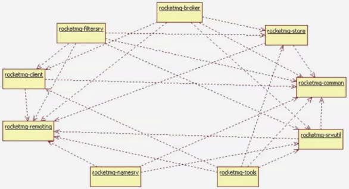
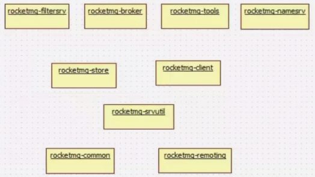
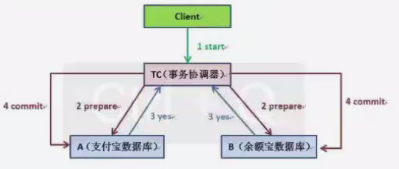
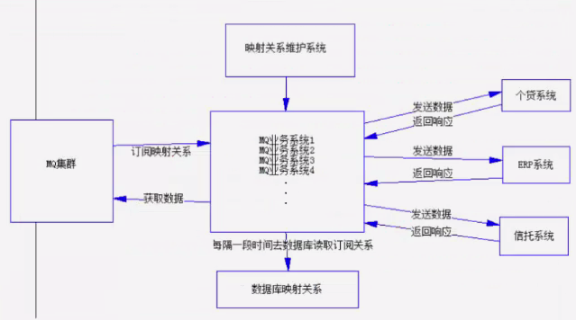
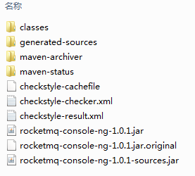
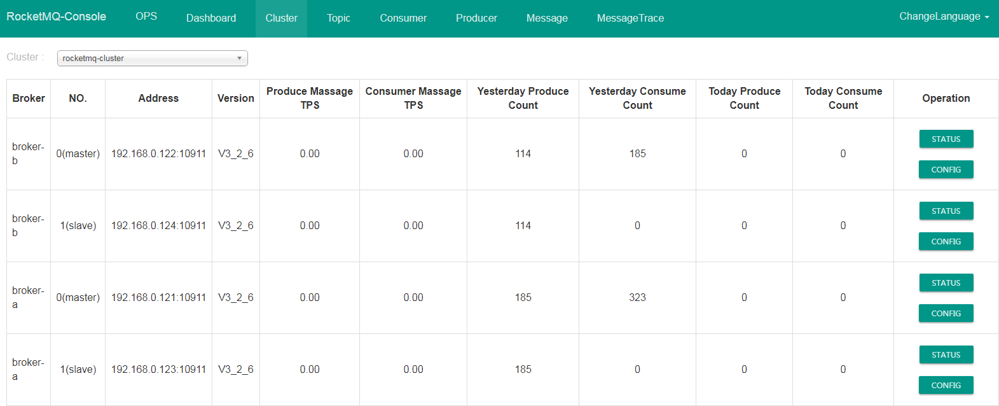

<!-- START doctoc generated TOC please keep comment here to allow auto update -->
<!-- DON'T EDIT THIS SECTION, INSTEAD RE-RUN doctoc TO UPDATE -->
**Table of Contents**  *generated with [DocToc](https://github.com/thlorenz/doctoc)*

- [RocketMQ](#rocketmq)
  - [目录](#%E7%9B%AE%E5%BD%95)
  - [1.1 RocketMQ简介](#11-rocketmq%E7%AE%80%E4%BB%8B)
  - [1.2 选择RocketMQ的理由](#12-%E9%80%89%E6%8B%A9rocketmq%E7%9A%84%E7%90%86%E7%94%B1)
  - [1.3 RocketMQ 介绍](#13-rocketmq-%E4%BB%8B%E7%BB%8D)
  - [2.x RocketMQ 环境搭建](#2x-rocketmq-%E7%8E%AF%E5%A2%83%E6%90%AD%E5%BB%BA)
  - [3.1 RocketMQ 准备工作](#31-rocketmq-%E5%87%86%E5%A4%87%E5%B7%A5%E4%BD%9C)
  - [3.2 Hello World](#32-hello-world)
  - [4.1 RocketMQ之架构](#41-rocketmq%E4%B9%8B%E6%9E%B6%E6%9E%84)
  - [5.1 RocketMQ详解-基本设计](#51-rocketmq%E8%AF%A6%E8%A7%A3-%E5%9F%BA%E6%9C%AC%E8%AE%BE%E8%AE%A1)
  - [5.2 RocketMQ详解-Producer](#52-rocketmq%E8%AF%A6%E8%A7%A3-producer)
        - [顺序模式示例](#%E9%A1%BA%E5%BA%8F%E6%A8%A1%E5%BC%8F%E7%A4%BA%E4%BE%8B)
  - [5.3 MQ避免分布式事务案例](#53-mq%E9%81%BF%E5%85%8D%E5%88%86%E5%B8%83%E5%BC%8F%E4%BA%8B%E5%8A%A1%E6%A1%88%E4%BE%8B)
        - [事务模式示例](#%E4%BA%8B%E5%8A%A1%E6%A8%A1%E5%BC%8F%E7%A4%BA%E4%BE%8B)
  - [5.4 RocketMQ详解-Consumer](#54-rocketmq%E8%AF%A6%E8%A7%A3-consumer)
        - [MQPullConsumer示例（不常用）](#mqpullconsumer%E7%A4%BA%E4%BE%8B%E4%B8%8D%E5%B8%B8%E7%94%A8)
        - [PullScheduleService示例（不常用）](#pullscheduleservice%E7%A4%BA%E4%BE%8B%E4%B8%8D%E5%B8%B8%E7%94%A8)
  - [5.5 Consumer配置参数](#55-consumer%E9%85%8D%E7%BD%AE%E5%8F%82%E6%95%B0)
  - [5.6 RocketMQ详解-Filter](#56-rocketmq%E8%AF%A6%E8%A7%A3-filter)
  - [6.1 应用案例](#61-%E5%BA%94%E7%94%A8%E6%A1%88%E4%BE%8B)
  - [6.2 应用案例示意图](#62-%E5%BA%94%E7%94%A8%E6%A1%88%E4%BE%8B%E7%A4%BA%E6%84%8F%E5%9B%BE)
  - [7.1 集群监控与运维](#71-%E9%9B%86%E7%BE%A4%E7%9B%91%E6%8E%A7%E4%B8%8E%E8%BF%90%E7%BB%B4)

<!-- END doctoc generated TOC please keep comment here to allow auto update -->

# RocketMQ

## 目录

1、RocketMQ简介

2、RocketMQ环境搭建

3、RocketMQ之HelloWorld

4、RocketMQ之架构设计

5、RocketMQ API详解

6、RocketMQ实战

7、RocketMQ管理员集群操作

## 1.1 RocketMQ简介

RocketMQ是一款分布式、队列模型的消息中间件，具有以下特点：

-   能够保证严格的消息顺序
-   提供丰富的消息拉取模式
-   高效的订阅者水平扩展能力
-   实时的消息订阅机制
-   亿级消息堆积能力

## 1.2 选择RocketMQ的理由

1.  强调集群无单点，可扩展，任意一点高可用，水平可扩展。
2.  海量消息堆积能力，消息堆积后，写入低延迟。
3.  支持上万个队列。
4.  消息失败重试机制。
5.  消息可查询
6.  开源社区活跃
7.  成熟度（经过双十一考验）

## 1.3 RocketMQ 介绍

大约经历了三个主要版本迭代

**一、Metaq Metamorphosis 1.x**

由开源社区killme2008 维护 ，开源社区非常活跃。

https://github.com/killme2008/Metamorphosis

**二、Metaq 2.x**

于2012 年 10 月份上线， 在淘宝内部被广泛使用 。

**三、RocketMQ 3.x**

基于公司内部开源共建原则， RocketMQ 项目只维护核心功能，且去除了所有其他运行时依赖，核心功能最
简化。每个BU 的个性化需求都在 RocketMQ 项目之上进行深度定制。 RocketMQ 向其他 BU 提供的仅仅是
Jar 包，例如要定制一个 Broker，那么只需要依赖 rocketmq broker 这个 jar 包即可，可通过 API 进行交互，如果定制 client ，则依赖 rocketmq client 这个 jar 包，对其提供的 api 进行再封装。

**开源社区地址**：https://github.com/alibaba/RocketMQ

## 2.x RocketMQ 环境搭建

我们参考《rocketMQ使用手册.pdf》进行搭建

-   **双Master模式**（推荐使用这种模式，性能最好）

-   **多Master多slave**的方式，**异步复制**（可以保证实时消费）

-   **多Master多slave**的方式，**同步双写**（可以保证实时消费，并且保证数据不丢失，但是性能会较异步复制的方式稍微差一点）

## 3.1 RocketMQ 准备工作

我们使用maven进行搭建项目环境：

repository查询地址：mvnrepository.com

需要安装私服：nexus

我们建立一个小的maven项目，springMVC+MyBatis整合，要熟悉maven项目，一般企业中都会使用maven。

我们需要在linux上安装jdk-1.7

-   `vi /etc/profile`，增加内容如下：

```bash
export JAVA_HOME=/usr/local/jdk1.7
export PATH=.:$JAVA_HOME/bin:$PATH
```

-   `source /etc/profile`使用配置立即生效

-   `java -version`进行验证

## 3.2 Hello World

我们要使用RocketMQ，非常简单。分为以下步骤：

**生产者**：

```java
/**
 * Producer，发送消息
 */
public class Producer {
    public static void main(String[] args) throws MQClientException, InterruptedException {
        // 1、创建DefaultMQProducer类产并设定生产者名称
        DefaultMQProducer producer = new DefaultMQProducer("quickstart_producer");
        // 2、设置setNamesrvAddr，集群模式用“;”进行分割
        producer.setNamesrvAddr("192.168.0.121:9876;192.168.0.122:9876;192.168.0.123:9876;192.168.0.124:9876");
        // 3、调用start方法启动即可
        producer.start();

        for (int i = 0; i < 100; i++) {
            try {
                // 4、使用Message类进行实例化消息，参数分别为：主题、标签、内容
                Message msg = new Message("TopicQuickStart", // topic
                        "TagA", // tag
                        ("Hello RocketMQ " + i).getBytes()// body
                );
                // 5、调用send方法发送信息
                SendResult sendResult = producer.send(msg);
                System.out.println(sendResult);
            } catch (Exception e) {
                e.printStackTrace();
                Thread.sleep(1000);
            }
        }
        // 6、并且关闭生产者
        producer.shutdown();
    }
}
```

**消费者**：

```java
import com.alibaba.rocketmq.client.consumer.DefaultMQPushConsumer;
import com.alibaba.rocketmq.client.consumer.listener.ConsumeConcurrentlyContext;
import com.alibaba.rocketmq.client.consumer.listener.ConsumeConcurrentlyStatus;
import com.alibaba.rocketmq.client.consumer.listener.MessageListenerConcurrently;
import com.alibaba.rocketmq.client.exception.MQClientException;
import com.alibaba.rocketmq.common.consumer.ConsumeFromWhere;
import com.alibaba.rocketmq.common.message.MessageExt;

/**
 * Consumer，订阅消息
 */
public class Consumer {

    public static void main(String[] args) throws InterruptedException, MQClientException {
        // 1、创建DefaultMQPushConsumer类并设定消费者名称
        DefaultMQPushConsumer consumer = new DefaultMQPushConsumer("quickstart_consumer");
        // 2、设置setNamesrvAddr，集群模式用“;”进行分割
        consumer.setNamesrvAddr("192.168.0.121:9876;192.168.0.122:9876;192.168.0.123:9876;192.168.0.124:9876");
        /**
         * 设置Consumer第一次启动是从队列头部开始消费还是队列尾部开始消费<br>
         * 如果非第一次启动，那么按照上次消费的位置继续消费
         */
        consumer.setConsumeFromWhere(ConsumeFromWhere.CONSUME_FROM_FIRST_OFFSET);
        // 3、设置DefaultMQPushConsumer实例的订阅主题，一个消费者对象可以订阅多个主题，使用subscribe方法订阅（参数1：主题名称，参数2：标签内容，可以使用“||”对标签内容进行合并获取）
        consumer.subscribe("TopicQuickStart", "*");
        // 4、消费者实例进行注册监听：设置registerMessageListener方法
        consumer.registerMessageListener(new MessageListenerConcurrently() {
            // 5、监听类实现MessageListenerConcurrently接口即可，重写consumeMessage方法接收数据
            @Override
            public ConsumeConcurrentlyStatus consumeMessage(List<MessageExt> msgs, ConsumeConcurrentlyContext context) {
                try {
                    for (MessageExt msg : msgs) {
                        String topic = msg.getTopic();
                        String msgBody = new String(msg.getBody(), "utf-8");
                        String tags = msg.getTags();
                        System.out.println("收到消息：" + " topic : " + topic + ", tags : " + tags + ", msg : " + msgBody);
                    }
                } catch (Exception e) {
                    e.printStackTrace();
                    // 消息处理过程中出现异常，进行重试
                    return ConsumeConcurrentlyStatus.RECONSUME_LATER;
                }
                // 消息接收并处理成功
                return ConsumeConcurrentlyStatus.CONSUME_SUCCESS;
            }
        });
        // 6、启动消费者实例对象，调用start方法即可
        consumer.start();

        System.out.println("Consumer Started.");
    }
}
```

## 4.1 RocketMQ之架构

RocketMQ包含9个子模块



 源码：https://github.com/apache/rocketmq

**rocketmq-common**：通用的常量枚举、基类方法或者数据结构，按描述的目标来分包，通俗易懂。包名有：admin、consumer、filter、hook、message等。

**rocketmq-remoting**：用Netty4写的客户端和服务端，fastjson做的序列化，自定义二进制协议。

**rocketmq-srvutil**：只有一个ServerUtil类，类注解时，只提供Server程序依赖，目的为了拆解客户端依赖，尽可能减少客户端的依赖。

**rocketmq-store**：存储服务，消息存储，索引存储，commitLog存储。

**rocketmq-client**：客户端，包含producer端和consumer端，发送消息和接收消息的过程。

**rocketmq-filtersrv**：消息过滤器server，现在rocketmq的wiki上有示例代码和说明，https://github.com/apache/rocketmq/tree/master/example/

**rocketmq-broker**：对consumer和producer来说是服务端，接producer发来的消息并存储，同时consumer业这里拉取消息。

**rocketmq-tools**：命令行工具。

**rocketmq-namesrv**：NameServer，类似SOA服务的注册中心，这里保存着消息的TopicName，队列等运行时的meta消息。一般系统分为dataNode和nameNode，这里是nameNode。

**模块依赖**：最底层为基础实现，最上层为对外提供的服务。



**rocketmq-namesrv模块介绍**

-   rocketmq-namesrv扮演着nameNode角色，记录运行时消息相关的meta信息以及broker和filtersrv运行时信息，可以部署集群。
-   我们可以把namesrv理解成一个轻量级的zookeeper，他比zookeeper性能更好，并且比zookeeper的可靠性更强。
-   rocketmq-namesrv主要是节点之间相互进行心跳检测、数据通信、集群高可靠性、一致性、容错性等方面的核心模块。
-   rocketmq-namesrv的底层通信机制与Netty4进行联系，上层通信与各个模块产生强一致性的对应关系。当broker、producer、consumer都运行后，namesrv一共有8类线程，如：守护进程、定时任务线程、Netty的boss线程、NettyEventExecuter线程、DestroyJavaVM线程、Worker线程、Handler线程、RemotingExecutorThread线程。

**rocketmq-namesrv 8类线程详解**

-   serverHouseKeepingService：守护线程，本质是ChannelEventListener，监听broker的channel变化来更新本地的RouteInfo。
-   NSScheduledThread1：定时任务线程，定时跑2个任务，第一个是，每隔10分钟扫描出不活动的broker，然后从routeInfo中删除，第二个是，每隔10分钟定时打印configTable的信息。
-   NettyBossSelector_1：Netty的boss线程（ Accept线程），这里只有一根线程。
-   NettyEventExecuter：一个单独的线程，监听NettyChannel状态变化来通知ChannelEventListener做响应的动作。
-   DestroyJavaVM：java虚拟机的析构钩子，一般当虚拟机关闭时用来清理和释放资源。
-   NettyServerSelector_x_x：Netty的Worker线程（IO线程），这里可能有很多根线程。
-   NeetServerWorkerThread_x：执行ChannelHandler方法的线程，ChannelHandler运行在该线程上，这里可能有很多根线程。
-   RemotingExecutorThread_x：服务端逻辑线程，这里可能有很多根线程。

**rocketmq-broker模块介绍**

-   这个是数据存储的核心，也就是真正的MQ服务器。我们所谓的消息存储、接收、摘取、推送操作都是在broker上进行的。

**rocketmq-filtersrv模块介绍**

-   在rocketmq中，使用独立的一个模块去对数据进行过滤，实现了真正意义上的高内聚低耦合的设计思想。
-   我们在使用rocketmq-filtersrv模块时也需要启动filter服务。

## 5.1 RocketMQ详解-基本设计

在RocketMQ里，可以理解为没有类似于ActiveMQ的createQueue和createTopic的语法，也就是点对点和发布订阅模型。RocketMQ不遵循JMS规范，自己有一套自定义的机制，简单来说都是使用订阅主题的方式去发送和接收任务的，但是支持集群和广播两种消息模式。

-   **集群模式**：设置消费端对象属性：`MessageModel.CLUSTERING`，这种方式就可以达到类似于ActiveMQ水平扩展负载均衡消费消息的实现，比较特殊的是，这种行为可以支持先发送数据（也就是生产端先传送数据到MQ），消费端订阅主题发生在生产端之后也可以收到数据，比较灵活。
-   **广播模式**：设置消费端对象属性：`MessageMode.BROADCASTING`，这种模式就是相当于生产端发送数据到MQ，多个消费端都可以获得到数据。

在RocketMQ里，有一个很重要的概念，就是**GroupName**，无论是生产端还是消费端，都必须指定一个GroupName，这个组名称，是维护在应用系统级别上的，比如生产端指定一个名称：producerGroupName，这个名称是需要由应用系统来保证唯一性的，一类Producer集合的名称，这类Producer通常发送一类消息，且发送逻辑一致。同理消费端也是如此。

**Topic**主题，每个主题表示一个逻辑上存储的概念，而在其MQ上，会有着与之相应的多个Queue队列，这个是物理存储的概念。

## 5.2 RocketMQ详解-Producer

对于Producer，它可以发送信息，并且可以对多个主题去发送信息，这种设计非常的灵活，而且可以通过Tag定义一些简单的过滤，通常已经满足我们90%的需求了，如果更复杂的过滤场景下，可能会使用filtersrv组件。

Producer的用途大家都很清楚，主要是生产消息，那么分布式模式下与单队列模式不一样，如何能够充分利用分布式的优势，将生产的消息分布到不同的队列下呢？RocketMQ提供了三种不同模式的Producer：

-   NormalProducer（普通）
-   OrderProducer（顺序）
-   TransactionProducer（事务）

**普通模式**：就不必多说了，使用传统的send发送信息即可。这种模式下不能保证消息的顺序一致性。

**顺序模式**：RocketMQ可以保证严格的消息顺序进行消费。

-   遵循全局顺序的时候使用一个queue，局部顺序的时候可以使用多个queue并行消息。

**事务模式**：支持事务方式对消息进行提交处理，在rocketmq里事务分为两个阶段。

-   第一阶段：把消息传递给MQ，只不过消费端不可见，但是数据其实已经发送到broker上了。
-   第二阶段：本地消息回调处理，如果成功，返回COMMIT_MESSAGE，则在broker上的数据对消费端可见，失败则为ROLLBACK_MESSAGE，消费端不可见。

>   消息顺序和重复问题可参考：https://www.jianshu.com/p/453c6e7ff81c

##### 顺序模式示例

Producer.java

```java
import java.util.List;

import com.alibaba.rocketmq.client.exception.MQBrokerException;
import com.alibaba.rocketmq.client.exception.MQClientException;
import com.alibaba.rocketmq.client.producer.DefaultMQProducer;
import com.alibaba.rocketmq.client.producer.MessageQueueSelector;
import com.alibaba.rocketmq.client.producer.SendResult;
import com.alibaba.rocketmq.common.message.Message;
import com.alibaba.rocketmq.common.message.MessageQueue;
import com.alibaba.rocketmq.remoting.exception.RemotingException;

/**
 * Producer，发送顺序消息
 */
public class Producer {
    public static void main(String[] args) {
        try {
            DefaultMQProducer producer = new DefaultMQProducer("quickstart_producer");
            producer.setNamesrvAddr("192.168.0.121:9876;192.168.0.122:9876;192.168.0.123:9876;192.168.0.124:9876");
            producer.start();

            String[] tags = new String[] { "TagA", "TagB", "TagC" };

            for (int i = 0; i < 20; i++) {
                // 订单ID相同的消息要有序
                int orderId = i % 3;
                Message msg = new Message("TopicQuickStart", tags[i % tags.length], "KEY" + i,
                        ("Hello RocketMQ " + i).getBytes());

                SendResult sendResult = producer.send(msg, new MessageQueueSelector() {
                    @Override
                    public MessageQueue select(List<MessageQueue> mqs, Message msg, Object arg) {
                        Integer id = (Integer) arg;
                        int index = id % mqs.size();
                        return mqs.get(index);
                    }
                }, orderId);

                System.out.println(sendResult);
            }

            producer.shutdown();
        } catch (MQClientException e) {
            e.printStackTrace();
        } catch (RemotingException e) {
            e.printStackTrace();
        } catch (MQBrokerException e) {
            e.printStackTrace();
        } catch (InterruptedException e) {
            e.printStackTrace();
        }
    }
}
```

Consumer.java

```java
import java.util.List;

import com.alibaba.rocketmq.client.consumer.DefaultMQPushConsumer;
import com.alibaba.rocketmq.client.consumer.listener.ConsumeOrderlyContext;
import com.alibaba.rocketmq.client.consumer.listener.ConsumeOrderlyStatus;
import com.alibaba.rocketmq.client.consumer.listener.MessageListenerOrderly;
import com.alibaba.rocketmq.client.exception.MQClientException;
import com.alibaba.rocketmq.common.consumer.ConsumeFromWhere;
import com.alibaba.rocketmq.common.message.MessageExt;

/**
 * 顺序消息消费，带事务方式（应用可控制Offset什么时候提交）
 */
public class Consumer {

    public static void main(String[] args) throws MQClientException {
        DefaultMQPushConsumer consumer = new DefaultMQPushConsumer("quickstart_consumer");
        consumer.setNamesrvAddr("192.168.0.121:9876;192.168.0.122:9876;192.168.0.123:9876;192.168.0.124:9876");
        /**
         * 设置Consumer第一次启动是从队列头部开始消费还是队列尾部开始消费<br>
         * 如果非第一次启动，那么按照上次消费的位置继续消费
         */
        consumer.setConsumeFromWhere(ConsumeFromWhere.CONSUME_FROM_FIRST_OFFSET);

        consumer.subscribe("TopicQuickStart", "*");

        consumer.registerMessageListener(new MessageListenerOrderly() {

            @Override
            public ConsumeOrderlyStatus consumeMessage(List<MessageExt> msgs, ConsumeOrderlyContext context) {
                context.setAutoCommit(true);
                try {
                    for (MessageExt msg : msgs) {
                        String topic = msg.getTopic();
                        String msgBody = new String(msg.getBody(), "utf-8");
                        String tags = msg.getTags();
                        System.out.println("收到消息：" + " topic : " + topic + ", tags : " + tags + ", msg : " + msgBody);
                    }
                } catch (Exception e) {
                    e.printStackTrace();
                    // 消息处理过程中出现异常，进行回滚
                    return ConsumeOrderlyStatus.ROLLBACK;
                }

                return ConsumeOrderlyStatus.SUCCESS;
            }
        });

        consumer.start();

        System.out.println("Consumer Started.");
    }
}
```

结果输出：

```bash
收到消息： topic : TopicQuickStart, tags : TagC, msg : Hello RocketMQ 2
收到消息： topic : TopicQuickStart, tags : TagC, msg : Hello RocketMQ 5
收到消息： topic : TopicQuickStart, tags : TagC, msg : Hello RocketMQ 8
收到消息： topic : TopicQuickStart, tags : TagC, msg : Hello RocketMQ 11
收到消息： topic : TopicQuickStart, tags : TagC, msg : Hello RocketMQ 14
收到消息： topic : TopicQuickStart, tags : TagC, msg : Hello RocketMQ 17
收到消息： topic : TopicQuickStart, tags : TagA, msg : Hello RocketMQ 0
收到消息： topic : TopicQuickStart, tags : TagA, msg : Hello RocketMQ 3
收到消息： topic : TopicQuickStart, tags : TagA, msg : Hello RocketMQ 6
收到消息： topic : TopicQuickStart, tags : TagA, msg : Hello RocketMQ 9
收到消息： topic : TopicQuickStart, tags : TagA, msg : Hello RocketMQ 12
收到消息： topic : TopicQuickStart, tags : TagA, msg : Hello RocketMQ 15
收到消息： topic : TopicQuickStart, tags : TagA, msg : Hello RocketMQ 18
收到消息： topic : TopicQuickStart, tags : TagB, msg : Hello RocketMQ 1
收到消息： topic : TopicQuickStart, tags : TagB, msg : Hello RocketMQ 4
收到消息： topic : TopicQuickStart, tags : TagB, msg : Hello RocketMQ 7
收到消息： topic : TopicQuickStart, tags : TagB, msg : Hello RocketMQ 10
收到消息： topic : TopicQuickStart, tags : TagB, msg : Hello RocketMQ 13
收到消息： topic : TopicQuickStart, tags : TagB, msg : Hello RocketMQ 16
收到消息： topic : TopicQuickStart, tags : TagB, msg : Hello RocketMQ 19
```

>   注：相同Tag下顺序消费

## 5.3 MQ避免分布式事务案例

前阵子从支付宝转帐1万块到余额宝，这是日常生活和一件普通小事，但作为互联网研发人员的职业病，我就思考支付宝扣除1万之后，如果系统挂掉怎么办，这时余额宝帐户并没有增加1万，数据就会出现不一致头部了。

上述场景在各个类型的系统中都能找到相似影子，比如在电商系统中，当有用户下单后，除了在订单表插入一条记录外，对应商品表的这个商品数量必须减1吧，怎么保证？！在搜索广告系统中，当用户点击某广告后，除了点击事件表中增加一条记录外，还得去商家帐户表中找到这个商家并扣除广告费吧，怎么保证？！等等，相信大家或多或少都能碰到相似场景。

**本地事务**（LocalTransaction）还是以支付宝转帖余额宝为例，假设有

支付宝帐户表：`A（id, userid, amount）`

余额宝帐户表：`B（id, userid, amount）`

用户的userid=1，从支付宝转帐1万块钱到余额宝的动作分为两步：

1、支付宝表扣除1万：`update A set amount=amount-10000 where userid=1;`

2、余额宝增加1万：`update B set amount=amount+10000 where userid=1;`

如何确保支付宝余额宝收支平衡呢？有人说这个很简单嘛，可以用事务解决。

```mysql
begin transaction
update A set amount=amount-10000 where userid=1;
update B set amount=amount+10000 where userid=1;
end transaction
commit;
```

非常正确，如果你使用spring的话一个注解（@Transactional）就能搞定上述事务功能。

如果系统规模较小，数据表都在一个数据库实例上，上述本地事务方式可以很好地运行，但是如果系统规模较大，比如支付宝帐户表和余额宝帐户表显然不会在同一个数据实例上，他们往往分布在不同的物理节点上，这时本地事务已经失去用武之地。

**两阶段提交协议**（Two-phase Commit, 2PC）经常被用来实现**分布式事务**。一般分为协调器C和若干事务执行者Si两种事务，这里的事务执行者就是具体的数据库，协调器可以和事务执行器在一台机器上。



1、两阶段提交涉及多次节点间的网络通信，通信时间太长！

2、事务时间相对于变长了，锁定的资源时间也变长了，造成资源等待时间增加好多！

正是由于分布式事务存在很严重的性能问题，大部分高并发服务都在避免使用，往往通过其他途径来解决数据一致性问题。

**使用消息队列来避免分布式事务**

如果仔细观察生活的话，生活的很多场景已经给了我们提示。

比如在北京有名的姚记炒肝，点了炒肝并付了钱后，他们并不会直接把你点的炒肝给你，而是给你一张小票，然后让你拿着小票到出货区排除去取。为什么他们要将付钱和取货两个动作分开呢？原因很多，其中一个很重要的原因是为了使他们接待能力增加（并发量更高）。

还是回到我们的问题，只要这张小票在，你最终是能拿到炒肝的。同理转账服务也是如此，当支付宝帐户扣除1万后，我们只要生成一个凭证（消息）即可，这个凭证（消息）上写着“让余额宝帐户增加1万”，只要这个凭证（消息）能可靠保存，我们最终是可以拿着这个凭证（消息）让余额宝帐户增加1万的，即我们能依靠这个凭证（消息）完成最终一致性。

**如何可靠保存凭证（消息）**，有两种方式：

第一种：**业务和消息耦合**方式

支付宝在完成扣款的同时，同时记录消息数据，这个消息数据和业务数据保存在同一数据为实例里（消息记录表表名为message）。

```mysql
begin transaction
update A set amount=amount-10000 where userid=1;
insert into message(userid, amount, status) values(1, 10000, 1);
end transaction
commit;
```

上述事务能保证只要支付宝帐户被扣了钱，消息一定能保存下来。

当上述事务提交成功后，我们通过实时消息服务将此消息通知余额宝，余额宝处理成功后发送回复成功消息，支付宝收到回复后删除该条消息数据。

第二种：**业务和消息解耦**方式

上述保存消息的方式使得消息数据和业务数据紧耦合在一起，从架构上看不够优雅，而且容易诱发其他问题。为了解耦，可以采用以下方式。

1、支付宝在扣款事务提交之前，向实时消息服务请求发送消息，实时消息服务只记录消息数据，而不真正发送，只有消息发送成功后才会提交事务。

2、当支付宝扣款事务被提交成功后，向实时消息服务确认发送。只有在得到确认发送指令后，服务才真正发送该消息。

3、当支付宝扣款事务提交失败回滚后，向实时消息服务取消发送。在得到取消发送指令后，该消息将不会被发送。

4、对于那些未确认的消息或者取消的消息，需要有一个消息状态确认系统定时去支付宝系统查询这个消息的状态并进行更新。为什么需要这一步骤，举个例子：假设在支付宝事务被成功提交后，系统挂了，此时消息状态并未被更新为“确认发送”，从而导致消息不能被发送。

**优点**：消息数据独立存储，降低业务系统与消息系统间的耦合。

**缺点**：一次消息发送需要两次请求，业务处理服务需要实现消息状态回查接口。

**如何解决消息重复投递的问题**，这个问题仅仅是会在第一种：业务与消息耦合的方式的情况下才会产生，因为支付宝保存了消息记录，余额宝处理成功之后需要发送处理成功的消息给支付宝，支付宝进行确认后，把消息记录状态删除或做变更。而我们的业务与消息解耦的方式则不需要考虑消息重复投递的问题，因为我们完全信任MQ中间件。

第一种方式的消息重复投递问题说明：

以我们支付宝转帐到余额宝为例，如果相同的消息被重复投递两次，那么我们余额宝帐户将会增加2万而不是1万了。

为什么相同的消息会被重复投递？比如余额宝处理消息后，发送了处理成功的消息给支付宝，正常情况下支付宝应该要删除消息，但如果支付宝这时候悲剧挂了，重启后一看消息还在，就会继续发送消息。

解决方法很简单，在余额宝这边增加消息应用状态表（message_apply），通俗来说就是个帐本，用于记录消息的消费情况，每次来一个消息，在真正执行之前，先去消息应用状态表中查询一遍，如果找到说明是重复消息，丢弃即可，如果没找到才执行，同时插入消息应用状态表（同一事务）。

##### 事务模式示例

TransactionProducer.java

```java
import com.alibaba.rocketmq.client.exception.MQClientException;
import com.alibaba.rocketmq.client.producer.SendResult;
import com.alibaba.rocketmq.client.producer.TransactionCheckListener;
import com.alibaba.rocketmq.client.producer.TransactionMQProducer;
import com.alibaba.rocketmq.common.message.Message;

/**
 * 发送事务消息例子
 */
public class TransactionProducer {
    public static void main(String[] args) throws MQClientException, InterruptedException {

        TransactionCheckListener transactionCheckListener = new TransactionCheckListenerImpl();
        TransactionMQProducer producer = new TransactionMQProducer("quickstart_producer");
        producer.setNamesrvAddr("192.168.0.121:9876;192.168.0.122:9876;192.168.0.123:9876;192.168.0.124:9876");
        // 事务回查最小并发数
        producer.setCheckThreadPoolMinSize(2);
        // 事务回查最大并发数
        producer.setCheckThreadPoolMaxSize(2);
        // 队列数
        producer.setCheckRequestHoldMax(2000);
        producer.setTransactionCheckListener(transactionCheckListener);
        producer.start();

        String[] tags = new String[] { "TagA", "TagB", "TagC" };
        TransactionExecuterImpl tranExecuter = new TransactionExecuterImpl();
        for (int i = 0; i < 20; i++) {
            try {
                Message msg = new Message("TopicQuickStart", tags[i % tags.length], "KEY" + i,
                        ("Hello RocketMQ " + i).getBytes());
                SendResult sendResult = producer.sendMessageInTransaction(msg, tranExecuter, null);
                System.out.println(sendResult);

                Thread.sleep(10);
            } catch (MQClientException e) {
                e.printStackTrace();
            }
        }

        for (int i = 0; i < 100000; i++) {
            Thread.sleep(1000);
        }

        producer.shutdown();
    }
}
```

TransactionExecuterImpl.java

```java
import java.util.concurrent.atomic.AtomicInteger;

import com.alibaba.rocketmq.client.producer.LocalTransactionExecuter;
import com.alibaba.rocketmq.client.producer.LocalTransactionState;
import com.alibaba.rocketmq.common.message.Message;

/**
 * 执行本地事务
 */
public class TransactionExecuterImpl implements LocalTransactionExecuter {
    private AtomicInteger transactionIndex = new AtomicInteger(1);

    @Override
    public LocalTransactionState executeLocalTransactionBranch(final Message msg, final Object arg) {
        int value = transactionIndex.getAndIncrement();

        if ((value % 6) == 0) {
            throw new RuntimeException("Could not find db");
        } else if ((value % 5) == 0) {
            return LocalTransactionState.ROLLBACK_MESSAGE;
        } else if ((value % 4) == 0) {
            return LocalTransactionState.COMMIT_MESSAGE;
        }

        return LocalTransactionState.UNKNOW;
    }
}
```

TransactionCheckListenerImpl.java

```java
import java.util.concurrent.atomic.AtomicInteger;

import com.alibaba.rocketmq.client.producer.LocalTransactionState;
import com.alibaba.rocketmq.client.producer.TransactionCheckListener;
import com.alibaba.rocketmq.common.message.MessageExt;

/**
 * 未决事务，服务器回查客户端
 */
public class TransactionCheckListenerImpl implements TransactionCheckListener {
    private AtomicInteger transactionIndex = new AtomicInteger(0);

    @Override
    public LocalTransactionState checkLocalTransactionState(MessageExt msg) {
        System.out.println("server checking TrMsg " + msg.toString());

        int value = transactionIndex.getAndIncrement();
        if ((value % 6) == 0) {
            throw new RuntimeException("Could not find db");
        } else if ((value % 5) == 0) {
            return LocalTransactionState.ROLLBACK_MESSAGE;
        } else if ((value % 4) == 0) {
            return LocalTransactionState.COMMIT_MESSAGE;
        }

        return LocalTransactionState.UNKNOW;
    }
}
```

Consumer.java

```java
import java.util.List;

import com.alibaba.rocketmq.client.consumer.DefaultMQPushConsumer;
import com.alibaba.rocketmq.client.consumer.listener.ConsumeConcurrentlyContext;
import com.alibaba.rocketmq.client.consumer.listener.ConsumeConcurrentlyStatus;
import com.alibaba.rocketmq.client.consumer.listener.MessageListenerConcurrently;
import com.alibaba.rocketmq.client.exception.MQClientException;
import com.alibaba.rocketmq.common.consumer.ConsumeFromWhere;
import com.alibaba.rocketmq.common.message.MessageExt;

/**
 * Consumer，订阅消息
 */
public class Consumer {

    public static void main(String[] args) throws InterruptedException, MQClientException {
        // 1、创建DefaultMQPushConsumer类并设定消费者名称
        DefaultMQPushConsumer consumer = new DefaultMQPushConsumer("quickstart_consumer");
        // 2、设置setNamesrvAddr，集群模式用“;”进行分割
        consumer.setNamesrvAddr("192.168.0.121:9876;192.168.0.122:9876;192.168.0.123:9876;192.168.0.124:9876");
        /**
         * 设置Consumer第一次启动是从队列头部开始消费还是队列尾部开始消费<br>
         * 如果非第一次启动，那么按照上次消费的位置继续消费
         */
        consumer.setConsumeFromWhere(ConsumeFromWhere.CONSUME_FROM_FIRST_OFFSET);
        // 3、设置DefaultMQPushConsumer实例的订阅主题，一个消费者对象可以订阅多个主题，使用subscribe方法订阅（参数1：主题名称，参数2：标签内容，可以使用“||”对标签内容进行合并获取）
        consumer.subscribe("TopicQuickStart", "*");
        // 4、消费者实例进行注册监听：设置registerMessageListener方法
        consumer.registerMessageListener(new MessageListenerConcurrently() {
            // 5、监听类实现MessageListenerConcurrently接口即可，重写consumeMessage方法接收数据
            @Override
            public ConsumeConcurrentlyStatus consumeMessage(List<MessageExt> msgs, ConsumeConcurrentlyContext context) {
                try {
                    for (MessageExt msg : msgs) {
                        String topic = msg.getTopic();
                        String msgBody = new String(msg.getBody(), "utf-8");
                        String tags = msg.getTags();
                        System.out.println("收到消息：" + " topic : " + topic + ", tags : " + tags + ", msg : " + msgBody);
                    }
                } catch (Exception e) {
                    e.printStackTrace();
                    // 消息处理过程中出现异常，进行重试
                    return ConsumeConcurrentlyStatus.RECONSUME_LATER;
                }
                // 消息接收并处理成功
                return ConsumeConcurrentlyStatus.CONSUME_SUCCESS;
            }
        });
        // 6、启动消费者实例对象，调用start方法即可
        consumer.start();

        System.out.println("Consumer Started.");
    }
}
```

结果输出：

```bash
收到消息： topic : TopicQuickStart, tags : TagA, msg : Hello RocketMQ 15
收到消息： topic : TopicQuickStart, tags : TagA, msg : Hello RocketMQ 3
收到消息： topic : TopicQuickStart, tags : TagB, msg : Hello RocketMQ 7
```

## 5.4 RocketMQ详解-Consumer

在RocketMQ里，Consumer被分为2类：**MQPullConsumer**和**MQPushConsumer**。

前者其实本质是拉模式（pull），即Consumer轮询从broker摘取消息。

后者是push方式，Consumer把轮询过程封装了，并注册MessageListener监听器，取到消息后，唤醒MessageListener的consumerMessage()来消费，对用户而言，感觉消息是被推送过来的。

pull方式里，取消息的过程需要自己写，首先通过打算消费的Topic拿到MessageQueue的集合，遍历MessageQueue集合，然后针对每个MessageQueue批量取消息，一次取完后，记录该队列下一次要取的开始offset，直到取完了，再换另一个MessageQueue。

##### MQPullConsumer示例（不常用）

```java
import java.util.HashMap;
import java.util.Map;
import java.util.Set;

import com.alibaba.rocketmq.client.consumer.DefaultMQPullConsumer;
import com.alibaba.rocketmq.client.consumer.PullResult;
import com.alibaba.rocketmq.client.exception.MQClientException;
import com.alibaba.rocketmq.common.message.MessageQueue;


/**
 * PullConsumer，订阅消息
 */
public class PullConsumer {
    private static final Map<MessageQueue, Long> offseTable = new HashMap<MessageQueue, Long>();


    public static void main(String[] args) throws MQClientException {
        DefaultMQPullConsumer consumer = new DefaultMQPullConsumer("please_rename_unique_group_name_5");

        consumer.start();

        Set<MessageQueue> mqs = consumer.fetchSubscribeMessageQueues("TopicTest");
        for (MessageQueue mq : mqs) {
            System.out.println("Consume from the queue: " + mq);
            SINGLE_MQ: while (true) {
                try {
                    PullResult pullResult =
                            consumer.pullBlockIfNotFound(mq, null, getMessageQueueOffset(mq), 32);
                    System.out.println(pullResult);
                    putMessageQueueOffset(mq, pullResult.getNextBeginOffset());
                    switch (pullResult.getPullStatus()) {
                    case FOUND:
                        // TODO
                        break;
                    case NO_MATCHED_MSG:
                        break;
                    case NO_NEW_MSG:
                        break SINGLE_MQ;
                    case OFFSET_ILLEGAL:
                        break;
                    default:
                        break;
                    }
                }
                catch (Exception e) {
                    e.printStackTrace();
                }
            }
        }

        consumer.shutdown();
    }


    private static void putMessageQueueOffset(MessageQueue mq, long offset) {
        offseTable.put(mq, offset);
    }


    private static long getMessageQueueOffset(MessageQueue mq) {
        Long offset = offseTable.get(mq);
        if (offset != null)
            return offset;

        return 0;
    }

}
```

##### PullScheduleService示例（不常用）

```java
import com.alibaba.rocketmq.client.consumer.MQPullConsumer;
import com.alibaba.rocketmq.client.consumer.MQPullConsumerScheduleService;
import com.alibaba.rocketmq.client.consumer.PullResult;
import com.alibaba.rocketmq.client.consumer.PullTaskCallback;
import com.alibaba.rocketmq.client.consumer.PullTaskContext;
import com.alibaba.rocketmq.client.exception.MQClientException;
import com.alibaba.rocketmq.common.message.MessageQueue;
import com.alibaba.rocketmq.common.protocol.heartbeat.MessageModel;


public class PullScheduleService {

    public static void main(String[] args) throws MQClientException {
        final MQPullConsumerScheduleService scheduleService = new MQPullConsumerScheduleService("GroupName1");

        scheduleService.setMessageModel(MessageModel.CLUSTERING);
        scheduleService.registerPullTaskCallback("TopicTest1", new PullTaskCallback() {

            @Override
            public void doPullTask(MessageQueue mq, PullTaskContext context) {
                MQPullConsumer consumer = context.getPullConsumer();
                try {
                    // 获取从哪里拉取
                    long offset = consumer.fetchConsumeOffset(mq, false);
                    if (offset < 0)
                        offset = 0;

                    PullResult pullResult = consumer.pull(mq, "*", offset, 32);
                    System.out.println(offset + "\t" + mq + "\t" + pullResult);
                    switch (pullResult.getPullStatus()) {
                    case FOUND:
                        break;
                    case NO_MATCHED_MSG:
                        break;
                    case NO_NEW_MSG:
                    case OFFSET_ILLEGAL:
                        break;
                    default:
                        break;
                    }

                    // 存储Offset，客户端每隔5s会定时刷新到Broker
                    consumer.updateConsumeOffset(mq, pullResult.getNextBeginOffset());

                    // 设置再过100ms后重新拉取
                    context.setPullNextDelayTimeMillis(100);
                }
                catch (Exception e) {
                    e.printStackTrace();
                }
            }
        });

        scheduleService.start();
    }
}
```

## 5.5 Consumer配置参数

```java
// Consumer启动后，默认从什么位置开始消费：默认CONSUME_FROM_LAST_OFFSET
consumer.setConsumerFrowWhere(ConsumeFromWhere.CONSUME_FROM_LAST_OFFSET);
// 消费线程池最小数量：默认10
consumer.setConsumeThreadMin(10);
// 消费线程池最大数量：默认20
consumer.setConsumeThreadMax(20);
// 垃消息本地队列缓存消息最大数：默认1000
consumer.setPullThresholdForQueue(1000);
// 批量消费，一次消费多少条消息：默认1条
consumer.setConsumeMessageBatchMaxSize(1);
// 批量拉消息，一次最多拉多少条，默认32条
consumer.setPullBatchSize(32);
// 消息拉取线程每隔多久拉取一次，默认为0
consumer.setPullInterval(0);
```

## 5.6 RocketMQ详解-Filter

我们如果想使用RocketMQ的Filter组件，则必须要启动myfiltersrv。

启动的顺序为：namesrv、broker、mqfiltersrv。

使用命令`nohup sh mqfiltersrv -c filter.properties`启动mqfiltersrv，配置文件的配额使用命令`sh mqfiltersrv -p`。

然后我们需要实现MessageFilter接口，进行重写match方法，我们可以针对自己想要过滤的消息进行细粒度的处理。

最后我们需要把自己实现的Filter类，通过消费端的订阅方式，加入到我们的消费端即可。

**示例：**

Producer.java

```java
import com.alibaba.rocketmq.client.exception.MQClientException;
import com.alibaba.rocketmq.client.producer.DefaultMQProducer;
import com.alibaba.rocketmq.client.producer.SendResult;
import com.alibaba.rocketmq.common.message.Message;

public class Producer {
    public static void main(String[] args) throws MQClientException, InterruptedException {
        DefaultMQProducer producer = new DefaultMQProducer("ProducerGroupName");
        producer.start();

        try {
            for (int i = 0; i < 6000000; i++) {
                Message msg = new Message("TopicFilter7",// topic
                    "TagA",// tag
                    "OrderID001",// key
                    ("Hello MetaQ").getBytes());// body

                msg.putUserProperty("SequenceId", String.valueOf(i));

                SendResult sendResult = producer.send(msg);
                System.out.println(sendResult);
            }
        }
        catch (Exception e) {
            e.printStackTrace();
        }

        producer.shutdown();
    }
}
```

Consumer.java

```java
import java.util.List;

import com.alibaba.rocketmq.client.consumer.DefaultMQPushConsumer;
import com.alibaba.rocketmq.client.consumer.listener.ConsumeConcurrentlyContext;
import com.alibaba.rocketmq.client.consumer.listener.ConsumeConcurrentlyStatus;
import com.alibaba.rocketmq.client.consumer.listener.MessageListenerConcurrently;
import com.alibaba.rocketmq.client.exception.MQClientException;
import com.alibaba.rocketmq.common.message.MessageExt;


public class Consumer {

    public static void main(String[] args) throws InterruptedException, MQClientException {
        DefaultMQPushConsumer consumer = new DefaultMQPushConsumer("ConsumerGroupNamecc4");
        /**
         * 使用Java代码，在服务器做消息过滤
         */
        consumer.subscribe("TopicFilter7", MessageFilterImpl.class.getCanonicalName());

        consumer.registerMessageListener(new MessageListenerConcurrently() {

            @Override
            public ConsumeConcurrentlyStatus consumeMessage(List<MessageExt> msgs,
                    ConsumeConcurrentlyContext context) {
                System.out.println(Thread.currentThread().getName() + " Receive New Messages: " + msgs);
                return ConsumeConcurrentlyStatus.CONSUME_SUCCESS;
            }
        });

        /**
         * Consumer对象在使用之前必须要调用start初始化，初始化一次即可<br>
         */
        consumer.start();

        System.out.println("Consumer Started.");
    }
}

```

MessageFilterImpl.java

```java
import com.alibaba.rocketmq.common.filter.MessageFilter;
import com.alibaba.rocketmq.common.message.MessageExt;

public class MessageFilterImpl implements MessageFilter {
    @Override
    public boolean match(MessageExt msg) {
        String property = msg.getUserProperty("SequenceId");
        if (property != null) {
            int id = Integer.parseInt(property);
            if ((id % 3) == 0 && (id > 10)) {
                return true;
            }
        }

        return false;
    }
}
```

## 6.1 应用案例

我们模拟一个真实的项目案例，进行RocketMQ的学习，假设我们有N个订阅关系，也就是说我们可能存在多个Topic主题，或者简单说我们的MQ服务器需要支持多个系统的消息收发。那么我们应该如何去做呢？

**考虑问题**1：我们有多个业务系统，比如说CRM系统、ERP系统、个贷系统、还款系统、理财系统等等，每一个系统都可能会订阅一个主题，然后生产者进行消息的产生，发送到MQ服务器中，MQ服务器进行接收数据，那么这些系统必定会产生系统名称、所需订阅的主题、标签等等，我们最终的目的是把相应的订阅数据发送到相应的系统中去，那么必定需要知道每一个系统处理这些数据的接口（即URL地址）。

**考虑问题**2：当我们业务系统增加的时候，我们应该有很强的扩展能力，也就是添加新的系统到应用中去，并且当我们的MQ服务器压力过大时（可能实时数据比较多），我们应该有水平扩展消费者集群的能力，实现负载均衡。

**考虑问题**3：我们应该使用什么策略将消息推送给各个系统，并且我们一定要得到每个系统的返回值，通知消息是否最终被各个系统处理成功。

**考虑问题**4：网络原因，导致消息延迟、消息没有发送给业务系统、业务系统消息处理成功了，但是没有返回结果等等细节因素。

其实我们支设计软件的架构，主要在于如何技术选型，选择合适的技术去完成当前的需求，是事技术和业务匹配。以及考虑到各方面因素，人员成本、开发周期、后期扩展升级等等因素。

##  6.2 应用案例示意图



## 7.1 集群监控与运维

我们使用RocketMQ自带的web项目监控集群消费消息。

下载源码：https://github.com/apache/rocketmq-externals

找到rocketmq-console目录中的application.properties，修改配置文件

```properties
server.contextPath=
server.port=8080

### SSL setting
#server.ssl.key-store=classpath:rmqcngkeystore.jks
#server.ssl.key-store-password=rocketmq
#server.ssl.keyStoreType=PKCS12
#server.ssl.keyAlias=rmqcngkey

#spring.application.index=true
spring.application.name=rocketmq-console
spring.http.encoding.charset=UTF-8
spring.http.encoding.enabled=true
spring.http.encoding.force=true
logging.config=classpath:logback.xml
#if this value is empty,use env value rocketmq.config.namesrvAddr  NAMESRV_ADDR | now, you can set it in ops page.default localhost:9876
rocketmq.config.namesrvAddr=192.168.0.121:9876;192.168.0.122:9876;192.168.0.123:9876;192.168.0.124:9876
#if you use rocketmq version < 3.5.8, rocketmq.config.isVIPChannel should be false.default true
rocketmq.config.isVIPChannel=false
#rocketmq-console's data path:dashboard/monitor
rocketmq.config.dataPath=/tmp/rocketmq-console/data
#set it false if you don't want use dashboard.default true
rocketmq.config.enableDashBoardCollect=true
#set the message track trace topic if you don't want use the default one
rocketmq.config.msgTrackTopicName=TopicQuickStart
rocketmq.config.ticketKey=ticket

#Must create userInfo file: ${rocketmq.config.dataPath}/users.properties if the login is required
rocketmq.config.loginRequired=false
```

在rocketmq-console目录下打开命令行，执行以下命令：

```bash
mvn clean package -Dmaven.test.skip=true
```

会打包成jar文件，如下图所示：



在命令行输入以下命令，会启动工程：

```bash
java -jar rocketmq-console-ng-1.0.1.jar
```

在浏览器中输入http://localhost:8080/#/cluster，即可查看rocketmq相关监控信息



我们还可以使用RocketMQ的admin指令来管理集群数据：

详见《RocketMQ运维指令整理.docx》


