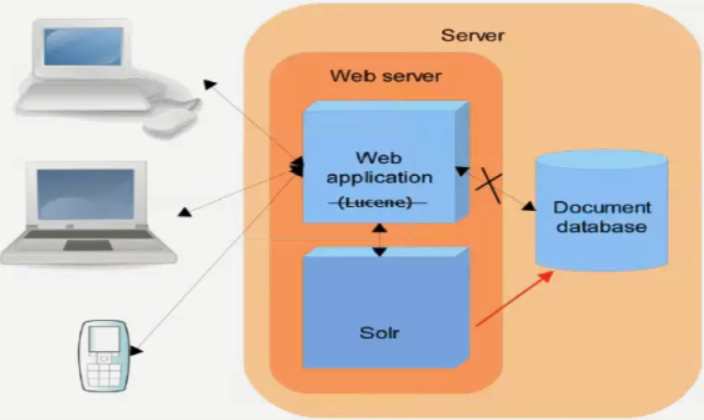
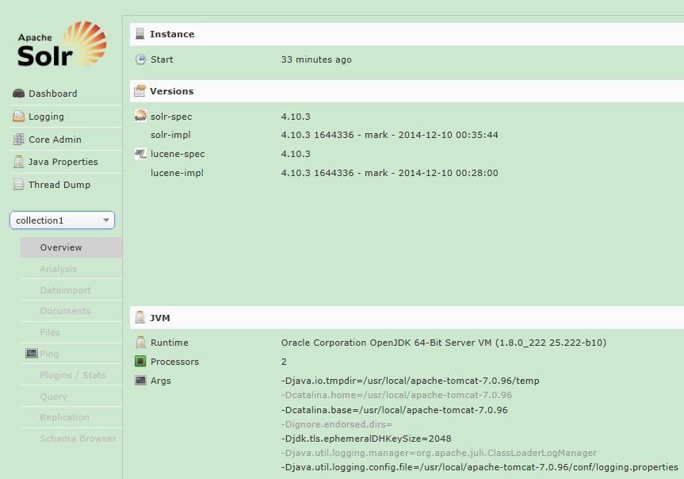
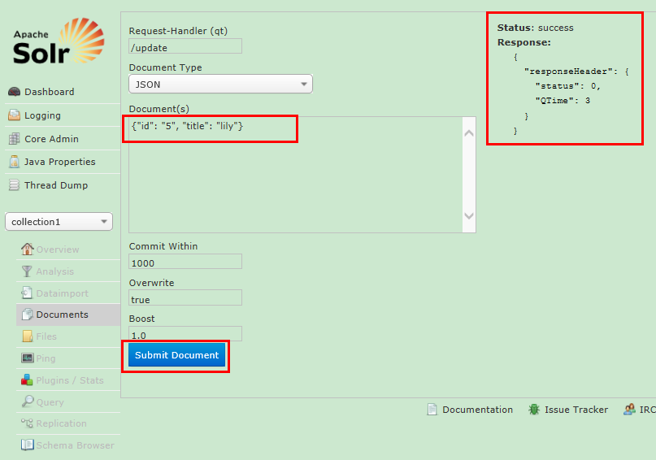
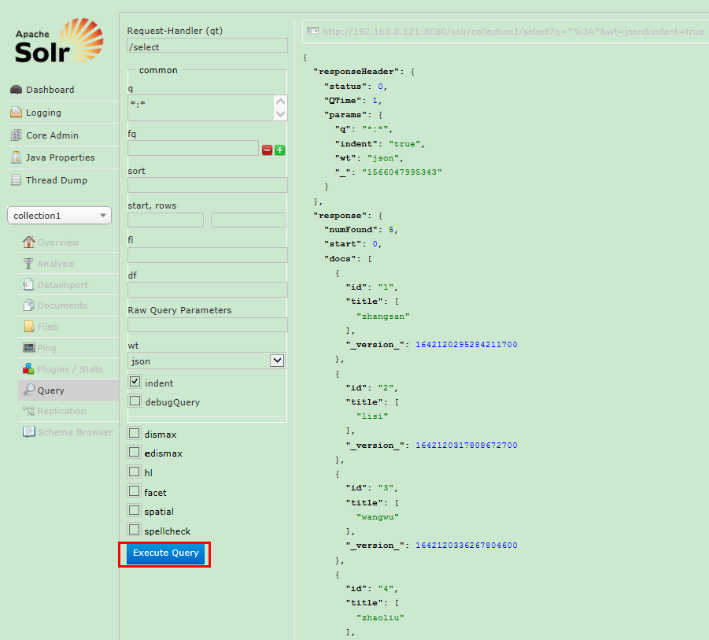
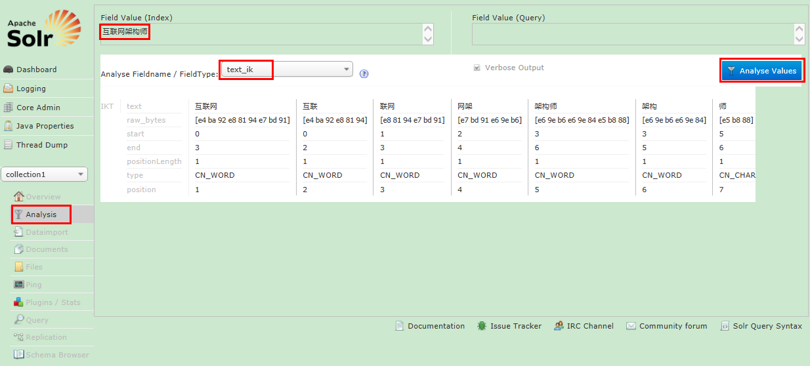
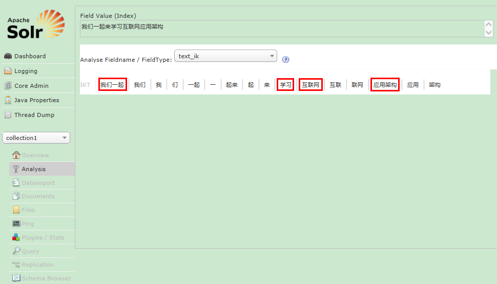

<!-- START doctoc generated TOC please keep comment here to allow auto update -->
<!-- DON'T EDIT THIS SECTION, INSTEAD RE-RUN doctoc TO UPDATE -->
**Table of Contents**  *generated with [DocToc](https://github.com/thlorenz/doctoc)*

- [Solr全文搜索](#solr%E5%85%A8%E6%96%87%E6%90%9C%E7%B4%A2)
  - [目录](#%E7%9B%AE%E5%BD%95)
  - [1.1 全文检索技术简介](#11-%E5%85%A8%E6%96%87%E6%A3%80%E7%B4%A2%E6%8A%80%E6%9C%AF%E7%AE%80%E4%BB%8B)
  - [1.2 Solr简介](#12-solr%E7%AE%80%E4%BB%8B)
  - [１.3 Solr示意图](#%EF%BC%913-solr%E7%A4%BA%E6%84%8F%E5%9B%BE)
  - [1.4 Solr与Lucene的区别](#14-solr%E4%B8%8Elucene%E7%9A%84%E5%8C%BA%E5%88%AB)
  - [1.5 Solr下载与安装](#15-solr%E4%B8%8B%E8%BD%BD%E4%B8%8E%E5%AE%89%E8%A3%85)
  - [1.6 简单操作solr服务器页面](#16-%E7%AE%80%E5%8D%95%E6%93%8D%E4%BD%9Csolr%E6%9C%8D%E5%8A%A1%E5%99%A8%E9%A1%B5%E9%9D%A2)
  - [2.1 java操作Solr服务器HelloWorld](#21-java%E6%93%8D%E4%BD%9Csolr%E6%9C%8D%E5%8A%A1%E5%99%A8helloworld)
  - [2.2 全文检索基础（一）](#22-%E5%85%A8%E6%96%87%E6%A3%80%E7%B4%A2%E5%9F%BA%E7%A1%80%E4%B8%80)
  - [2.3 全文检索基础（二）](#23-%E5%85%A8%E6%96%87%E6%A3%80%E7%B4%A2%E5%9F%BA%E7%A1%80%E4%BA%8C)
  - [2.4 全文检索基础（三）](#24-%E5%85%A8%E6%96%87%E6%A3%80%E7%B4%A2%E5%9F%BA%E7%A1%80%E4%B8%89)
  - [2.5 全文检索基础（四）](#25-%E5%85%A8%E6%96%87%E6%A3%80%E7%B4%A2%E5%9F%BA%E7%A1%80%E5%9B%9B)
  - [2.6 Solr基础](#26-solr%E5%9F%BA%E7%A1%80)
  - [2.7 Solr索引操作](#27-solr%E7%B4%A2%E5%BC%95%E6%93%8D%E4%BD%9C)
  - [2.8 Solr搜索](#28-solr%E6%90%9C%E7%B4%A2)
  - [2.9 Solr模式（一）](#29-solr%E6%A8%A1%E5%BC%8F%E4%B8%80)
  - [2.10 Solr模式（二）](#210-solr%E6%A8%A1%E5%BC%8F%E4%BA%8C)
  - [2.11 Solr添加信息对象](#211-solr%E6%B7%BB%E5%8A%A0%E4%BF%A1%E6%81%AF%E5%AF%B9%E8%B1%A1)
  - [2.12 Solr查询详细使用](#212-solr%E6%9F%A5%E8%AF%A2%E8%AF%A6%E7%BB%86%E4%BD%BF%E7%94%A8)
  - [3.1 Solr管理员命令](#31-solr%E7%AE%A1%E7%90%86%E5%91%98%E5%91%BD%E4%BB%A4)
  - [3.2 Solr集群搭建](#32-solr%E9%9B%86%E7%BE%A4%E6%90%AD%E5%BB%BA)
  - [4.1 案例实战说明](#41-%E6%A1%88%E4%BE%8B%E5%AE%9E%E6%88%98%E8%AF%B4%E6%98%8E)
  - [4.2 Solr的DIH全量同步](#42-solr%E7%9A%84dih%E5%85%A8%E9%87%8F%E5%90%8C%E6%AD%A5)
  - [4.3 Solr的DIH增量同步](#43-solr%E7%9A%84dih%E5%A2%9E%E9%87%8F%E5%90%8C%E6%AD%A5)

<!-- END doctoc generated TOC please keep comment here to allow auto update -->

# Solr全文搜索

## 目录

1、全文检索和Solr介绍、Solr环境安装

2、java操作Solr服务器

3、管理员运维命令以及集群搭建

4、案例实战

## 1.1 全文检索技术简介

在一些大型门户网站、电子商务网站等都需要站内搜索功能，使用传统的数据库查询方式实现搜索无法满足一些高级的搜索需求，比如：搜索速度要快、搜索结果按相关度排序、搜索内容格式不固定等，这里就需要使用全文检索技术实现搜索功能。

-   单独使用Lucene实现站内搜索需要开发的工作量较大，主要表现在：索引维护、索引性能优化、搜索性能优化等，因此不建议采用。
-   通过第三方搜索引擎提供的接口实现站内搜索，这样和第三方引擎系统依赖紧密，不方便扩展，不建议采用。
-   基于Solr实现站内搜索扩展性较好并且可以减少程序员的工作量，因为Solr提供了较为完备的搜索引擎解决方案，因此在门户、论坛等系统中常用此方案。

## 1.2 Solr简介

Solr是Apache下的一个顶级开源项目，采用java开发，这是基于Lucene的全文搜索服务器。Solr提供了比Lucene更为丰富的查询语言，同时实现了可配置、可扩展，并对索引、搜索性能进行了优化。

Solr可以独立运行，运行在jetty、tomcat等这些servlet容器中，Solr索引的实现方法简单，用POST方法向Solr服务器发送一个描述Field及其内容的XML文档，Solr根据xml文档添加、删除、更新索引。Solr搜索只需要发送HTTP GET请求，然后对Solr返回xml、json等格式的查询结果进行解析，组织页面布局。Solr不提供构建UI的功能，Solr提供了一个管理界面，通过管理界面可以查询Solr的配置和运行情况。

## １.3 Solr示意图



## 1.4 Solr与Lucene的区别

Lucene是一个开放源代码的全文检索引擎工具包，它不是一个完整的全文检索引擎，Lucene提供了完整的查询引擎和索引引擎，目的是为软件开发人员提供一个简单易用的工具包，以方便的在目标系统中实现全文检索的功能，或者以Lucene为基础构建全文检索引擎。

Solr的目标是打造一款企业级的搜索引擎系统，它是一个搜索引擎服务，可以独立运行，通过Solr可以非常快速的构建企业的搜索引擎，通过Solr也可以高效的完成站内搜索功能。

## 1.5 Solr下载与安装

Solr下载地址：http://archive.apache.org/dist/lucene/solr

安装Solr与Tomcat集成：Linux环境CentOS6.4、Tomcat7.0、Solr4.10.3

**安装步骤**：

-   解压Solr：`tar zxvf solr-4.10.3.tgz -C /usr/local`。
-   进入目录：`cd /usr/local/solr-4.10.3/example/webapps`。
-   拷贝其下war文件到tomcat的webapps中：`cp solr.war /usr/local/apache-tomcat-7.0.96/webapps`。
-   解压Solr：`mkdir solr && unzip solr.war -d solr && rm -rf solr.war`。
-   修改解压好的solr文件夹，修改其文件：`vim solr/WEB-INF/web.xml`，查找到nv-entry内容，解开注释文本。并修改solr/home的地址：`/usr/local/solr-4.10.3/example/solr`。保存并退出即可。
-   拷贝相关jar包到tomcat下：`cd /usr/local/solr-4.10.3/example/lib/ext && cp * /usr/local/apache-tomcat-7.0.96/lib`。
-   启动tomcat即可：`/usr/local/apache-tomcat-7.0.96/bin/startup.sh`。
-   查看日志：`tail -500 /usr/local/apache-tomcat-7.0.96/logs/catalina.out`。
-   通过浏览器访问：`http://192.168.0.121:8080/solr`，看到solr主页即可。

## 1.6 简单操作solr服务器页面



打开collection1进行添加数据测试



查询结果：



## 2.1 java操作Solr服务器HelloWorld

使用java可以对solr服务器进行操作。我们新建一个solr的maven项目，对其进行演示。

项目：springMVC + MyBatis + Spring + Solr + Mysql

只需要在项目中加入：`solr-solrj–4.10.3.jar` 即可使用

我们在这里完成我们的第一个HelloWorld小程序：实现对Solor服务器的信息添加、查询、修改、删除等操作。

通过查看Solr服务器下的schema.xml文件可以知道solr里面存储的数据类型，路径为：

```bash
vim /usr/local/solr-4.10.3/example/solr/collection1/conf/schema.xml
```

**java代码示例**

```java
// 搜索
@Test
public void testSearch() throws SolrServerException {
    SolrServer solr = new HttpSolrServer(urlString);
    // 查询对象
    SolrQuery query = new SolrQuery();
    //设置查询条件,名称“q”是固定的且必须的
    //搜索product_keywords域，product_keywords是复制域包括product_name和product_description
    query.set("q", "product_keywords:java教程");
    // 请求查询
    QueryResponse response = solr.query(query);
    // 查询结果
    SolrDocumentList docs = response.getResults();
    // 查询文档总数
    System.out.println("查询文档总数" + docs.getNumFound());
    for (SolrDocument doc : docs) {
        //商品主键
        String id = (String) doc.getFieldValue("id");
        //商品名称
        String product_name = (String)doc.getFieldValue("product_name");
        //商品价格
        Float product_price = (Float)doc.getFieldValue("product_price");
        //商品图片
        String product_picture = (String)doc.getFieldValue("product_picture");
        //商品分类
        String product_catalog_name = (String)doc.getFieldValue("product_catalog_name");
        
        System.out.println("=============================");
        System.out.println(id);
        System.out.println(product_name);
        System.out.println(product_price);
        System.out.println(product_picture);
        System.out.println(product_catalog_name);
    }
}
```

## 2.2 全文检索基础（一）

1.  信息源→本地（进行加工和处理）→建立索引库（信息集合，一组文件的集合）。
2.  搜索的时候从本地的（索引库）信息集合中搜索。
3.  文本在建立索引和搜索的时，都会先进行分词（使用分词器）。
4.  索引的结构：
    -   索引表（存放具体的词汇，哪些词汇在哪些文档里存储，索引里存储的就是分词器分词之后的结果）。
    -   存放数据（文档信息集合）。
5.  用户搜索时：首先经过分词器进行分词，然后去索引表里查找对应的词汇（利用倒排序索引），再找到对应文档集合。
6.  索引库位置（Directory）。
7.  信息集合里的每一条数据都是一个document（存储所有信息，他是一个Field属性的集合）。
8.  store是否进行存储（可以不存储，也可以存储）。
9.  index是否进行存储（可以不索引，也可以索引，索引的话分为分词后索引，或者直接索引）。

## 2.3 全文检索基础（二）

-   无论是Solr还是Lucene，都对中文分词不太好，所有我们一般索引中文的话需要使用IK中文分词器。
-   下载：`IK Analyzer 2012FF_hf1.zip`。
-   进行解压
-   安装：把`IKAnalyzer2012FF_u1.jar`拷贝到tomcat的solr应用服务下：

```bash
cd /usr/local/softwares && cp IKAnalyzer2012FF_u1.jar /usr/local/apache-tomcat-7.0.96/webapps/solr/WEB-INF/lib
```

-   创建文件夹：`/usr/local/apache-tomcat-7.0.96/webapps/solr/WEB-INF/classes`。
-   把IKAnalyzer.cfg.xml和stopword.dic拷贝到新创建的classes目录下即可。
-   修改solr core的schema文件，默认位置：

```bash
vim /usr/local/solr-4.10.3/example/solr/collection1/conf/schema.xml
```

-   添加如下配置：

```xml
<fieldType name="text_ik" class="solr.TextField">
    <!--索引时候的分词器-->
    <analyzer type="index" isMaxWordLength="false" class="org.wltea.analyzer.lucene.IKAnalyzer"/>
    <!--查询时候的分词器-->
    <analyzer type="query" isMaxWordLength="true" class="org.wltea.analyzer.lucene.IKAnalyzer"/>
</fieldType>
```

-   重新tomcat

```bash
/usr/local/apache-tomcat-7.0.96/bin/shutdown.sh
/usr/local/apache-tomcat-7.0.96/bin/startup.sh
tail -500 /usr/local/apache-tomcat-7.0.96/logs/catalina.out
```

## 2.4 全文检索基础（三）

-   进入页面在分词器选择text_ik中文分词器，进入输入：互联网架构师，查看分词结果如图所示：



## 2.5 全文检索基础（四）

如果我们想自定义一些词库，让IK分词器可以识别，那么就需要自定义扩展词库了：

操作步骤：

1、修改/usr/local/apache-tomcat-7.0.96/webapps/solr/WEB-INF/classes目录下的IKAnalyzer.cfg.xml配置文件，添加如下配置：

```xml
<entry key="ext_dict">ext.dic;</entry>
```

2、新建ext.dic文件，在里面添加如下内容（注意：ext.dic的编码必须是encode in UTF-8 without BOM，否则自定义的词库不会被识别）。

```bash
我们一起
学习
互联网
应用架构
```

显示结果：



## 2.6 Solr基础

因为Solr包装并扩展了Lucene，所以它们使用很多相同的术语。更重要的是，Solr创建的索引与Lucene搜索引擎完全兼容。通过对Solr进行适当的配置，某些情况下可能需要进行编码，Solr可以阅读和使用构建到其他Lucene应用程序中的索引。

在Solr和Lucene中，使用一个或多个Document来构建索引。Document包括一个或多个Field。Field包括名称、内容以及告诉Solr如何处理内容的元数据。例如，Field可以包含字符串、数字、布尔值或者日期，也可以包含你想添加的任何类型，只需在Solr的配置文件中进行相应的配置即可。Field可以使用大量的选项来描述，这些选项告诉Solr在索引和搜索期间如何处理内容。

| 属性名称 | 描述                                                         |
| -------- | ------------------------------------------------------------ |
| Indexed  | Indexed Field可以进行搜索和排序。你还可以在Indexed Field上运行Solr分析过程，此过程可修改内容以改进或更改结果。 |
| Stored   | Stored Field内容保存在索引中。这对于检索和醒目显示内容很有用，但对于实际搜索则不是必需的。例如，很多应用程序存储指向内容位置的指针而不是存储实际的文件内容。 |

## 2.7 Solr索引操作

在Solr中，通过向部署在servlet容器中的Solr Web应用程序发送HTTP请求来启动索引和搜索。Solr接受请求，确定要使用的适当SolrRequestHandler，然后处理请求。通过HTTP以同样的方式返回响应。默认配置返回Solr的标准XML响应。你也可以配置Solr的备用响应格式，如json、csv格式的文本。

索引就是接受输入元数据（数据格式在schema.xml中进行配置）并将它们传递给Solr，从而在HTTP Post XML消息中进行索引的过程。你可以向Solr索引servlet传递四个不同的索引请求。

-   add/update：允许你向Solr添加文档或更新文档。直到提交后才能搜索到这些添加和更新。
-   commit：告诉Solr，应该使上次提交以来所做的所有更改都可以搜索到。
-   optimize：重构Lucener的文件以改进搜索性能。索引完成后执行一下优化通常比较好。如果更新比较频繁，则应该在使用率较低的时候安排优化。一个索引无需优化也可以正常地运行。优化是一个耗时较多的过程。
-   delete：可以通过id或查询来指定。按id删除将删除具有指定id的文档；按查询删除将删除查询返回的所有文档。
-   Lucene中操作索引也有这几个步骤，但是没有更新。Lucene更新是先删除，然后添加索引。因为索引在一定情况下，效率没有先删除后添加的效率好。

## 2.8 Solr搜索

添加文档后，就可以搜索这些文档了。Solr接受HTTP GET 和 HTTP POST查询消息。收到的查询由相应的SolrRequestHandler进行处理。

| 参数  | 描述                                                         | 示例                                                         |
| ----- | ------------------------------------------------------------ | ------------------------------------------------------------ |
| q     | Solr中用来搜索的查询。有关该语法的完整描述，请参阅 参考资料。可以通过追加一个分号和已索引且未进行断词的字段（下面会进行解释）的名称来包含排序信息，默认的排序是score desc，指按记分降序排序。 | q=myField:Java AND otherField:developerWorks; date asc<br>此查询搜索指定两个字段，并根据一个日期字段对结果进行排序。 |
| start | 将初始偏移量指定到结果集中，可用于对结果进行分布，默认值为0。 | start=15<br/>返回从第15个结果开始的结果。                    |
| rows  | 返回文档的最大数目，默认为10。                               | rows=25<br/>返回25个结果集                                   |
| fq    | 提供一个可选的筛选器查询，查询结果被限制为仅搜索筛选器查询返回的结果。筛选过的查询由Solr进行缓存，它们对提高复杂查询的速度非常有用。 | 任何可以用q参数传递的有效查询，排序信息除外                  |
| hl    | 当hl=true时，在查询响应中醒目显示片段，默认为false，参看醒目显示参数（见参考资料）。 | hl=true                                                      |
| fl    | 作为逗号分隔的列表指定文档结果中应返回的Field集，默认为“*”，指所有的字段，“score”指还应返回记分。 | *,score                                                      |
| sort  | 排序，对查询结果进行排序                                     | sort=date asc,price desc                                     |

## 2.9 Solr模式（一）

之前我们看过schema.xml这个配置，这个配置可以在你下载solr包的安装解压目录的apache-solr-3.4.0\example\solr\conf中找到，它就是solr模式关联的文件。打开这个配置文件，你会发现有详细的注释。模式组织主要分为三个重要配置：

-   **types**部分是一些常见的可重用定义，定义了solr（和lucene）如何处理Field。也就是添加到索引中的xml文件属性中的类型，如int、text、date等。
-   **fields**是你添加到索引文件中出现的属性名称，而声明类型就需要用到上面的types。
-   **uniqueKey**唯一键，这里配置的是上面出现的fields，一般是id、url等不重复的，在更新、删除的时候可以用到。
-   **defaultSearchField**默认搜索属性，如q=solr就是默认的搜索哪个字段
-   **solrQueryParser**查询转换模式，是并且还是或者（and/or）

## 2.10 Solr模式（二）

在schema.xml中，下面的就是一个type，配置field的时候就可以用这个type。

```xml
<!-- A text field that only splits on whitespace for exact matching of words -->
<fieldType name="text_ws" class="solr.TextField" positionIncrementGap="100">
    <analyzer>
        <tokenizer class="solr.WhitespaceTokenizerFactory"/>
    </analyzer>
</fieldType>
```

上面的fieldType的配置中有个analyzer，这是分词器。主要把我们的数据进行分割成一个个的词语。词干提取、停止词删除以及相似的操作都被应用于标记，然后才进行索引和搜索，导致使用相同类型的标记。

在schema.xml中，Sor定义一些field内容，应用程序在添加field时会出现，如果出现`ERROR:unknown field ‘xxx’`就表示你设置的这个field在schema.xml中不存在。如果一定要使用这个field，请你在schema.xml中进行field元素的配置。

```xml
<field name="id" type="string" indexed="true" stored="true" required="true" multiValued="false" />

<field name="sku" type="text_en_splitting_tight" indexed="true" stored="true" omitNorms="true"/>
<field name="name" type="text_general" indexed="true" stored="true"/>
<field name="manu" type="text_general" indexed="true" stored="true" omitNorms="true"/>
<field name="cat" type="string" indexed="true" stored="true" multiValued="true"/>
<field name="features" type="text_general" indexed="true" stored="true" multiValued="true"/>
<field name="includes" type="text_general" indexed="true" stored="true" termVectors="true" termPositions="true" termOffsets="true" />
```

## 2.11 Solr添加信息对象

我们知道如果想要使数据加入到Solr服务器中，在schema.xml必须要存在与其对应的Field标签声明，如果我们要添加一个对象（比如用户对象）每次去一个一个的setField，这样比较麻烦，Solr允许使用javaBean的方式，将一个对象之间保存到Solr服务器中。

首先在schema.xml中定义自己的User对象：

```xml
 <field name="user_name" type="text_general" indexed="true" stored="true"/>
 <field name="user_sex" type="text_general" indexed="true" stored="true"/>
 <field name="user_age" type="text_general" indexed="false" stored="true"/>
 <field name="user_like" type="text_general" indexed="true" stored="true" multiValued="true"/>
```

然后在java中建立实体对象，并且一定要在属性或set方法上添加`@Field(nameValue)`注解（org.apache.solr.client.solrj.beans.Field）。

最后我们在junit里面进行测试。

## 2.12 Solr查询详细使用

Solr可以对查询数据进行一系列的操作。

-   查询分页start（起始位置）、rows（数据条数）、sort（排序）。
-   查询操作拼接：可使用AND、OR、NOT进行拼接联合查询。
-   查询操作区间：price:[5 TO 10] 表示包含，price{5 TO 10} 为不包含5和10的数据。
-   查询操作过滤器：addFilterQuery提高查询效率。
-   查询操作开启高亮设置：setHighlight*等方法，可以高亮显示结果信息。
-   查询操作分片处理：可以进行统计分析单词出现次数。

## 3.1 Solr管理员命令

我们在生产环境时，需要管理员维护solr服务器的数据信息。那么两种主要的手段：

-   直接使用curl命令进行操作solr数据，如：

```bash
# 删除
curl http://localhost:8080/solr/update --data-binary "<delete><query>id:1</query></delete>" -H 'Content-type:text/xml;charset=utf-8'
# 提交
curl http://localhost:8080/solr/update --data-binary "<commit/>" -H 'Content-type:text/xml;charset=utf-8'
```

-   进入`/usr/local/solr-4.10.3/example/exampledocs`下执行`java -jar post.jar`命令进行维护数据操作：

```bash
# 删除
java -Ddata=args -jar post.jar "<delete><id>42</id></delete>"
# 帮助
java -jar post.jar -help
```

## 3.2 Solr集群搭建

Solr性能不用说，一定是非常好的。那么针对于互联网大数据方向的搜索，海量数据进行索引，Solr一般使用集群环境，利用zookeeper去协调，参考相关文档我们可以对 Solr 进行集群搭建：

-   参考solrcloud高可用集群搭建手册。
-   http://blog.csdn.net/xyls12345/article/details/27504965
-   http://segmentfault.com/a/1190000000595712

## 4.1 案例实战说明

我们已经对solr有了一个初步的认识，那么我们一般在真实的项目中如何去对solr进行使用的呢？

一般来说，我们会从数据库中把相关信息加载到solr中，然后定时去与后台数据库进行同步（利用存储过程或者使用DIH全量增量同步即可）。

完成步骤说明：

-   GOODS表设计、实体类、DAO、Service层。
-   Controller实现
-   页面遍历结果集
-   定时job实现solr服务与数据库同步

## 4.2 Solr的DIH全量同步

第一步：创建数据库solr，然后建立一张表test，插入几条数据即可：

```sql
SET FOREIGN_KEY_CHECKS=0;
-- ----------------------------
-- Table structure for goods
-- ----------------------------
CREATE TABLE `goods` (
  `GOODS_ID` varchar(32) NOT NULL,
  `GOODS_NAME` varchar(100) DEFAULT NULL,
  `GOODS_TYPE` varchar(10) DEFAULT NULL,
  `GOODS_PRICE` varchar(100) DEFAULT NULL,
  `GOODS_DESC` varchar(400) DEFAULT NULL,
  `GOODS_URL` varchar(100) DEFAULT NULL,
  PRIMARY KEY (`GOODS_ID`)
) ENGINE=InnoDB DEFAULT CHARSET=utf8;

-- ----------------------------
-- Table structure for test
-- ----------------------------
CREATE TABLE `test` (
  `id` bigint(20) NOT NULL,
  `subject` varchar(100) DEFAULT NULL,
  `content` varchar(3000) DEFAULT NULL,
  `last_modified` timestamp NULL DEFAULT NULL ON UPDATE CURRENT_TIMESTAMP,
  PRIMARY KEY (`id`)
) ENGINE=InnoDB DEFAULT CHARSET=utf8;

-- ----------------------------
-- Records 
-- ----------------------------
INSERT INTO `test` VALUES ('1', '第一个科目', '这是一个文本内容', '2016-04-14 13:17:01');
INSERT INTO `test` VALUES ('2', '第二个科目', '我们一起来学习', '2016-04-14 13:17:27');
INSERT INTO `test` VALUES ('3', '第三个科目', '互联网应用架构师课程', '2016-04-14 13:17:51');
```

第二步：/usr/local/solr-4.10.3/example/solr/collection1/conf/solrconfig.xml对这个文件进行编辑：

```bash
vim /usr/local/solr-4.10.3/example/solr/collection1/conf/solrconfig.xml
```

添加内容：

```xml
<requestHandler name="/dataimport" class="org.apache.solr.handler.dataimport.DataImportHandler">
    <list name="defaults">
    	<str name="config">data-config.xml</str>
    </list>
</requestHandler>
```

第三步：新建一个data-config.xml文件，与solrconfig.xml同一个目录下：

```bash
vim /usr/local/solr-4.10.3/example/solr/collection1/conf/data-config.xml
```

添加内容：

```xml
<dataConfig>
	<dataSource type="JdbcDataSource" 
                driver="com.mysql.jdbc.Driver" 
                url="jdbc:mysql://192.168.0.200:3306/solr" 
                user="root" 
                password="root"/>
    <document>
    	<entity name="test" transformer="DateFormatTransformer" query="select id,subject,content,last_modified from test where id >= ${dataimporter.request.id}">
        	<field column="id" name="id"/>
            <field column="subject" name="subject"/>
            <field column="content" name="content"/>
            <field column="last_modified" name="last_modified" dateTimeFormat="yyyy-MM-dd HH:mm:ss"/>
        </entity>
    </document>
</dataConfig>
```

第四步：添加jar包到tomcat的项目中：

-   1、首先是在/usr/local/solr-4.10.3/dist目录下找到solr导入数据相关的jar包

```bash
cd /usr/local/solr-4.10.3/dist
cp solr-dataimporthandler-4.10.3.jar solr-dataimporthandler-extras-4.10.3.jar /usr/local/apache-tomcat-7.0.96/webapps/solr/WEB-INF/lib
```

-   当然还需要添加mysql驱动jar到apache-tomcat-7.0.96/webapps/solr/WEB-INF/lib之中才行。

第五步：编辑/usr/local/solr-4.10.3/example/solr/collection1/conf/schema.xml配置文件，去把数据库里面有的字段，添加到schema.xml中，如果有则无需配置。

```bash
vim /usr/local/solr-4.10.3/example/solr/collection1/conf/schema.xml
```

第六步：进行数据库访问授权操作，本地的mysql需要得到授权：

```mysql
grant all privileges on *.* to 'root'@'%' identified by 'root' with grant option;
flush privileges;
```

第七步：solr服务器的时间要和mysql服务器的时间统一。

```bash
date -s "2019-08-18 12:34:00"
```

第八步：最后启动tomcat。进行页面操作，导入数据库全量数据即可！


或者使用url操作：

http://192.168.0.200:8080/solr/collection1/dataimport?command=full-import&clean=true&commit-true&wt=json&indent=true&entity=test&verbose=false&optimize=false&debug=false&id=1

## 4.3 Solr的DIH增量同步

前面我的文章DIH全量导入中已经学会了如何全量导入Oracle和Mysql的数据，大家都知道全量导入在数据量大的时候代价非常大，一般来说都会适用增量的方式来导入数据，下面介绍如何增量导入Mysql数据库中的数据，以及如何设置定时来做。

下面介绍的所有操作都是基于前面已经完成全量导入的基础上来做的。

还记得我们之前在数据库表里面有一个last_modified字段，有了这样一个字段，Solr才能判断增量导入的时候，哪些数据是新的。

因为Solr本身有一个默认值last_index__time，记录最后一次做full import或者是delta import（增量导入）的时间，这个值存储在文件conf目录的dataimport.properties文件中，全路径如下：

```bash
vim /usr/local/solr-4.10.3/example/solr/collection1/conf/dataimport.properties
```

data-config.xml中必要属性的设置：

```xml
<!-- transformer格式转化：HTMLStripTransformer索引中忽略HTML标签 -->
<!-- query：查询数据库表符合记录数据 -->
<!-- deltaQuery：增量索引查询主键ID（注意这个只能返回ID字段） -->
<!-- deltaImportQuery：增量索引查询导入的数据 -->
<!-- deletedPkQuery：增量索引删除主键ID查询（注意这个字段只能返回ID字段） -->
```

第一步：修改/usr/local/solr-4.10.3/example/solr/collection1/conf/data-config.xml

```xml
<dataConfig>
	<dataSource type="JdbcDataSource" 
                driver="com.mysql.jdbc.Driver" 
                url="jdbc:mysql://192.168.0.121:3306/solr" 
                user="root" 
                password="root"/>
    <document>
    	<entity name="test" pk="id" transformer="DateFormatTransformer" query="select id,subject,content,last_modified from test where id >= ${dataimporter.request.id}" deltaImportQuery="select * from test where id=${dih.delta.id}" deltaQuery="select id from test where last_modified > '${dataimporter.last_index_time}'">
        	<field column="id" name="id"/>
            <field column="subject" name="subject"/>
            <field column="content" name="content"/>
            <field column="last_modified" name="last_modified" dateTimeFormat="yyyy-MM-dd HH:mm:ss"/>
        </entity>
    </document>
</dataConfig>
```

对于上面的操作解释：

-   意思是首先按照query指定的SQL语句查询出符合条件的记录。
-   然后从这些数据中根据deltaQuery指定的SQL语句查询出所有需要增量导入的数据的ID号。
-   最后根据deltaImportQuery指定的SQL语句返回所有这些ID的数据，即为这次增量导入所要处理的数据。

核心思想是：通过内置变量`${dih.delta.id}`和`${dataimporter.last_index_time}`来记录本次要索引的ID和最近一次索引的时间。

注意：last_modified字段也要在field属性中配置，同时也要在schema.xml文件中配置：

```xml
<field name="last_modified" type="date" indexed="true" stored="true"/>
```

定时访问增量更新的url：

http://192.168.0.200:8080/solr/collection1/dataimport?command=delta-import&entity=test

推荐博客：

http://blog.csdn.net/a__java___a/article/details/22688243

https://blog.csdn.net/u012985257/article/details/49611655


