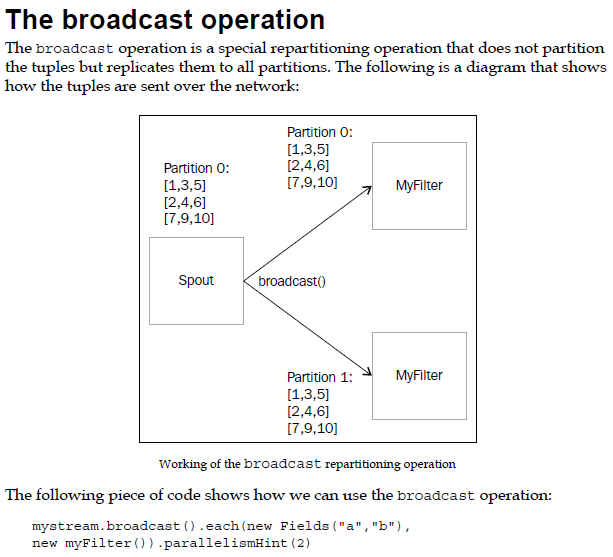
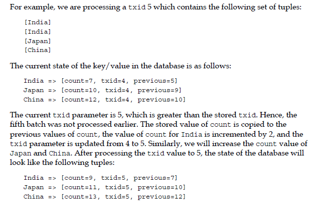

<!-- START doctoc generated TOC please keep comment here to allow auto update -->
<!-- DON'T EDIT THIS SECTION, INSTEAD RE-RUN doctoc TO UPDATE -->
**Table of Contents**  *generated with [DocToc](https://github.com/thlorenz/doctoc)*

- [Storm](#storm)
  - [目录](#%E7%9B%AE%E5%BD%95)
  - [1.1 Storm简介](#11-storm%E7%AE%80%E4%BB%8B)
  - [2.1 Storm体系架构](#21-storm%E4%BD%93%E7%B3%BB%E6%9E%B6%E6%9E%84)
  - [3.1 Storm集群环境搭建](#31-storm%E9%9B%86%E7%BE%A4%E7%8E%AF%E5%A2%83%E6%90%AD%E5%BB%BA)
  - [4.1 Storm Hello World示例](#41-storm-hello-world%E7%A4%BA%E4%BE%8B)
  - [5.0 Storm API](#50-storm-api)
  - [5.1 Storm 拓扑配置（一）](#51-storm-%E6%8B%93%E6%89%91%E9%85%8D%E7%BD%AE%E4%B8%80)
  - [5.1 Storm 什么是拓扑？（二）](#51-storm-%E4%BB%80%E4%B9%88%E6%98%AF%E6%8B%93%E6%89%91%E4%BA%8C)
  - [5.2 Storm 流分组（一）](#52-storm-%E6%B5%81%E5%88%86%E7%BB%84%E4%B8%80)
  - [5.2 Storm 流分组（二）](#52-storm-%E6%B5%81%E5%88%86%E7%BB%84%E4%BA%8C)
  - [5.2 Storm 流分组（三）](#52-storm-%E6%B5%81%E5%88%86%E7%BB%84%E4%B8%89)
  - [5.3 Storm WordCount](#53-storm-wordcount)
  - [5.4 Storm Spout的可靠性（一）](#54-storm-spout%E7%9A%84%E5%8F%AF%E9%9D%A0%E6%80%A7%E4%B8%80)
  - [5.4 Storm Spout的可靠性（二）](#54-storm-spout%E7%9A%84%E5%8F%AF%E9%9D%A0%E6%80%A7%E4%BA%8C)
  - [5.4 Storm Spout的可靠性（三）](#54-storm-spout%E7%9A%84%E5%8F%AF%E9%9D%A0%E6%80%A7%E4%B8%89)
  - [6.1 RPC介绍](#61-rpc%E4%BB%8B%E7%BB%8D)
  - [6.2 Storm DRPC介绍](#62-storm-drpc%E4%BB%8B%E7%BB%8D)
  - [6.3 Storm DRPC配置和示例](#63-storm-drpc%E9%85%8D%E7%BD%AE%E5%92%8C%E7%A4%BA%E4%BE%8B)
  - [6.4  Storm DRPC实例场景](#64--storm-drpc%E5%AE%9E%E4%BE%8B%E5%9C%BA%E6%99%AF)
  - [7.1 Storm Trident介绍](#71-storm-trident%E4%BB%8B%E7%BB%8D)
  - [7.2  Storm Trident filters](#72--storm-trident-filters)
  - [7.3 Storm Trident projections](#73-storm-trident-projections)
  - [7.4 Trident repartitioning operations](#74-trident-repartitioning-operations)
  - [7.5 Trident partition aggregate](#75-trident-partition-aggregate)
  - [7.6 Batch和Spout与Transaction](#76-batch%E5%92%8Cspout%E4%B8%8Etransaction)
  - [8.1 Storm与Kafka](#81-storm%E4%B8%8Ekafka)
  - [8.2 Kafka相关术语介绍](#82-kafka%E7%9B%B8%E5%85%B3%E6%9C%AF%E8%AF%AD%E4%BB%8B%E7%BB%8D)
  - [8.3 Kafka安装和使用](#83-kafka%E5%AE%89%E8%A3%85%E5%92%8C%E4%BD%BF%E7%94%A8)
  - [8.4 Kafka-Manager-Console安装](#84-kafka-manager-console%E5%AE%89%E8%A3%85)
  - [8.5 Kafka示例](#85-kafka%E7%A4%BA%E4%BE%8B)
  - [8.6 Kafka与Storm结合示例](#86-kafka%E4%B8%8Estorm%E7%BB%93%E5%90%88%E7%A4%BA%E4%BE%8B)
  - [9.0 Storm与Redis](#90-storm%E4%B8%8Eredis)

<!-- END doctoc generated TOC please keep comment here to allow auto update -->

# Storm

## 目录

1、Storm简介

2、Storm体系架构

3、Storm环境搭建

4、Storm HelloWorld示例

5、Storm API详解

6、Storm DRPC讲解

7、Storm Trident

8、Storm与Kafka

9、Storm与Redis

## 1.1 Storm简介

Storm是Twitter开源的一个**分布式的实时计算系统**，用于数据的实时分析，持续计算，分布式RPC等等。

-   官网地址：http://storm-project.net/

-   源码地址：http://github.com/nathanmarz/storm

-   捐献给apache了，https://github.com/apache/storm

**实时计算需要解决一些什么问题**

-   最显而易见的就是实时推荐系统，比如我们在淘宝等电商购物网站去买东西，我们会在网页旁边或者底端看到与自己所需商品相关的系列产品。这就是使用类似Storm实时计算去做的，我们非常熟悉的hadoop只是做离线的数据分析，无法做到实时分析计算。
-   比如车流量实时的计算，每天我们北京市的交通情况非常的拥挤，我们可以利用Storm为我们实时计算每一个路段的拥挤度等相关路况信息。
-   再比如我们非常熟悉的股票，那么股票系统也是一种实时计算的机制，利用Storm完全可以实现。

**实现一个实时计算系统**

-   低延迟：都说了实时计算系统了，延迟是一下要低的。
-   高性能：可以使用几台普通的服务器建立环境，结余成本。
-   分布式：Storm非常适合于分布式场景，大数据的实时计算：你的数据和计算单机就能搞定，那么不用考虑这些复杂的问题了。我们所说的是单机搞不定的情况。
-   可扩展：伴随着业务的发展，我们的数据量、计算量可能会越来越大，所以希望这上系统是可扩展的。
-   容错：这是分布式系统中通用问题，一个节点挂了不能影响我的应用，Storm可以轻松做到节点挂了的时候实现任务转移，并且在节点重启的时候（也就是重新投入生产环境是地，自动平衡任务）
-   可靠性：可靠的消息处理。Storm保证每个消息至少能得到一次完整处理。任务失败时，它会负责从消息源重试消息。
-   快速：系统的设计保证了消息能得到快速的处理，使用ZeroMQ作为其底层消息队列。
-   本地模式：Storm有一个”本地模式“，可以在处理过程中完全模拟Storm集群。这让你可以快速进行开发和单元测试。

## 2.1 Storm体系架构

首先我们拿Hadoop和Storm进行一个简单的对比：

|          | Hadoop                               | Storm                            |
| -------- | ------------------------------------ | -------------------------------- |
| 系统角色 | JobTracker<br/>TaskTracker<br/>Child | Nimbus<br/>Supervisor<br/>Worker |
| 应用名称 | Job                                  | Topology                         |
| 组件接口 | Mapper/Reducer                       | Spout/Bolt                       |

Storm是一个开源的分布式实时计算系统，可以简单、可靠的处理大量的数据流。Storm有很多使用场景：如实时分析，在线机器学习，持续计算，分布式RPC，ETL等等。Storm支持水平扩展，具有高容错性，保证每个消息都会得到处理，而且处理速度很快（在一个小集群中，每个结点每秒可以处理数以百万计的消息）。Storm的部署和运维都很便捷，而且更为重要的是可以使用任意编程语言来开发应用。

**Storm架构结构图**


**Nimbus主节点：**

-   主节点通常运行一个后台程序——Nimbus，用于响应分布在集群中的节点，分配任务和监测故障。这个很类似于Hadoop中的JobTracker。

**Supervisor工作节点：**

-   工作节点同样会运行一个后台程序——Supervisor，用于监听工作指派并基于要求运行工作进程。每个工作节点都是Topology中一个子集的实现。而Nimbus和Supervisor之间的协调则通过Zookeeper系统或者集群。

**Zookeeper**

-   Zookeeper是完成Nimbus和Supervisor之间协调的服务。而应用程序实现实时的逻辑则被封装到Storm中的”topology“。topology则是一组由Spouts（数据源）和Bolts（数据操作）通过Stream Grouping进行连接的图。下面对出现的术语进行更深刻的解析。

**Topology（拓扑）**

-   Storm中运行的一个实时应用程序，因为各个组件间的消息流动形成逻辑上的一个拓扑结构。一个topology是spouts和bolts组成的图，通过stream grouping将图中的spouts和bolts连接起来，如下图：


## 3.1 Storm集群环境搭建

1、关闭防火墙，修改`/etc/hosts`配置（3台机器的IP可能相互通信）。

2、下载并安装jdk7，配置JAVA_HOME，CLASSPATH。

3、搭建zookeeper集群（保证3台机器的zookeeper都可用）。

4、安装python（最好是2.6.6版本以上），centos7默认是2.7.5， 这步可以跳过。

```bash
wget https://www.python.org/ftp/python/2.6.6/Python-2.6.6.tgz
tar xzf Python-2.6.6.tgz
cd Python-2.6.6
./configure --prefix=/usr/local/Python-2.6.6
make -j 16
make install
```

5 、下载并解压Storm发布版本。

```bash
cd /usr/local/softwares
tar -zxvf apache-storm-0.9.2-incubating.tar.gz -C /usr/local
cd /usr/local
mv apache-storm-0.9.2-incubating apache-storm-0.9.2

vim /etc/profile

export ZOOKEEPER_HOME=/usr/local/zookeeper
export STORM_HOME=/usr/local/apache-storm-0.9.2
export PATH=$ZOOKEEPER_HOME/bin:$STORM_HOME/bin:$PATH

source /etc/profile
```

6、修改Storm.yaml配置文件。

```bash
cd /usr/local/apache-storm-0.9.2/conf

vim /usr/local/apache-storm-0.9.2/conf/storm.yaml

# 修改以下内容
 storm.zookeeper.servers:
     - "192.168.0.121"
     - "192.168.0.122"
     - "192.168.0.123"

 nimbus.host: "192.168.0.121"
 storm.local.dir: "/usr/local/apache-storm-0.9.2/data"
 ui.port: 18080
 supervisor.slots.ports:
     - 6700
     - 6701
     - 6702
     - 6703

```

7、启动Storm各个后台进程。

```bash
# 主机器上运行
storm nimbus &
# 查看UI
storm ui &
# 查看工作日志
storm logviewer &

# 从机器上运行
storm supervisor &
```

在浏览器中输入：http://192.168.0.121:18080 查看storm的UI


## 4.1 Storm Hello World示例

**1、首先建立一个maven工程（ Quick Start工程strom01）**

引入maven依赖：

```xml
<repositories>
    <!-- Repository where we can found the storm dependencies -->
    <repository>
        <id>clojars.org</id>
        <url>http://clojars.org/repo</url>
    </repository>
</repositories>
<dependencies>
    <dependency>
        <groupId>org.apache.storm</groupId>
        <artifactId>storm-core</artifactId>
        <version>0.9.2-incubating</version>
    </dependency>
</dependencies>
```

**2、我们首先回顾一下Storm的组件，按照这个流程去写我们的java代码：**


**3、首先编写我们的数据源类：Spout。可以使用两种方式：**

-   继承BaseRichSpout类。
-   实现IRickSpout接口。
-   重点需要几个方法进行重写或实现：open、nextTuple、declareOutputFields。

**4、继续编写我们的数据处理类：Bolt。可以使用两种方式：**

-   继承BaseBasicBolt类。
-   实现IRickBolt接口。
-   重点需要几个方法进行重写或实现：execute、declareOutputFields。

**5、最后我们编写主函数（Topology）去进行提交一个任务。**

-   在使用Topology的时候，Storm框架为我们提供了两种模式：本地模式和集群模式。
-   **本地模式**：（无需Storm集群，直接在java中即可运行，一般用于测试和开发阶段）执行运行main函数即可。
-   **集群模式**：（需要Storm集群，把实现的java程序打包，然后Topology进行提交）需要把应用打成jar，使用Storm命令把Topology提交到集群中去。

**PWTopology1.java**

```java
import backtype.storm.Config;
import backtype.storm.LocalCluster;
import backtype.storm.StormSubmitter;
import backtype.storm.topology.TopologyBuilder;
import bhz.bolt.PrintBolt;
import bhz.bolt.WriteBolt;
import bhz.spout.PWSpout;

public class PWTopology1 {

    public static void main(String[] args) throws Exception {
        Config cfg = new Config();
        cfg.setNumWorkers(2);
        cfg.setDebug(true);

        TopologyBuilder builder = new TopologyBuilder();
        builder.setSpout("spout", new PWSpout());
        builder.setBolt("print-bolt", new PrintBolt()).shuffleGrouping("spout");
        builder.setBolt("write-bolt", new WriteBolt()).shuffleGrouping("print-bolt");

        // 1 本地模式
        LocalCluster cluster = new LocalCluster();
        cluster.submitTopology("top1", cfg, builder.createTopology());
        Thread.sleep(10000);
        cluster.killTopology("top1");
        cluster.shutdown();

        // 2 集群模式
        StormSubmitter.submitTopology("top1", cfg, builder.createTopology());

    }
}
```

**PWSpout.java**

```java
import java.util.HashMap;
import java.util.Map;
import java.util.Random;

import backtype.storm.spout.SpoutOutputCollector;
import backtype.storm.task.TopologyContext;
import backtype.storm.topology.OutputFieldsDeclarer;
import backtype.storm.topology.base.BaseRichSpout;
import backtype.storm.tuple.Fields;
import backtype.storm.tuple.Values;

public class PWSpout extends BaseRichSpout {

    private static final long serialVersionUID = 1L;
    private SpoutOutputCollector collector;

    private static final Map<Integer, String> map = new HashMap<Integer, String>();

    static {
        map.put(0, "java");
        map.put(1, "php");
        map.put(2, "groovy");
        map.put(3, "python");
        map.put(4, "ruby");
    }

    @Override
    public void open(Map conf, TopologyContext context, SpoutOutputCollector collector) {
        // 对spout进行初始化
        this.collector = collector;
        // System.out.println(this.collector);
    }

    @Override
    public void nextTuple() {
        // 随机发送一个单词
        final Random r = new Random();
        int num = r.nextInt(5);
        try {
            Thread.sleep(500);
        } catch (InterruptedException e) {
            e.printStackTrace();
        }
        this.collector.emit(new Values(map.get(num)));
    }

    @Override
    public void declareOutputFields(OutputFieldsDeclarer declarer) {
        // 进行声明
        declarer.declare(new Fields("print"));
    }

}
```

**PrintBolt.java**

```java
import org.apache.commons.logging.Log;
import org.apache.commons.logging.LogFactory;

import backtype.storm.topology.BasicOutputCollector;
import backtype.storm.topology.OutputFieldsDeclarer;
import backtype.storm.topology.base.BaseBasicBolt;
import backtype.storm.tuple.Fields;
import backtype.storm.tuple.Tuple;
import backtype.storm.tuple.Values;

public class PrintBolt extends BaseBasicBolt {

    private static final Log log = LogFactory.getLog(PrintBolt.class);

    private static final long serialVersionUID = 1L;

    @Override
    public void execute(Tuple input, BasicOutputCollector collector) {
        // 获取上一个组件所声明的Field
        String print = input.getStringByField("print");
        log.info("【print】： " + print);
        // System.out.println("Name of input word is : " + word);
        // 进行传递给下一个bolt
        collector.emit(new Values(print));
    }

    @Override
    public void declareOutputFields(OutputFieldsDeclarer declarer) {
        declarer.declare(new Fields("write"));
    }

}
```

**WriteBolt.java**

```java
import java.io.FileWriter;

import org.apache.commons.logging.Log;
import org.apache.commons.logging.LogFactory;

import clojure.main;
import backtype.storm.topology.BasicOutputCollector;
import backtype.storm.topology.OutputFieldsDeclarer;
import backtype.storm.topology.base.BaseBasicBolt;
import backtype.storm.tuple.Tuple;

public class WriteBolt extends BaseBasicBolt {

    private static final long serialVersionUID = 1L;

    private static final Log log = LogFactory.getLog(WriteBolt.class);

    private FileWriter writer;

    @Override
    public void execute(Tuple input, BasicOutputCollector collector) {
        // 获取上一个组件所声明的Field
        String text = input.getStringByField("write");
        try {
            if (writer == null) {
                if (System.getProperty("os.name").equals("Windows 10")) {
                    writer = new FileWriter("C:\\storm_test\\" + this);
                } else if (System.getProperty("os.name").equals("Windows 8.1")) {
                    writer = new FileWriter("C:\\storm_test\\" + this);
                } else if (System.getProperty("os.name").equals("Windows 7")) {
                    writer = new FileWriter("C:\\storm_test\\" + this);
                } else if (System.getProperty("os.name").equals("Linux")) {
                    System.out.println("----:" + System.getProperty("os.name"));
                    writer = new FileWriter("/usr/local/temp/" + this);
                }
            }
            log.info("【write】： 写入文件");
            writer.write(text);
            writer.write("\n");
            writer.flush();
        } catch (Exception e) {
            e.printStackTrace();
        }
    }

    @Override
    public void declareOutputFields(OutputFieldsDeclarer declarer) {

    }

}
```

**6、提交topology命令：**

```bash
storm jar /usr/local/storm01.jar bhz.topology.PWTopology1
```


**7、查看任务命令：**

```bash
storm list
```


**8、另外两个supervisor节点jps显示：**


>   最后我们可以看下两个节点的`/usr/local/temp/`下的文件信息是否有内容

## 5.0 Storm API

-   Topology（拓扑）
-   Stream Grouping（流分组、数据的分发方式）
-   Spout（喷口、消息源）
-   Bolt（螺栓、处理器）
-   Worker（工作进程）
-   Executor（执行器、Task的线程）
-   Task（具体的执行任务）
-   Configuration（配置）

## 5.1 Storm 拓扑配置（一）

-   工作进程、并行度、任务数设置：

```java
Config cfg = new Config();
cfg.setNumWorkers(2);// 设置使用俩个工作进程
cfg.setDebug(false);
TopologyBuilder builder = new TopologyBuilder();
// 设置sqout的并行度和任务数（产生2个执行器和俩个任务）
builder.setSpout("spout", new PWSpout(), 2);// .setNumTasks(2);
// 设置bolt的并行度和任务数:（产生2个执行器和4个任务）
builder.setBolt("print-bolt", new PrintBolt(), 2).shuffleGrouping("spout").setNumTasks(4);
// 设置bolt的并行度和任务数:（产生6个执行器和6个任务）
builder.setBolt("write-bolt", new WriteBolt(), 6).shuffleGrouping("print-bolt");
```

-   我们首先设置了2个工作线程（也就是2个jvm）
-   然后我们设置了spout的并行度为2（产生2个执行器和2个任务）
-   第一个bolt的并行度为2并且指定任务数为4（产生2个执行器和4个任务）
-   第二个bolt的并行度为6（产生6个执行器和6个任务）
-   因此：该拓扑程序共有两个工作进程（worker），2+2+6=10个执行器（executor），2+4+6=12个任务（task）。每个工作进程可以领取到12/2=6个任务。默认情况下一个执行器执行一个任务，但如果指定了任务的数目。则任务会平均分配到执行器中。


## 5.1 Storm 什么是拓扑？（二）

-   我们在使用Storm 进行流式计算的时候，都必须要在Main函数里建立所谓的”拓扑“，拓扑是什么？
-   拓扑是一个有向图的计算。（也就是说在计算的过程中是有流向的去处理业务逻辑，节点之间的连接显示数据该如何进入下一个节点，他们是进行连接传递的）
-   拓扑运行很简单，只需要使用Storm 命令，把一个jar提交给nimbus节点，nimbus就会把任务分配给具体的子节点（supervisor）去工作。
-   我们创建拓扑非常简单：
    -   1、构建TopologyBuilder对象
    -   2、设置Spout（喷口）数据源对象（可以设置多个）
    -   3、设置Bolt（螺栓）数据处理对象（可以设置多个）
    -   4、构建Config对象
    -   5、提交拓扑

##  5.2 Storm 流分组（一）

-   Stream Grouping：为每个bolt指定应该接受哪个流作为输入，流分组定义了如何在bolt的任务直接进行分发。


##  5.2 Storm 流分组（二）

-   **Shuffle Grouping**：随机分组，保证每个bolt接收到的tuple数目相同。
-   **Fields Grouping**：按字段分组，比如按userid来分组，具有同样userid的tuple会被分到相同的Bolts，而不同的userid则会被分配到不同的Bolts。
-   **All Grouping**：广播发送，对于每一个tuple，所有的Bolts都会收到。
-   **Global Grouping**：全局分组，这个tuple被分配到storm中的一个bolt的其中一个task。再具体一点就是分配给id值最低的那个task。
-   **Non Grouping**：无分组，假设你不关心流式如何分组的，煤科院使用这种方式，目前这种分组和随机分组是一样的效果，不同的是Storm会把这个Bolt放到Bolt的订阅者的同一个线程中执行。
-   **Direct Grouping**：直接分组，这种分组意味着消息的发送者指定由消息接收者的哪个task处理这个消息。只有被声明为Direct Stream的消息流可以声明这种分组方式。而且这种消息tuple必须使用emitDirect方法来发射。消息处理者可以通过TopologyContext来获取处理它的消息的taskid（OutputCollector.emit方法也会返回taskid）。
-   **本地分组**：如果目标bolt在同一工作进程存在一个或多个任务，tuple（元祖）会随机分配给执行任务，否则该分组方式与随机分组方式是一样的。

```java
Config cfg = new Config();
cfg.setNumWorkers(2);
cfg.setDebug(true);
TopologyBuilder builder = new TopologyBuilder();
builder.setSpout("spout", new PWSpout(), 4);
builder.setBolt("print-bolt", new PrintBolt(), 4).shuffleGrouping("spout");
// 设置字段分组
builder.setBolt("write-bolt", new WriteBolt(), 8).fieldsGrouping("print-bolt", new Fields("write"));
// 设置广播分组
builder.setBolt("write-bolt", new WriteBolt(), 4).allGrouping("print-bolt");
// 设置全局分组
builder.setBolt("write-bolt", new WriteBolt(), 4).globalGrouping("print-bolt");
```

## 5.2 Storm 流分组（三）

-   常见的流分组


## 5.3 Storm WordCount

-   我们以一个统计单词的小程序来说明问题。（storm02）


-   上面的示意图中4个组件，分别为一个spout和3个bolt，当数据源spout取得数据（可以是一个句子，里面包含多个单词）以后，发送给SolitBolt进行切分，然后由CountBolt进行统计结果，最终由ReportBolt记录结果。

**WordTopology.java**

```java
import backtype.storm.Config;
import backtype.storm.LocalCluster;
import backtype.storm.topology.TopologyBuilder;
import backtype.storm.tuple.Fields;
import bhz.bolt.WordCountBolt;
import bhz.bolt.WordReportBolt;
import bhz.bolt.WordSplitBolt;
import bhz.spout.WordSpout;
import bhz.util.Utils;

public class WordTopology {
    // 定义常量
    private static final String WORD_SPOUT_ID = "word-spout";
    private static final String SPLIT_BOLT_ID = "split-bolt";
    private static final String COUNT_BOLT_ID = "count-bolt";
    private static final String REPORT_BOLT_ID = "report-bolt";
    private static final String TOPOLOGY_NAME = "word-count-topology";

    public static void main(String[] args) throws Exception {

        // 实例化对象
        WordSpout spout = new WordSpout();
        WordSplitBolt splitBolt = new WordSplitBolt();
        WordCountBolt countBolt = new WordCountBolt();
        WordReportBolt reportBolt = new WordReportBolt();

        // 构建拓扑
        TopologyBuilder builder = new TopologyBuilder();
        builder.setSpout(WORD_SPOUT_ID, spout);

        // WordSpout --> WordSplitBolt
        builder.setBolt(SPLIT_BOLT_ID, splitBolt).shuffleGrouping(WORD_SPOUT_ID);

        // WordSplitBolt --> WordCountBolt
        builder.setBolt(COUNT_BOLT_ID, countBolt).fieldsGrouping(SPLIT_BOLT_ID, new Fields("word"));

        // WordCountBolt --> WordReportBolt
        builder.setBolt(REPORT_BOLT_ID, reportBolt).globalGrouping(COUNT_BOLT_ID);

        // 本地配置
        Config config = new Config();
        config.setDebug(false);
        LocalCluster cluster = new LocalCluster();

        cluster.submitTopology(TOPOLOGY_NAME, config, builder.createTopology());
        Utils.waitForSeconds(10);
        cluster.killTopology(TOPOLOGY_NAME);
        cluster.shutdown();
    }
}
```

**WordSpout.java**

```java
import java.util.Map;
import java.util.UUID;

import org.apache.commons.logging.Log;
import org.apache.commons.logging.LogFactory;

import backtype.storm.spout.SpoutOutputCollector;
import backtype.storm.task.OutputCollector;
import backtype.storm.task.TopologyContext;
import backtype.storm.topology.IRichSpout;
import backtype.storm.topology.OutputFieldsDeclarer;
import backtype.storm.tuple.Fields;
import backtype.storm.tuple.Values;
import bhz.util.Utils;

public class WordSpout implements IRichSpout {

    private static final long serialVersionUID = 1L;

    private SpoutOutputCollector collector;

    private int index = 0;

    private String[] sentences = { "my dog has fleas", "i like cold beverages", "the dog ate my homework",
            "don't have a cow man", "i don't think i like fleas" };

    @Override
    public void open(Map config, TopologyContext context, SpoutOutputCollector collector) {
        this.collector = collector;
    }

    @Override
    public void nextTuple() {
        this.collector.emit(new Values(sentences[index]));
        index++;
        if (index >= sentences.length) {
            index = 0;
        }
        Utils.waitForSeconds(1);
    }

    @Override
    public void declareOutputFields(OutputFieldsDeclarer declarer) {
        declarer.declare(new Fields("sentence"));
    }

    @Override
    public void ack(Object msgId) {
    }

    @Override
    public void fail(Object msgId) {
    }

    @Override
    public void activate() {

    }

    @Override
    public void close() {

    }

    @Override
    public void deactivate() {

    }

    @Override
    public Map<String, Object> getComponentConfiguration() {
        return null;
    }
}

```

**WordSplitBolt.java**

```java
import java.util.Map;

import backtype.storm.task.OutputCollector;
import backtype.storm.task.TopologyContext;
import backtype.storm.topology.IRichBolt;
import backtype.storm.topology.OutputFieldsDeclarer;
import backtype.storm.tuple.Fields;
import backtype.storm.tuple.Tuple;
import backtype.storm.tuple.Values;

public class WordSplitBolt implements IRichBolt {

    private static final String ERROR_STR = "don't have a cow man";

    private OutputCollector collector;

    @Override
    public void prepare(Map config, TopologyContext context, OutputCollector collector) {
        this.collector = collector;
    }

    @Override
    public void execute(Tuple tuple) {
        String sentence = tuple.getStringByField("sentence");
        String[] words = sentence.split(" ");
        for (String word : words) {
            this.collector.emit(new Values(word));
            // this.collector.ack(tuple);
        }
    }

    @Override
    public void declareOutputFields(OutputFieldsDeclarer declarer) {
        declarer.declare(new Fields("word"));
    }

    @Override
    public void cleanup() {

    }

    @Override
    public Map<String, Object> getComponentConfiguration() {
        return null;
    }
}
```

**WordCountBolt.java**

```java
import java.util.HashMap;
import java.util.Map;

import backtype.storm.task.OutputCollector;
import backtype.storm.task.TopologyContext;
import backtype.storm.topology.IRichBolt;
import backtype.storm.topology.OutputFieldsDeclarer;
import backtype.storm.tuple.Fields;
import backtype.storm.tuple.Tuple;
import backtype.storm.tuple.Values;

public class WordCountBolt implements IRichBolt {

    private OutputCollector collector;
    private HashMap<String, Long> counts = null;

    @Override
    public void prepare(Map config, TopologyContext context, OutputCollector collector) {
        this.collector = collector;
        this.counts = new HashMap<String, Long>();
    }

    @Override
    public void execute(Tuple tuple) {
        String word = tuple.getStringByField("word");
        Long count = this.counts.get(word);
        if (count == null) {
            count = 0L;
        }
        count++;
        this.counts.put(word, count);
        this.collector.emit(new Values(word, count));
    }

    @Override
    public void declareOutputFields(OutputFieldsDeclarer declarer) {
        declarer.declare(new Fields("word", "count"));
    }

    @Override
    public Map<String, Object> getComponentConfiguration() {
        return null;
    }

    @Override
    public void cleanup() {

    }
}
```

**WordReportBolt.java**

```java
import java.util.ArrayList;
import java.util.Collections;
import java.util.HashMap;
import java.util.List;
import java.util.Map;

import backtype.storm.task.OutputCollector;
import backtype.storm.task.TopologyContext;
import backtype.storm.topology.IRichBolt;
import backtype.storm.topology.OutputFieldsDeclarer;
import backtype.storm.tuple.Tuple;

public class WordReportBolt implements IRichBolt {

    private HashMap<String, Long> counts = null;

    @Override
    public void prepare(Map config, TopologyContext context, OutputCollector collector) {
        this.counts = new HashMap<String, Long>();
    }

    @Override
    public void execute(Tuple tuple) {
        String word = tuple.getStringByField("word");
        Long count = tuple.getLongByField("count");
        this.counts.put(word, count);
    }

    @Override
    public void declareOutputFields(OutputFieldsDeclarer declarer) {

    }

    @Override
    public Map<String, Object> getComponentConfiguration() {
        return null;
    }

    @Override
    public void cleanup() {
        System.out.println("----------- FINAL COUNTS -----------");
        List<String> keys = new ArrayList<String>();
        keys.addAll(this.counts.keySet());
        Collections.sort(keys);
        for (String key : keys) {
            System.out.println(key + " : " + this.counts.get(key));
        }
        System.out.println("-----------------------------------");
    }
}
```

**Utils.java**

```java
public class Utils {
    public static void waitForSeconds(int seconds) {
        try {
            Thread.sleep(seconds * 1000);
        } catch (InterruptedException e) {
        }
    }

    public static void waitForMillis(long milliseconds) {
        try {
            Thread.sleep(milliseconds);
        } catch (InterruptedException e) {
        }
    }
}
```

## 5.4 Storm Spout的可靠性（一）

-   Spout是Storm数据流的入口，在设计拓扑时，一件很重要的事情就是需要考虑消息的可靠性，如果消息不能被处理而丢失是很严重的问题。
-   我们继续做实验，以一个传递消息并且实时处理的例子，来说明这个问题。
-   新建maven项目（storm03）。

```java
public class MessageTopology {
    public static void main(String[] args) throws Exception {
        TopologyBuilder builder = new TopologyBuilder();
        builder.setSpout("spout", new MessageSpout());
        builder.setBolt("split-bolt", new SpliterBolt()).shuffleGrouping("spout");
        builder.setBolt("write-bolt", new WriterBolt()).shuffleGrouping("split-bolt");
        // 本地配置
        Config config = new Config();
        config.setDebug(false);
        LocalCluster cluster = new LocalCluster();
        System.out.println(cluster);
        cluster.submitTopology("message", config, builder.createTopology());
        Thread.sleep(10000);
        cluster.killTopology("message");
        cluster.shutdown();
    }
}

public class MessageSpout implements IRichSpout {
    private static final long serialVersionUID = 1L;
    private int index = 0;
    private String[] subjects = new String[] { "groovy,oeacnbase", "openfire,restful", "flume,activiti", "hadoop,hbase",
            "spark,sqoop" };
    private SpoutOutputCollector collector;

    @Override
    public void open(Map conf, TopologyContext context, SpoutOutputCollector collector) {
        this.collector = collector;
    }

    @Override
    public void nextTuple() {
        if (index < subjects.length) {
            String sub = subjects[index];
            // 发送信息参数1 为数值， 参数2为msgId
            collector.emit(new Values(sub), index);
            index++;
        }
    }

    @Override
    public void declareOutputFields(OutputFieldsDeclarer declarer) {
        declarer.declare(new Fields("subjects"));
    }

    @Override
    public void ack(Object msgId) {
        System.out.println("【消息发送成功!!!】 (msgId = " + msgId + ")");
    }

    @Override
    public void fail(Object msgId) {
        System.out.println("【消息发送失败!!!】  (msgId = " + msgId + ")");
        System.out.println("【重发进行中...】");
        collector.emit(new Values(subjects[(Integer) msgId]), msgId);
        System.out.println("【重发成功!!!】");
    }
}

public class SpliterBolt implements IRichBolt {
    private static final long serialVersionUID = 1L;
    private OutputCollector collector;
    private boolean flag = false;

    @Override
    public void prepare(Map config, TopologyContext context, OutputCollector collector) {
        this.collector = collector;
    }

    @Override
    public void execute(Tuple tuple) {
        try {
            String subjects = tuple.getStringByField("subjects");

//			if(!flag && subjects.equals("flume,activiti")){
//				flag = true;
//				int a = 1/0;
//			}

            String[] words = subjects.split(",");
            // List<String> list = new ArrayList<String>();
            // int index = 0;
            for (String word : words) {
                // 注意这里循环发送消息，要携带tuple对象，用于处理异常时重发策略
                collector.emit(tuple, new Values(word));
                // list.add(word);
                // index ++;
            }
            // collector.emit(tuple, new Values(list));
            collector.ack(tuple);
        } catch (Exception e) {
            e.printStackTrace();
            collector.fail(tuple);
        }
    }

    @Override
    public void declareOutputFields(OutputFieldsDeclarer declarer) {
        declarer.declare(new Fields("word"));
    }
}

public class WriterBolt implements IRichBolt {
    private static final long serialVersionUID = 1L;
    private FileWriter writer;
    private OutputCollector collector;
    private boolean flag = false;

    @Override
    public void prepare(Map config, TopologyContext context, OutputCollector collector) {
        this.collector = collector;
        try {
            writer = new FileWriter("d://message.txt");
        } catch (IOException e) {
            e.printStackTrace();
        }
    }

    @Override
    public void execute(Tuple tuple) {
        String word = tuple.getString(0);
//		List<String> list = (List<String>)tuple.getValueByField("word");
//		System.out.println("======================" + list);
        try {
            if (!flag && word.equals("hadoop")) {
                flag = true;
                int a = 1 / 0;
            }
            writer.write(word);
            writer.write("\r\n");
            writer.flush();
        } catch (Exception e) {
            e.printStackTrace();
            collector.fail(tuple);
        }
        collector.emit(tuple, new Values(word));
        collector.ack(tuple);
    }
}
```

-   通过示例我们知道，如果在第一个bolt处理的时候出现异常，我们可以让整个数据进行重发，但是如果在第二个bolt处理的时候出现了异常，那么我们也会让对应的spout里的数据重发，这样就会出现事务的问题，我们就需要进行判断或者是进行记录。
-   如果是数据入库的话，可以与原ID进行比对。
-   如果是事务的话在编写代码时，尽量不要进行拆分tuple。
-   或者使用storm的Trident框架。

## 5.4 Storm Spout的可靠性（二）

-   Storm 系统中有一组叫做”acker“的特殊的任务，它们负责跟踪DAG（有向无环图）中的每个消息。
-   acker任务保存了spout消息id到一对值的映射。第一个值就是spout的任务id，通过这个id，acker就知道消息处理完成时该通知哪个spout任务。第二个值是一个64bit的数字，我们称之为”ack val“，它是树中所有消息的随机id的异或结果。ack val表示了整棵树的状态，无论这棵树多大，只需要这个固定大小的数字就可以跟踪整棵树。当消息被创建和被应答的时候都会有相同的消息id发送过来做异或。
-   每当acker发现一棵树的ack val值为0的时候，它就知道这棵树已经被完全处理了。因为消息的随机ID是一个64bit的值，因此ack val在树处理完之前被置为0的概率非常小。假设你每秒钟发送一万个消息，从概率上说，至少需要50,000,000年才会有机会发生一次错误。即使如此，也另有在这个消息确实处理失败的情况下才会有数据的丢失。

## 5.4 Storm Spout的可靠性（三）

下图是spout处理可靠性的示意图：当spout发送一个消息时，分配给两个bolt分别处理，那么在最后一个bolt接受的时候会做异或运算。


## 6.1 RPC介绍


-   调用客户端句柄，执行传送参数
-   调用本地系统内核发送网络信息
-   消息传送到远程主机
-   服务器句柄得到消息并取得参数
-   执行远程过程
-   执行的过程将结果返回服务器句柄
-   服务器句柄返回结果，调用远程系统内核
-   消息传回本地主机
-   客户句柄由内核接收信息
-   客户接收句柄返回的数据

## 6.2 Storm DRPC介绍

-   分布式RPC（Distributed RPC，DRPC）
-   Storm 里面引入DRPC主要是利用Storm 的实时计算能力来并行化CPU密集型（CPU Intensive）的计算任务。DRPC的storm topology以函数的参数流作为输入，而把这些函数调用的返回值作为topology的输出流。
-   DRPC其实不能算是Storm本身的一个特性，它是通过组合Storm的原语stream、spout、bolt、topology而成的一种模式（pattern）。本来应该把DRPC单独打成一个包的，但是DRPC实在是太有用了，所以我们把它和Storm捆绑在一起。
-   DRPC是通过一个”DRPC Server“来实现。
-   DRPC Server的整体工作过程如下：
    -   接收一个RPC请求。
    -   发送请求到storm topology。
    -   从storm topology接收结果。
    -   把结果发回给等待的客户端。

## 6.3 Storm DRPC配置和示例

-   Storm提供了一个称作LinearDRPCTopologyBuilder的topology builder，它把实现DRPC的几乎所有步骤都自简化了。
-   相关代码地址：https://github.com/nathanmarz/storm-starter/blob/master/src/jvm/storm/starter/BasicDRPCTopology.java

```java
package storm.starter;

import backtype.storm.Config;
import backtype.storm.LocalCluster;
import backtype.storm.LocalDRPC;
import backtype.storm.StormSubmitter;
import backtype.storm.drpc.LinearDRPCTopologyBuilder;
import backtype.storm.topology.BasicOutputCollector;
import backtype.storm.topology.OutputFieldsDeclarer;
import backtype.storm.topology.base.BaseBasicBolt;
import backtype.storm.tuple.Fields;
import backtype.storm.tuple.Tuple;
import backtype.storm.tuple.Values;

/**
 * This topology is a basic example of doing distributed RPC on top of Storm. It implements a function that appends a
 * "!" to any string you send the DRPC function.
 * <p/>
 * See https://github.com/nathanmarz/storm/wiki/Distributed-RPC for more information on doing distributed RPC on top of
 * Storm.
 */
public class BasicDRPCTopology {
  public static class ExclaimBolt extends BaseBasicBolt {
    @Override
    public void execute(Tuple tuple, BasicOutputCollector collector) {
      String input = tuple.getString(1);
      collector.emit(new Values(tuple.getValue(0), input + "!"));
    }

    @Override
    public void declareOutputFields(OutputFieldsDeclarer declarer) {
      declarer.declare(new Fields("id", "result"));
    }

  }

  public static void main(String[] args) throws Exception {
    LinearDRPCTopologyBuilder builder = new LinearDRPCTopologyBuilder("exclamation");
    builder.addBolt(new ExclaimBolt(), 3);

    Config conf = new Config();

    if (args == null || args.length == 0) {
      LocalDRPC drpc = new LocalDRPC();
      LocalCluster cluster = new LocalCluster();

      cluster.submitTopology("drpc-demo", conf, builder.createLocalTopology(drpc));

      for (String word : new String[]{ "hello", "goodbye" }) {
        System.out.println("Result for \"" + word + "\": " + drpc.execute("exclamation", word));
      }

      cluster.shutdown();
      drpc.shutdown();
    }
    else {
      conf.setNumWorkers(3);
      StormSubmitter.submitTopology(args[0], conf, builder.createRemoteTopology());
    }
  }
}
```

-   **实现DRPC步骤**：（新建maven项目，storm04）

    -   需要修改配置文件内容为（分别修改每台机器配置）：

    ```bash
    vim /usr/local/apache-storm-0.9.2/conf/storm.yaml
    
    drpc.servers:
    	- "192.168.0.121"
    ```

    -   需要启动storm的drpc服务，命令：

    ```java
    storm drpc &
    ```

    -   把相应的topology代码上传到storm服务器上。

    ```bash
    storm jar storm04.jar bhz.drpc1.BasicDRPCTopology exc
    ```

    -   在本地调用远程topology即可。

## 6.4  Storm DRPC实例场景

**我们继续看下一个示例**：

主要使用Storm的并行计算能力来进行， 我们在微博、论坛进行转发帖子的时候，是对url进行转发，分析给粉丝（关注我的人），那么每一个人的粉丝（关注者可能会有重复的情况），这个例子就是统计一下帖子（url）的转发人数。

**相关代码地址**：

https://github.com/apache/storm/blob/master/examples/storm-starter/src/jvm/org/apache/storm/starter/ReachTopology.java

```java
/**
 * Licensed to the Apache Software Foundation (ASF) under one or more contributor license agreements.  See the NOTICE file distributed with
 * this work for additional information regarding copyright ownership.  The ASF licenses this file to you under the Apache License, Version
 * 2.0 (the "License"); you may not use this file except in compliance with the License.  You may obtain a copy of the License at
 *
 * http://www.apache.org/licenses/LICENSE-2.0
 *
 * Unless required by applicable law or agreed to in writing, software distributed under the License is distributed on an "AS IS" BASIS,
 * WITHOUT WARRANTIES OR CONDITIONS OF ANY KIND, either express or implied. See the License for the specific language governing permissions
 * and limitations under the License.
 */

package org.apache.storm.starter;

import java.util.Arrays;
import java.util.HashMap;
import java.util.HashSet;
import java.util.List;
import java.util.Map;
import java.util.Set;
import org.apache.storm.Config;
import org.apache.storm.StormSubmitter;
import org.apache.storm.coordination.BatchOutputCollector;
import org.apache.storm.drpc.LinearDRPCTopologyBuilder;
import org.apache.storm.task.TopologyContext;
import org.apache.storm.topology.BasicOutputCollector;
import org.apache.storm.topology.OutputFieldsDeclarer;
import org.apache.storm.topology.base.BaseBasicBolt;
import org.apache.storm.topology.base.BaseBatchBolt;
import org.apache.storm.tuple.Fields;
import org.apache.storm.tuple.Tuple;
import org.apache.storm.tuple.Values;
import org.apache.storm.utils.DRPCClient;

/**
 * This is a good example of doing complex Distributed RPC on top of Storm. This program creates a topology that can
 * compute the reach for any URL on Twitter in realtime by parallelizing the whole computation.
 *
 * <p>Reach is the number of unique people exposed to a URL on Twitter. To compute reach, you have to get all the people
 * who tweeted the URL, get all the followers of all those people, unique that set of followers, and then count the
 * unique set. It's an intense computation that can involve thousands of database calls and tens of millions of follower
 * records.
 *
 * <p>This Storm topology does every piece of that computation in parallel, turning what would be a computation that takes
 * minutes on a single machine into one that takes just a couple seconds.
 *
 * <p>For the purposes of demonstration, this topology replaces the use of actual DBs with in-memory hashmaps.
 *
 * @see <a href="http://storm.apache.org/documentation/Distributed-RPC.html">Distributed RPC</a>
 */
public class ReachTopology {
    public static Map<String, List<String>> TWEETERS_DB = new HashMap<String, List<String>>() {
        {
            put("foo.com/blog/1", Arrays.asList("sally", "bob", "tim", "george", "nathan"));
            put("engineering.twitter.com/blog/5", Arrays.asList("adam", "david", "sally", "nathan"));
            put("tech.backtype.com/blog/123", Arrays.asList("tim", "mike", "john"));
        }
    };

    public static Map<String, List<String>> FOLLOWERS_DB = new HashMap<String, List<String>>() {
        {
            put("sally", Arrays.asList("bob", "tim", "alice", "adam", "jim", "chris", "jai"));
            put("bob", Arrays.asList("sally", "nathan", "jim", "mary", "david", "vivian"));
            put("tim", Arrays.asList("alex"));
            put("nathan", Arrays.asList("sally", "bob", "adam", "harry", "chris", "vivian", "emily", "jordan"));
            put("adam", Arrays.asList("david", "carissa"));
            put("mike", Arrays.asList("john", "bob"));
            put("john", Arrays.asList("alice", "nathan", "jim", "mike", "bob"));
        }
    };

    public static LinearDRPCTopologyBuilder construct() {
        LinearDRPCTopologyBuilder builder = new LinearDRPCTopologyBuilder("reach");
        builder.addBolt(new GetTweeters(), 4);
        builder.addBolt(new GetFollowers(), 12).shuffleGrouping();
        builder.addBolt(new PartialUniquer(), 6).fieldsGrouping(new Fields("id", "follower"));
        builder.addBolt(new CountAggregator(), 3).fieldsGrouping(new Fields("id"));
        return builder;
    }

    public static void main(String[] args) throws Exception {
        LinearDRPCTopologyBuilder builder = construct();

        Config conf = new Config();
        conf.setNumWorkers(6);
        String topoName = "reach-drpc";
        if (args.length > 0) {
            topoName = args[0];
        }
        StormSubmitter.submitTopologyWithProgressBar(topoName, conf, builder.createRemoteTopology());

        try (DRPCClient drpc = DRPCClient.getConfiguredClient(conf)) {
            String[] urlsToTry = new String[]{ "foo.com/blog/1", "engineering.twitter.com/blog/5", "notaurl.com" };
            for (String url : urlsToTry) {
                System.out.println("Reach of " + url + ": " + drpc.execute("reach", url));
            }
        }
    }

    public static class GetTweeters extends BaseBasicBolt {
        @Override
        public void execute(Tuple tuple, BasicOutputCollector collector) {
            Object id = tuple.getValue(0);
            String url = tuple.getString(1);
            List<String> tweeters = TWEETERS_DB.get(url);
            if (tweeters != null) {
                for (String tweeter : tweeters) {
                    collector.emit(new Values(id, tweeter));
                }
            }
        }

        @Override
        public void declareOutputFields(OutputFieldsDeclarer declarer) {
            declarer.declare(new Fields("id", "tweeter"));
        }
    }

    public static class GetFollowers extends BaseBasicBolt {
        @Override
        public void execute(Tuple tuple, BasicOutputCollector collector) {
            Object id = tuple.getValue(0);
            String tweeter = tuple.getString(1);
            List<String> followers = FOLLOWERS_DB.get(tweeter);
            if (followers != null) {
                for (String follower : followers) {
                    collector.emit(new Values(id, follower));
                }
            }
        }

        @Override
        public void declareOutputFields(OutputFieldsDeclarer declarer) {
            declarer.declare(new Fields("id", "follower"));
        }
    }

    public static class PartialUniquer extends BaseBatchBolt<Object> {
        BatchOutputCollector collector;
        Object id;
        Set<String> followers = new HashSet<String>();

        @Override
        public void prepare(Map<String, Object> conf, TopologyContext context, BatchOutputCollector collector, Object id) {
            this.collector = collector;
            this.id = id;
        }

        @Override
        public void execute(Tuple tuple) {
            followers.add(tuple.getString(1));
        }

        @Override
        public void finishBatch() {
            collector.emit(new Values(id, followers.size()));
        }

        @Override
        public void declareOutputFields(OutputFieldsDeclarer declarer) {
            declarer.declare(new Fields("id", "partial-count"));
        }
    }

    public static class CountAggregator extends BaseBatchBolt<Object> {
        BatchOutputCollector collector;
        Object id;
        int count = 0;

        @Override
        public void prepare(Map<String, Object> conf, TopologyContext context, BatchOutputCollector collector, Object id) {
            this.collector = collector;
            this.id = id;
        }

        @Override
        public void execute(Tuple tuple) {
            count += tuple.getInteger(1);
        }

        @Override
        public void finishBatch() {
            collector.emit(new Values(id, count));
        }

        @Override
        public void declareOutputFields(OutputFieldsDeclarer declarer) {
            declarer.declare(new Fields("id", "reach"));
        }
    }
}
```

**实现步骤如下**：

-   1、获取当前转发帖子的人。
-   2、获取当前人的粉丝（关注者）。
-   3、进行粉丝去重。
-   4、统计人数。
-   5、最后使用drpc远程调用topology返回执行结果。

## 7.1 Storm Trident介绍

Trident是在Storm基础上，一个以实时计算为目标的高度抽象。它在提供处理大吞吐量数据能力（每秒百万 次消息）的同时，也提供了低延时分布式查询和有状态流式处理的能力。如果你对Pig和Cascading这种高级批处理工具很了解的话，那么应该很容易理解Trident，因为他们之间很多的概念和思想都是类似的。Trident提供了joins，aggregations，grouping，functions以及filters等能力。除此之外，Trident还提供了一些专门的原语，从而在基于数据库或者其他存储的前提下来应付有状态的递增式处理。Trident也提供一致性（consistent）、有且仅有一次（exactly-once）等语义，这使得我们在使用Trident Topology时变得容易。

我们首先熟悉下Trident的概念：

-   Stream是Trident的核心数据模型，它被当作一系列的batch来处理。在Storm集群的节点之间，一个stream被划分成很多partition（分区），对流的操作（operation）是在每个partition上并行执行的。
-   对每个partition的局部操作包括：function、filter、partitionAggregate、stateQuery、partitionPersist、project等。

新建maven工程（storm05）

**TridentFunction.java**

```java
import storm.trident.Stream;
import storm.trident.TridentTopology;
import storm.trident.operation.BaseFunction;
import storm.trident.operation.TridentCollector;
import storm.trident.testing.FixedBatchSpout;
import storm.trident.tuple.TridentTuple;
import backtype.storm.Config;
import backtype.storm.LocalCluster;
import backtype.storm.StormSubmitter;
import backtype.storm.generated.StormTopology;
import backtype.storm.tuple.Fields;
import backtype.storm.tuple.Values;

/**
 * <B>系统名称：</B>测试TridentFunction使用<BR>
 */
public class TridentFunction {

    // 继承BaseFunction类，重新execute方法
    public static class SumFunction extends BaseFunction {
        @Override
        public void execute(TridentTuple tuple, TridentCollector collector) {
            System.out.println("传入进来的内容为：" + tuple);
            // 获取a、b俩个域
            int a = tuple.getInteger(0);
            int b = tuple.getInteger(1);
            int sum = a + b;
            // 发射数据
            collector.emit(new Values(sum));
        }
    }

    // 继承BaseFunction类，重新execute方法
    public static class Result extends BaseFunction {
        @Override
        public void execute(TridentTuple tuple, TridentCollector collector) {
            // 获取tuple输入内容
            System.out.println();
            Integer a = tuple.getIntegerByField("a");
            Integer b = tuple.getIntegerByField("b");
            Integer c = tuple.getIntegerByField("c");
            Integer d = tuple.getIntegerByField("d");
            System.out.println("a: " + a + ", b: " + b + ", c: " + c + ", d: " + d);
            Integer sum = tuple.getIntegerByField("sum");
            System.out.println("sum: " + sum);
        }
    }

    public static StormTopology buildTopology() {
        TridentTopology topology = new TridentTopology();
        // 设定数据源
        FixedBatchSpout spout = new FixedBatchSpout(new Fields("a", "b", "c", "d"), // 声明输入的域字段为"a"、"b"、"c"、"d"
                4, // 设置批处理大小为1
                // 设置数据源内容
                // 测试数据
                new Values(1, 4, 7, 10), new Values(1, 1, 3, 11), new Values(2, 2, 7, 1), new Values(2, 5, 7, 2));
        // 指定是否循环
        spout.setCycle(false);
        // 指定输入源spout
        Stream inputStream = topology.newStream("spout", spout);
        /**
         * 要实现流sqout - bolt的模式 在trident里是使用each来做的 each方法参数： 1.输入数据源参数名称："a", "b", "c",
         * "d" 2.需要流转执行的function对象（也就是bolt对象）：new SumFunction()
         * 3.指定function对象里的输出参数名称：sum
         */
        inputStream.each(new Fields("a", "b", "c", "d"), new SumFunction(), new Fields("sum"))
                /**
                 * 继续使用each调用下一个function（bolt） 第一个输入参数为："a", "b", "c", "d", "sum" 第二个参数为：new
                 * Result() 也就是执行函数，第三个参数为没有输出
                 */
                .each(new Fields("a", "b", "c", "d", "sum"), new Result(), new Fields());
        return topology.build(); // 利用这种方式，我们返回一个StormTopology对象，进行提交
    }

    public static void main(String[] args) throws Exception {
        Config conf = new Config();
        // 设置batch最大处理
        conf.setNumWorkers(2);
        conf.setMaxSpoutPending(20);
        if (args.length == 0) {
            LocalCluster cluster = new LocalCluster();
            cluster.submitTopology("trident-function", conf, buildTopology());
            Thread.sleep(10000);
            cluster.shutdown();
        } else {
            StormSubmitter.submitTopology(args[0], conf, buildTopology());
        }
    }

}
```

执行结果：


## 7.2  Storm Trident filters

```java
import storm.trident.Stream;
import storm.trident.TridentTopology;
import storm.trident.operation.BaseFilter;
import storm.trident.operation.BaseFunction;
import storm.trident.operation.TridentCollector;
import storm.trident.testing.FixedBatchSpout;
import storm.trident.tuple.TridentTuple;
import backtype.storm.Config;
import backtype.storm.LocalCluster;
import backtype.storm.StormSubmitter;
import backtype.storm.generated.StormTopology;
import backtype.storm.tuple.Fields;
import backtype.storm.tuple.Values;

/**
 * <B>系统名称：</B>测试TridentFilter使用<BR>
 */
public class TridentFilter {

    // 继承BaseFilter类，重新isKeep方法
    public static class CheckFilter extends BaseFilter {
        @Override
        public boolean isKeep(TridentTuple tuple) {
            int a = tuple.getInteger(0);
            int b = tuple.getInteger(1);
            if ((a + b) % 2 == 0) {
                return true;
            }
            return false;
        }
    }

    // 继承BaseFunction类，重新execute方法
    public static class Result extends BaseFunction {
        @Override
        public void execute(TridentTuple tuple, TridentCollector collector) {
            // 获取tuple输入内容
            Integer a = tuple.getIntegerByField("a");
            Integer b = tuple.getIntegerByField("b");
            Integer c = tuple.getIntegerByField("c");
            Integer d = tuple.getIntegerByField("d");
            System.out.println("a: " + a + ", b: " + b + ", c: " + c + ", d: " + d);
        }
    }

    public static StormTopology buildTopology() {
        TridentTopology topology = new TridentTopology();
        // 设定数据源
        FixedBatchSpout spout = new FixedBatchSpout(new Fields("a", "b", "c", "d"), // 声明输入的域字段为"a"、"b"、"c"、"d"
                4, // 设置批处理大小为1
                   // 设置数据源内容
                   // 测试数据
                new Values(1, 4, 7, 10), new Values(1, 1, 3, 11), new Values(2, 2, 7, 1), new Values(2, 5, 7, 2));
        // 指定是否循环
        spout.setCycle(false);
        // 指定输入源spout
        Stream inputStream = topology.newStream("spout", spout);
        /**
         * 要实现流sqout - bolt的模式 在trident里是使用each来做的 each方法参数： 1.输入数据源参数名称：subjects
         * 2.需要流转执行的function对象（也就是bolt对象）：new Split()
         */
        inputStream.each(new Fields("a", "b", "c", "d"), new CheckFilter())
                // 继续使用each调用下一个function（bolt）输入参数为subject和count，第二个参数为new Result()
                // 也就是执行函数，第三个参数为没有输出
                .each(new Fields("a", "b", "c", "d"), new Result(), new Fields());
        return topology.build(); // 利用这种方式，我们返回一个StormTopology对象，进行提交
    }

    public static void main(String[] args) throws Exception {

        Config conf = new Config();
        // 设置batch最大处理
        conf.setNumWorkers(2);
        conf.setMaxSpoutPending(20);
        if (args.length == 0) {
            LocalCluster cluster = new LocalCluster();
            cluster.submitTopology("trident-function", conf, buildTopology());
            Thread.sleep(10000);
            cluster.shutdown();
        } else {
            StormSubmitter.submitTopology(args[0], conf, buildTopology());
        }
    }
}
```

执行结果：


## 7.3 Storm Trident projections


## 7.4 Trident repartitioning operations





```java
public class StrategyTopology {

    public static StormTopology buildTopology() {
        TridentTopology topology = new TridentTopology();
        // 设定数据源
        FixedBatchSpout spout = new FixedBatchSpout(new Fields("sub"), // 声明输入的域字段为"sub"
                4, // 设置批处理大小为4
                // 设置数据源内容
                // 测试数据
                new Values("java"), new Values("python"), new Values("php"), new Values("c++"), new Values("ruby"));
        // 指定是否循环
        spout.setCycle(true);
        // 指定输入源spout
        Stream inputStream = topology.newStream("spout", spout);
        /**
         * 要实现流sqout - bolt的模式 在trident里是使用each来做的 each方法参数： 1.输入数据源参数名称："sub"
         * 2.需要流转执行的function对象（也就是bolt对象）：new WriteFunction()
         * 3.指定function对象里的输出参数名称,没有则不输出任何内容
         */
        inputStream
                // 随机分组：shuffle
                .shuffle()
                // 分区分组：partitionBy
                // .partitionBy(new Fields("sub"))
                // 全局分组：global
                // .global()
                // 广播分组：broadcast
                // .broadcast()
                .each(new Fields("sub"), new WriteFunction(), new Fields()).parallelismHint(4);
        return topology.build(); // 利用这种方式，我们返回一个StormTopology对象，进行提交
    }

    public static void main(String[] args) throws Exception {
        Config conf = new Config();
        // 设置batch最大处理
        conf.setNumWorkers(2);
        conf.setMaxSpoutPending(20);
        if (args.length == 0) {
            LocalCluster cluster = new LocalCluster();
            cluster.submitTopology("trident-strategy", conf, buildTopology());
            Thread.sleep(5000);
            cluster.shutdown();
        } else {
            StormSubmitter.submitTopology(args[0], conf, buildTopology());
        }
    }
}

public class WriteFunction extends BaseFunction {
    /** serialVersionUID */
    private static final long serialVersionUID = 1L;
    private FileWriter writer;
    private static final Log log = LogFactory.getLog(WriteFunction.class);

    @Override
    public void execute(TridentTuple tuple, TridentCollector collector) {
        String text = tuple.getStringByField("sub");
        try {
            if (writer == null) {
                if (System.getProperty("os.name").equals("Windows 10")) {
                    writer = new FileWriter("D:\\099_test\\" + this);
                } else if (System.getProperty("os.name").equals("Windows 8.1")) {
                    writer = new FileWriter("D:\\099_test\\" + this);
                } else if (System.getProperty("os.name").equals("Windows 7")) {
                    writer = new FileWriter("D:\\099_test\\" + this);
                } else if (System.getProperty("os.name").equals("Linux")) {
                    System.out.println("----:" + System.getProperty("os.name"));
                    writer = new FileWriter("/usr/local/temp/" + this);
                }
            }
            log.info("【write】： 写入文件");
            writer.write(text);
            writer.write("\n");
            writer.flush();
        } catch (Exception e) {
            e.printStackTrace();
        }
    }
}
```


## 7.5 Trident partition aggregate


## 7.6 Batch和Spout与Transaction

Trident提供了下面的语义来实现有且只有一次被处理的目标

-   1、Tuples是被分成小的集合（一组tuple被称为一个batch）被批量处理的。
-   2、每一批tuples被给定一个唯一ID作为事务ID（ txid）。当这一个batch被重发时，txid不变。
-   3、batch和batch之间的状态更新时严格顺序的。比如说batch3的状态的更新必须要等到batch2的状态更新成功之后才可以进行。

有了这些定义，你的状态实现可以检测到当前batch是否以前处理过，并根据不同的情况进行不同的处理，这个处理取决于你的输入spout。有三种不同类型的可以容错的spout：

-   1、non-transactional（无事务支持的spout）
-   2、transactional（事务支持的spout）
-   3、opaque transactional（不透明事务支持的spout）

**transactional spout实现**

1、重发操作：


2、重发结果：


**opaque transactional spout实现**



实现ITridentSpout接口：

-   最通用的API可以支持transactional or opaque transactional语义

实现IBatchSpout接口：

-   一个non-transactional spout

实现IPartitionedTridentSpout接口：

-   一个transactional spout

实现IOpaquePartitionedTridentSpout接口：

-   一个opaque transactional spout

## 8.1 Storm与Kafka

Kafka是一种**高吞吐量的分布式发布订阅消息系统**，它可以处理消费者规模的网站中的所有动作**流数据**。这种动作（网页浏览，搜索和其他用户的行动）是在现代网络上的许多社会功能的一个关键因素。这些数据通常是由于吞吐量的要求而通过处理日志和日志聚合来解决。对于像Hadoop的一样的日志数据和离线分析系统，但又要求实时处理的限制，这是一个可行的解决方案。Kafka的目的是通过Hadoop的并行加载机制来统一线上和离线的消息处理，也是为了通过集群机来提供实时的消费。

## 8.2 Kafka相关术语介绍

**Broker**：Kafka集群包含一个或多个服务器，这种服务器被称为broker。

**Topic**：每条发布到Kafka集群的消息都有一个类别，这个类别称为Topic。（物理上不同Topic的消息分开存储，逻辑上一个Topic的消息虽然保存于一个或多个broker上，但用户只需要指定消息的Topic即可生产或消费数据而不必关心数据在于何处）。

**Partition**：Partition是物理上的概念，每个Topic包含一个或多个Partition。

**Producer**：负责发布消息到Kafka broker。

**Consumer**：消息消费者，向Kafka broker读取消息的客户端。

**Consumer Group**：每个Consumer属于一个特定的Consumer Group（可为每个Consumer指定group name，若不指定group name则属于默认的group）。

## 8.3 Kafka安装和使用

```bash
#kafka下载地址
http://kafka.apache.org/downloads.html
#解压
cd /usr/local/softwares
tar zxvf kafka_2.10-0.9.0.1.tgz.gz -C /usr/local
#改名
cd /usr/local
mv kafka_2.10-0.9.0.1 kafka
#进入解压后的目录，修改server.properties文件
vim /usr/local/kafka/config/server.properties
#修改内容
broker.id=0
port=9092
host.name=192.168.0.121
advertised.host.name=192.168.0.121
log.dirs=/usr/local/kafka/logs
num.partitions=2
zookeeper.connect=192.168.0.121:2181,192.168.0.122:2181,192.168.0.123:2181
#建立日志文件夹
mkdir /usr/local/kafka/logs
#启动kafka
/usr/local/kafka/bin/kafka-server-start.sh /usr/local/kafka/config/server.properties &
```

## 8.4 Kafka-Manager-Console安装

```bash
#下载kafka-manager-1.0.SNAPSHOT.zip
#解压
cd /usr/local/softwares
unzip kafka-manager-1.0-SNAPSHOT.zip -d /usr/local
#改名
cd /usr/local
mv kafka-manager-1.0-SNAPSHOT kafka-manager-1.0
#编辑文件
vim /usr/local/kafka-manager-1.0/conf/application.conf
#修改内容
kafka-manager./zkhosts="192.168.0.121:2181,192.168.0.122:2181,192.168.0.123:2181"
#启动kafka-manager，默认端口：9000
nohup /usr/local/kafka-manager-1.0/bin/kafka-manager -Dconfig.file=/usr/local/kafka-manager-1.0/conf/application.conf >/dev/null 2>&1 &
```

## 8.5 Kafka示例

KafkaProducer.java

```java
import java.util.Properties;
import java.util.concurrent.TimeUnit;

import kafka.javaapi.producer.Producer;
import kafka.producer.KeyedMessage;
import kafka.producer.ProducerConfig;
import kafka.serializer.StringEncoder;

public class KafkaProducer {
    public static final String topic = "test";

    public static void main(String[] args) throws Exception {
        Properties properties = new Properties();
        properties.put("zookeeper.connect", "192.168.0.121:2181,192.168.0.122:2181,192.168.0.123:2181"); // 声明zk
        properties.put("serializer.class", StringEncoder.class.getName());
        properties.put("metadata.broker.list", "192.168.0.121:9092"); // 声明kafka broker
        properties.put("request.required.acks", "1");
        Producer producer = new Producer<Integer, String>(new ProducerConfig(properties));
        for (int i = 0; i < 10; i++) {
            producer.send(new KeyedMessage<Integer, String>(topic, "hello kafka" + i));
            System.out.println("send message: " + "hello kafka" + i);
            TimeUnit.SECONDS.sleep(1);
        }
        producer.close();
    }
}
```

KafkaConsumer.java

```java
import java.util.HashMap;
import java.util.List;
import java.util.Map;
import java.util.Properties;

import kafka.consumer.ConsumerConfig;
import kafka.consumer.ConsumerIterator;
import kafka.consumer.KafkaStream;
import kafka.javaapi.consumer.ConsumerConnector;
import kafka.serializer.StringDecoder;
import kafka.utils.VerifiableProperties;

public class KafkaConsumer {
    public static final String topic = "test";

    public static void main(String[] args) {
        Properties props = new Properties();
        props.put("zookeeper.connect", "192.168.0.121:2181,192.168.0.122:2181,192.168.0.123:2181");
        // group 代表一个消费组
        props.put("group.id", "group1");
        // zk连接超时
        props.put("zookeeper.session.timeout.ms", "4000");
        props.put("zookeeper.sync.time.ms", "200");
        props.put("auto.commit.interval.ms", "1000");
        props.put("auto.offset.reset", "smallest");
        // 序列化类
        props.put("serializer.class", "kafka.serializer.StringEncoder");

        ConsumerConfig config = new ConsumerConfig(props);
        ConsumerConnector consumer = kafka.consumer.Consumer.createJavaConsumerConnector(config);

        Map<String, Integer> topicCountMap = new HashMap<String, Integer>();

        topicCountMap.put(topic, new Integer(1));

        StringDecoder keyDecoder = new StringDecoder(new VerifiableProperties());
        StringDecoder valueDecoder = new StringDecoder(new VerifiableProperties());

        Map<String, List<KafkaStream<String, String>>> consumerMap = consumer.createMessageStreams(topicCountMap,
                keyDecoder, valueDecoder);

        KafkaStream<String, String> stream = consumerMap.get(topic).get(0);
        ConsumerIterator<String, String> it = stream.iterator();

        while (it.hasNext()){
            System.out.println(it.next().message());
        }
    }
}
```

## 8.6 Kafka与Storm结合示例

**WordsProducer.java**

```java
import java.util.Properties;
import kafka.javaapi.producer.Producer;
import kafka.producer.KeyedMessage;
import kafka.producer.ProducerConfig;

public class WordsProducer {

    public static void main(String[] args) {
        // Build the configuration required for connecting to Kafka
        Properties props = new Properties();

        // List of Kafka brokers. Complete list of brokers is not
        // required as the producer will auto discover the rest of
        // the brokers. Change this to suit your deployment.
        props.put("metadata.broker.list", "192.168.0.121:9092");

        // Serializer used for sending data to kafka. Since we are sending string,
        // we are using StringEncoder.
        props.put("serializer.class", "kafka.serializer.StringEncoder");

        // We want acks from Kafka that messages are properly received.
        props.put("request.required.acks", "1");

        // Create the producer instance
        ProducerConfig config = new ProducerConfig(props);
        Producer<String, String> producer = new Producer<String, String>(config);

        // Now we break each word from the paragraph
        for (String word : METAMORPHOSIS_OPENING_PARA.split("\\s")) {
            // Create message to be sent to "words_topic" topic with the word
            KeyedMessage<String, String> data = new KeyedMessage<String, String>("words_topic", word);

            // Send the message
            producer.send(data);
        }

        System.out.println("Produced data");

        // close the producer
        producer.close();
    }

    // First paragraph from Franz Kafka's Metamorphosis
    private static String METAMORPHOSIS_OPENING_PARA = "One morning, when Gregor Samsa woke from troubled dreams, "
            + "he found himself transformed in his bed into a horrible "
            + "vermin. He lay on his armour-like back, and if he lifted "
            + "his head a little he could see his brown belly, slightly "
            + "domed and divided by arches into stiff sections.";
}
```

**KafkaTopology.java**

```java
import storm.kafka.KafkaSpout;
import storm.kafka.SpoutConfig;
import storm.kafka.StringScheme;
import storm.kafka.ZkHosts;
import backtype.storm.Config;
import backtype.storm.LocalCluster;
import backtype.storm.generated.AlreadyAliveException;
import backtype.storm.generated.InvalidTopologyException;
import backtype.storm.spout.SchemeAsMultiScheme;
import backtype.storm.topology.TopologyBuilder;

public class KafkaTopology {
    public static void main(String[] args) throws AlreadyAliveException, InvalidTopologyException {
        // zookeeper hosts for the Kafka cluster
        ZkHosts zkHosts = new ZkHosts("192.168.0.121:2181,192.168.0.122:2181,192.168.0.123:2181");

        // Create the KafkaSpout configuartion
        // Second argument is the topic name
        // Third argument is the zookeeper root for Kafka
        // Fourth argument is consumer group id
        SpoutConfig kafkaConfig = new SpoutConfig(zkHosts, "words_topic", "", "id7");

        // Specify that the kafka messages are String
        kafkaConfig.scheme = new SchemeAsMultiScheme(new StringScheme());

        // We want to consume all the first messages in the topic everytime
        // we run the topology to help in debugging. In production, this
        // property should be false
        kafkaConfig.forceFromStart = true;

        // Now we create the topology
        TopologyBuilder builder = new TopologyBuilder();

        // set the kafka spout class
        builder.setSpout("KafkaSpout", new KafkaSpout(kafkaConfig), 1);

        // configure the bolts
        builder.setBolt("SentenceBolt", new SentenceBolt(), 1).globalGrouping("KafkaSpout");
        builder.setBolt("PrinterBolt", new PrinterBolt(), 1).globalGrouping("SentenceBolt");

        // create an instance of LocalCluster class for executing topology in local
        // mode.
        LocalCluster cluster = new LocalCluster();
        Config conf = new Config();

        // Submit topology for execution
        cluster.submitTopology("KafkaToplogy", conf, builder.createTopology());

        try {
            // Wait for some time before exiting
            System.out.println("Waiting to consume from kafka");
            Thread.sleep(10000);
        } catch (Exception exception) {
            System.out.println("Thread interrupted exception : " + exception);
        }

        // kill the KafkaTopology
        cluster.killTopology("KafkaToplogy");

        // shut down the storm test cluster
        cluster.shutdown();
    }
}
```

**PrinterBolt.java**

```java
import backtype.storm.topology.BasicOutputCollector;
import backtype.storm.topology.OutputFieldsDeclarer;
import backtype.storm.topology.base.BaseBasicBolt;
import backtype.storm.tuple.Tuple;

public class PrinterBolt extends BaseBasicBolt {

	public void execute(Tuple input, BasicOutputCollector collector) {
		// get the sentence from the tuple and print it
		String sentence = input.getString(0);
		System.out.println("------------Received Sentence:" + sentence);
	}

	public void declareOutputFields(OutputFieldsDeclarer declarer) {
		// we don't emit anything
	}
}
```

**SentenceBolt.java**

```java
import java.util.ArrayList;
import java.util.List;

import org.apache.commons.lang.StringUtils;

import backtype.storm.topology.BasicOutputCollector;
import backtype.storm.topology.OutputFieldsDeclarer;
import backtype.storm.topology.base.BaseBasicBolt;
import backtype.storm.tuple.Fields;
import backtype.storm.tuple.Tuple;

import com.google.common.collect.ImmutableList;

public class SentenceBolt extends BaseBasicBolt {

    // list used for aggregating the words
    private List<String> words = new ArrayList<String>();

    public void execute(Tuple input, BasicOutputCollector collector) {
        // Get the word from the tuple
        String word = input.getString(0);

        if (StringUtils.isBlank(word)) {
            // ignore blank lines
            return;
        }

        System.out.println("------------Received Word:" + word);

        // add word to current list of words
        words.add(word);

        if (word.endsWith(".")) {
            // word ends with '.' which means this is the end of
            // the sentence publishes a sentence tuple
            collector.emit(ImmutableList.of((Object) StringUtils.join(words, ' ')));

            // and reset the words list.
            words.clear();
        }
    }

    public void declareOutputFields(OutputFieldsDeclarer declarer) {
        // here we declare we will be emitting tuples with
        // a single field called "sentence"
        declarer.declare(new Fields("sentence"));
    }
}
```

## 9.0 Storm与Redis

**Topology.java**

```java
import java.util.ArrayList;
import java.util.List;

import backtype.storm.Config;
import backtype.storm.LocalCluster;
import backtype.storm.generated.AlreadyAliveException;
import backtype.storm.generated.InvalidTopologyException;
import backtype.storm.topology.TopologyBuilder;

public class Topology {
    public static void main(String[] args) throws AlreadyAliveException, InvalidTopologyException {

        TopologyBuilder builder = new TopologyBuilder();

        List<String> zks = new ArrayList<String>();
        zks.add("192.168.0.121");

        List<String> cFs = new ArrayList<String>();
        cFs.add("personal");
        cFs.add("company");

        // set the spout class
        builder.setSpout("spout", new SampleSpout(), 2);
        // set the bolt class
        builder.setBolt("bolt", new StormRedisBolt("192.168.0.121", 6379), 2).shuffleGrouping("spout");

        Config conf = new Config();
        conf.setDebug(true);
        // create an instance of LocalCluster class for
        // executing topology in local mode.
        LocalCluster cluster = new LocalCluster();

        // StormRedisTopology is the name of submitted topology.
        cluster.submitTopology("StormRedisTopology", conf, builder.createTopology());
        try {
            Thread.sleep(10000);
        } catch (Exception exception) {
            System.out.println("Thread interrupted exception : " + exception);
        }
        // kill the StormRedisTopology
        cluster.killTopology("StormRedisTopology");
        // shutdown the storm test cluster
        cluster.shutdown();
    }
}
```

**RedisOperations.java**

```java
import java.io.Serializable;
import java.util.Map;

import com.fasterxml.jackson.databind.ObjectMapper;

import redis.clients.jedis.Jedis;

public class RedisOperations implements Serializable {

    private static final long serialVersionUID = 1L;
    Jedis jedis = null;

    public RedisOperations(String redisIP, int port) {
        // Connecting to Redis on localhost
        jedis = new Jedis(redisIP, port);
    }

    public void insert(Map<String, Object> record, String id) {
        try {
            jedis.set(id, new ObjectMapper().writeValueAsString(record));
        } catch (Exception e) {
            System.out.println("Record not persist into datastore : ");
        }
    }
}
```

**SampleSpout.java**

```java
import java.util.HashMap;
import java.util.Map;
import java.util.Random;

import backtype.storm.spout.SpoutOutputCollector;
import backtype.storm.task.TopologyContext;
import backtype.storm.topology.OutputFieldsDeclarer;
import backtype.storm.topology.base.BaseRichSpout;
import backtype.storm.tuple.Fields;
import backtype.storm.tuple.Values;

public class SampleSpout extends BaseRichSpout {
    private static final long serialVersionUID = 1L;
    private SpoutOutputCollector spoutOutputCollector;

    private static final Map<Integer, String> FIRSTNAMEMAP = new HashMap<Integer, String>();
    static {
        FIRSTNAMEMAP.put(0, "john");
        FIRSTNAMEMAP.put(1, "nick");
        FIRSTNAMEMAP.put(2, "mick");
        FIRSTNAMEMAP.put(3, "tom");
        FIRSTNAMEMAP.put(4, "jerry");
    }

    private static final Map<Integer, String> LASTNAME = new HashMap<Integer, String>();
    static {
        LASTNAME.put(0, "anderson");
        LASTNAME.put(1, "watson");
        LASTNAME.put(2, "ponting");
        LASTNAME.put(3, "dravid");
        LASTNAME.put(4, "lara");
    }

    private static final Map<Integer, String> COMPANYNAME = new HashMap<Integer, String>();
    static {
        COMPANYNAME.put(0, "abc");
        COMPANYNAME.put(1, "dfg");
        COMPANYNAME.put(2, "pqr");
        COMPANYNAME.put(3, "ecd");
        COMPANYNAME.put(4, "awe");
    }

    public void open(Map conf, TopologyContext context, SpoutOutputCollector spoutOutputCollector) {
        // Open the spout
        this.spoutOutputCollector = spoutOutputCollector;
    }

    public void nextTuple() {
        // Storm cluster repeatedly call this method to emit the continuous //
        // stream of tuples.
        final Random rand = new Random();
        // generate the random number from 0 to 4.
        int randomNumber = rand.nextInt(5);
        spoutOutputCollector.emit(
                new Values(FIRSTNAMEMAP.get(randomNumber), LASTNAME.get(randomNumber), COMPANYNAME.get(randomNumber)));
    }

    public void declareOutputFields(OutputFieldsDeclarer declarer) {
        // emit the field site.
        declarer.declare(new Fields("firstName", "lastName", "companyName"));
    }
}
```

**StormRedisBolt.java**

```java
import java.util.HashMap;
import java.util.Map;
import java.util.UUID;

import backtype.storm.task.TopologyContext;
import backtype.storm.topology.BasicOutputCollector;
import backtype.storm.topology.IBasicBolt;
import backtype.storm.topology.OutputFieldsDeclarer;
import backtype.storm.tuple.Tuple;

public class StormRedisBolt implements IBasicBolt {

    private static final long serialVersionUID = 2L;
    private RedisOperations redisOperations = null;
    private String redisIP = null;
    private int port;

    public StormRedisBolt(String redisIP, int port) {
        this.redisIP = redisIP;
        this.port = port;
    }

    public void execute(Tuple input, BasicOutputCollector collector) {
        Map<String, Object> record = new HashMap<String, Object>();
        // "firstName","lastName","companyName")
        record.put("firstName", input.getValueByField("firstName"));
        record.put("lastName", input.getValueByField("lastName"));
        record.put("companyName", input.getValueByField("companyName"));
        redisOperations.insert(record, UUID.randomUUID().toString());
    }

    public void declareOutputFields(OutputFieldsDeclarer declarer) {

    }

    public Map<String, Object> getComponentConfiguration() {
        return null;
    }

    public void prepare(Map stormConf, TopologyContext context) {
        redisOperations = new RedisOperations(this.redisIP, this.port);
    }

    public void cleanup() {

    }

}
```

