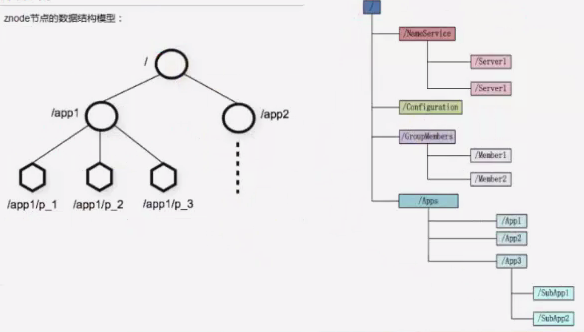

<!-- START doctoc generated TOC please keep comment here to allow auto update -->
<!-- DON'T EDIT THIS SECTION, INSTEAD RE-RUN doctoc TO UPDATE -->
**Table of Contents**  *generated with [DocToc](https://github.com/thlorenz/doctoc)*

- [Zookeeper](#zookeeper)
  - [目录](#%E7%9B%AE%E5%BD%95)
  - [1.1 Zookeeper简介](#11-zookeeper%E7%AE%80%E4%BB%8B)
  - [1.2 Zookeeper设计目标](#12-zookeeper%E8%AE%BE%E8%AE%A1%E7%9B%AE%E6%A0%87)
  - [1.3 Zookeeper的结构](#13-zookeeper%E7%9A%84%E7%BB%93%E6%9E%84)
  - [1.4 Zookeeper的数据模型](#14-zookeeper%E7%9A%84%E6%95%B0%E6%8D%AE%E6%A8%A1%E5%9E%8B)
  - [1.5 Zookeeper的组成](#15-zookeeper%E7%9A%84%E7%BB%84%E6%88%90)
  - [1.6 Zookeeper应用场景](#16-zookeeper%E5%BA%94%E7%94%A8%E5%9C%BA%E6%99%AF)
  - [1.7 Zookeeper应用场景说明](#17-zookeeper%E5%BA%94%E7%94%A8%E5%9C%BA%E6%99%AF%E8%AF%B4%E6%98%8E)
  - [1.8 Zookeeper开源框架应用](#18-zookeeper%E5%BC%80%E6%BA%90%E6%A1%86%E6%9E%B6%E5%BA%94%E7%94%A8)
  - [2.1 Zookeeper集群搭建](#21-zookeeper%E9%9B%86%E7%BE%A4%E6%90%AD%E5%BB%BA)
  - [2.2 Zookeeper操作Shell](#22-zookeeper%E6%93%8D%E4%BD%9Cshell)
  - [2.3 配置文件zoo.cfg详解](#23-%E9%85%8D%E7%BD%AE%E6%96%87%E4%BB%B6zoocfg%E8%AF%A6%E8%A7%A3)
  - [3.1 java操作zookeeper](#31-java%E6%93%8D%E4%BD%9Czookeeper)
        - [创建会话方法：客户端可以通过创建一个zookeeper实例来连接zookeeper服务器。](#%E5%88%9B%E5%BB%BA%E4%BC%9A%E8%AF%9D%E6%96%B9%E6%B3%95%E5%AE%A2%E6%88%B7%E7%AB%AF%E5%8F%AF%E4%BB%A5%E9%80%9A%E8%BF%87%E5%88%9B%E5%BB%BA%E4%B8%80%E4%B8%AAzookeeper%E5%AE%9E%E4%BE%8B%E6%9D%A5%E8%BF%9E%E6%8E%A5zookeeper%E6%9C%8D%E5%8A%A1%E5%99%A8)
        - [创建节点（znode）方法：create](#%E5%88%9B%E5%BB%BA%E8%8A%82%E7%82%B9znode%E6%96%B9%E6%B3%95create)
        - [删除节点：delete方法（api提供了两个接口：同步删除和异步删除方式）](#%E5%88%A0%E9%99%A4%E8%8A%82%E7%82%B9delete%E6%96%B9%E6%B3%95api%E6%8F%90%E4%BE%9B%E4%BA%86%E4%B8%A4%E4%B8%AA%E6%8E%A5%E5%8F%A3%E5%90%8C%E6%AD%A5%E5%88%A0%E9%99%A4%E5%92%8C%E5%BC%82%E6%AD%A5%E5%88%A0%E9%99%A4%E6%96%B9%E5%BC%8F)
        - [getChildren读取数据方法：包括子节点列表的获取和子节点数据的获取。](#getchildren%E8%AF%BB%E5%8F%96%E6%95%B0%E6%8D%AE%E6%96%B9%E6%B3%95%E5%8C%85%E6%8B%AC%E5%AD%90%E8%8A%82%E7%82%B9%E5%88%97%E8%A1%A8%E7%9A%84%E8%8E%B7%E5%8F%96%E5%92%8C%E5%AD%90%E8%8A%82%E7%82%B9%E6%95%B0%E6%8D%AE%E7%9A%84%E8%8E%B7%E5%8F%96)
        - [getData方法：获取指定节点的数据内容。](#getdata%E6%96%B9%E6%B3%95%E8%8E%B7%E5%8F%96%E6%8C%87%E5%AE%9A%E8%8A%82%E7%82%B9%E7%9A%84%E6%95%B0%E6%8D%AE%E5%86%85%E5%AE%B9)
        - [setData方法：修改指定节点的数据内容。](#setdata%E6%96%B9%E6%B3%95%E4%BF%AE%E6%94%B9%E6%8C%87%E5%AE%9A%E8%8A%82%E7%82%B9%E7%9A%84%E6%95%B0%E6%8D%AE%E5%86%85%E5%AE%B9)
        - [exists方法：检测节点是否存在。](#exists%E6%96%B9%E6%B3%95%E6%A3%80%E6%B5%8B%E8%8A%82%E7%82%B9%E6%98%AF%E5%90%A6%E5%AD%98%E5%9C%A8)
  - [3.2 Watcher、ZK状态、事件类型](#32-watcherzk%E7%8A%B6%E6%80%81%E4%BA%8B%E4%BB%B6%E7%B1%BB%E5%9E%8B)
  - [3.3 zookeeper的ACL（AUTH）](#33-zookeeper%E7%9A%84aclauth)
  - [4.1 查看zookeeper及管理工具](#41-%E6%9F%A5%E7%9C%8Bzookeeper%E5%8F%8A%E7%AE%A1%E7%90%86%E5%B7%A5%E5%85%B7)
  - [4.2 实际应用场景](#42-%E5%AE%9E%E9%99%85%E5%BA%94%E7%94%A8%E5%9C%BA%E6%99%AF)
  - [5.1 zkClient使用](#51-zkclient%E4%BD%BF%E7%94%A8)
        - [1、创建客户端方法：ZKClient(Args)](#1%E5%88%9B%E5%BB%BA%E5%AE%A2%E6%88%B7%E7%AB%AF%E6%96%B9%E6%B3%95zkclientargs)
        - [2、创建节点方法：](#2%E5%88%9B%E5%BB%BA%E8%8A%82%E7%82%B9%E6%96%B9%E6%B3%95)
        - [3、删除节点方法：](#3%E5%88%A0%E9%99%A4%E8%8A%82%E7%82%B9%E6%96%B9%E6%B3%95)
        - [4、读取子节点数据方法：](#4%E8%AF%BB%E5%8F%96%E5%AD%90%E8%8A%82%E7%82%B9%E6%95%B0%E6%8D%AE%E6%96%B9%E6%B3%95)
        - [5、读取节点数据方法：](#5%E8%AF%BB%E5%8F%96%E8%8A%82%E7%82%B9%E6%95%B0%E6%8D%AE%E6%96%B9%E6%B3%95)
        - [6、更新数据方法：](#6%E6%9B%B4%E6%96%B0%E6%95%B0%E6%8D%AE%E6%96%B9%E6%B3%95)
        - [7、检测节点是否存在方法：](#7%E6%A3%80%E6%B5%8B%E8%8A%82%E7%82%B9%E6%98%AF%E5%90%A6%E5%AD%98%E5%9C%A8%E6%96%B9%E6%B3%95)
        - [8、subscribeChildChanges 方法](#8subscribechildchanges-%E6%96%B9%E6%B3%95)
        - [9、IZkDataListener接口，需要重写两个方法](#9izkdatalistener%E6%8E%A5%E5%8F%A3%E9%9C%80%E8%A6%81%E9%87%8D%E5%86%99%E4%B8%A4%E4%B8%AA%E6%96%B9%E6%B3%95)
  - [6.1 Curator框架](#61-curator%E6%A1%86%E6%9E%B6)
  - [6.2 Curator 框架使用](#62-curator-%E6%A1%86%E6%9E%B6%E4%BD%BF%E7%94%A8)
  - [6.3 Curator的监听](#63-curator%E7%9A%84%E7%9B%91%E5%90%AC)
  - [6.4 Curator场景应用](#64-curator%E5%9C%BA%E6%99%AF%E5%BA%94%E7%94%A8)
        - [分布式锁功能：](#%E5%88%86%E5%B8%83%E5%BC%8F%E9%94%81%E5%8A%9F%E8%83%BD)
        - [分布式计数器功能：](#%E5%88%86%E5%B8%83%E5%BC%8F%E8%AE%A1%E6%95%B0%E5%99%A8%E5%8A%9F%E8%83%BD)
        - [DistributedDoubleBarrier示例](#distributeddoublebarrier%E7%A4%BA%E4%BE%8B)
        - [DistributedBarrier 示例](#distributedbarrier-%E7%A4%BA%E4%BE%8B)

<!-- END doctoc generated TOC please keep comment here to allow auto update -->

# Zookeeper

## 目录

1、zookeeper简介说明

2、搭建zookeeper与配置文件说明

3、java操作zookeeper

4、应用场景实例

5、zkClient客户端

6、Curator框架

## 1.1 Zookeeper简介

**什么是Zookeeper？**

Zookeeper是一个高效的分布式协调服务，它暴露了一些公用服务，比如命名、配置管理、同步控制、群组服务等。我们可以使用ZK来实现比如达成共识、集群管理、 leader选举等。

Zookeeper是一个高可用的**分布式管理与协调框架**，基于**ZAB算法**（原子消息广播协议）的实现。该框架能够很好地保证分布式环境中数据的一致性。也正是基于这样的特性，使得Zookeeper成为了解决公布式一致性问题的利器。

**顺序一致性**：从一个客户端发起的事务请求，最终将会严格地按照其发起的顺序被应用到Zookeeper中去。

**原子性**：所有事务请求的处理结果在整个集群中所有机器上的应用情况是一致的，也就是说，要么整个集群所有的机器都成功应用了某一事务，要么没有应用，一定不会出现部分机器应用了该事务，而另一部分没有应用的情况。

**单一视图**：无论客户端连接的是哪个Zookeeper服务器，其看到的服务端数据模型都是一致的。

**可靠性**：一旦服务器成功地应用了一个事务，并完成对客户端的响应，那么该事务所引起的服务器端状态将会被一致保留下来。除非有另外一个事务对其更改。

**实时性**：通常所说的实时性就是指一旦事务被成功应用，那么客户端就能立刻从服务器上获取变更后的新数据，Zookeeper仅仅能保证在一段时间内，客户端最终一定能从服务器读取更新的数据状态。

## 1.2 Zookeeper设计目标

**目标1：简单的数据结构**。Zookeeper就是以简单的树形结构来进行相互协调的（也叫树形名字空间）。

**目标2：可以构建集群**。一般Zookeeper集群通常由一组机器构成，一般3~5台机器就可以组成一个Zookeeper集群了。只要集群中超过半数以上的机器能够正常工作，那么整个集群就能够正常对外提供服务。

**目标3：顺序访问**。对于来自每一个客户端的每一个请求，Zookeeper都会分配一个全局唯一的递增编号，这个编号反应了所有事务操作的先后顺序，应用程序可以使用Zookeeper这个特性来实现更高层次的同步。

**目标4：高性能**。由于Zookeeper将全量数据存储在内存中，并直接服务于所有的非事务请求，因此尤其在读操作为主的场景下性能非常突出。在JMeter压力测试下（100%读请求场景下），其结果大约在12~13W的QPS。

## 1.3 Zookeeper的结构

Zookeeper会维护一个具有层次关系的数据结构，它非常类似于一个标准的文件系统。



## 1.4 Zookeeper的数据模型

1、每个子目录项如NameService都被称作为**znode**，这个znode是被它所在的路径唯一标识，如Server1这个znode的标识为/NameService/Server1。

2、znode可以有子节点目录，并且每个znode可以存储数据，注意EPHEMERAL类型的目录节点不能有子节点目录。

3、znode是有版本的，每个znode中存储的数据可以有多个版本，也就是一个访问路径中可以存储多份数据。

4、znode可以是临时节点，一旦创建这个znode的客户端与服务器失去联系，这个znode也将自动删除，Zookeeper的客户端与服务器通信采用长连接方式，每个客户端和服务器通过心跳来保持连接，这个连接状态称为session，如果znode是临时节点，这个session失效，znode也就删除了。

5、znode的目录名可以自动编号，如App1已经存在，现创建的话，将会自动命名为App2。

6、znode可以被监控，包括这个目录节点中存储的数据的修改，子节点目录的变化等，一旦变化可以通知设置监控的客户端，这个是Zookeeper的核心特性，Zookeeper的很多功能都是基于这个特性实现的，后面在典型的应用场景中会有实例介绍。

## 1.5 Zookeeper的组成

ZK server根据其身份特性分为三种：Leader、Follower、Observer，其中Follower和Observer又统称为Learner（学习者）。

-   **Leader**：负责客户端的write类型请求。
-   **Follower**：负责客户端的reader类型请求，参与leader选举等。
-   **Observer**：特殊的“Follower”，其可以接受客户端的reader请求，但不参与选举。（扩容系统支撑能力，提高了读取速度。因为它不接受任何同步的写入请求，只负责与leader同步数据）

## 1.6 Zookeeper应用场景

**典型应用场景**

Zookeeper从设计模式角度来看，是一个基于观察者模式设计的分布式服务管理框架，它负责存储和管理大家关心的数据，然后接受观察者的注册，一旦这些数据的状态变化，Zookeeper就将负责通知已经在Zookeeper上注册的那些观察者做出相应的反应，从而实现集群中类似Master/Slave管理模式。

-   配置管理
-   集群管理
-   发布与订阅
-   数据库切换
-   分布式日志的收集
-   分布式锁、队列管理等等

## 1.7 Zookeeper应用场景说明

1、**配置管理**：配置的管理在分布式应用环境中很常见，比如我们在平常的应用系统中，经常会碰到这样的需求：如机器的配置列表、运行时的开关配置、数据库配置信息等。这些全局配置信息通常具备以下3个特性：

-   数据量比较小。
-   数据内容在运行时动态发生变化。
-   集群中各个节点共享信息，配置一致。

2、**集群管理**：Zookeeper不仅能够帮你维护当前的集群中机器的服务状态，而且能够帮你选出一个“总管”，让这个总管来管理集群，这就是Zookeeper的另一个功能Leader，并实现集群容错功能。

-   希望知道当前集群中究竟有多少个机器工作。
-   对集群中每天集群的运行时状态进行数据收集。
-   对集群中每台集群进行上下线操作。

3、**发布与订阅**：Zookeeper是一个典型的发布/订阅模式的分布式数据管理与协调框架，开发人员可以使用它来进行分布式数据的发布与订阅。

4、**数据库切换**：比如我们初始化Zookeeper的时候读取其节点上的数据库配置文件，当配置一旦发生变更时，Zookeeper就能帮助我们把变更的通知发送到各个客户端，每个客户端在接收到这个变更通知后，就可以重新进行最新数据的获取。

5、**分布式日志收集**：我们可以做一个日志系统，收集集群中所有的日志信息，进行统一管理。

6、Zookeeper的特性就是在分布式场景下高可用，但是原生的API实现分布式功能非常困难，团队去实现也太浪费时间，即使实现了也未必稳定。那么可以采用第三方的客户端的完美实现，比如**Curator框架**，他是Apache的顶级项目。

## 1.8 Zookeeper开源框架应用

Zookeeper使用场景非常广泛：

如Hadoop、Storm、消息中间件、RPC服务框架、数据库增量订阅与消费组件（如Mysql Binlog）、分布式数据库同步系统，淘宝的Otter。

所以我们有必要学好Zookeeper！

## 2.1 Zookeeper集群搭建

1、一共三个节点（ZK服务器集群规模不小于3个节点），要求服务器之间系统时间保持一致。

2、进行解压：`tar -zxvf zookeeper-3.4.5.tar.gz -C /usr/local`

3、重新名：`mv zookeeper-3.4.5 zookeeper `

4、修改环境变量：

```bash
vim /etc/profile
export ZOOKEEPER_HOME=/usr/local/zookeeper
export PATH=$ZOOKEEPER_HOME/bin:$PATH
```

5、刷新：`source /etc/profile`

6、到zookeeper下修改配置文件

```bash
cd /usr/local/zookeeper/conf
mv zoo_sample.cfg zoo.cfg
```

7、修改conf，修改两处

```bash
vim zoo.cfg
# 1 修改dataDir
dataDir=/usr/local/zookeeper/data
# 2 增加如下内容
server.0=192.168.0.121:2888:3888
server.1=192.168.0.122:2888:3888
server.2=192.168.0.123:2888:3888
```

8、服务器标识配置：

-   创建文件夹：`mkdir /usr/local/zookeeper/data`
-   在data文件夹下创建文件myid并填写内容为0：`vi myid`，内容为服务器标识：0

```bash
# 192.168.0.121
cd /usr/local/zookeeper/data
touch myid
echo 0 > myid
# 192.168.0.122
cd /usr/local/zookeeper/data
touch myid
echo 1 > myid
# 192.168.0.123
cd /usr/local/zookeeper/data
touch myid
echo 2 > myid
```

9、启动zookeeper：

-   路径：`cd /usr/local/zookeeper/bin`
-   执行：`/usr/local/zookeeper/bin/zkServer.sh start`（注意这里3台机器都要进行启动）
-   状态：`/usr/local/zookeeper/bin/zkServer.sh status`（在三个节点上检验zk的mode， 一个leader和两个follower）

## 2.2 Zookeeper操作Shell

进入Zookeeper客户端`/usr/local/zookeeper/bin/zkCli.sh`

根据提示命令进行操作：

```bash
#查找
ls /
ls /path
#创建并赋值
create /path value
#获取
get /path
#设值
set /path value
#递归删除节点
rmr /path
#删除指定某个节点
delete /path/child
```

创建节点有两种类型：短暂（ephemeral）、持久（persistent）

## 2.3 配置文件zoo.cfg详解

```properties
# 基本事件单元，以毫秒为单位，这个时间是作为Zookeeper服务器之间或客户端与服务器之间维持心跳的时间间隔，也就是每隔tickTime时间就会发送一个心跳。
tickTime=2000
# 这个配置项是用来配置Zookeeper接受客户端初始化连接时最长能忍受多少个心跳时间间隔数，当已经超过10个心跳的时间（也就是tickTime）长度后Zookeeper服务器一汀烟雨杏花寒没有收到客户端的返回信息，那么表明这个客户端连接失败。总的时间长度就是10*2000=20秒。
initLimit=10
# 这个配置项标识Leader和Follower之间发送信息，请求和应答时间长度，最长不能超过多少个tickTime的时间长度，总的时间长度就是5*2000=10秒。
syncLimit=5
# 存储内存中数据库快照的位置，顾名思义就是Zookeeper保存数据的目录，默认情况下，Zookeeper将写数据的日志文件也保存在这个目录里。
dataDir=/usr/local/zookeeper/data
# 这个商品就是客户端连接Zookeeper服务器的端口，Zookeeper会监听这个端口，接受客户端的访问请求。
clientPort=2181
#
# 在打开自动清除之前，请务必阅读管理员指南的维护部分
# http://zookeeper.apache.org/doc/current/zookeeperAdmin.html#sc_maintenance
#
# 要在datadir中保留的快照数
#autopurge.snapRetainCount=3
#
# 清除任务间隔（小时）
# 设置为“0”以禁用自动清除功能
#autopurge.purgeInterval=1
#
# 集群配置
#server.A = B:C:D
# A表示这个是第几号服务器
# B表示这个服务器的IP地址
# C表示这个服务器与集群中的Leader服务器交换信息的端口
# D表示万一集群中的Leader服务器挂了，需要一个端口来重新进行选举，选出一个新的Leader
server.0=192.168.0.121:2888:3888
server.1=192.168.0.122:2888:3888
server.2=192.168.0.123:2888:3888
```

## 3.1 java操作zookeeper

首先要使用java操作zookeeper，zookeeper的javaclient使我们更轻松的去对zookeeper进行各种操作，我们引入zookeeper-3.4.4.jar和zkclient-0.1.jar即可。

zookeeper-3.4.4.jar为官方提供的java API，zkclient-0.1.jar则为源生api基础之上进行扩展的开源java客户端。

##### 创建会话方法：客户端可以通过创建一个zookeeper实例来连接zookeeper服务器。

`zookeeper（Arguments）`方法（一共4个构造方法，根据参数不同）

参数说明如下：

```bash
connectString：连接服务器列表，用“,”分割
sessionTimeout：心跳检测时间周期(毫秒)
watcher：事件处理通知器
canBeReadOnly：标识当前会话是否支持只读
sessionId和sessionPasswd：提供连接zookeeper的会话ID和密码，通过这两个确定唯一一台客户端，目的是可以提供重复会话
```

注意：zookeeper客户端和服务器端会话的建立是一个异步的过程，也就是说在程序中，我们程序方法在处理完客户端初始化后立即返回（也就是说程序往下执行代码），这样，大多数情况下我们并没有真正构建好一个可用会话，在会话的生命周期处于“CONNECTING”时才算真正建立完毕，所以我们需要使用多线程中所学习的一个小工具类。

------

##### 创建节点（znode）方法：create

提供了两套创建节点的方法，同步和异步创建节点方式。

**同步方式：**

-   参数1，节点路径（名称）：`/nodeName`（不允许递归创建节点，也就是说父节点不存在的情况下，不允许创建子节点）
-   参数2，节点内容：要求类型是字节数组（也就是说，不支持序列化方式，如果需要实现序列化，可使用java相关序列化框架，如Hession、Kryo框架）
-   参数3，节点权限：使用`Ids.OPEN_ACL_UNSAFE`开放权限即可（这个参数一般在权限没有太高要求的场景下，没必要关注）
-   参数4，节点类型：创建节点的类型：`CreateMode.*`，提供四种节点类型
    -   PERSISTENT（持久节点）
    -   PERSISTENT_SEQUENTIAL（持久顺序节点）
    -   EPHEMERAL（临时节点）
    -   EPHEMERAL_SEQUENTIAL（临时顺序节点）

**异步方式**：（在同步基础上增加两个参数）

-   参数5，注册一个异步回调函数，要实现`AsynCallBack.StringCallBack`接口，重写`processResult(int rc, String path, Object ctx, String name)`方法，当节点创建完毕后执行此方法。
    -   rc：为服务器响应码0表示调用成功、-4表示端口连接、-110表示指定节点存在、-112表示会话已经过期。
    -   path：接口调用时传入API的数据节点的路径参数。
    -   ctx：为调用接口传入API的ctx值。
    -   name：实际在服务器端创建节点的名称

-   参数6，传递给回调函数的参数，一般为上下文（Context）信息

------

##### 删除节点：delete方法（api提供了两个接口：同步删除和异步删除方式）

**同步方式**：

-   参数1：节点名称/deletePath。

-   参数2：版本号，即表明本次删除操作是针对该数据的某个版本进行的操作。

**异步方式**：

-   参数3：一个异步回调函数。
-   参数4：用于传递上下文信息的对象。

------

##### getChildren读取数据方法：包括子节点列表的获取和子节点数据的获取。

-   参数1，path：获取指定节点下的数据（获取子节点列表）

-   参数2，watcher：注册的watcher，一旦在本次子节点获取后，子节点列表发生变更的话，那么就会向客户端发送通知。该参数允许为null。

-   参数3，watch：表明是否需要注册一个watcher，如果为true，则会使用到zookeeper客户端上下文提到的那个默认watcher。如果为false，则表明不需要注册watcher。

-   参数4，cb：回调函数。

-   参数5，ctx：上下文信息对象。

-   参数6，stat：指定数据节点的节点状态信息。

注意：当我们获取指定节点的子节点列表后，还需要订阅这个节点列表的变化通知，这时候就可以通过注册一个watcher来实现，当子节点被添加或删除时，服务器端就会触发一个“NodeChildrenChanged”类型的事件通知，需要注意的是服务器端发送给客户端的事件通知中，是不包含最新的节点列表的，客户端必须主动从新进行获取，通常在客户端收到这个事件通知后，就可以再次主动获取最新的子节点列表了。也就是说，zookeeper服务端向客户端发送watcher”“NodeChildrenChanged”事件通知的时候，仅仅只发了一个通知，不会把节点变化情况发给客户端，需要客户端自己重新获取，另外watcher通知是一次性的，即触发后失效，因此客户端需要反复注册watcher才行。

------

##### getData方法：获取指定节点的数据内容。

-   参数1，path：路径
-   参数2，watcher：注册的watcher对象。一旦之后节点内容有变更，则会像客户端发送通知，该参数允许为null。
-   参数3，stat：指定节点的状态信息。
-   参数4，watch：是否使用watcher，如果为true则使用默认上下文的watcher，false则不使用。
-   参数5，cb：回调函数。
-   参数6，ctx：用于传递的上下文信息对象。

注意：该方法和getChildren方法基本相同，主要是注册的watcher有所不同，客户端在获取一个阶段数据内容时，是可以进行watcher注册的，一旦节点发生变更，则服务器端会发送给客户端一个“NodeChildrenChanged”的事件通知。

------

##### setData方法：修改指定节点的数据内容。

-   参数1，path：路径。
-   参数2，data：数据内容。
-   参数3，版本号：-1覆盖之前所有的版本。
-   参数4，cb：回调函数
-   参数5，ctx：用于传递的上下文信息对象。

------

##### exists方法：检测节点是否存在。

-   参数1，path：路径。
-   参数2，watcher：注册的watcher对象。一旦之后节点内容有变更，则会像客户端发送通知，该参数允许为null。（用于三类事件监听：节点的创建、删除、更新）

-   参数3，watch：是否使用watcher，如果为true则使用默认上下文的watcher，false则不使用。

-    参数4，cb：回调函数

-   参数5，ctx：用于传递的上下文信息对象。

注意：exists方法意义在于无论节点是否存在，都可以进行注册watcher，能够对节点的创建、删除和修改进行监听，但是其子节点发送各种变化，都不会通知客户端。

```java
import java.util.concurrent.CountDownLatch;

import org.apache.zookeeper.CreateMode;
import org.apache.zookeeper.WatchedEvent;
import org.apache.zookeeper.Watcher;
import org.apache.zookeeper.Watcher.Event.EventType;
import org.apache.zookeeper.ZooKeeper;
import org.apache.zookeeper.Watcher.Event.KeeperState;
import org.apache.zookeeper.ZooDefs.Ids;

/**
 * Zookeeper base学习笔记
 */
public class ZookeeperBase {

    /** zookeeper地址 */
    static final String CONNECT_ADDR = "192.168.0.121:2181,192.168.0.122:2181,192.168.0.123:2181";
    /** session超时时间 */
    static final int SESSION_OUTTIME = 2000;// ms
    /** 信号量，阻塞程序执行，用于等待zookeeper连接成功，发送成功信号 */
    static final CountDownLatch connectedSemaphore = new CountDownLatch(1);

    public static void main(String[] args) throws Exception {
        // 初始化ZooKeeper
        ZooKeeper zk = new ZooKeeper(CONNECT_ADDR, SESSION_OUTTIME, new Watcher() {
            @Override
            public void process(WatchedEvent event) {
                // 获取事件的状态
                KeeperState keeperState = event.getState();
                // 获取事件的类型
                EventType eventType = event.getType();
                // 如果是建立连接
                if (KeeperState.SyncConnected == keeperState) {
                    if (EventType.None == eventType) {
                        // 如果建立连接成功，则发送信号量，让后续阻塞程序向下执行
                        System.out.println("zk 建立连接");
                        connectedSemaphore.countDown();
                    }
                }
            }
        });

        // 进行阻塞，连接建立后往下执行
        connectedSemaphore.await();

        System.out.println("执行啦..");
        // 创建父节点
        zk.create("/testRoot", "testRoot".getBytes(), Ids.OPEN_ACL_UNSAFE, CreateMode.PERSISTENT);

        // 创建子节点
        zk.create("/testRoot/children", "children data".getBytes(), Ids.OPEN_ACL_UNSAFE, CreateMode.PERSISTENT);

        // 获取节点洗信息
        byte[] data = zk.getData("/testRoot", false, null);
        System.out.println(new String(data));
        System.out.println(zk.getChildren("/testRoot", false));

        // 修改节点的值
        zk.setData("/testRoot", "modify data root".getBytes(), -1);
        byte[] data2 = zk.getData("/testRoot", false, null);
        System.out.println(new String(data2));

        // 判断节点是否存在
        System.out.println(zk.exists("/testRoot/children", false));
        // 删除节点
        zk.delete("/testRoot/children", -1);
        System.out.println(zk.exists("/testRoot/children", false));

        zk.close();
    }
}
```

## 3.2 Watcher、ZK状态、事件类型

zookeeper有watch事件，是一次触发的，当watch监视的数据发生变化时，通知设置了该watch的client，即watcher。

同样，其watcher是监听数据发送了某些变化，那就一定会有对应的事件类型和状态类型。

**事件类型**：（znode节点相关的）

```java
EventType.NodeCreated
EventType.NodeDataChanged
EventType.NodeChildrenChanged
EventType.NodeDeleted
```

**状态类型**：（ 是跟客户端实例相关的）

```java
KeeperState.Disconnected
KeeperState.SyncConnected
KeeperState.AuthFailed
KeeperState.Expired
```

**watcher的特性：一次性、客户端串行执行、轻量。**

-   **一次性**：对于ZK的watcher，你只需要记住一点：zookeeper有watch事件，是一次性触发的，当watch监视的数据发生变化时，通知设置了该watch的client，即watcher，由于zookeeper的监控都是一次性的，所以每次必须设置监控。
-   **客户端串行执行**：客户端watcher回调的过程是现代战争串行同步的过程，这为我们保证了顺序，同时需要开发人员注意一点，千万不要因为一个watcher的处理逻辑影响了整个客户端的watcher回调。
-   **轻量**：WatchedEvent是Zookeeper整个Watcher通知机制的最小通知单元，整个事件结构只包含三部分：通知状态、事件类型和节点路径。也就是说Watcher通知非常的简单，只会告诉客户端发生了事件而不会告知其具体内容，需要客户自己去进行获取，比如NodeDataChanged事件，Zookeeper只会通知客户端指定节点的数据发生了变更，而不会直接提供具体的数据内容。

我们通过一个示例，详细学习下Watcher的概念和其目的。Watcher示例：

```java
import java.util.List;
import java.util.concurrent.CountDownLatch;
import java.util.concurrent.atomic.AtomicInteger;

import org.apache.zookeeper.CreateMode;
import org.apache.zookeeper.WatchedEvent;
import org.apache.zookeeper.Watcher;
import org.apache.zookeeper.Watcher.Event.EventType;
import org.apache.zookeeper.Watcher.Event.KeeperState;
import org.apache.zookeeper.ZooDefs.Ids;
import org.apache.zookeeper.ZooKeeper;
import org.apache.zookeeper.data.Stat;

/**
 * Zookeeper Wathcher 本类就是一个Watcher类（实现了org.apache.zookeeper.Watcher类）
 */
public class ZooKeeperWatcher implements Watcher {

    /** 定义原子变量 */
    AtomicInteger seq = new AtomicInteger();
    /** 定义session失效时间 */
    private static final int SESSION_TIMEOUT = 10000;
    /** zookeeper服务器地址 */
    private static final String CONNECTION_ADDR = "192.168.0.121:2181,192.168.0.122:2181,192.168.0.123:2181";
    /** zk父路径设置 */
    private static final String PARENT_PATH = "/p";
    /** zk子路径设置 */
    private static final String CHILDREN_PATH = "/p/c";
    /** 进入标识 */
    private static final String LOG_PREFIX_OF_MAIN = "【Main】";
    /** zk变量 */
    private ZooKeeper zk = null;
    /** 信号量设置，用于等待zookeeper连接建立之后 通知阻塞程序继续向下执行 */
    private CountDownLatch connectedSemaphore = new CountDownLatch(1);

    /**
     * 创建ZK连接
     * 
     * @param connectAddr    ZK服务器地址列表
     * @param sessionTimeout Session超时时间
     */
    public void createConnection(String connectAddr, int sessionTimeout) {
        this.releaseConnection();
        try {
            zk = new ZooKeeper(connectAddr, sessionTimeout, this);
            System.out.println(LOG_PREFIX_OF_MAIN + "开始连接ZK服务器");
            connectedSemaphore.await();
        } catch (Exception e) {
            e.printStackTrace();
        }
    }

    /**
     * 关闭ZK连接
     */
    public void releaseConnection() {
        if (this.zk != null) {
            try {
                this.zk.close();
            } catch (InterruptedException e) {
                e.printStackTrace();
            }
        }
    }

    /**
     * 创建节点
     * 
     * @param path 节点路径
     * @param data 数据内容
     * @return
     */
    public boolean createPath(String path, String data) {
        try {
            // 设置监控(由于zookeeper的监控都是一次性的所以 每次必须设置监控)
            this.zk.exists(path, true);
            System.out.println(LOG_PREFIX_OF_MAIN + "节点创建成功, Path: " + this.zk.create( /** 路径 */
                    path,
                    /** 数据 */
                    data.getBytes(),
                    /** 所有可见 */
                    Ids.OPEN_ACL_UNSAFE,
                    /** 永久存储 */
                    CreateMode.PERSISTENT) + ", content: " + data);
        } catch (Exception e) {
            e.printStackTrace();
            return false;
        }
        return true;
    }

    /**
     * 读取指定节点数据内容
     * 
     * @param path 节点路径
     * @return
     */
    public String readData(String path, boolean needWatch) {
        try {
            return new String(this.zk.getData(path, needWatch, null));
        } catch (Exception e) {
            e.printStackTrace();
            return "";
        }
    }

    /**
     * 更新指定节点数据内容
     * 
     * @param path 节点路径
     * @param data 数据内容
     * @return
     */
    public boolean writeData(String path, String data) {
        try {
            System.out.println(LOG_PREFIX_OF_MAIN + "更新数据成功，path：" + path + ", stat: "
                    + this.zk.setData(path, data.getBytes(), -1));
        } catch (Exception e) {
            e.printStackTrace();
        }
        return false;
    }

    /**
     * 删除指定节点
     * 
     * @param path 节点path
     * 
     */
    public void deleteNode(String path) {
        try {
            this.zk.delete(path, -1);
            System.out.println(LOG_PREFIX_OF_MAIN + "删除节点成功，path：" + path);
        } catch (Exception e) {
            e.printStackTrace();
        }
    }

    /**
     * 判断指定节点是否存在
     * 
     * @param path 节点路径
     */
    public Stat exists(String path, boolean needWatch) {
        try {
            return this.zk.exists(path, needWatch);
        } catch (Exception e) {
            e.printStackTrace();
            return null;
        }
    }

    /**
     * 获取子节点
     * 
     * @param path 节点路径
     */
    private List<String> getChildren(String path, boolean needWatch) {
        try {
            return this.zk.getChildren(path, needWatch);
        } catch (Exception e) {
            e.printStackTrace();
            return null;
        }
    }

    /**
     * 删除所有节点
     */
    public void deleteAllTestPath() {
        if (this.exists(CHILDREN_PATH, false) != null) {
            this.deleteNode(CHILDREN_PATH);
        }
        if (this.exists(PARENT_PATH, false) != null) {
            this.deleteNode(PARENT_PATH);
        }
    }

    /**
     * 收到来自Server的Watcher通知后的处理。
     */
    @Override
    public void process(WatchedEvent event) {

        System.out.println("进入 process 。。。。。event = " + event);

        try {
            Thread.sleep(200);
        } catch (InterruptedException e) {
            e.printStackTrace();
        }

        if (event == null) {
            return;
        }

        // 连接状态
        KeeperState keeperState = event.getState();
        // 事件类型
        EventType eventType = event.getType();
        // 受影响的path
        String path = event.getPath();

        String logPrefix = "【Watcher-" + this.seq.incrementAndGet() + "】";

        System.out.println(logPrefix + "收到Watcher通知");
        System.out.println(logPrefix + "连接状态:\t" + keeperState.toString());
        System.out.println(logPrefix + "事件类型:\t" + eventType.toString());

        if (KeeperState.SyncConnected == keeperState) {
            // 成功连接上ZK服务器
            if (EventType.None == eventType) {
                System.out.println(logPrefix + "成功连接上ZK服务器");
                connectedSemaphore.countDown();
            }
            // 创建节点
            else if (EventType.NodeCreated == eventType) {
                System.out.println(logPrefix + "节点创建");
                try {
                    Thread.sleep(100);
                } catch (InterruptedException e) {
                    e.printStackTrace();
                }
                this.exists(path, true);
            }
            // 更新节点
            else if (EventType.NodeDataChanged == eventType) {
                System.out.println(logPrefix + "节点数据更新");
                System.out.println("我看看走不走这里........");
                try {
                    Thread.sleep(100);
                } catch (InterruptedException e) {
                    e.printStackTrace();
                }
                System.out.println(logPrefix + "数据内容: " + this.readData(PARENT_PATH, true));
            }
            // 更新子节点
            else if (EventType.NodeChildrenChanged == eventType) {
                System.out.println(logPrefix + "子节点变更");
                try {
                    Thread.sleep(3000);
                } catch (InterruptedException e) {
                    e.printStackTrace();
                }
                System.out.println(logPrefix + "子节点列表：" + this.getChildren(PARENT_PATH, true));
            }
            // 删除节点
            else if (EventType.NodeDeleted == eventType) {
                System.out.println(logPrefix + "节点 " + path + " 被删除");
            } else
                ;
        } else if (KeeperState.Disconnected == keeperState) {
            System.out.println(logPrefix + "与ZK服务器断开连接");
        } else if (KeeperState.AuthFailed == keeperState) {
            System.out.println(logPrefix + "权限检查失败");
        } else if (KeeperState.Expired == keeperState) {
            System.out.println(logPrefix + "会话失效");
        } else
            ;

        System.out.println("--------------------------------------------");

    }

    /**
     * <B>方法名称：</B>测试zookeeper监控<BR>
     * <B>概要说明：</B>主要测试watch功能<BR>
     * 
     * @param args
     * @throws Exception
     */
    public static void main(String[] args) throws Exception {

        // 建立watcher
        ZooKeeperWatcher zkWatch = new ZooKeeperWatcher();
        // 创建连接
        zkWatch.createConnection(CONNECTION_ADDR, SESSION_TIMEOUT);
        // System.out.println(zkWatch.zk.toString());

        Thread.sleep(1000);

        // 清理节点
        zkWatch.deleteAllTestPath();

        if (zkWatch.createPath(PARENT_PATH, System.currentTimeMillis() + "")) {

            Thread.sleep(1000);

            // 读取数据
            System.out.println("---------------------- read parent ----------------------------");
            // zkWatch.readData(PARENT_PATH, true);

            // 读取子节点
            System.out.println("---------------------- read children path ----------------------------");
            zkWatch.getChildren(PARENT_PATH, true);

            // 更新数据
            zkWatch.writeData(PARENT_PATH, System.currentTimeMillis() + "");

            Thread.sleep(1000);

            // 创建子节点
            zkWatch.createPath(CHILDREN_PATH, System.currentTimeMillis() + "");

            Thread.sleep(1000);

            zkWatch.writeData(CHILDREN_PATH, System.currentTimeMillis() + "");
        }

        Thread.sleep(50000);
        // 清理节点
        zkWatch.deleteAllTestPath();
        Thread.sleep(1000);
        zkWatch.releaseConnection();
    }
}
```

## 3.3 zookeeper的ACL（AUTH）

ACL(Access Control List)，Zookeeper作为一个分布式协调框架，其内部存储的都是一些关乎分布式系统运行时状态的元数据，尤其是涉及到一些分布式锁、Master选举和协调等应用场景。我们需要有效地保障Zookeeper中的数据安全，Zookeeper提供一套完善的ACL权限控制机制来保障数据的安全。

Zookeeper提供了三种模式：权限模式、授权对象、权限。

**权限模式**：Scheme，开发人员最多使用的如下四种权限模式：

-   **IP**：IP模式通过IP地址粒度来进行控制权限，例如配置了ip:192.168.1.107即表示权限控制，都是针对这个IP地址的，同时也支持按网段分配，比如：192.168.1.*
-   **Digest**：Digest是最常用的权限控制模式，也更符合我们对权限控制的认识，其类似于“username:password”形式的权限标识进行权限配置。ZK对形成的权限标识先后进行两次编码处理，分别是SHA-1加密算法、BASE64编码。
-   **World**：World是一直最开放的权限控制模式。这种模式可以看做为特殊的Digest，他仅仅是一个标识而已。
-   **Super**：超级用户模式，在超级用户模式下可以对ZK任意进行操作。

**权限对象**：指的是权限赋予的用户或者一个指定的实体，例如IP地址或机器等。在不同的模式下，授权对象是不同的。这种械和权限对象一一对应。

**权限**：权限就是指那些通过权限检测后可以被允许执行的操作，在ZK中，对数据的操作权限分为以下五大类：CREATE、DELETE、READ、WRITE、ADMIN。

我们通过一个示例，详细学习下Auth的概念和其目的。Auth示例：

```java
import java.util.ArrayList;
import java.util.List;
import java.util.concurrent.CountDownLatch;
import java.util.concurrent.atomic.AtomicInteger;

import org.apache.zookeeper.CreateMode;
import org.apache.zookeeper.WatchedEvent;
import org.apache.zookeeper.Watcher;
import org.apache.zookeeper.Watcher.Event.EventType;
import org.apache.zookeeper.Watcher.Event.KeeperState;
import org.apache.zookeeper.ZooDefs.Ids;
import org.apache.zookeeper.ZooKeeper;
import org.apache.zookeeper.data.ACL;
import org.apache.zookeeper.data.Stat;

/**
 * Zookeeper 节点授权
 */
public class ZookeeperAuth implements Watcher {

    /** 连接地址 */
    final static String CONNECT_ADDR = "192.168.80.88:2181";
    /** 测试路径 */
    final static String PATH = "/testAuth";
    final static String PATH_DEL = "/testAuth/delNode";
    /** 认证类型 */
    final static String authentication_type = "digest";
    /** 认证正确方法 */
    final static String correctAuthentication = "123456";
    /** 认证错误方法 */
    final static String badAuthentication = "654321";

    static ZooKeeper zk = null;
    /** 计时器 */
    AtomicInteger seq = new AtomicInteger();
    /** 标识 */
    private static final String LOG_PREFIX_OF_MAIN = "【Main】";

    private CountDownLatch connectedSemaphore = new CountDownLatch(1);

    @Override
    public void process(WatchedEvent event) {
        try {
            Thread.sleep(200);
        } catch (InterruptedException e) {
            e.printStackTrace();
        }
        if (event == null) {
            return;
        }
        // 连接状态
        KeeperState keeperState = event.getState();
        // 事件类型
        EventType eventType = event.getType();
        // 受影响的path
        String path = event.getPath();

        String logPrefix = "【Watcher-" + this.seq.incrementAndGet() + "】";

        System.out.println(logPrefix + "收到Watcher通知");
        System.out.println(logPrefix + "连接状态:\t" + keeperState.toString());
        System.out.println(logPrefix + "事件类型:\t" + eventType.toString());
        if (KeeperState.SyncConnected == keeperState) {
            // 成功连接上ZK服务器
            if (EventType.None == eventType) {
                System.out.println(logPrefix + "成功连接上ZK服务器");
                connectedSemaphore.countDown();
            }
        } else if (KeeperState.Disconnected == keeperState) {
            System.out.println(logPrefix + "与ZK服务器断开连接");
        } else if (KeeperState.AuthFailed == keeperState) {
            System.out.println(logPrefix + "权限检查失败");
        } else if (KeeperState.Expired == keeperState) {
            System.out.println(logPrefix + "会话失效");
        }
        System.out.println("--------------------------------------------");
    }

    /**
     * 创建ZK连接
     * 
     * @param connectString  ZK服务器地址列表
     * @param sessionTimeout Session超时时间
     */
    public void createConnection(String connectString, int sessionTimeout) {
        this.releaseConnection();
        try {
            zk = new ZooKeeper(connectString, sessionTimeout, this);
            // 添加节点授权
            zk.addAuthInfo(authentication_type, correctAuthentication.getBytes());
            System.out.println(LOG_PREFIX_OF_MAIN + "开始连接ZK服务器");
            // 倒数等待
            connectedSemaphore.await();
        } catch (Exception e) {
            e.printStackTrace();
        }
    }

    /**
     * 关闭ZK连接
     */
    public void releaseConnection() {
        if (this.zk != null) {
            try {
                this.zk.close();
            } catch (InterruptedException e) {
            }
        }
    }

    /**
     * 
     * <B>方法名称：</B>测试函数<BR>
     * <B>概要说明：</B>测试认证<BR>
     * 
     * @param args
     * @throws Exception
     */
    public static void main(String[] args) throws Exception {

        ZookeeperAuth testAuth = new ZookeeperAuth();
        testAuth.createConnection(CONNECT_ADDR, 2000);
        List<ACL> acls = new ArrayList<ACL>(1);
        for (ACL ids_acl : Ids.CREATOR_ALL_ACL) {
            acls.add(ids_acl);
        }

        try {
            zk.create(PATH, "init content".getBytes(), acls, CreateMode.PERSISTENT);
            System.out.println("使用授权key：" + correctAuthentication + "创建节点：" + PATH + ", 初始内容是: init content");
        } catch (Exception e) {
            e.printStackTrace();
        }
        try {
            zk.create(PATH_DEL, "will be deleted! ".getBytes(), acls, CreateMode.PERSISTENT);
            System.out.println("使用授权key：" + correctAuthentication + "创建节点：" + PATH_DEL + ", 初始内容是: init content");
        } catch (Exception e) {
            e.printStackTrace();
        }

        // 获取数据
        getDataByNoAuthentication();
        getDataByBadAuthentication();
        getDataByCorrectAuthentication();

        // 更新数据
        updateDataByNoAuthentication();
        updateDataByBadAuthentication();
        updateDataByCorrectAuthentication();

        // 删除数据
        deleteNodeByBadAuthentication();
        deleteNodeByNoAuthentication();
        deleteNodeByCorrectAuthentication();
        //
        Thread.sleep(1000);

        deleteParent();
        // 释放连接
        testAuth.releaseConnection();
    }

    /** 获取数据：采用错误的密码 */
    static void getDataByBadAuthentication() {
        String prefix = "[使用错误的授权信息]";
        try {
            ZooKeeper badzk = new ZooKeeper(CONNECT_ADDR, 2000, null);
            // 授权
            badzk.addAuthInfo(authentication_type, badAuthentication.getBytes());
            Thread.sleep(2000);
            System.out.println(prefix + "获取数据：" + PATH);
            System.out.println(prefix + "成功获取数据：" + badzk.getData(PATH, false, null));
        } catch (Exception e) {
            System.err.println(prefix + "获取数据失败，原因：" + e.getMessage());
        }
    }

    /** 获取数据：不采用密码 */
    static void getDataByNoAuthentication() {
        String prefix = "[不使用任何授权信息]";
        try {
            System.out.println(prefix + "获取数据：" + PATH);
            ZooKeeper nozk = new ZooKeeper(CONNECT_ADDR, 2000, null);
            Thread.sleep(2000);
            System.out.println(prefix + "成功获取数据：" + nozk.getData(PATH, false, null));
        } catch (Exception e) {
            System.err.println(prefix + "获取数据失败，原因：" + e.getMessage());
        }
    }

    /** 采用正确的密码 */
    static void getDataByCorrectAuthentication() {
        String prefix = "[使用正确的授权信息]";
        try {
            System.out.println(prefix + "获取数据：" + PATH);

            System.out.println(prefix + "成功获取数据：" + zk.getData(PATH, false, null));
        } catch (Exception e) {
            System.out.println(prefix + "获取数据失败，原因：" + e.getMessage());
        }
    }

    /**
     * 更新数据：不采用密码
     */
    static void updateDataByNoAuthentication() {

        String prefix = "[不使用任何授权信息]";

        System.out.println(prefix + "更新数据： " + PATH);
        try {
            ZooKeeper nozk = new ZooKeeper(CONNECT_ADDR, 2000, null);
            Thread.sleep(2000);
            Stat stat = nozk.exists(PATH, false);
            if (stat != null) {
                nozk.setData(PATH, prefix.getBytes(), -1);
                System.out.println(prefix + "更新成功");
            }
        } catch (Exception e) {
            System.err.println(prefix + "更新失败，原因是：" + e.getMessage());
        }
    }

    /**
     * 更新数据：采用错误的密码
     */
    static void updateDataByBadAuthentication() {

        String prefix = "[使用错误的授权信息]";

        System.out.println(prefix + "更新数据：" + PATH);
        try {
            ZooKeeper badzk = new ZooKeeper(CONNECT_ADDR, 2000, null);
            // 授权
            badzk.addAuthInfo(authentication_type, badAuthentication.getBytes());
            Thread.sleep(2000);
            Stat stat = badzk.exists(PATH, false);
            if (stat != null) {
                badzk.setData(PATH, prefix.getBytes(), -1);
                System.out.println(prefix + "更新成功");
            }
        } catch (Exception e) {
            System.err.println(prefix + "更新失败，原因是：" + e.getMessage());
        }
    }

    /**
     * 更新数据：采用正确的密码
     */
    static void updateDataByCorrectAuthentication() {

        String prefix = "[使用正确的授权信息]";

        System.out.println(prefix + "更新数据：" + PATH);
        try {
            Stat stat = zk.exists(PATH, false);
            if (stat != null) {
                zk.setData(PATH, prefix.getBytes(), -1);
                System.out.println(prefix + "更新成功");
            }
        } catch (Exception e) {
            System.err.println(prefix + "更新失败，原因是：" + e.getMessage());
        }
    }

    /**
     * 不使用密码 删除节点
     */
    static void deleteNodeByNoAuthentication() throws Exception {

        String prefix = "[不使用任何授权信息]";

        try {
            System.out.println(prefix + "删除节点：" + PATH_DEL);
            ZooKeeper nozk = new ZooKeeper(CONNECT_ADDR, 2000, null);
            Thread.sleep(2000);
            Stat stat = nozk.exists(PATH_DEL, false);
            if (stat != null) {
                nozk.delete(PATH_DEL, -1);
                System.out.println(prefix + "删除成功");
            }
        } catch (Exception e) {
            System.err.println(prefix + "删除失败，原因是：" + e.getMessage());
        }
    }

    /**
     * 采用错误的密码删除节点
     */
    static void deleteNodeByBadAuthentication() throws Exception {

        String prefix = "[使用错误的授权信息]";

        try {
            System.out.println(prefix + "删除节点：" + PATH_DEL);
            ZooKeeper badzk = new ZooKeeper(CONNECT_ADDR, 2000, null);
            // 授权
            badzk.addAuthInfo(authentication_type, badAuthentication.getBytes());
            Thread.sleep(2000);
            Stat stat = badzk.exists(PATH_DEL, false);
            if (stat != null) {
                badzk.delete(PATH_DEL, -1);
                System.out.println(prefix + "删除成功");
            }
        } catch (Exception e) {
            System.err.println(prefix + "删除失败，原因是：" + e.getMessage());
        }
    }

    /**
     * 使用正确的密码删除节点
     */
    static void deleteNodeByCorrectAuthentication() throws Exception {

        String prefix = "[使用正确的授权信息]";

        try {
            System.out.println(prefix + "删除节点：" + PATH_DEL);
            Stat stat = zk.exists(PATH_DEL, false);
            if (stat != null) {
                zk.delete(PATH_DEL, -1);
                System.out.println(prefix + "删除成功");
            }
        } catch (Exception e) {
            System.out.println(prefix + "删除失败，原因是：" + e.getMessage());
        }
    }

    /**
     * 使用正确的密码删除节点
     */
    static void deleteParent() throws Exception {
        try {
            Stat stat = zk.exists(PATH_DEL, false);
            if (stat == null) {
                zk.delete(PATH, -1);
            }
        } catch (Exception e) {
            e.printStackTrace();
        }
    }
}
```

## 4.1 查看zookeeper及管理工具

-   与eclipse集成的管理zookeeper工具：zookeeperBrowser
    http://www.massedynamic.org/eclipse/updates/
-   java -jar zookeeper-dev-ZooInspector.jar

## 4.2 实际应用场景

我们希望zookeeper对分布式系统的配置文件进行管理，也就是说多个服务器进行watcher，zookeeper节点发送变化，则我们实时更新配置文件。

我们要完成多个应用服务器注册watcher，然后去实时观察数据的变化，然后反馈给媒体服务器变更的数据信息。观察zookeeper节点。

## 5.1 zkClient使用

ZKClient是由Datameer的工程师Stefan Groschupf和Peter Voss一起开发的。在源生的API接口基础上进行了封装，简化了ZK的复杂性。

##### 1、创建客户端方法：ZKClient(Args)

-   参数1：zkServers， zookeeper服务器的地址，用“,”分割。
-   参数2：sessionTimeout，超时会话，单位为毫秒，默认30000ms。
-   参数3：connectionTimeout，连接超时会话。
-   参数4：IZkConnection接口的实现类。
-   参数5：ZkSerializer，自定义序列化实现。

##### 2、创建节点方法：

create、createEphemeral、createEphemeralSequential、createPersistent、createPersistentSequential

-   参数1：path，路径
-   参数2：data，数据内容，可以传入null
-   参数3：mode，节点类型，为一个枚举类型，4种形式
-   参数4：acl策略
-   参数5：callback，回调函数
-   参数6：context，上下文对象
-   参数7：createParents，是否创建父节点

##### 3、删除节点方法：

delete、deleteRecursive

-   参数1：path，路径

-   参数2：callback，回调函数

-   参数3：context，上下文对象

##### 4、读取子节点数据方法：

getChildren

-   参数1：path，路径

##### 5、读取节点数据方法：

readData

-   参数1：path，路径
-   参数2：returnNullIfPathNotExists（避免为空节点抛出异常，直接返回null）
-   参数3：节点状态

##### 6、更新数据方法：

writeData

-   参数1：path，路径
-   参数2：data，数据信息
-   参数3：version，版本号

##### 7、检测节点是否存在方法：

exists

-   参数1：path，路径

>   我们发现，上述ZKClient里面并没有类似watcher、watch参数，这也就是说我们开发人员无需关心反复注册watcher的问题，ZKClient给我们提供了一套监听方式，我们可以使用监听节点的方式进行操作，剔除了繁琐的反复watcher操作，减化了代码的复杂程序。

```java
import java.util.List;
import java.util.concurrent.TimeUnit;

import org.I0Itec.zkclient.ZkClient;
import org.I0Itec.zkclient.ZkConnection;

public class ZkClientBase {

    /** zookeeper地址 */
    static final String CONNECT_ADDR = "192.168.1.121:2181,192.168.1.122:2181,192.168.1.123:2181";
    /** session超时时间 */
    static final int SESSION_OUTTIME = 5000;// ms

    public static void main(String[] args) throws Exception {
        ZkClient zkc = new ZkClient(new ZkConnection(CONNECT_ADDR), 5000);
        // 1. create and delete方法
        zkc.createEphemeral("/temp");
        zkc.createPersistent("/super/c1", true);
        Thread.sleep(10000);
        zkc.delete("/temp");
        zkc.deleteRecursive("/super");

        // 2. 设置path和data 并且读取子节点和每个节点的内容
        zkc.createPersistent("/super", "1234");
        zkc.createPersistent("/super/c1", "c1内容");
        zkc.createPersistent("/super/c2", "c2内容");
        List<String> list = zkc.getChildren("/super");
        for (String p : list) {
            System.out.println(p);
            String rp = "/super/" + p;
            String data = zkc.readData(rp);
            System.out.println("节点为：" + rp + "，内容为: " + data);
        }

        // 3. 更新和判断节点是否存在
        zkc.writeData("/super/c1", "新内容");
        System.out.println(zkc.readData("/super/c1"));
        System.out.println(zkc.exists("/super/c1"));

        // 4.递归删除/super内容
        zkc.deleteRecursive("/super");
    }
}
```

##### 8、subscribeChildChanges 方法

-   参数1：path，路径
-   参数2：实现了`IZkChildListener`接口的类（如：实例化`IZkChildListener`类），只需要重写其`handleChildChanges(String parentPath, List<String> currentChilds)`方法。其中参数parentPath为所监听节点全路径，currentChilds为最新的子节点列表（相对路径）。
-   `IZkChildListener`事件说明针对于下面三个事件触发：新增子节点、减少子节点、删除节点。

  **通过之前的方法我们发现，其IZkChildListener有以下特点：**

1.  客户端可以对一个不存在的节点进行变更的监听。
2.  一旦客户端对一个节点注册了子节点列表变更监听后，那么当前节点的子节点列表发送变更的时候，服务器都会通知客户端，并将最新的子节点列表发送给客户端。
3.  该节点本身创建或删除也会通知到客户端。
4.  另外最重要的是这个监听是一直存在的，不是单次监听，相比较原生API提供的要简单多了。

```java
import java.util.List;

import org.I0Itec.zkclient.IZkChildListener;
import org.I0Itec.zkclient.ZkClient;
import org.I0Itec.zkclient.ZkConnection;

public class ZkClientWatcher1 {

    /** zookeeper地址 */
    static final String CONNECT_ADDR = "192.168.1.121:2181,192.168.1.122:2181,192.168.1.123:2181";
    /** session超时时间 */
    static final int SESSION_OUTTIME = 5000;// ms

    public static void main(String[] args) throws Exception {
        ZkClient zkc = new ZkClient(new ZkConnection(CONNECT_ADDR), 5000);

        // 对父节点添加监听子节点变化。
        zkc.subscribeChildChanges("/super", new IZkChildListener() {
            @Override
            public void handleChildChange(String parentPath, List<String> currentChilds) throws Exception {
                System.out.println("parentPath: " + parentPath);
                System.out.println("currentChilds: " + currentChilds);
            }
        });

        Thread.sleep(3000);

        zkc.createPersistent("/super");
        Thread.sleep(1000);

        zkc.createPersistent("/super" + "/" + "c1", "c1内容");
        Thread.sleep(1000);

        zkc.createPersistent("/super" + "/" + "c2", "c2内容");
        Thread.sleep(1000);

        zkc.delete("/super/c2");
        Thread.sleep(1000);

        zkc.deleteRecursive("/super");
        Thread.sleep(Integer.MAX_VALUE);
    }
}
```

##### 9、IZkDataListener接口，需要重写两个方法

```java
handleDataChange(String dataPath, Object data);
handleDataDeleted(String dataPath);
```

分别为节点变更和节点删除事件。

```java
import org.I0Itec.zkclient.IZkDataListener;
import org.I0Itec.zkclient.ZkClient;
import org.I0Itec.zkclient.ZkConnection;

public class ZkClientWatcher2 {

    /** zookeeper地址 */
    static final String CONNECT_ADDR = "192.168.1.121:2181,192.168.1.122:2181,192.168.1.123:2181";
    /** session超时时间 */
    static final int SESSION_OUTTIME = 5000;// ms

    public static void main(String[] args) throws Exception {
        ZkClient zkc = new ZkClient(new ZkConnection(CONNECT_ADDR), 5000);

        zkc.createPersistent("/super", "1234");

        // 对父节点添加监听子节点变化。
        zkc.subscribeDataChanges("/super", new IZkDataListener() {
            @Override
            public void handleDataDeleted(String path) throws Exception {
                System.out.println("删除的节点为:" + path);
            }

            @Override
            public void handleDataChange(String path, Object data) throws Exception {
                System.out.println("变更的节点为:" + path + ", 变更内容为:" + data);
            }
        });

        Thread.sleep(3000);
        zkc.writeData("/super", "456", -1);
        Thread.sleep(1000);

        zkc.delete("/super");
        Thread.sleep(Integer.MAX_VALUE);
    }
}
```

## 6.1 Curator框架

为了更好的实现java操作zookeeper服务器，后来出现Curator框架，非常的强大，目前已经是Apache的顶级项目，里面提供了更多丰富的操作，例如session超时重连、主从选举、分布式计数器、分布式锁等等适用于各种复杂的zookeeper场景的API封装。

maven依赖：

```xml
<dependency>
    <groupId>org.apache.curator</groupId>
    <artifactId>curator-framework</artifactId>
    <version>2.4.2</version>
</dependency>
```

相关资料地址：http://curator.apache.org/curator-recipes/index.html

## 6.2 Curator 框架使用

Curator框架中使用链式编程风格，易读性更强，使用工程方法创建连接对象。

1、使用CuratorFrameworkFactory的两个静态工厂方法（参数不同）来实现：

-   参数1：connectString，连接串。
-   参数2：retryPolicy，重试连接策略。有四种实现分别为：
    -   ExponentialBackoffRetry
    -   RetryNTimes
    -   RetryOneTimes
    -   RetryUntilElapsed
-   参数3：sessionTimeoutMs，会话超时时间，默认为60000ms。
-   参数4：connectionTimeoutMs，连接超时时间，默认为15000ms。

>   注意：对于retryPolicy策略通过一个接口来让用户自定义实现。

2、创建节点create方法，可选链式项：

creatingParentsIfNeeded、withMode、forPath、withACL等。

3、删除节点delete方法，可选链式项：

deletingChildrenIfNeeded、guaranteed、withVersion、forPath等。

4、读取和修改数据getData、setData方法。

5、异步绑定回调方法。比如创建节点时绑定一个回调函数，该回调函数可以输出服务器的状态码以及服务器事件类型。还可以加入一个线程池进行优化操作。

6、读取子节点方法getChildren。

7、判断节点是否存在方法checkExists。

```java
import java.util.List;
import java.util.concurrent.ExecutorService;
import java.util.concurrent.Executors;

import org.apache.curator.RetryPolicy;
import org.apache.curator.framework.CuratorFramework;
import org.apache.curator.framework.CuratorFrameworkFactory;
import org.apache.curator.framework.api.BackgroundCallback;
import org.apache.curator.framework.api.CuratorEvent;
import org.apache.curator.retry.ExponentialBackoffRetry;
import org.apache.zookeeper.CreateMode;
import org.apache.zookeeper.ZooKeeper.States;
import org.apache.zookeeper.data.Stat;

public class CuratorBase {

    /** zookeeper地址 */
    static final String CONNECT_ADDR = "192.168.1.121:2181,192.168.1.122:2181,192.168.1.123:2181";
    /** session超时时间 */
    static final int SESSION_OUTTIME = 5000;// ms

    public static void main(String[] args) throws Exception {

        // 1 重试策略：初试时间为1s 重试10次
        RetryPolicy retryPolicy = new ExponentialBackoffRetry(1000, 10);
        // 2 通过工厂创建连接
        CuratorFramework cf = CuratorFrameworkFactory.builder().connectString(CONNECT_ADDR)
                .sessionTimeoutMs(SESSION_OUTTIME).retryPolicy(retryPolicy).namespace("super").build();
        // 3 开启连接
        cf.start();

        System.out.println(States.CONNECTED);
        System.out.println(cf.getState());

        // 新加、删除
        // 4 建立节点 指定节点类型（不加withMode默认为持久类型节点）、路径、数据内容
        cf.create().creatingParentsIfNeeded().withMode(CreateMode.PERSISTENT).forPath("/super/c1", "c1内容".getBytes());
        // 5 删除节点
        cf.delete().guaranteed().deletingChildrenIfNeeded().forPath("/super");

        // 读取、修改
        // 创建节点
        cf.create().creatingParentsIfNeeded().withMode(CreateMode.PERSISTENT).forPath("/super/c1", "c1内容".getBytes());
        cf.create().creatingParentsIfNeeded().withMode(CreateMode.PERSISTENT).forPath("/super/c2", "c2内容".getBytes());
        // 读取节点
        String ret1 = new String(cf.getData().forPath("/super/c2"));
        System.out.println(ret1);
        // 修改节点
        cf.setData().forPath("/super/c2", "修改c2内容".getBytes());
        String ret2 = new String(cf.getData().forPath("/super/c2"));
        System.out.println(ret2);

        // 绑定回调函数
        ExecutorService pool = Executors.newCachedThreadPool();
        cf.create().creatingParentsIfNeeded().withMode(CreateMode.PERSISTENT).inBackground(new BackgroundCallback() {
            @Override
            public void processResult(CuratorFramework cf, CuratorEvent ce) throws Exception {
                System.out.println("code:" + ce.getResultCode());
                System.out.println("type:" + ce.getType());
                System.out.println("线程为:" + Thread.currentThread().getName());
            }
        }, pool).forPath("/super/c3", "c3内容".getBytes());
        Thread.sleep(Integer.MAX_VALUE);

        // 读取子节点getChildren方法 和 判断节点是否存在checkExists方法
        List<String> list = cf.getChildren().forPath("/super");
        for (String p : list) {
            System.out.println(p);
        }

        Stat stat = cf.checkExists().forPath("/super/c3");
        System.out.println(stat);

        Thread.sleep(2000);
        cf.delete().guaranteed().deletingChildrenIfNeeded().forPath("/super");

        cf.delete().guaranteed().deletingChildrenIfNeeded().forPath("/super");
    }
}
```

## 6.3 Curator的监听

如果要使用类似Watcher的监听功能，Curator必须依靠一个jar包，Maven依赖：

```xml
<dependency>
    <groupId>org.apache.curator</groupId>
    <artifactId>curator-recipes</artifactId>
    <version>2.4.2</version>
</dependency>
```

有了这个依赖包，我们使用NodeCache的方式去客户端实例中注册一个监听缓存，然后实现对应的监听方法即可，这里我们主要有两种监听方式：

**NodeCacheListener：监听节点的新增、修改操作。**

```java
import java.util.List;
import java.util.concurrent.ExecutorService;
import java.util.concurrent.Executors;

import org.apache.curator.RetryPolicy;
import org.apache.curator.framework.CuratorFramework;
import org.apache.curator.framework.CuratorFrameworkFactory;
import org.apache.curator.framework.api.BackgroundCallback;
import org.apache.curator.framework.api.CuratorEvent;
import org.apache.curator.framework.recipes.cache.NodeCache;
import org.apache.curator.framework.recipes.cache.NodeCacheListener;
import org.apache.curator.retry.ExponentialBackoffRetry;
import org.apache.zookeeper.CreateMode;
import org.apache.zookeeper.data.Stat;

public class CuratorWatcher1 {

    /** zookeeper地址 */
    static final String CONNECT_ADDR = "192.168.1.121:2181,192.168.1.122:2181,192.168.1.123:2181";
    /** session超时时间 */
    static final int SESSION_OUTTIME = 5000;// ms

    public static void main(String[] args) throws Exception {

        // 1 重试策略：初试时间为1s 重试10次
        RetryPolicy retryPolicy = new ExponentialBackoffRetry(1000, 10);
        // 2 通过工厂创建连接
        CuratorFramework cf = CuratorFrameworkFactory.builder().connectString(CONNECT_ADDR)
                .sessionTimeoutMs(SESSION_OUTTIME).retryPolicy(retryPolicy).build();

        // 3 建立连接
        cf.start();

        // 4 建立一个cache缓存
        final NodeCache cache = new NodeCache(cf, "/super", false);
        cache.start(true);
        cache.getListenable().addListener(new NodeCacheListener() {
            /**
             * <B>方法名称：</B>nodeChanged<BR>
             * <B>概要说明：</B>触发事件为创建节点和更新节点，在删除节点的时候并不触发此操作。<BR>
             * 
             * @see org.apache.curator.framework.recipes.cache.NodeCacheListener#nodeChanged()
             */
            @Override
            public void nodeChanged() throws Exception {
                System.out.println("路径为：" + cache.getCurrentData().getPath());
                System.out.println("数据为：" + new String(cache.getCurrentData().getData()));
                System.out.println("状态为：" + cache.getCurrentData().getStat());
                System.out.println("---------------------------------------");
            }
        });

        Thread.sleep(1000);
        cf.create().forPath("/super", "123".getBytes());

        Thread.sleep(1000);
        cf.setData().forPath("/super", "456".getBytes());

        Thread.sleep(1000);
        cf.delete().forPath("/super");

        Thread.sleep(Integer.MAX_VALUE);
    }
}
```

**PathChildrenCacheListener：监听子节点的新增、修改、删除操作。**

```java
import java.util.List;
import java.util.concurrent.ExecutorService;
import java.util.concurrent.Executors;

import org.apache.curator.RetryPolicy;
import org.apache.curator.framework.CuratorFramework;
import org.apache.curator.framework.CuratorFrameworkFactory;
import org.apache.curator.framework.api.BackgroundCallback;
import org.apache.curator.framework.api.CuratorEvent;
import org.apache.curator.framework.recipes.cache.NodeCache;
import org.apache.curator.framework.recipes.cache.NodeCacheListener;
import org.apache.curator.framework.recipes.cache.PathChildrenCache;
import org.apache.curator.framework.recipes.cache.PathChildrenCacheEvent;
import org.apache.curator.framework.recipes.cache.PathChildrenCacheListener;
import org.apache.curator.framework.recipes.cache.PathChildrenCache.StartMode;
import org.apache.curator.retry.ExponentialBackoffRetry;
import org.apache.zookeeper.CreateMode;
import org.apache.zookeeper.data.Stat;

public class CuratorWatcher2 {

    /** zookeeper地址 */
    static final String CONNECT_ADDR = "192.168.1.121:2181,192.168.1.122:2181,192.168.1.123:2181";
    /** session超时时间 */
    static final int SESSION_OUTTIME = 5000;// ms

    public static void main(String[] args) throws Exception {

        // 1 重试策略：初试时间为1s 重试10次
        RetryPolicy retryPolicy = new ExponentialBackoffRetry(1000, 10);
        // 2 通过工厂创建连接
        CuratorFramework cf = CuratorFrameworkFactory.builder().connectString(CONNECT_ADDR)
                .sessionTimeoutMs(SESSION_OUTTIME).retryPolicy(retryPolicy).build();

        // 3 建立连接
        cf.start();

        // 4 建立一个PathChildrenCache缓存,第三个参数为是否接受节点数据内容 如果为false则不接受
        PathChildrenCache cache = new PathChildrenCache(cf, "/super", true);
        // 5 在初始化的时候就进行缓存监听
        cache.start(StartMode.POST_INITIALIZED_EVENT);
        cache.getListenable().addListener(new PathChildrenCacheListener() {
            /**
             * <B>方法名称：</B>监听子节点变更<BR>
             * <B>概要说明：</B>新建、修改、删除<BR>
             * 
             * @see org.apache.curator.framework.recipes.cache.PathChildrenCacheListener#childEvent(org.apache.curator.framework.CuratorFramework,
             *      org.apache.curator.framework.recipes.cache.PathChildrenCacheEvent)
             */
            @Override
            public void childEvent(CuratorFramework cf, PathChildrenCacheEvent event) throws Exception {
                switch (event.getType()) {
                case CHILD_ADDED:
                    System.out.println("CHILD_ADDED :" + event.getData().getPath());
                    break;
                case CHILD_UPDATED:
                    System.out.println("CHILD_UPDATED :" + event.getData().getPath());
                    break;
                case CHILD_REMOVED:
                    System.out.println("CHILD_REMOVED :" + event.getData().getPath());
                    break;
                default:
                    break;
                }
            }
        });

        // 创建本身节点不发生变化
        cf.create().forPath("/super", "init".getBytes());

        // 添加子节点
        Thread.sleep(1000);
        cf.create().forPath("/super/c1", "c1内容".getBytes());
        Thread.sleep(1000);
        cf.create().forPath("/super/c2", "c2内容".getBytes());

        // 修改子节点
        Thread.sleep(1000);
        cf.setData().forPath("/super/c1", "c1更新内容".getBytes());

        // 删除子节点
        Thread.sleep(1000);
        cf.delete().forPath("/super/c2");

        // 删除本身节点
        Thread.sleep(1000);
        cf.delete().deletingChildrenIfNeeded().forPath("/super");

        Thread.sleep(Integer.MAX_VALUE);
    }
}
```

## 6.4 Curator场景应用

##### 分布式锁功能：

在分布式场景中，我们为了保证数据的一致性，经常在程序运行的某一点需要进行同步操作（java可提供synchronized或者Reentrantlock实现），比如我们看一个小示例，这个会出现分布式不同步的问题：

因为我们之前所说的是高并发下访问一个程序，现在我们则是在高并发下访问多个服务器节点（分布式）。

我们使用Curator基于zookeeper的特性提供的分布式锁来处理分布式场景的数据一致性，zookeeper本身的分布式是有写问题的，我以前在实现的时候遇到过…这里强烈推荐使用curator的分布式锁。

```java
import java.text.SimpleDateFormat;
import java.util.Date;
import java.util.concurrent.CountDownLatch;
import java.util.concurrent.locks.ReentrantLock;

import org.apache.curator.RetryPolicy;
import org.apache.curator.framework.CuratorFramework;
import org.apache.curator.framework.CuratorFrameworkFactory;
import org.apache.curator.framework.recipes.locks.InterProcessMutex;
import org.apache.curator.retry.ExponentialBackoffRetry;

public class Lock2 {

    /** zookeeper地址 */
    static final String CONNECT_ADDR = "192.168.1.121:2181,192.168.1.122:2181,192.168.1.123:2181";
    /** session超时时间 */
    static final int SESSION_OUTTIME = 5000;// ms

    static int count = 10;

    public static void genarNo() {
        try {
            count--;
            System.out.println(count);
        } finally {

        }
    }

    public static void main(String[] args) throws Exception {

        // 1 重试策略：初试时间为1s 重试10次
        RetryPolicy retryPolicy = new ExponentialBackoffRetry(1000, 10);
        // 2 通过工厂创建连接
        CuratorFramework cf = CuratorFrameworkFactory.builder().connectString(CONNECT_ADDR)
                .sessionTimeoutMs(SESSION_OUTTIME).retryPolicy(retryPolicy)
//					.namespace("super")
                .build();
        // 3 开启连接
        cf.start();

        // 4 分布式锁
        final InterProcessMutex lock = new InterProcessMutex(cf, "/super");
        // final ReentrantLock reentrantLock = new ReentrantLock();
        final CountDownLatch countdown = new CountDownLatch(1);

        for (int i = 0; i < 10; i++) {
            new Thread(new Runnable() {
                @Override
                public void run() {
                    try {
                        countdown.await();
                        // 加锁
                        lock.acquire();
                        // reentrantLock.lock();
                        // -------------业务处理开始
                        // genarNo();
                        SimpleDateFormat sdf = new SimpleDateFormat("HH:mm:ss|SSS");
                        System.out.println(sdf.format(new Date()));
                        // System.out.println(System.currentTimeMillis());
                        // -------------业务处理结束
                    } catch (Exception e) {
                        e.printStackTrace();
                    } finally {
                        try {
                            // 释放
                            lock.release();
                            // reentrantLock.unlock();
                        } catch (Exception e) {
                            e.printStackTrace();
                        }
                    }
                }
            }, "t" + i).start();
        }
        Thread.sleep(100);
        countdown.countDown();
    }
}
```

##### 分布式计数器功能：

一说到分布式计算器，你可能脑海里想到了AtomicInteger这种经典的方式，如果针对于一个jvm的场景当然没有问题，但是我们现在是分布式场景下，就需要利用Cutator框架的DistributedAtomicInteger了。

```java
import org.apache.curator.RetryPolicy;
import org.apache.curator.framework.CuratorFramework;
import org.apache.curator.framework.CuratorFrameworkFactory;
import org.apache.curator.framework.recipes.atomic.AtomicValue;
import org.apache.curator.framework.recipes.atomic.DistributedAtomicInteger;
import org.apache.curator.retry.ExponentialBackoffRetry;
import org.apache.curator.retry.RetryNTimes;

public class CuratorAtomicInteger {

    /** zookeeper地址 */
    static final String CONNECT_ADDR = "192.168.1.121:2181,192.168.1.122:2181,192.168.1.123:2181";
    /** session超时时间 */
    static final int SESSION_OUTTIME = 5000;// ms

    public static void main(String[] args) throws Exception {

        // 1 重试策略：初试时间为1s 重试10次
        RetryPolicy retryPolicy = new ExponentialBackoffRetry(1000, 10);
        // 2 通过工厂创建连接
        CuratorFramework cf = CuratorFrameworkFactory.builder().connectString(CONNECT_ADDR)
                .sessionTimeoutMs(SESSION_OUTTIME).retryPolicy(retryPolicy).build();
        // 3 开启连接
        cf.start();
        // cf.delete().forPath("/super");

        // 4 使用DistributedAtomicInteger
        DistributedAtomicInteger atomicIntger = new DistributedAtomicInteger(cf, "/super", new RetryNTimes(3, 1000));

        AtomicValue<Integer> value = atomicIntger.add(1);
        System.out.println(value.succeeded());
        System.out.println(value.postValue()); // 最新值
        System.out.println(value.preValue()); // 原始值

    }
}
```

**模拟任务同时开始，再同时结束**

##### DistributedDoubleBarrier示例

```java
import java.util.Random;

import org.apache.curator.RetryPolicy;
import org.apache.curator.framework.CuratorFramework;
import org.apache.curator.framework.CuratorFrameworkFactory;
import org.apache.curator.framework.recipes.barriers.DistributedDoubleBarrier;
import org.apache.curator.retry.ExponentialBackoffRetry;

public class CuratorBarrier1 {

    /** zookeeper地址 */
    static final String CONNECT_ADDR = "192.168.1.121:2181,192.168.1.122:2181,192.168.1.123:2181";
    /** session超时时间 */
    static final int SESSION_OUTTIME = 5000;// ms

    public static void main(String[] args) throws Exception {
        for (int i = 0; i < 5; i++) {
            new Thread(new Runnable() {
                @Override
                public void run() {
                    try {
                        RetryPolicy retryPolicy = new ExponentialBackoffRetry(1000, 10);
                        CuratorFramework cf = CuratorFrameworkFactory.builder().connectString(CONNECT_ADDR)
                                .retryPolicy(retryPolicy).build();
                        cf.start();

                        DistributedDoubleBarrier barrier = new DistributedDoubleBarrier(cf, "/super", 5);
                        Thread.sleep(1000 * (new Random()).nextInt(3));
                        System.out.println(Thread.currentThread().getName() + "已经准备");
                        barrier.enter();
                        System.out.println("同时开始运行...");
                        Thread.sleep(1000 * (new Random()).nextInt(3));
                        System.out.println(Thread.currentThread().getName() + "运行完毕");
                        barrier.leave();
                        System.out.println("同时退出运行...");

                    } catch (Exception e) {
                        e.printStackTrace();
                    }
                }
            }, "t" + i).start();
        }
    }
}
```

##### DistributedBarrier 示例

```java
import java.text.SimpleDateFormat;
import java.util.Date;

import org.apache.curator.RetryPolicy;
import org.apache.curator.framework.CuratorFramework;
import org.apache.curator.framework.CuratorFrameworkFactory;
import org.apache.curator.framework.recipes.atomic.AtomicValue;
import org.apache.curator.framework.recipes.atomic.DistributedAtomicInteger;
import org.apache.curator.framework.recipes.barriers.DistributedBarrier;
import org.apache.curator.framework.recipes.queue.DistributedQueue;
import org.apache.curator.retry.ExponentialBackoffRetry;
import org.apache.curator.retry.RetryNTimes;

public class CuratorBarrier2 {

    /** zookeeper地址 */
    static final String CONNECT_ADDR = "192.168.1.121:2181,192.168.1.122:2181,192.168.1.123:2181";
    /** session超时时间 */
    static final int SESSION_OUTTIME = 5000;// ms

    static DistributedBarrier barrier = null;

    public static void main(String[] args) throws Exception {
        for (int i = 0; i < 5; i++) {
            new Thread(new Runnable() {
                @Override
                public void run() {
                    try {
                        RetryPolicy retryPolicy = new ExponentialBackoffRetry(1000, 10);
                        CuratorFramework cf = CuratorFrameworkFactory.builder().connectString(CONNECT_ADDR)
                                .sessionTimeoutMs(SESSION_OUTTIME).retryPolicy(retryPolicy).build();
                        cf.start();
                        barrier = new DistributedBarrier(cf, "/super");
                        System.out.println(Thread.currentThread().getName() + "设置barrier!");
                        barrier.setBarrier(); // 设置
                        barrier.waitOnBarrier(); // 等待
                        System.out.println("---------开始执行程序----------");
                    } catch (Exception e) {
                        e.printStackTrace();
                    }
                }
            }, "t" + i).start();
        }

        Thread.sleep(5000);
        barrier.removeBarrier(); // 释放
    }
}
```

