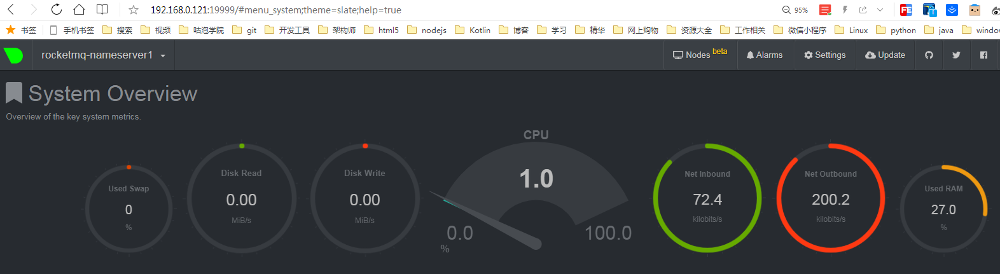

# linux系统监控命令汇总

| 命令       | 功能应用                                                                                                    | 用法举例             |
| ---------- | ----------------------------------------------------------------------------------------------------------- | -------------------- |
| free       | 查看内存使用情况，包括物理内存和虚拟内存                                                                    | free -h或free -m     |
| vmstat     | 对系统的整体情况进行统计，包括内核进程、虚拟内存、磁盘、陷阱和 CPU 活动的统计信息                           | vmstat 2 100         |
| top        | 实时显示系统中各个进程的资源占用状况及总体状况                                                              | top                  |
| mpstat     | 实时系统监控工具，它会报告与CPU相关的统计信息                                                               | mpstat               |
| mpstat 2 3 | 用于报告多路CPU主机的每颗CPU活动情况，以及整个主机的CPU情况。                                               | mpstat 2 3           |
| sar        | 收集、报告和保存CPU、内存、输入输出端口使用情况                                                             | sar -n DEV 3 100     |
| netstat    | 检验本机各端口的网络连接情况，用于显示与IP、TCP、UDP和ICMP协议相关的统计数据                                | netstat -a           |
| tcpdump    | 用于捕捉或者过滤网络上指定接口上接收或者传输的TCP/IP包                                                      | tcpdump -i eth0 -c 3 |
| iptraf     | 用来生成包括TCP信息、UDP计数、ICMP和OSPF信息、以太网负载信息、节点状态信息、IP校验和错误等等统计数据        | iptraf               |
| df         | 检查linux的文件系统的磁盘空间占用情况                                                                       | df -h                |
| iostat     | 收集显示系统存储设备输入和输出状态统计                                                                      | iostat -x -k 2 100   |
| iotop      | 用来监视磁盘I/O使用状况的top类工具                                                                          | iotop                |
| lsof       | 用于以列表的形式显示所有打开的文件和进程                                                                    | lsof                 |
| atop       | 显示的是各种系统资源（CPU, memory, network, I/O, kernel）的综合，并且在高负载的情况下进行了彩色标注         | atop                 |
| htop       | 它和top命令十分相似，高级的交互式的实时linux进程监控工具                                                    | htop                 |
| ps         | 最基本同时也是非常强大的进程查看命令                                                                        | ps aux               |
| glances    | 监视 CPU，平均负载，内存，网络流量，磁盘 I/O，其他处理器 和 文件系统 空间的利用情况                         | glances              |
| dstat      | 全能系统信息统计工具，可用于替换vmstat、iostat、netstat、nfsstat和ifstat这些命令的工具                      | dstat                |
| uptime     | 用于查看服务器运行了多长时间以及有多少个用户登录，快速获知服务器的负荷情况                                  | uptime               |
| dmesg      | 主要用来显示内核信息。使用dmesg可以有效诊断机器硬件故障或者添加硬件出现的问题。                             | dmesg                |
| nmon       | 监控CPU、内存、I/O、文件系统及网络资源。对于内存的使用，它可以实时的显示 总/剩余内存、交换空间等信息。      | nmon                 |
| mytop      | 用于监控 mysql 的线程和性能。它能让你实时查看数据库以及正在处理哪些查询。                                   | mytop                |
| iftop      | 用来监控网卡的实时流量（可以指定网段）、反向解析IP、显示端口信息等                                          | iftop                |
| jnettop    | 以相同的方式来监测网络流量但比 iftop 更形象。它还支持自定义的文本输出，并能以友好的交互方式来深度分析日志。 | jnettop              |
| ngrep      | 网络层的 grep。它使用 pcap ，允许通过指定扩展正则表达式或十六进制表达式来匹配数据包。                       | ngrep                |
| nmap       | 可以扫描你服务器开放的端口并且可以检测正在使用哪个操作系统                                                  | nmap                 |
| du         | 查看Linux系统中某目录的大小                                                                                 | du -sh 目录名        |
| fdisk      | 查看硬盘及分区信息                                                                                          | fdisk -l             |

- Ubuntu

```bash
sudo apt install -y sysstat
sudo apt install -y net-tools
sudo apt install -y iptrap
sudo apt install -y iotop
sudo apt install -y atop htop
sudo apt install -y glances
sudo apt install -y dstat
sudo apt install -y nmon
sudo apt install -y mytop
sudo apt install -y iftop
sudo apt install -y jnettop
sudo apt install -y nmap
```

- CentOS

```bash
sudo yum install -y sysstat
sudo yum install -y net-tools
sudo yum install -y iptrap
sudo yum install -y iotop
sudo yum install -y atop htop
sudo yum install -y glances
sudo yum install -y dstat
sudo yum install -y nmon
sudo yum install -y mytop
sudo yum install -y iftop
sudo yum install -y jnettop
sudo yum install -y nmap
```

-   netdata（系统性能监控工具）

```bash
wget https://github.com/netdata/netdata/archive/v1.16.1.tar.gz
mv v1.16.1.tar.gz netdata-v1.16.1.tar.gz
tar -zxvf netdata-v1.16.1.tar.gz
cd netdata-1.16.1
bash ./netdata-installer.sh
```

在浏览器输入ip:19999，即可打开服务器性能监控页面

